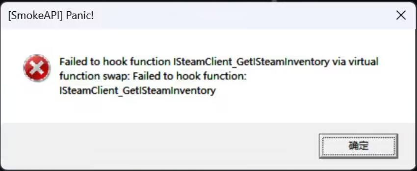
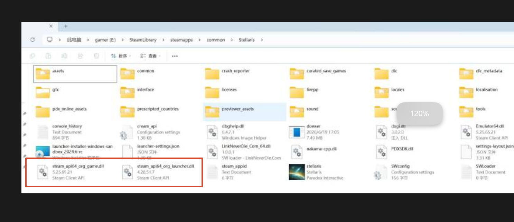

---
title: "打完 dlc 补丁包后启动游戏报错[SmokeAPI] Panic! Failed to hook function ISteamClient_GetISteamInventory via virtual function swap: Failed to hook function: ISteamClient_GetISteamInventory"
date: 2026-07-15
description: "打完 dlc 补丁包后启动游戏报错[SmokeAPI] Panic! Failed to hook function ISteamClient_GetISteamInventory via virtual function swap: Failed to hook function: ISteam..."
categories:
  - "报错"
tags:
  - "群星"
  - "Stellaris"
  - "DLC"
  - "问题排查"
draft: false
slug: "stellaris-dlc-error-07"
---

> 本文整理自《群星常见问题合集及解决办法》，原作者：唏嘘南溪。文档内容会随实际反馈持续修正。

## 1. 报错现象

打完 dlc 补丁包后启动游戏报错[SmokeAPI] Panic! Failed to hook function ISteamClient_GetISteamInventory via virtual function swap: Failed to hook function: ISteamClient_GetISteamInventory。

## 2. 解决方法

报错原因：

该问题通常是由于此前安装过其他补丁包，但旧补丁文件未完全删除，导致不同补丁之间发生文件冲突，从而引发报错。

如图，存在多余补丁：

解决方法：

如果不确定到底多了哪些补丁，请先删除游戏根目录下除文件夹以外的所有文件，随后在 Steam 中验证游戏文件的完整性。待缺失或损坏的原始文件恢复完成后，再重新安装当前补丁包。

## 3. 仍未解决

如果上述方法不适用，建议记录完整报错文字、复现步骤和 `error.log` 内容后再进一步排查。也可以联系原文作者（QQ：3217344726）反馈，以便补充或修正方案。
