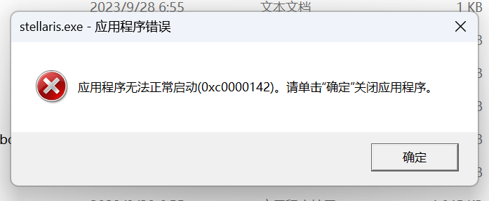

---
title: "学习版群星一打开就闪退"
date: 2026-07-15
description: "学习版群星一打开就闪退的排查与解决方法，整理常见原因、操作步骤和相关报错截图。"
categories:
  - "报错"
tags:
  - "群星"
  - "学习版"
  - "游戏闪退"
  - "启动失败"
draft: false
slug: "stellaris-offline-error-01"
related_group: "stellaris-offline"
hidden: true
searchable: true
guide: "/p/stellaris-offline-troubleshooting-guide/"
guide_title: "群星离线版常见问题解决指南"
---

> 本文整理自《群星常见问题合集及解决办法》，原作者：唏嘘南溪。文档内容会随实际反馈持续修正。

## 1. 报错现象

学习版群星一打开就闪退。

## 2. 解决方法

路径中有中文，类似于”下载”这样，至于最前面那个”此电脑”不影响，把整个文件夹移动到全英文路径下即可，或者直接放到盘符下

## 3. 仍未解决

如果上述方法不适用，建议记录完整报错文字、复现步骤和 `error.log` 内容后再进一步排查。也可以联系原文作者（QQ：3217344726）反馈，以便补充或修正方案。

