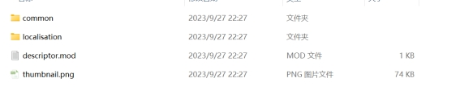
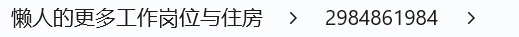
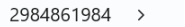

---
title: "学习版用 JSGME 打 mod 后发现 mod 没有生效"
date: 2026-07-15
description: "学习版用 JSGME 打 mod 后发现 mod 没有生效的排查与解决方法，整理常见原因、操作步骤和相关报错截图。"
categories:
  - "报错"
tags:
  - "群星"
  - "Stellaris"
  - "游戏故障"
  - "问题排查"
draft: false
slug: "stellaris-offline-error-03"
---

> 本文整理自《群星常见问题合集及解决办法》，原作者：唏嘘南溪。文档内容会随实际反馈持续修正。

## 1. 报错现象

学习版用 JSGME 打 mod 后发现 mod 没有生效。

## 2. 解决方法

解压问题，多套了一层文件夹，解压后 mod 文件夹内应直接为 mod 文件，比如文件夹 2984861984 点开后直接就是 mod 的内容文件，如果类似 2984861984 的文件夹外还包含一个仅用于表述 mod 名称的文件夹，如”懒人的更多工作岗位与住房”,只需要去掉最外层的名称文件夹再打入 mod 即可

比如下图就是有多余文件夹

而去掉前面的文件夹才是正确的形式

## 3. 仍未解决

如果上述方法不适用，建议记录完整报错文字、复现步骤和 `error.log` 内容后再进一步排查。也可以联系原文作者（QQ：3217344726）反馈，以便补充或修正方案。

