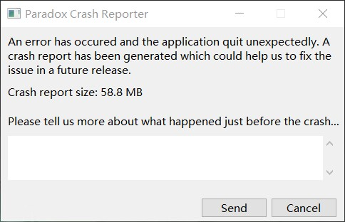

---
title: "最常见的闪退后白框报错"
date: 2026-07-15
description: "最常见的闪退后白框报错的排查与解决方法，整理常见原因、操作步骤和相关报错截图。"
categories:
  - "报错"
tags:
  - "群星"
  - "游戏闪退"
  - "显卡驱动"
  - "虚拟内存"
  - "MOD 冲突"
draft: false
slug: "stellaris-error-01"
related_group: "stellaris"
hidden: true
searchable: true
guide: "/p/stellaris-troubleshooting-guide/"
guide_title: "群星常见报错解决指南"
---

> 本文整理自《群星常见问题合集及解决办法》，原作者：唏嘘南溪。文档内容会随实际反馈持续修正。

## 1. 报错现象

最常见的闪退后白框报错。

## 2. 解决方法

导致该报错原因很多，但这个白框报错本身除了让你提交日志以外没有提供任何相关信息，你可以跟根据自身的操作步骤和查看游戏的报错日志推测出现该报错的原因，出现该报错的主要原因有以下几点：

(注：报错日志路径 `C:\Users\<你的用户名>\Documents\Paradox Interactive\Stellaris\logs\error.log`)

mod 冲突，你打的 mod 里有的 mod 互相不适配，你需要找到不适配的 mod 并清理掉它；

如果你认为自己没有打 mod 或者已经把 mod 删除干净了，你应该打开启动器，切换到播放集界面，观察 mod 有没有真的清除干净。

运算量爆炸，电脑无法支撑游戏导致发生卡退，这种情况大多出现在游戏后期或者大量舰队作战的时候，解决方法是换更好的配置，或者在舰队作战的时候不要点击去看，不点进去看就会流畅很多；

在 P 社更新后出现的一些时效性 bug，其特点是玩家在游戏过程中玩了一段时间后，突然发生闪退，且每次加载存档并继续游戏时，时间推进到某个特定年份（例如 2300 年或 2350 年左右）时，游戏会固定闪退。这类 bug 的典型例子如 3.10.2 版本中的“灭国闪退”问题。为了解决存档闪退问题，可以尝试以下方法：通过干预相关事件，避免触发致使游戏崩溃的情况。例如，针对“灭国闪退”bug，玩家可以采取措施拯救即将灭亡的国家，从而避免闪退。其他类似的事件也可以通过类似方式解决。如果在挖掘遗址时遇到闪退问题，可以尝试停止挖掘；若是殖民时闪退，则尝试更换殖民球进行操作。此外，有群友提供了一种替代方案：加载原本会闪退的存档后，暂停时间流动，直接保存并修改存档名，再读取修改后的存档，通常可以顺利继续游戏。

全学习版群星改语言文件没改对，细节看本文档四 -4 学习版群星修改语言文件后启动游戏闪退报错

未知错误？??,玄学解决方法，回退到旧版本后再更新到新版本即可解决问题。

手柄驱动过旧引发冲突，更新手柄的驱动或卸载手柄驱动即可

如果游戏以窗口模式可以正常运行，但切换为全屏或无边框全屏就会闪退，此时可以尝试右键 stellaris.exe，在兼容性选项卡中勾选禁用全屏优化和以管理员身份启动。点击应用后尝试启动游戏，如果成功则不再调整，如果失败取消勾选禁用全屏优化和以管理员身份启动，应用后再次启动游戏。

在未安装 mod 时，游戏能够正常运行；但安装 mod 并确认没有冲突后，游戏仍然闪退。这时，可以尝试扩展虚拟内存，具体操作方法请参考网上相关教程。如果其他磁盘被加密导致无法扩展虚拟内存，可以考虑解除加密或直接在 C 盘设置。如果 C 盘空间不足，请先扩展 C 盘空间，再进行虚拟内存扩展，否则可能导致系统卡顿。可参考的教程：

<https://www.bilibili.com/video/BV1a142197a9/?spm_id_from=333.337.search-card.all.click&vd_source=19dcf32d8641182f1f159b50887e0cf8>

显卡驱动过旧，更新显卡驱动即可。

如果在加载游戏时，游戏总是在某个特定进度处闪退，可以尝试在 Steam 中验证游戏文件完整性，并重新启动游戏。

## 3. 仍未解决

如果上述方法不适用，建议记录完整报错文字、复现步骤和 `error.log` 内容后再进一步排查。也可以联系原文作者（QQ：3217344726）反馈，以便补充或修正方案。

