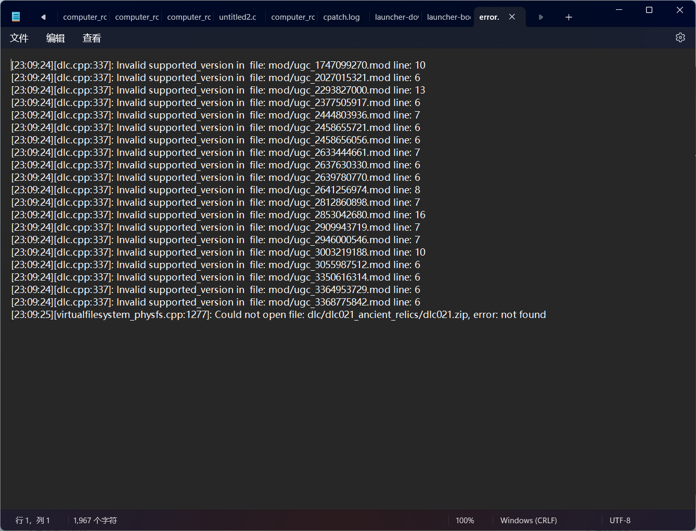
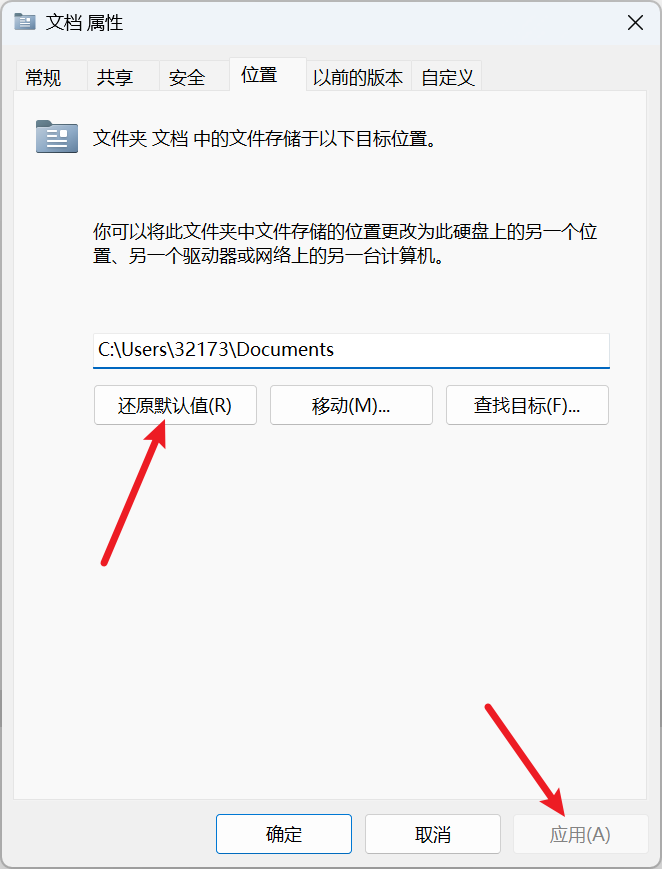

---
title: "点击开始游戏时直接闪退，没有任何报错"
date: 2026-07-15
description: "点击开始游戏时直接闪退，没有任何报错的排查与解决方法，整理常见原因、操作步骤和相关报错截图。"
categories:
  - "报错"
tags:
  - "群星"
  - "Stellaris"
  - "游戏故障"
  - "问题排查"
draft: false
slug: "stellaris-error-02"
---

> 本文整理自《群星常见问题合集及解决办法》，原作者：唏嘘南溪。文档内容会随实际反馈持续修正。

## 1. 报错现象

点击开始游戏时直接闪退，没有任何报错。

## 2. 解决方法

注意这里指的是打开游戏时闪退，如果你是 Steam 里启动游戏按钮点了没反应，压根没打开游戏，请跳转 steam 点开始游戏按钮后打不开游戏，过一会后停止按钮又变成了开始游戏。

对于这种情况，可以在路径 C:\Users\(你的用户名)\文档 (Documents)\Paradox Interactive\Stellaris\logs 中找到报错日志 error.log，打开日志可以看到报错的详细情况，如果报错日志是空的，跳转到游戏加载到 100% 后闪退

常见的报错如下：

dlc 文件缺失，如下图：

这种情况可能是电脑上的杀毒软件把 dlc 部分文件识别为病毒软件并且将其删除，解决这个问题的方法也很简单，把现有的 dlc 文件全部删掉，下载新的 dlc+ 补丁包，重新打上即可。注意如果不想让这个问题反复出现，建议筛查电脑中的杀毒软件，看看到底是哪个软件干的，并把群星的文件夹设置为白名单，避免再次被删除。

如果你顺着这个路径没找到文档，那问题就出在你的文档上，你想想你把你文档改哪去了，见到一个把文档位置改进 U 盘里的，你找不到文档程序自然也找不到，把文档位置改回去问题就解决了

## 3. 仍未解决

如果上述方法不适用，建议记录完整报错文字、复现步骤和 `error.log` 内容后再进一步排查。也可以联系原文作者（QQ：3217344726）反馈，以便补充或修正方案。

