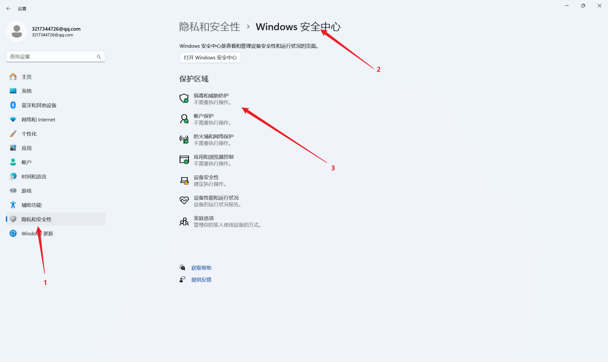
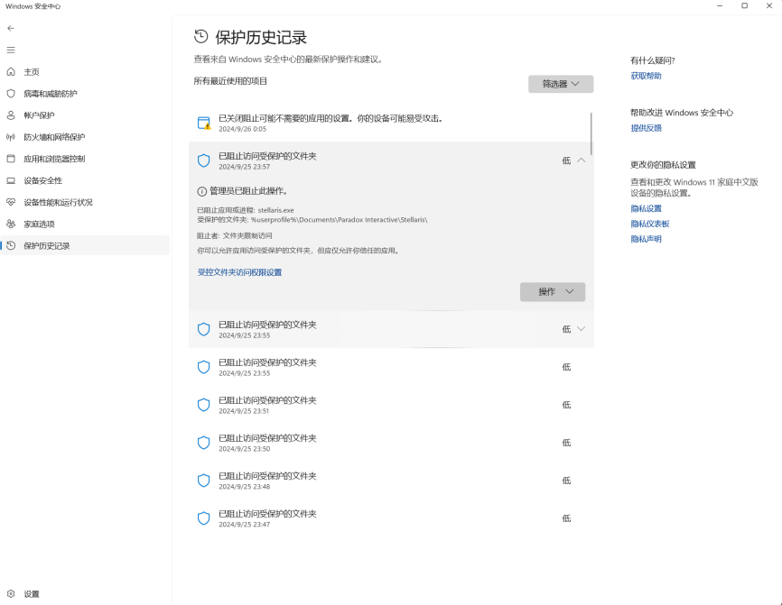
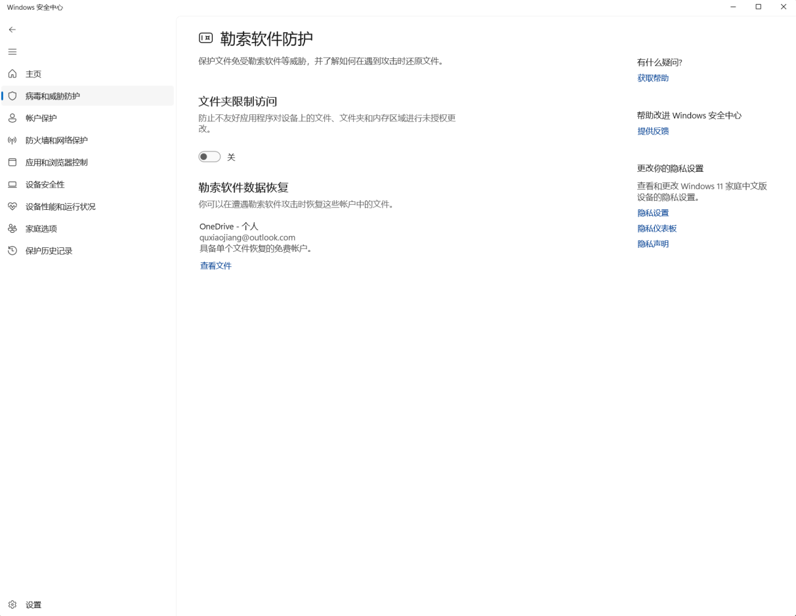

---
title: "加载进入游戏后在游戏主界面闪退"
date: 2026-07-15
description: "加载进入游戏后在游戏主界面闪退的排查与解决方法，整理常见原因、操作步骤和相关报错截图。"
categories:
  - "报错"
tags:
  - "群星"
  - "Stellaris"
  - "游戏故障"
  - "问题排查"
draft: false
slug: "stellaris-error-06"
---

> 本文整理自《群星常见问题合集及解决办法》，原作者：唏嘘南溪。文档内容会随实际反馈持续修正。

## 1. 报错现象

加载进入游戏后在游戏主界面闪退。

## 2. 解决方法

该报错区别于第一条白框闪退报错，该报错一般出现于游戏加载读条结束后一段时间，已经进入了游戏注界面，但不久后闪退。(如下图，进入以下游戏界面后闪退)

出现该报错的可能是是因为系统自带的安全系统限制了游戏对文件夹的访问，只要关掉文件夹限制访问即可。

操作如下：打开设置，选择隐私和安全性，进入 windows 安全中心，选择病毒和威胁防护。

可以在保护历史记录中看到被限制访问文件夹的进程，比如该图中群星被限制访问自己的文件夹，极其抽象。

解决方法也很简单，只要进入病毒和防护，在勒索软件防护中把文件夹限制访问关掉即可。

## 3. 仍未解决

如果上述方法不适用，建议记录完整报错文字、复现步骤和 `error.log` 内容后再进一步排查。也可以联系原文作者（QQ：3217344726）反馈，以便补充或修正方案。
