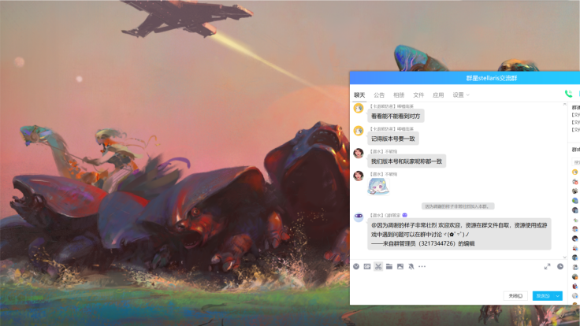

---
title: "打开游戏以后界面过大，不显示按钮"
date: 2026-07-15
description: "打开游戏以后界面过大，不显示按钮的排查与解决方法，整理常见原因、操作步骤和相关报错截图。"
categories:
  - "报错"
tags:
  - "群星"
  - "显示异常"
  - "游戏故障"
draft: false
slug: "stellaris-error-11"
related_group: "stellaris"
---

> 本文整理自《群星常见问题合集及解决办法》，原作者：唏嘘南溪。文档内容会随实际反馈持续修正。

## 1. 报错现象

打开游戏以后界面过大，不显示按钮。

## 2. 解决方法

分辨率问题，退出重进看看有没有效果，如果没有可以参考下面链接的视频删掉指定文件，让系统重新创建一个默认的 (你是佬的话直接改文件也行),如果是正版可以直接去启动器里调整分辨率，或者看显示模式是不是窗口，如果是的话调成全屏。

文件位置：

C:\Users\(你的用户名)\Documents\Paradox Interactive\Stellaris\settings.txt

参考视频：

<https://www.bilibili.com/video/BV1q14y1v7Jg/?share_source=copy_web&vd_source=04becf7d20fdc437d804d92aa7ca4370>

## 3. 仍未解决

如果上述方法不适用，建议记录完整报错文字、复现步骤和 `error.log` 内容后再进一步排查。也可以联系原文作者（QQ：3217344726）反馈，以便补充或修正方案。

