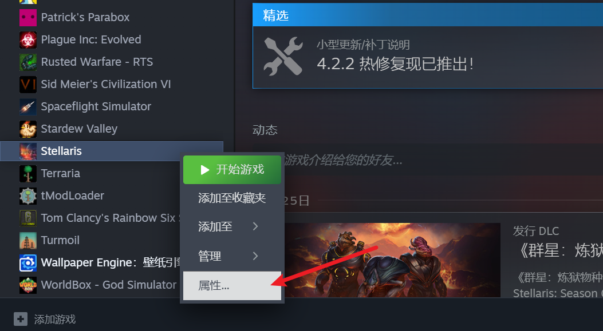
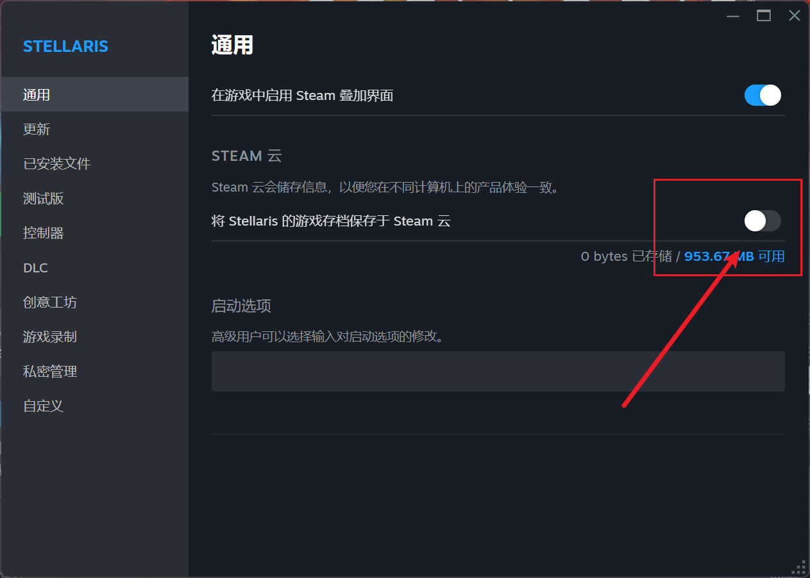

---
title: "退出游戏时游戏卡死，只能强制关闭游戏"
date: 2026-07-15
description: "退出游戏时游戏卡死，只能强制关闭游戏的排查与解决方法，整理常见原因、操作步骤和相关报错截图。"
categories:
  - "报错"
tags:
  - "群星"
  - "Stellaris"
  - "游戏故障"
  - "问题排查"
draft: false
slug: "stellaris-error-13"
---

> 本文整理自《群星常见问题合集及解决办法》，原作者：唏嘘南溪。文档内容会随实际反馈持续修正。

## 1. 报错现象

退出游戏时游戏卡死，只能强制关闭游戏。

## 2. 解决方法

开了云存档导致的，把 steam 云关了就好了，不过关掉之后记得时不时给你存档备份一下，不然换个电脑或者不小心把存档删了你存档就没了

## 3. 仍未解决

如果上述方法不适用，建议记录完整报错文字、复现步骤和 `error.log` 内容后再进一步排查。也可以联系原文作者（QQ：3217344726）反馈，以便补充或修正方案。
