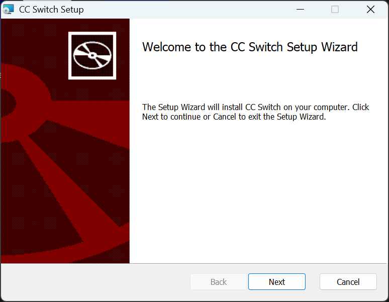
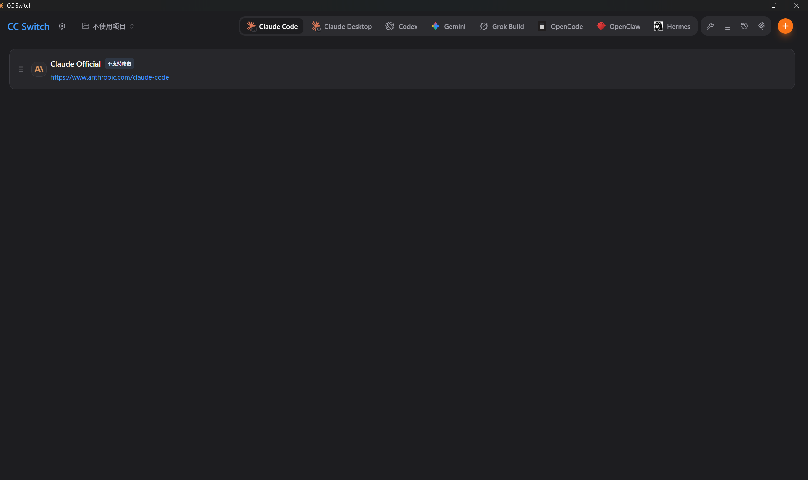
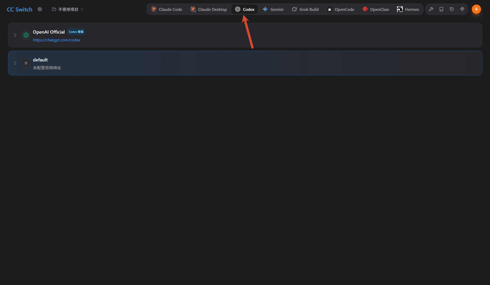
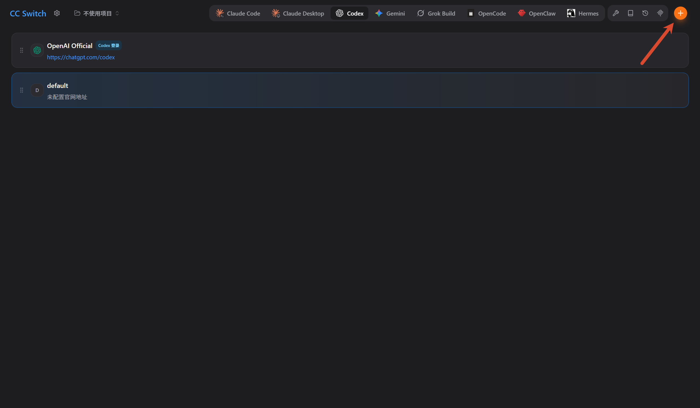
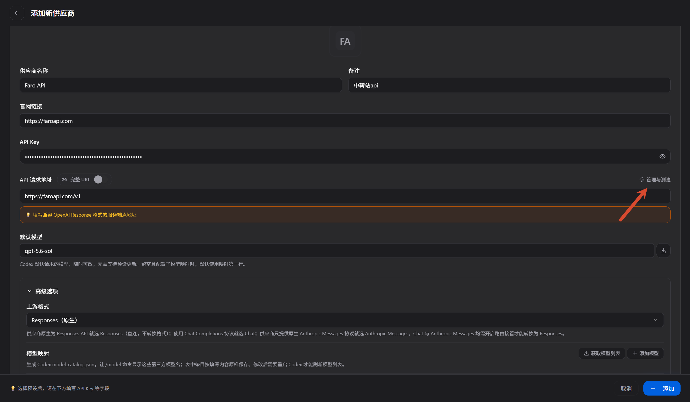
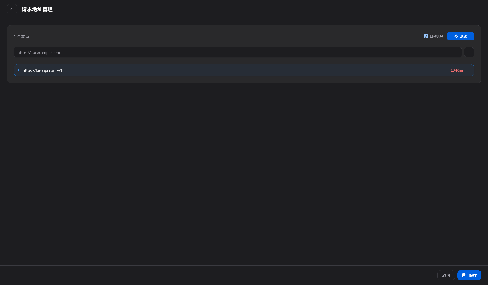
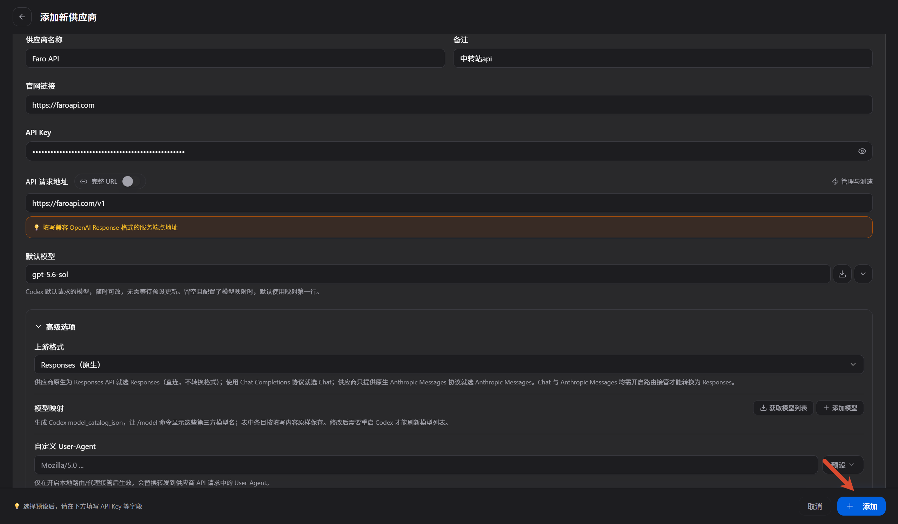
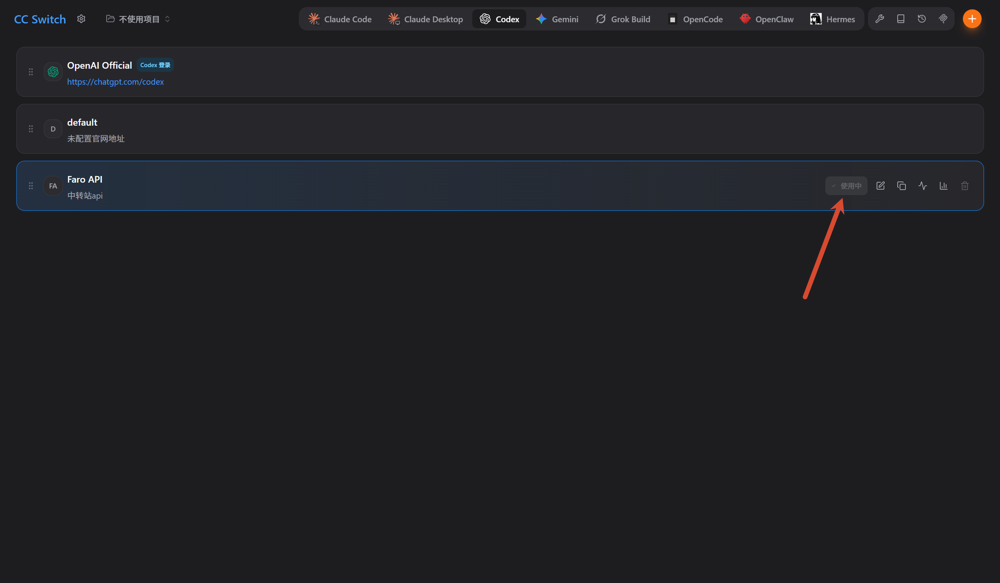
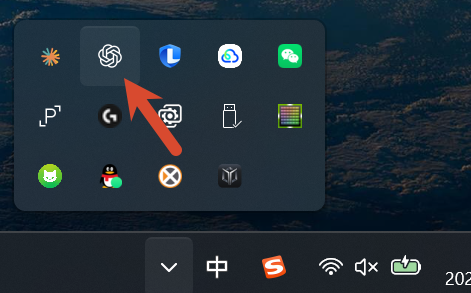
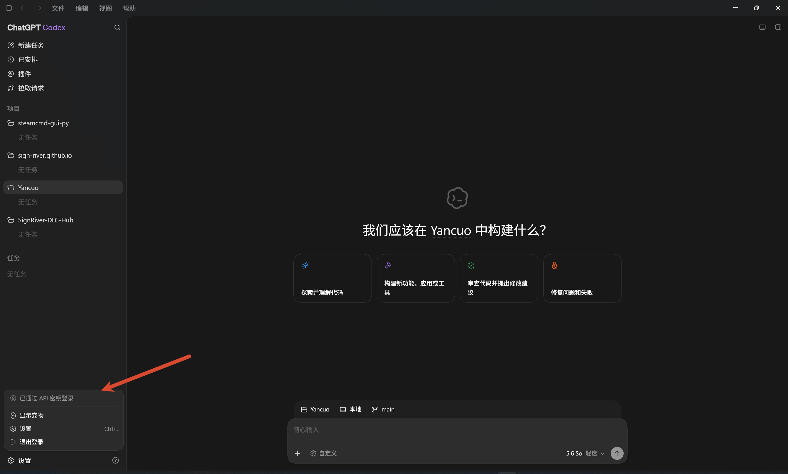

本文以 Windows 和 CC Switch v3.18.0 为例，介绍如何将 Faro API 提供的 API 密钥添加到 CC Switch，并让 Codex 桌面版使用这套配置。后续需要更换接口或密钥时，也可以直接在 CC Switch 中统一管理。

> 本文所说的“登录”是指通过第三方兼容接口进行 **API 密钥登录**，并不是登录 OpenAI 或 ChatGPT 账号。API 密钥相当于账号凭据，请勿公开、转发或以明文形式放入截图。

## 1. 准备工作

开始前需要准备：

- 已安装的 Codex 桌面版
- 从 [Faro API](https://faroapi.com/) 获取的可用 API 密钥
- 能够访问 GitHub 和 Faro API 的网络环境

## 2. 下载并安装 CC Switch

### 2.1. 下载 Windows 安装包

打开 [CC Switch Releases](https://github.com/farion1231/cc-switch/releases)，进入最新版本的下载列表。普通 Windows 电脑选择文件名以 `Windows.msi` 结尾的安装包；ARM64 设备则选择对应的 `Windows-arm64.msi`。不要误下 `.sig` 文件，它只是签名文件，不能直接安装。

截图中的最新版本为 v3.18.0，实际下载时版本号可能已经更新。

### 2.2. 完成安装并启动

双击下载的 `.msi` 文件运行安装程序。在安装向导中点击 **Next**，按提示完成安装。

安装完成后打开 CC Switch。程序首次启动时可能停留在 **Claude Code** 页面，这是正常现象。

## 3. 添加 Faro API 配置

### 3.1. 进入 Codex 配置页

点击顶部的 **Codex** 标签，切换到 Codex 配置页面。

然后点击右上角的 **+** 按钮，进入“添加新供应商”页面。

### 3.2. 填写供应商信息

按照 Faro API 提供的信息填写表单：

| 字段         | 填写内容                                                  |
| ------------ | --------------------------------------------------------- |
| 供应商名称   | `Faro API`，也可以填写其他便于识别的名称                  |
| 备注         | 可选，用于区分不同接口或密钥                              |
| 官网链接     | `https://faroapi.com`                                     |
| API Key      | 粘贴从 Faro API 获取的 API 密钥                           |
| API 请求地址 | `https://faroapi.com/v1`                                  |
| 完整 URL     | 按照截图保持关闭                                          |
| 默认模型     | 填写 Faro API 当前提供的模型 ID，截图示例为 `gpt-5.6-sol` |
| 上游格式     | 选择 `Responses（原生）`                                  |

其余高级选项没有特殊需求时保持默认即可。模型 ID 可能会随服务端调整，不要把截图中的 `gpt-5.6-sol` 当作固定值。

### 3.3. 测试请求地址

填写完成后，点击 API 请求地址右侧的 **管理与测速**。

进入“请求地址管理”页面后，确认列表中显示 `https://faroapi.com/v1`，再点击右上角的 **测速**。

测速的主要目的是确认接口端点可以连接。出现延迟数值说明测试已得到响应；数值较高不代表配置失败，但可能影响实际使用时的响应速度。如果显示连接错误，应先检查请求地址和本机网络。

### 3.4. 保存配置

返回“添加新供应商”页面，再次确认 API Key、请求地址、默认模型和上游格式无误，然后点击右下角的 **添加**。

## 4. 应用配置并重启 Codex

返回 Codex 配置列表，选中刚刚添加的 **Faro API**，将其设为当前使用的配置。当右侧按钮变为 **使用中** 时，说明 CC Switch 已经应用该配置。

Codex 桌面版可能仍在使用启动时读取的旧配置，因此应用供应商后需要彻底退出并重新启动 Codex。不要只关闭主窗口，应从 Windows 系统托盘退出 Codex，确保它不再驻留后台。

## 5. 验证 API 密钥登录状态

重新打开 Codex 桌面版，展开左下角的账号菜单。如果顶部显示 **已通过 API 密钥登录**，并且底部模型选择器中出现对应模型，就说明 Faro API 配置已经生效。

## 6. 常见问题

### 6.1. 应用配置后 Codex 没有变化

返回 CC Switch，确认 Faro API 右侧显示 **使用中**。随后彻底退出 Codex 后重新打开，仅关闭窗口可能不会让新配置立即生效。

### 6.2. 测速显示连接失败

检查 API 请求地址是否完整填写为 `https://faroapi.com/v1`，同时确认网络可以访问 Faro API。如果地址可以连接但实际请求仍失败，还需要检查 API 密钥是否有效。

### 6.3. 模型不可用或模型名称错误

默认模型必须填写 Faro API 当前支持的模型 ID。服务端模型发生变化时，应以 Faro API 提供的最新模型列表为准，再回到 CC Switch 修改配置并重新应用。

> 使用第三方 API 时，请自行留意请求内容的隐私、密钥安全、用量费用和相关服务条款。
