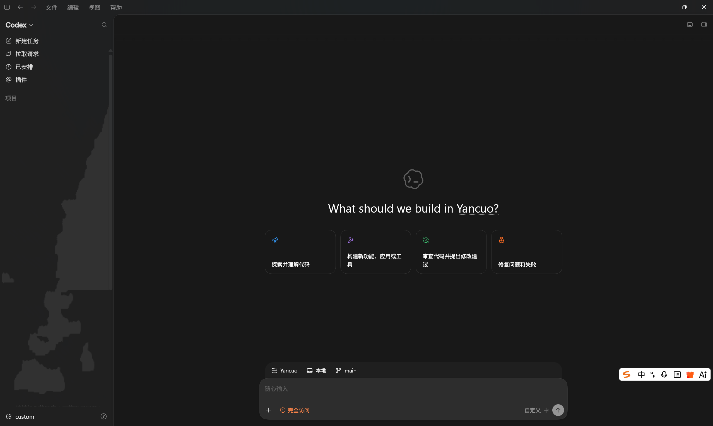
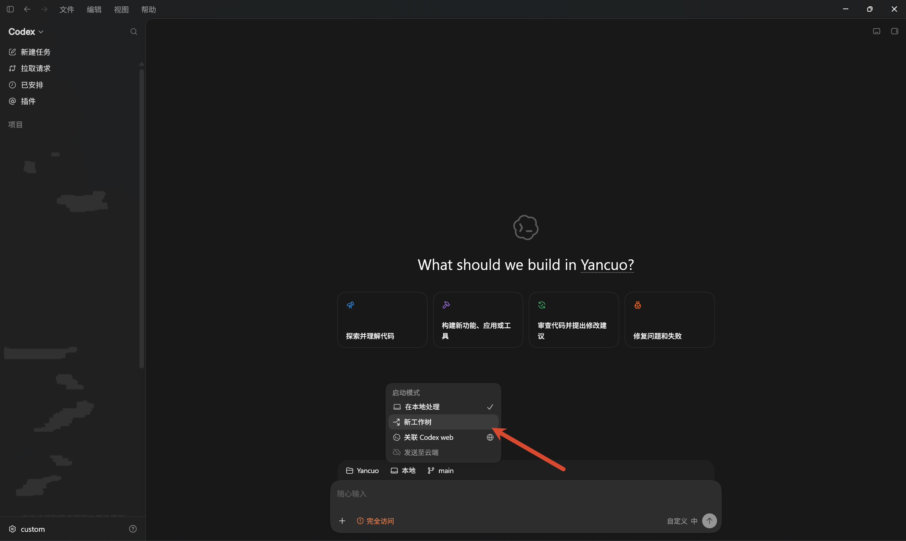
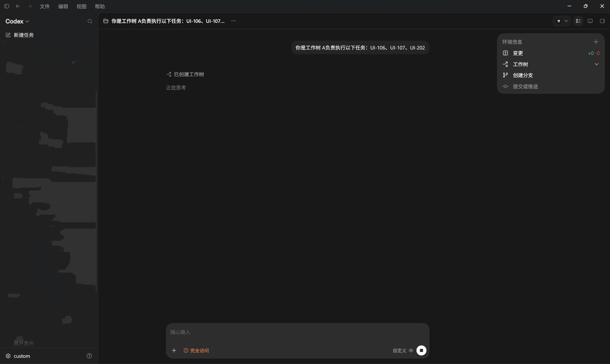
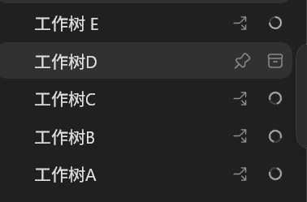
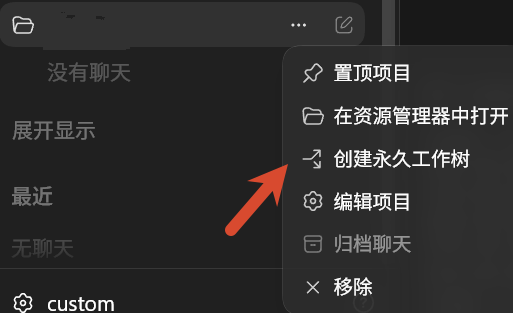
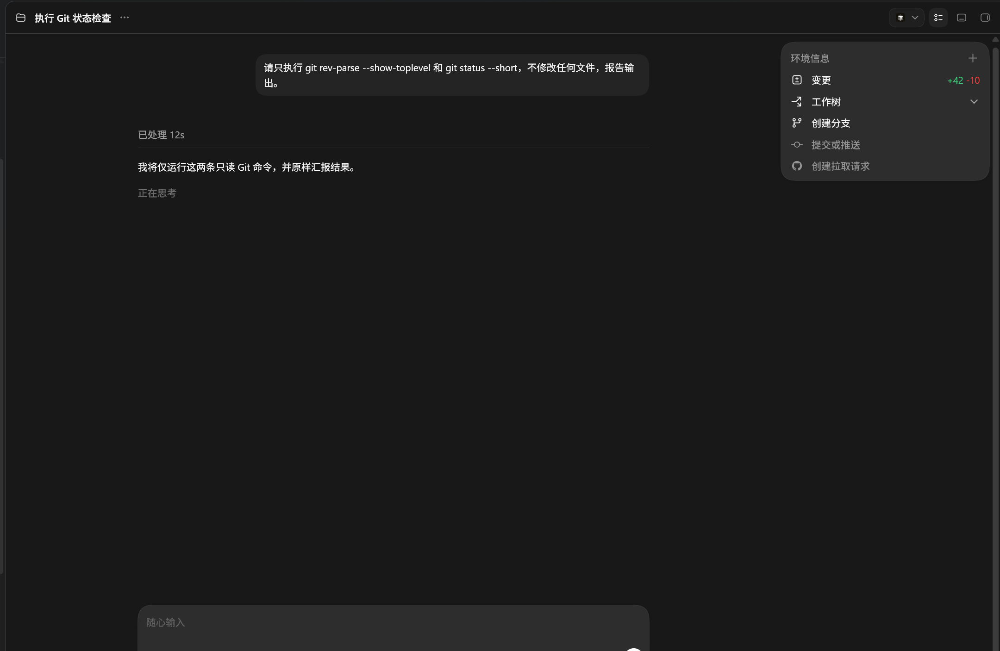
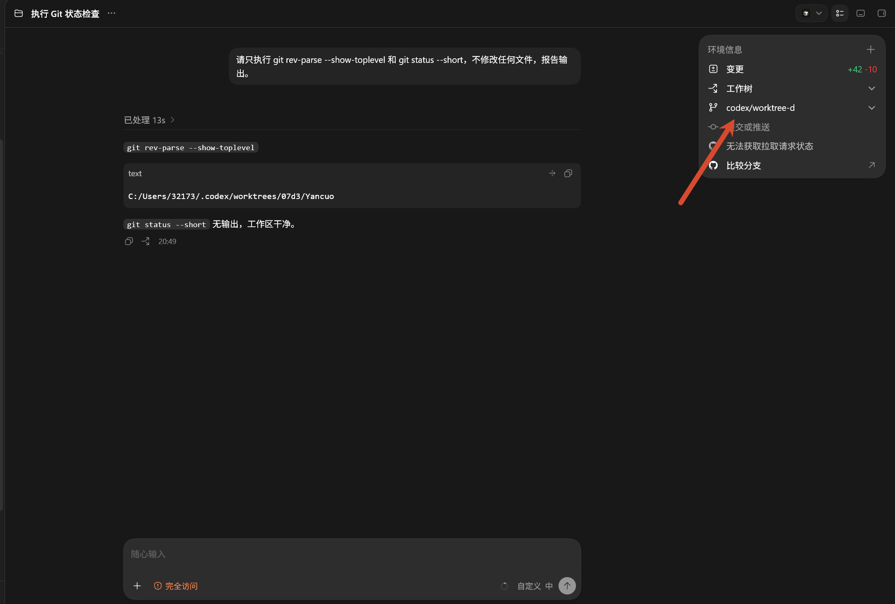

本文演示如何借助本地 Codex 和 Git 工作树，让多个对话同时推进同一个项目中的不同任务。核心原则是先划分清楚任务边界，再分别开发、提交和合并。

本文介绍两种工作流：临时工作树适合一次性的并行任务；永久工作树适合需要持续维护同一条开发线的场景。无论采用哪一种，都应避免多个任务同时修改同一批文件。

## 1. 临时工作树：适合一次性并行任务

临时工作树的特点是每次新建对话时创建一个分支和对应的工作树。任务完成并合并后，这个工作树通常不再继续使用，适合功能开发、测试补充或独立问题排查等短期任务。

### 1.1 创建工作树并分配任务

首先新建一个对话。

<a href="images/2026-07-31-21-53-02.png" target="_blank">  </a>

然后将本地环境切换到新的工作树。

<a href="images/2026-07-31-21-53-26.png" target="_blank">  </a>

接下来，为第一个工作树分配任务。重复“新建对话、创建工作树、分配任务”的过程，就可以让多个对话并行修改同一个项目。

在开始前，建议明确每个任务负责的模块和文件范围。例如，一个任务负责接口实现，另一个任务负责测试，第三个任务负责前端页面。任务说明中最好同时写清目标、涉及目录、验收方式和不应修改的文件，避免后续合并时出现冲突或重复工作。

<a href="images/2026-07-31-21-57-50.png" target="_blank">  </a>

多个任务并行执行后的效果如下：

<a href="images/2026-07-31-22-01-38.png" target="_blank">  </a>

### 1.2 要求每个任务完成收尾

当某个工作树中的任务完成后，可以向对应对话发送下面这段提示，确保它在提交前完成必要的检查：

```text
请停止继续扩展范围，完成当前任务的收尾：

1. 运行本任务相关测试、Ruff、Python 编译和 git diff --check。
2. 只提交你自己修改的文件，不要更新 docs/任务书.md、docs/完成记录.md。
3. 创建一个清晰的 Git 提交。
4. 回复提交哈希、修改文件列表、测试结果和已知风险。
```

这样可以让每个并行任务都产出独立、可审查的提交，也便于后续定位问题。

### 1.3 将各工作树的改动合并到主线

当各工作树完成 Git 提交后，回到主工作区的终端，按提交间的依赖关系依次执行 `cherry-pick`。例如：

```powershell
git cherry-pick <A 的提交哈希>
git cherry-pick <C 的提交哈希>
git cherry-pick <E 的提交哈希>
git cherry-pick <D 的提交哈希>
```

这些命令会将各工作树中的提交复制到主线。每次执行 `cherry-pick` 后，都应检查当前工作区状态和补丁格式：

```powershell
git status --short
git diff --check
```

如果发生冲突，应在主工作区统一处理，不要回到原工作树反复修改同一处代码。处理完成后继续执行 `cherry-pick`，并在所有提交合并完成后运行完整测试。

## 2. 永久工作树：适合持续维护的任务

如果某个任务需要跨多次对话持续推进，或你希望长期保留它的独立开发环境，可以创建永久工作树。它不需要在每次开始新对话时重复创建分支，更适合持续迭代的功能或长期维护的模块。

### 2.1 创建永久工作树

在项目右侧的三个点菜单中，选择创建永久工作树。

<a href="images/2026-08-01-19-03-09.png" target="_blank">  </a>

创建完成后，先向 AI 发送一条只读检查指令，确认当前工作树的根目录和 Git 状态：

```text
请只执行 git rev-parse --show-toplevel 和 git status --short，不修改任何文件，并报告输出结果。
```

<a href="images/2026-08-01-20-50-02.png" target="_blank">  </a>

确认工作树状态无误后，再为它创建对应的分支。

<a href="images/2026-08-01-20-50-57.png" target="_blank">  </a>

后续可以持续在这个工作树中推进同一类任务。需要将成果并入主线时，仍然应遵循独立提交、审查差异和集中处理冲突的原则。

## 3. 如何选择工作树方式

- 临时工作树：适合目标明确、完成后即可合并的一次性任务。
- 永久工作树：适合跨多个阶段持续迭代，或需要长期保留上下文和开发环境的任务。

无论使用哪种方式，任务之间的文件边界越清晰，最终合并就越顺畅。

## 4. 小结

使用本地 Codex 并行开发的重点不在于同时开启多少个对话，而在于任务边界清晰、每项改动独立提交，并在主工作区集中完成合并与验证。这样既能提升并行效率，也能控制集成风险。
