本文以 Windows 和 CC Switch v3.18.0 为例，介绍如何使用 CC Switch 在 Codex 中接入 DeepSeek API，让 Codex 使用 DeepSeek 提供的模型进行对话与编程。

## 1. 准备工作

开始前需要准备：

- 已安装的 Codex 桌面版
- 从 DeepSeek 开放平台获取的可用 API 密钥
- 能够访问 GitHub 和 DeepSeek API 的网络环境

## 2. 下载并安装 CC Switch

### 2.1. 下载 Windows 安装包

打开 [CC Switch Releases](https://github.com/farion1231/cc-switch/releases)，进入最新版本的下载列表。普通 Windows 电脑选择文件名以 `Windows.msi` 结尾的安装包；ARM64 设备则选择对应的 `Windows-arm64.msi`。不要误下 `.sig` 文件，它只是签名文件，不能直接安装。

截图中的最新版本为 v3.18.0，实际下载时版本号可能已经更新。

<a href="images/2026-07-25-00-20-41.png" target="_blank" rel="noopener">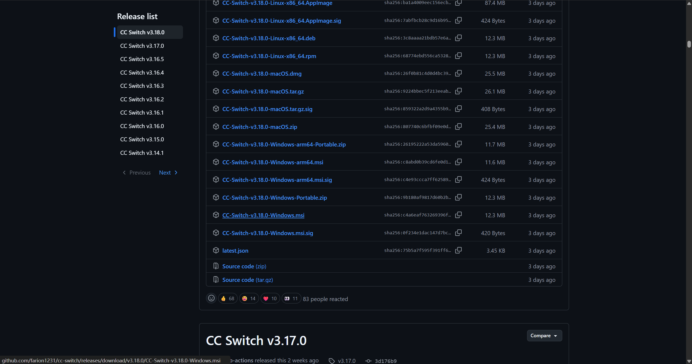</a>

### 2.2. 完成安装并启动

双击下载的 `.msi` 文件运行安装程序。在安装向导中点击 **Next**，按提示完成安装。

安装完成后打开 CC Switch。程序首次启动时可能停留在 **Claude Code** 页面，这是正常现象。

## 3. 获取 DeepSeek API 密钥

进入 [DeepSeek 开放平台的 API Keys 页面](https://platform.deepseek.com/api_keys)，点击 **创建 API Key** 后复制保存。

API Key 只会完整显示一次；如果第一次生成后不小心丢失，也不用着急，把之前创建的密钥删除，重新创建一个即可。

<a href="images/2026-08-04-22-11-39.png" target="_blank"> 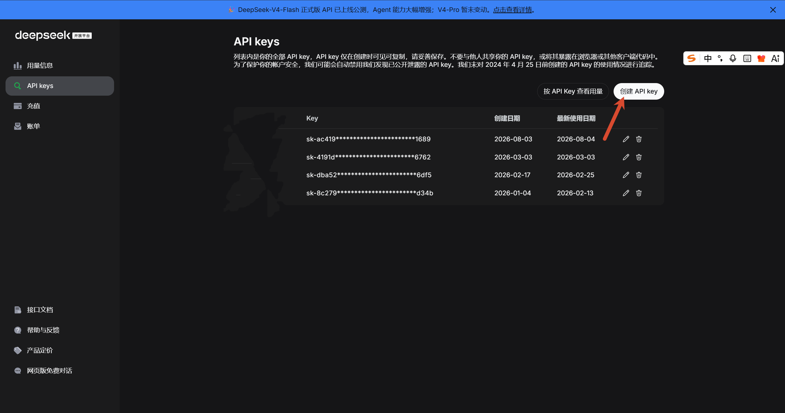 </a>

## 4. 在 Codex 中配置 DeepSeek API

### 4.1. 在 CC Switch 中添加 DeepSeek 供应商

在 Codex 中配置 DeepSeek 需要用到刚刚下载的 CC Switch。首先打开 CC Switch，在顶部选择 **Codex**。

<a href="images/2026-08-04-22-12-42.png" target="_blank"> 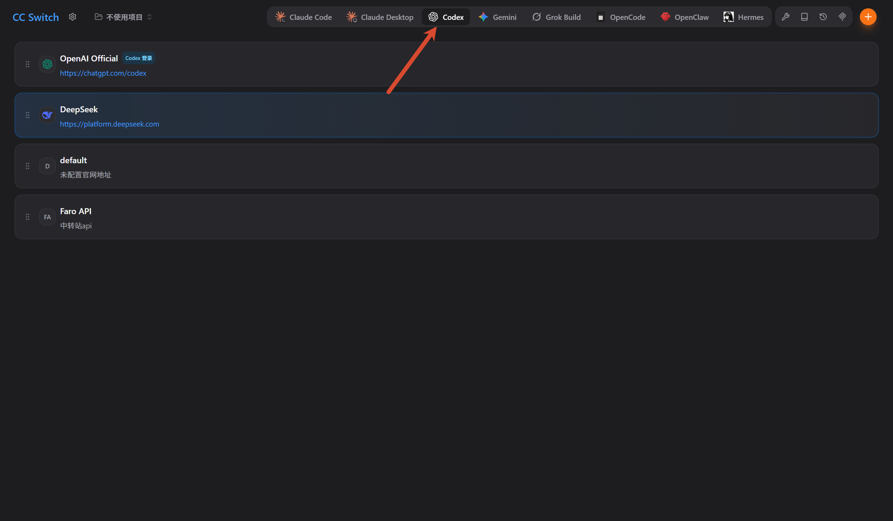 </a>

点击右上角的 **添加新账户**。

<a href="images/2026-08-04-22-13-05.png" target="_blank"> 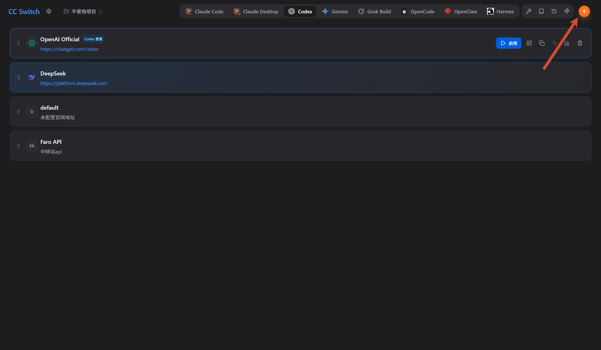 </a>

选择 **DeepSeek**。

<a href="images/2026-08-04-22-13-22.png" target="_blank"> 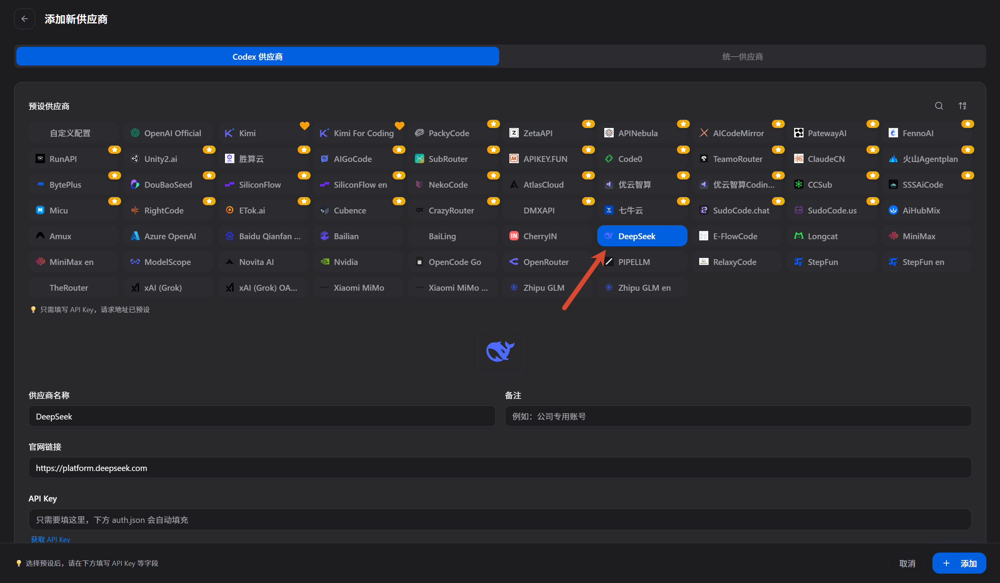 </a>

### 4.2. 填写 API 配置

在 **API Key** 中填写刚刚创建的 API 密钥。

<a href="images/2026-08-04-22-14-07.png" target="_blank"> 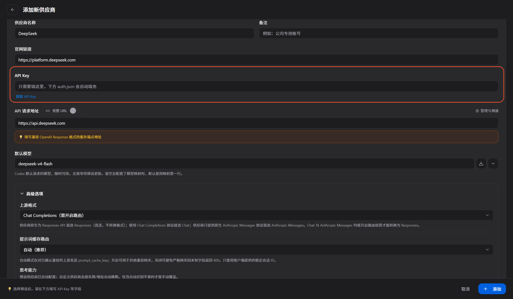 </a>

为了使用 DeepSeek 专门适配 Codex 的功能，上游格式选择 **Responses**。

<a href="images/2026-08-04-22-14-38.png" target="_blank"> 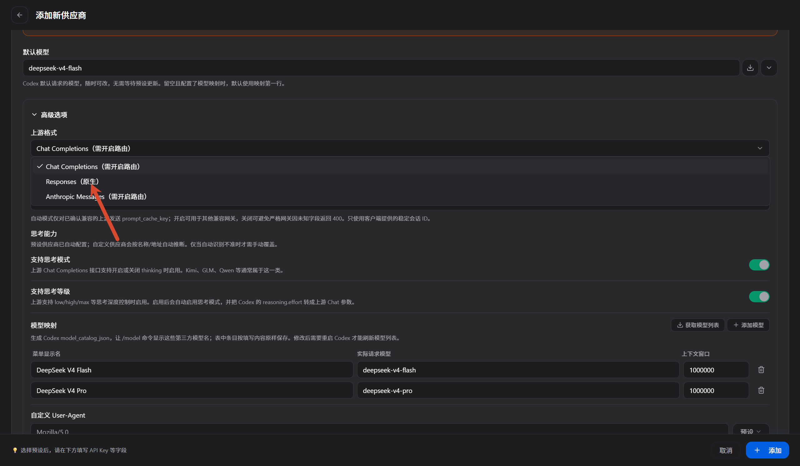 </a>

DeepSeek V4 Pro 目前尚未适配 Codex，可以将其删除。
<a href="images/2026-08-04-22-15-42.png" target="_blank"> 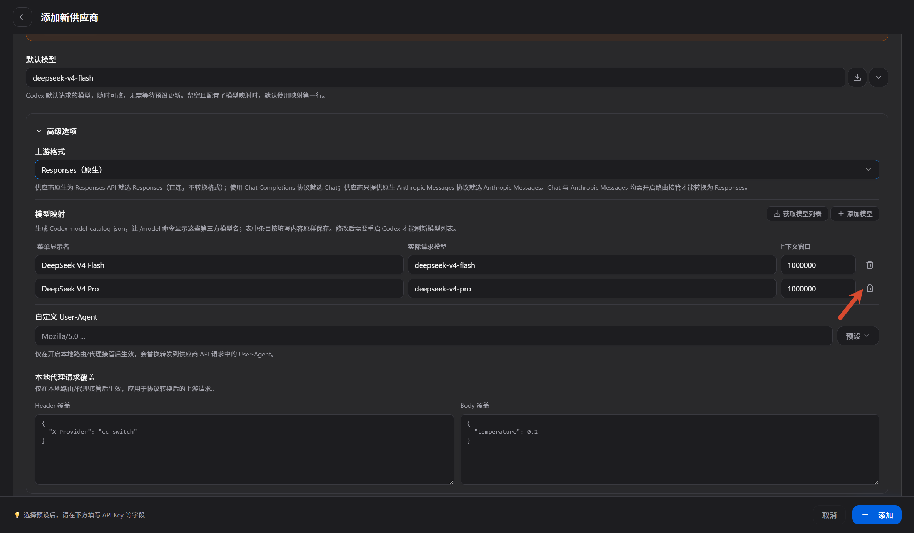 </a>

全部设置完成后点击 **添加**。

<a href="images/2026-08-04-22-16-32.png" target="_blank"> 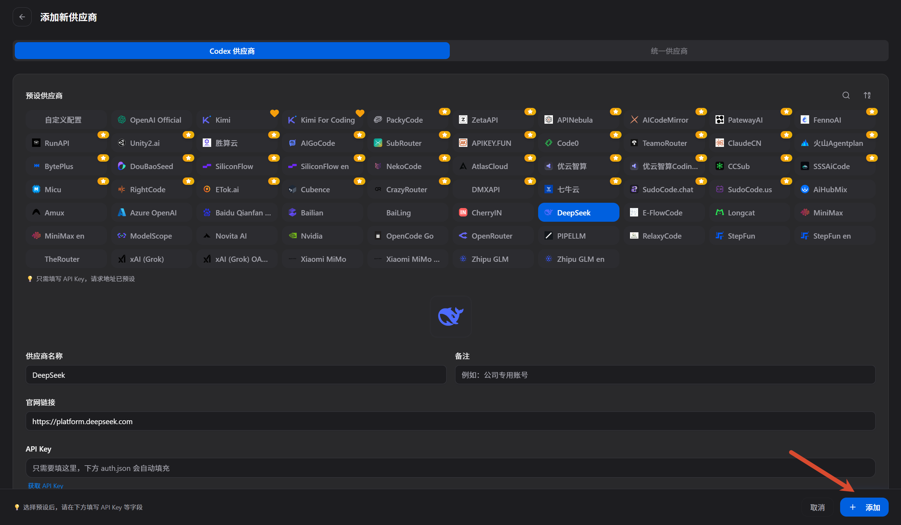 </a>

返回主页面，选择启用 **DeepSeek**。

<a href="images/2026-08-04-22-17-05.png" target="_blank"> 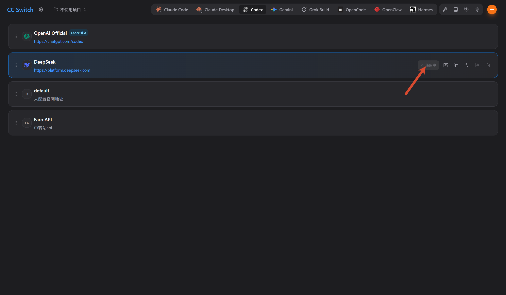 </a>

### 4.3. 应用配置并重启 Codex

彻底退出 Codex 后重新打开。

<a href="images/2026-08-04-22-17-56.png" target="_blank"> 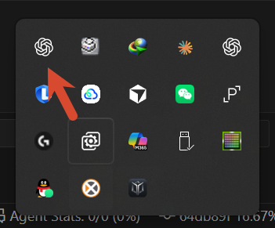 </a>

重新打开后，即可在 Codex 中成功使用 DeepSeek。

<a href="images/2026-08-04-22-18-35.png" target="_blank"> 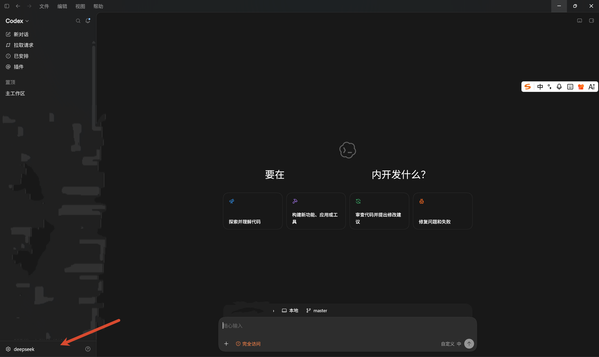 </a>

## 5. 总结

注意：如果 Codex 显示需要配置路由，说明在 CC Switch 的 **上游格式** 中没有选择 **Responses**，回到配置中修改并重新应用即可。
<a href="images/2026-08-04-22-20-14.png" target="_blank"> 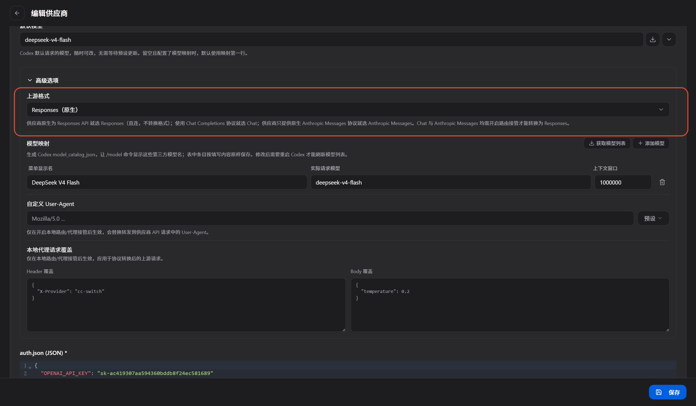 </a>
