本文介绍如何通过本地视觉代理 `codex-deepseek-vision`，让 Codex 中的 DeepSeek 支持粘贴图片并正常看图回答。全程使用智谱 GLM 免费视觉模型，无需额外费用、无需 GPU。

## 方案原理

DeepSeek 的 API 模型是纯文本模型，不能直接接收图片。`codex-deepseek-vision`（agent-vision）是一个本地「视觉桥」：它在 Codex 与 DeepSeek 之间拦截请求，把图片交给智谱 GLM（免费视觉模型）转成文字描述，再以纯文本形式交给 DeepSeek 推理——主模型不变、成本不变，只是多了一层本地代理。

```text
粘贴图片 / 图片路径
        ↓
agent-vision 本地代理（127.0.0.1:19100）
        ↓
GLM 免费视觉模型 → 文字描述
        ↓
DeepSeek 基于描述回答
```

## 一、准备工作：打开 PowerShell 与检查 Python

### 1. 打开 PowerShell

在桌面按 `Win + X`，选择「终端」或「Windows PowerShell」：

<a href="images/2026-08-05-23-07-09.png" target="_blank"> 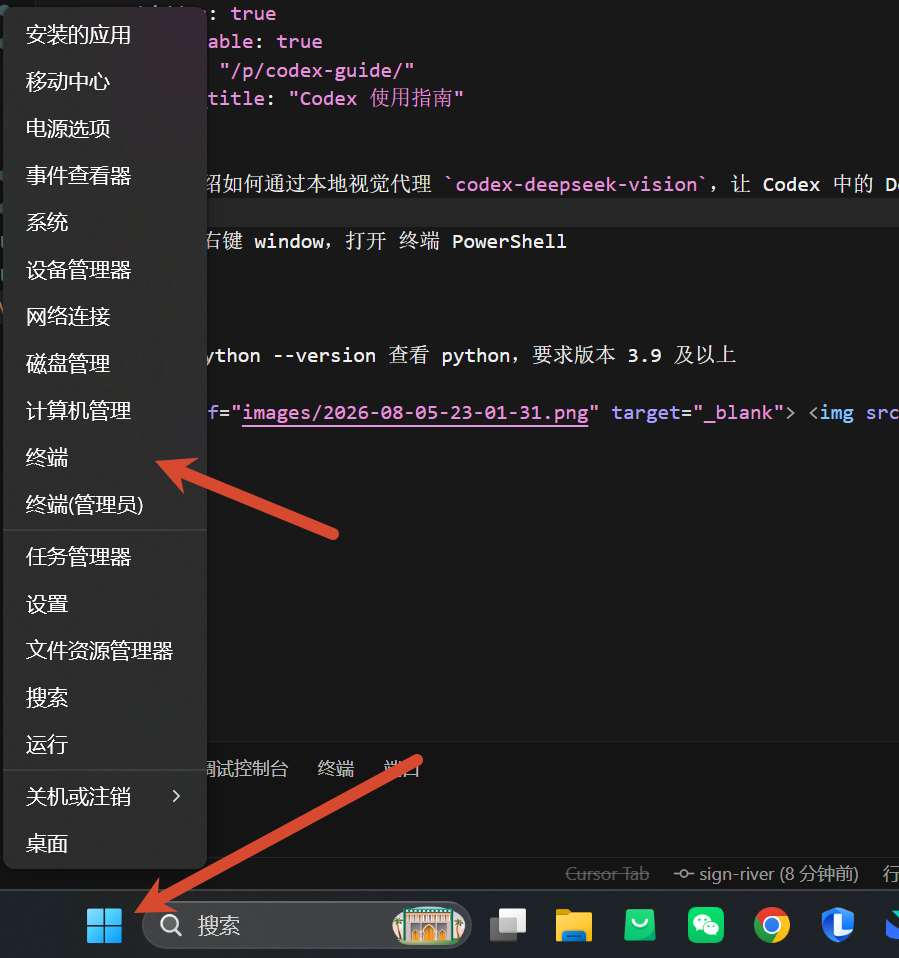 </a>

### 2. 检查 Python 版本

执行 `python --version`，要求版本 3.9 及以上：

<a href="images/2026-08-05-23-01-31.png" target="_blank"> 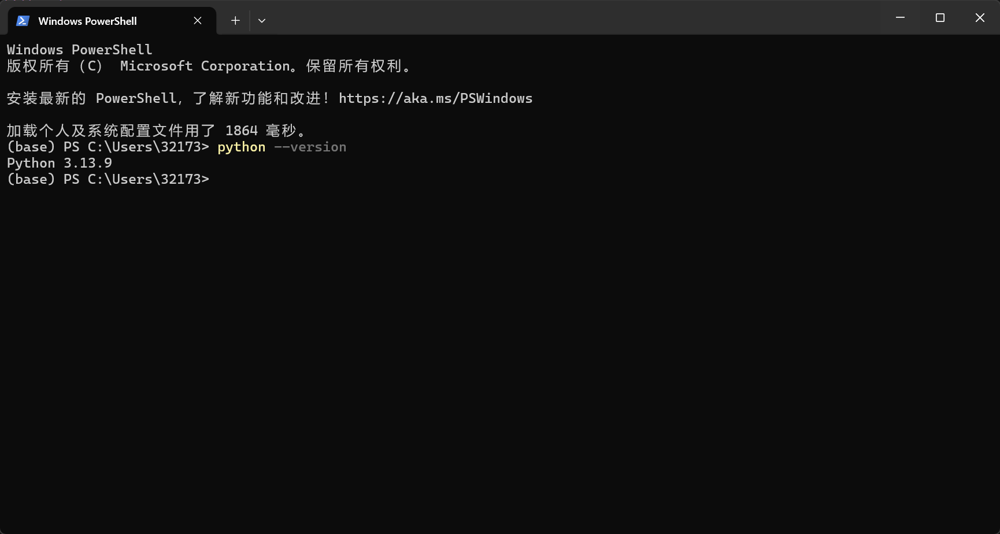 </a>

如果没有 python，则执行 `winget install Python.Python.3.12` 安装

<a href="images/2026-08-08-21-34-59.png" target="_blank"> 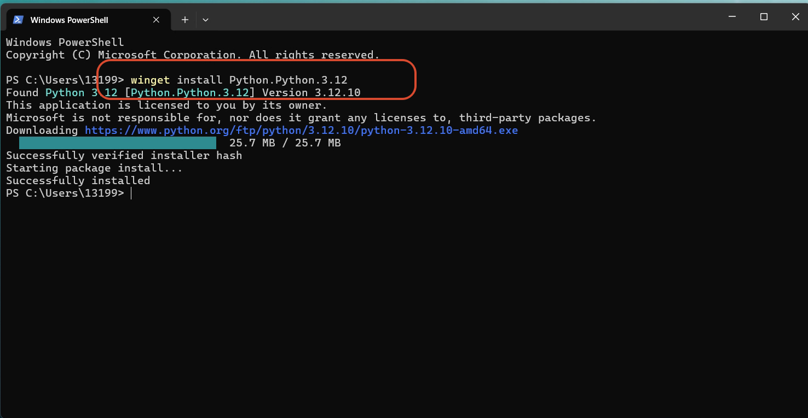 </a>

## 二、安装 agent-vision

`agent-vision` 是一个「视觉桥」——给纯文本模型（比如 DeepSeek）外挂一双眼睛，让它在图片到达之前，先把图片翻译成文字描述。

执行安装命令：

```powershell
pip install codex-deepseek-vision
```

看到 `Successfully installed` 即安装成功：

<a href="images/2026-08-05-23-13-00.png" target="_blank"> 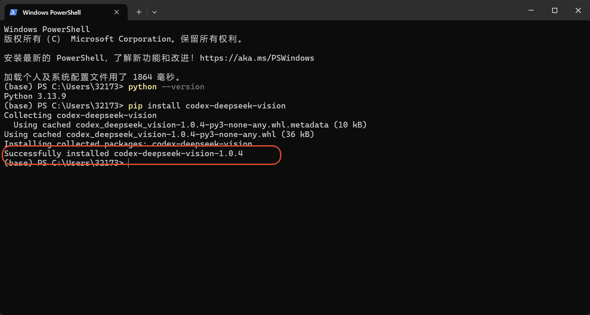 </a>

验证安装：

```powershell
agent-vision --help
```

<a href="images/2026-08-05-23-14-15.png" target="_blank"> 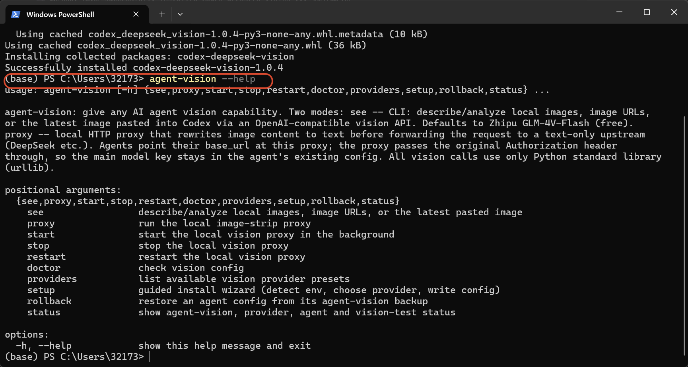 </a>

## 三、注册智谱开放平台，获取免费 API Key

前往 https://open.bigmodel.cn 注册并登录账号（注册流程从略）：

<a href="images/2026-08-05-23-28-12.png" target="_blank"> 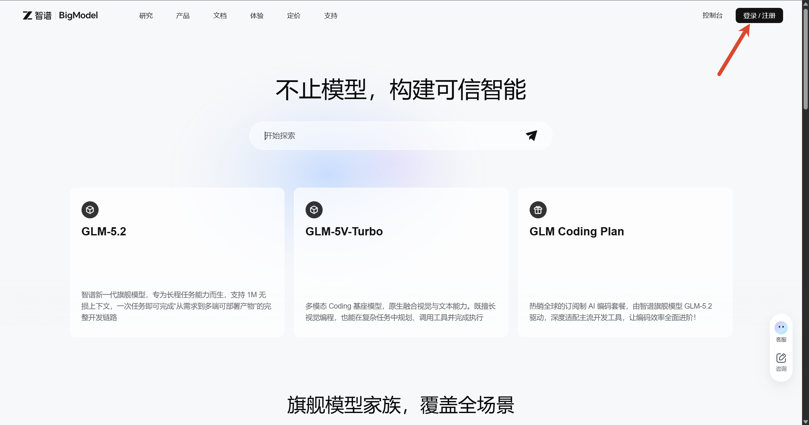 </a>

登录后进入个人设置，完成**实名认证**（否则调用会受限）：

<a href="images/2026-08-05-23-30-17.png" target="_blank"> 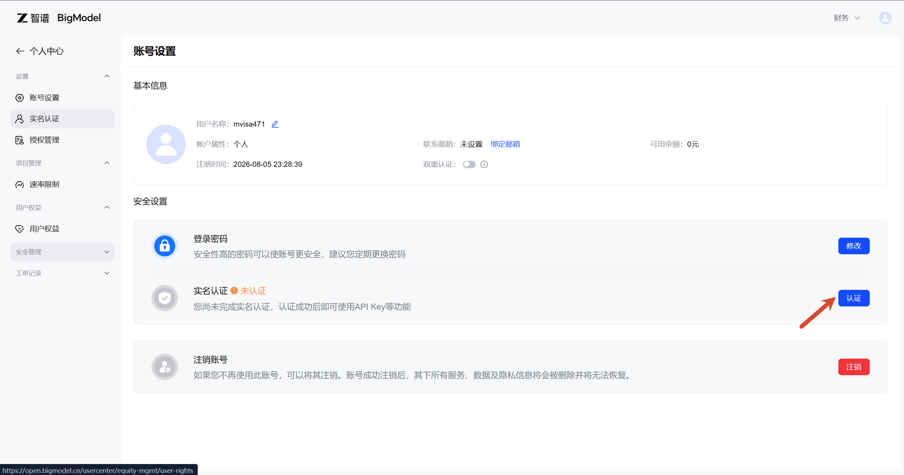 </a>

进入个人中心：

<a href="images/2026-08-05-23-34-15.png" target="_blank"> 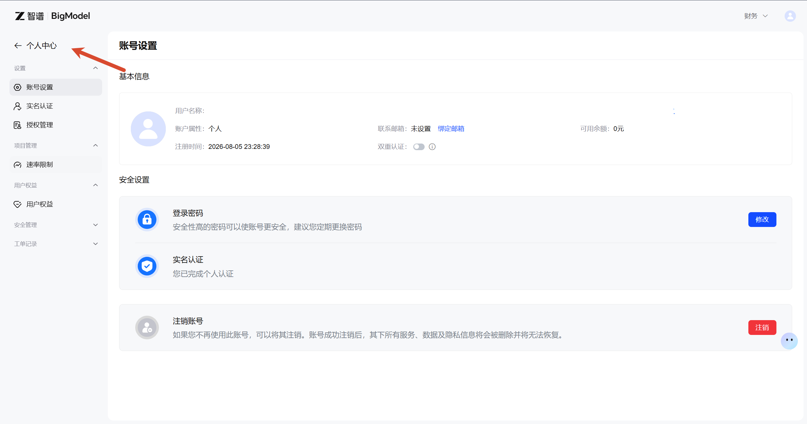 </a>

进入 API Keys 管理页：

<a href="images/2026-08-05-23-34-42.png" target="_blank">  </a>

新建一个 Key，起个名字（如 `codex-vision`），创建后复制并保存到安全的地方（**Key 只显示一次**）：

<a href="images/2026-08-05-23-35-36.png" target="_blank"> 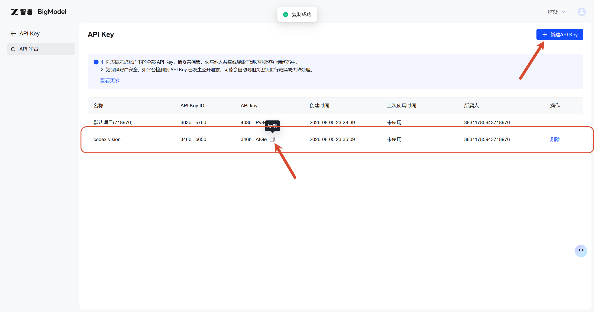 </a>

## 四、配置向导：接入免费识图模型

接下来接入免费识图模型 GLM-4.6V-Flash（默认使用免费的 `glm-4v-flash`，均可免费调用）：

<a href="images/2026-08-05-23-56-26.png" target="_blank"> 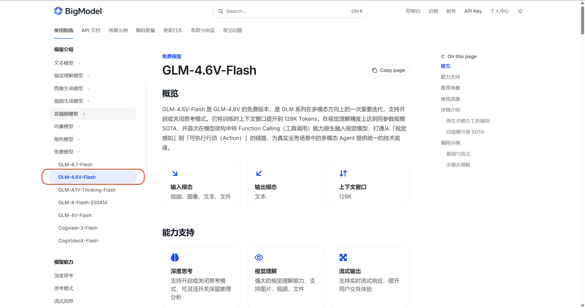 </a>

回到终端，确认已安装：

```powershell
pip install codex-deepseek-vision
```

<a href="images/2026-08-05-23-57-19.png" target="_blank"> 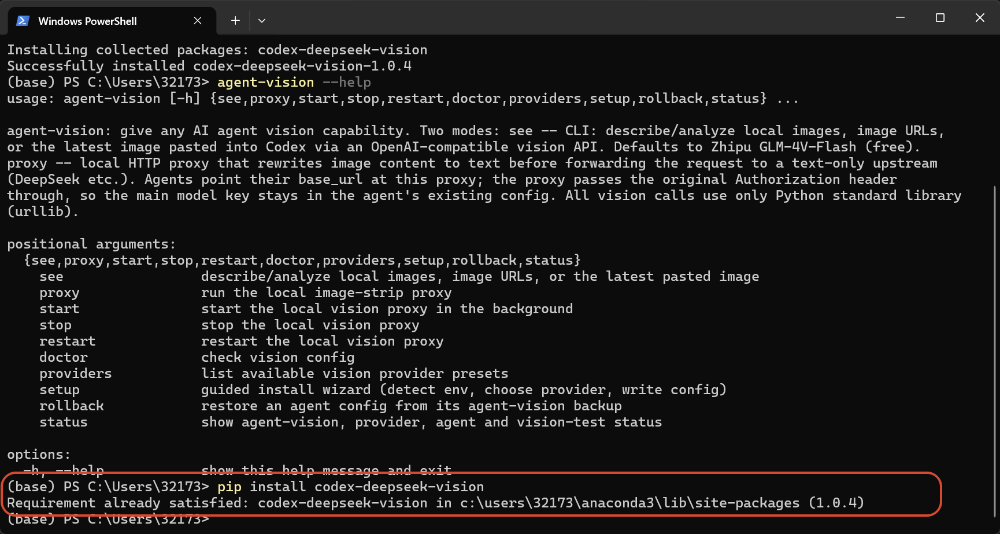 </a>

运行配置向导：

```powershell
agent-vision setup
```

<a href="images/2026-08-05-23-58-18.png" target="_blank"> 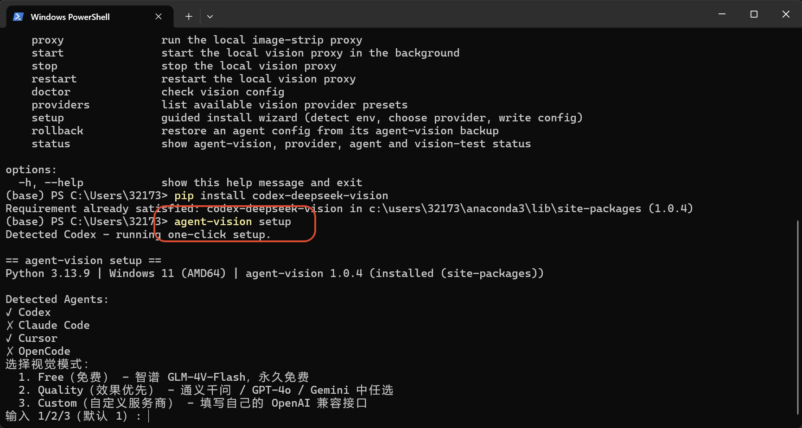 </a>

选择 **1（Free 免费模型）**，然后粘贴刚才保存的 API Key（截图已打码，正常输入时是明文可见的）：

<a href="images/2026-08-06-00-00-27.png" target="_blank"> 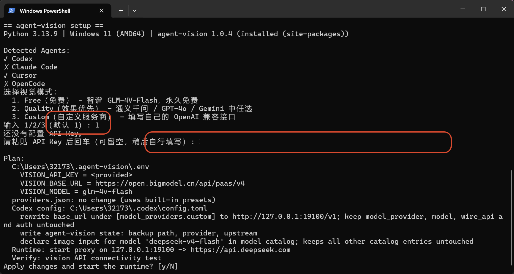 </a>

输入 `y` 回车确认，向导会自动修改 Codex 配置、启动本地代理并测试连接：

<a href="images/2026-08-06-00-01-22.png" target="_blank"> 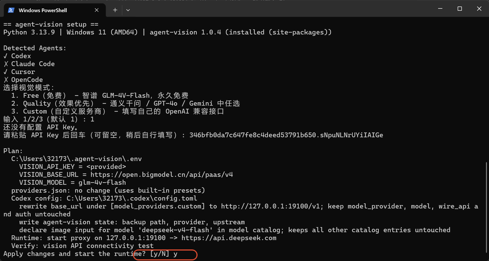 </a>

安装成功：

<a href="images/2026-08-06-00-01-45.png" target="_blank"> 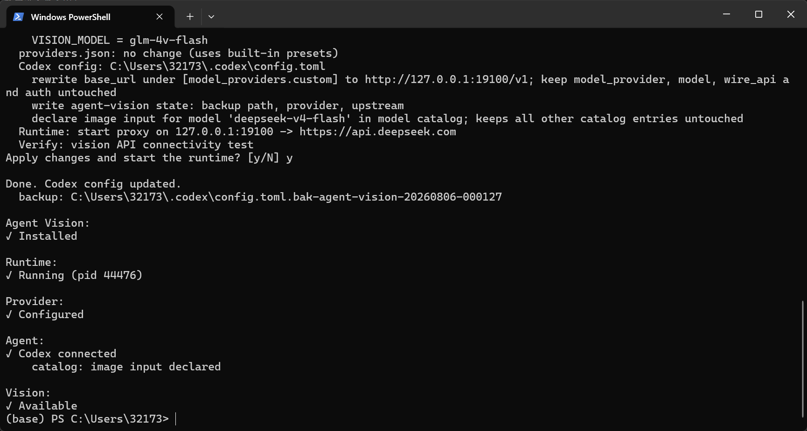 </a>

执行 `agent-vision status` 检查结果，各检查项均为 ✓ 即正常：

<a href="images/2026-08-06-00-03-11.png" target="_blank"> 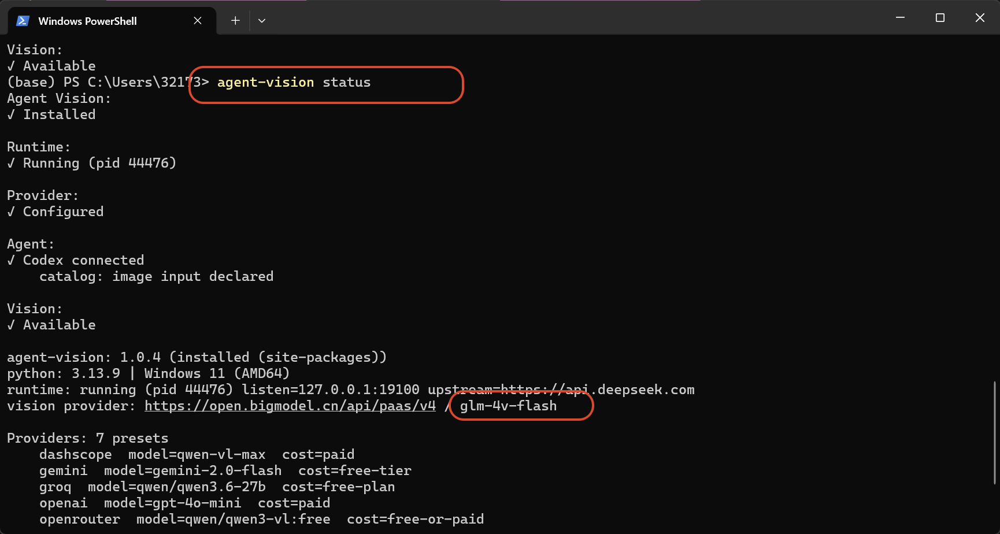 </a>

## 五、（可选）切换更好的视觉模型

默认使用 `glm-4v-flash`，免费且稳定，日常使用足够。如果想追求更好的识别效果，可以换成 `glm-4.6v-flash`（同样免费），或以后切换到任意视觉模型——下面的流程可作为通用模板。

打开配置文件：

```powershell
notepad $env:USERPROFILE\.agent-vision\.env
```

把 `VISION_MODEL` 改为目标模型名并保存（务必保存成功，可多按几次 `Ctrl+S`）：

<a href="images/2026-08-06-00-04-57.png" target="_blank"> 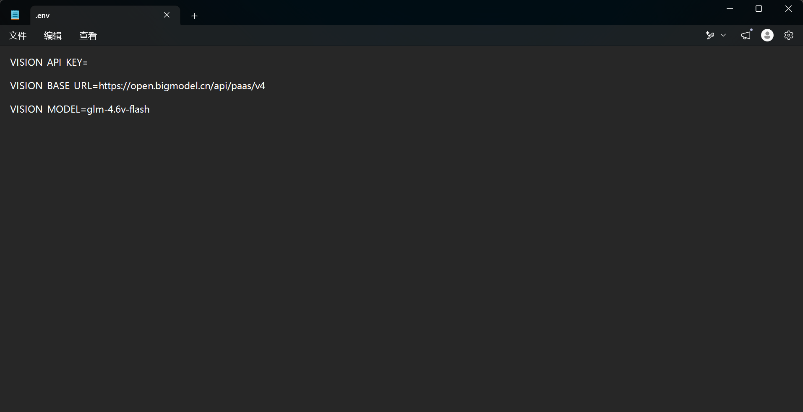 </a>

重启服务使配置生效：

```powershell
agent-vision restart
```

<a href="images/2026-08-06-00-06-05.png" target="_blank"> 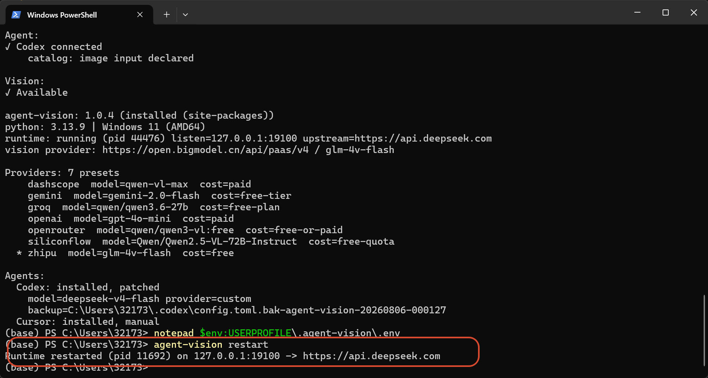 </a>

> 提示：`glm-4.6v-flash` 高峰期可能因访问量过大返回 429。日常建议保持默认的 `glm-4v-flash`，需要更好效果时再切换。

## 六、验证 Codex 配置已被自动修改

检查 `config.toml`，`base_url` 应指向本地代理：

```powershell
Get-Content "$env:USERPROFILE\.codex\config.toml" | Select-String "base_url|model_provider|model_catalog_json"
```

预期结果：`base_url = "http://127.0.0.1:19100/v1"`（不再是 api.deepseek.com）：

<a href="images/2026-08-06-00-08-27.png" target="_blank"> 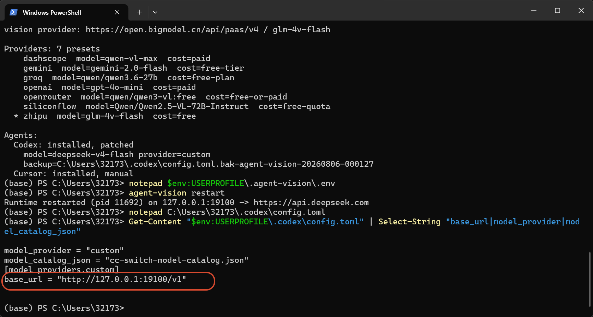 </a>

检查模型目录，`deepseek-v4-flash` 的 `input_modalities` 应多了 `image`：

```powershell
Get-Content "$env:USERPROFILE\.codex\cc-switch-model-catalog.json" -Raw | ConvertFrom-Json | Select-Object -ExpandProperty models | Where-Object { $_.slug -eq "deepseek-v4-flash" } | Select-Object slug, input_modalities, supports_image_detail_original | Format-List
```

预期结果：`input_modalities` 为 `{text, image}`，不再只有 `text`：

<a href="images/2026-08-06-00-09-15.png" target="_blank"> 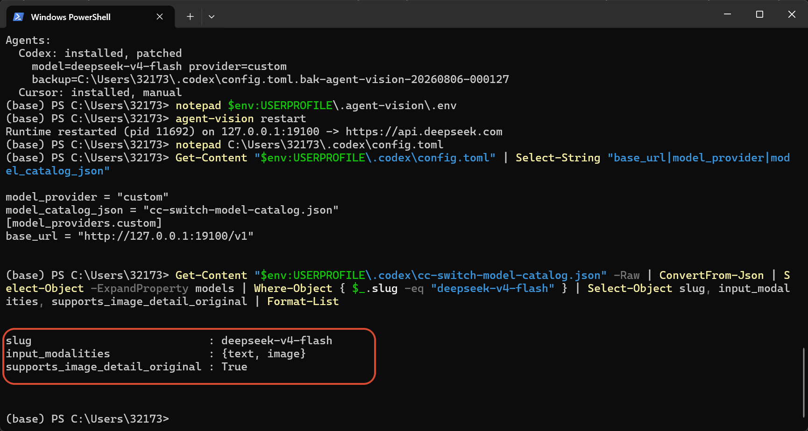 </a>

## 七、命令行识图自测

执行以下命令，识别最近一次发给 Codex 的图片（如果之前没发过图，先在 Codex 对话里发一张再执行）：

```powershell
agent-vision see --latest -q "描述一下这张图"
```

第一次测试可能遇到 `HTTP 429`（免费模型高峰期访问量过大），属正常现象：

<a href="images/2026-08-06-00-13-33.png" target="_blank"> 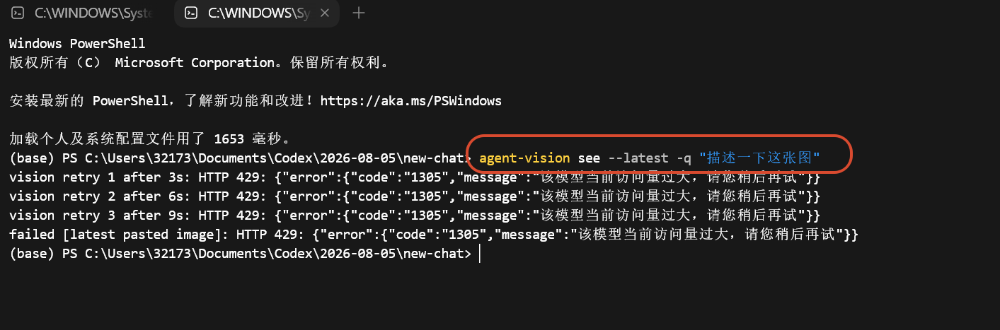 </a>

遇到 429 就切回稳定的 `glm-4v-flash`：再次打开 `.env`，把模型名改回去：

```powershell
notepad $env:USERPROFILE\.agent-vision\.env
```

<a href="images/2026-08-06-00-15-27.png" target="_blank"> 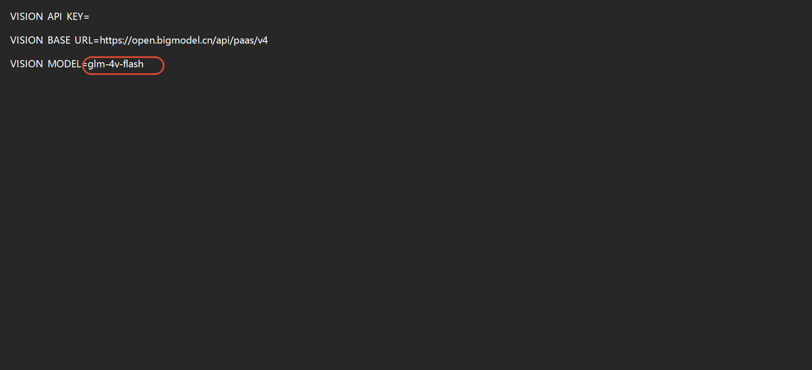 </a>

重启服务：

```powershell
agent-vision restart
```

<a href="images/2026-08-06-00-16-03.png" target="_blank"> 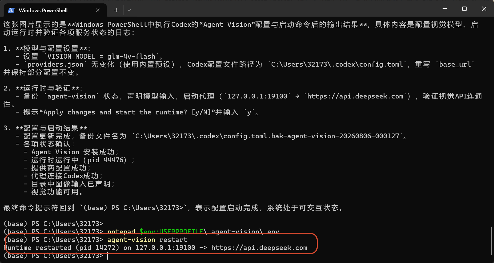 </a>

再次执行 `agent-vision see --latest -q "描述一下这张图"`，可以看到成功返回图片描述：

<a href="images/2026-08-06-00-17-50.png" target="_blank"> 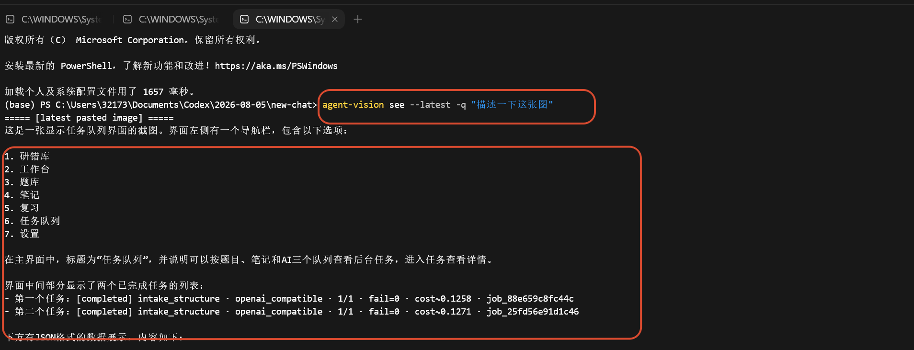 </a>

## 八、开机自启（可选，推荐）

**外置模型生效的重要前提：代理必须保持运行。** 如果以后电脑重启，先执行 `agent-vision start` 再打开 Codex。

嫌麻烦的话，可以设置开机自启，在终端执行：

```powershell
$agent = (Get-Command agent-vision).Source
$startup = [Environment]::GetFolderPath('Startup')
$ws = New-Object -ComObject WScript.Shell
$sc = $ws.CreateShortcut("$startup\agent-vision.lnk")
$sc.TargetPath = "powershell.exe"
$sc.Arguments = "-WindowStyle Hidden -NoProfile -Command `"& '$agent' start`""
$sc.Description = "Codex vision bridge auto-start"
$sc.Save()
Write-Host "已创建自启项：$startup\agent-vision.lnk"
```

看到「已创建自启项」即成功。然后完全退出 Codex 桌面端并重新打开：

<a href="images/2026-08-06-00-24-19.png" target="_blank"> 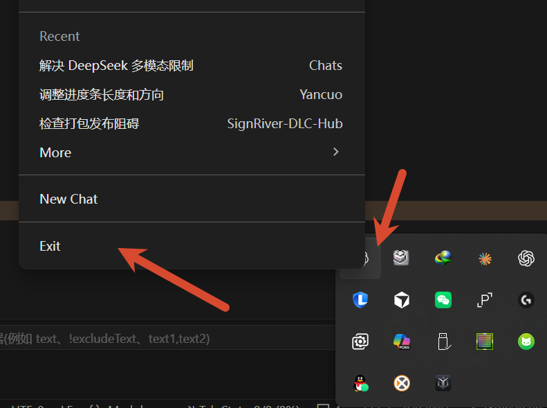 </a>

## 九、创建 skill：让 DeepSeek 优先使用外置识图

默认情况下，Codex 桌面端会先用系统 OCR 兜底识别图片。为了让 DeepSeek 优先使用我们接入的 GLM 视觉模型，需要创建一个 skill，让模型主动调用 `agent-vision see`。

打开资源管理器，在地址栏输入以下路径并回车：

```
%USERPROFILE%\.codex\skills
```

<a href="images/2026-08-06-00-45-20.png" target="_blank"> 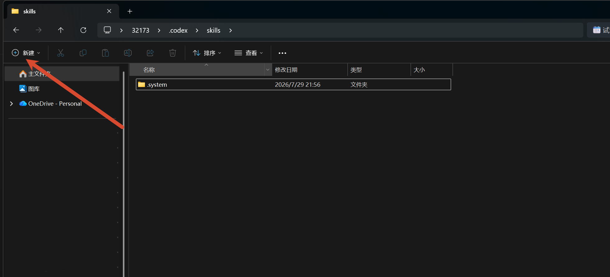 </a>

新建文件夹，命名为 `glm-vision`：

<a href="images/2026-08-06-00-46-08.png" target="_blank"> 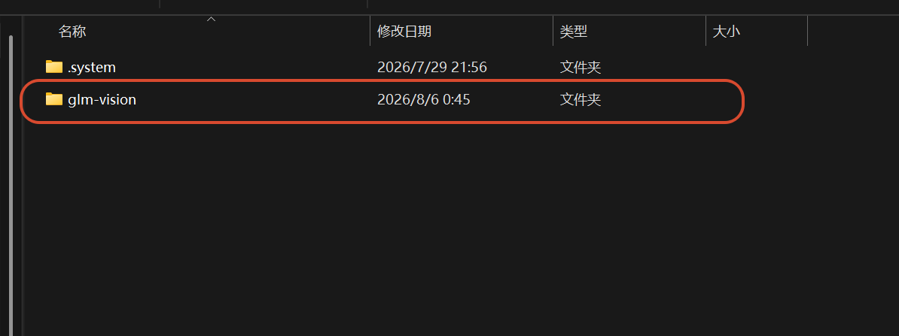 </a>

在 `glm-vision` 文件夹内新建一个文本文件，改名为 `SKILL.md`（注意扩展名是 `.md`，不是 `.txt`）：

<a href="images/2026-08-06-00-46-34.png" target="_blank"> 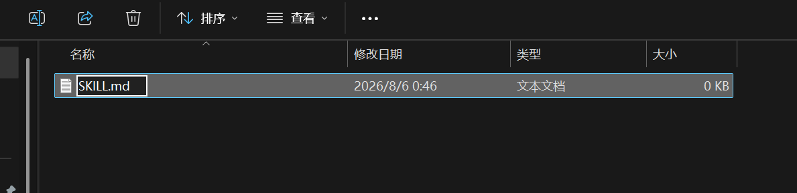 </a>

如果看不到后缀，先在「查看」中打开「文件扩展名」显示：

<a href="images/2026-08-06-00-47-00.png" target="_blank"> 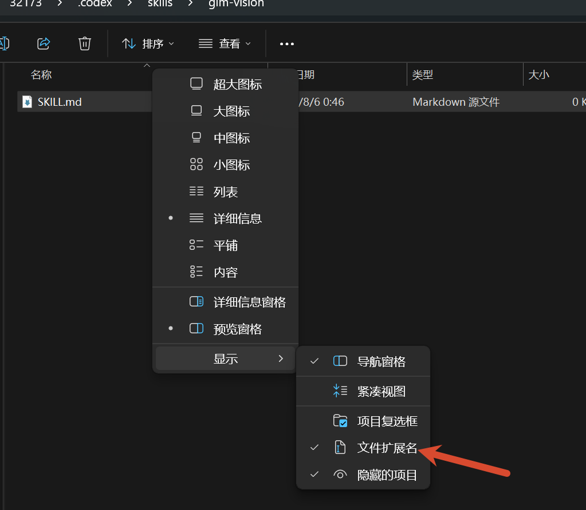 </a>

用记事本打开 `SKILL.md`，粘贴以下内容：

````markdown
---
name: glm-vision
description: 当用户粘贴图片、提供图片文件路径或 URL，或对话里出现图片附件且需要理解图片内容时使用。适用于任何图片：照片、动物、场景、截图、报错、图表、文档、UI 设计稿等。通过 agent-vision 调用智谱 GLM 免费视觉模型，把图片转成文字描述后再回答。
---

# GLM Vision（图片识别）

DeepSeek 是纯文本模型，不能直接接收图片。本技能用已安装的 agent-vision 把图片交给智谱 GLM（免费视觉模型）转成文字描述。

## 触发时机

- 用户粘贴了图片（消息里通常带 `C:/Users/.../Temp/codex-clipboard-*.png` 这类附件路径）
- 用户给出图片文件路径或图片 URL，要求描述 / 分析 / OCR
- 对话里出现图片附件或 `[image described by vision model]` 标记，且用户的问题依赖图片内容

## 操作步骤

1. 优先使用消息里附带的图片路径：

   ```powershell
   agent-vision see "<图片路径>" -q "<用户的问题，或'描述一下这张图'>"
   ```

2. 没有可用路径、但用户刚粘贴过图片时，用 `--latest` 从 Codex 会话文件恢复最近粘贴的图片：

   ```powershell
   agent-vision see --latest -q "<用户的问题>"
   ```

3. 把返回的文字描述当作图片内容，基于它回答用户，不要编造图片里没有的信息。

## 失败处理

- `HTTP 429`（模型繁忙）：等待几秒重试一次；仍失败则告知用户稍后再试，或退回消息里的系统 OCR 描述。
- 路径不存在：改用 `--latest`，或请用户重新提供图片路径。

## 可选参数

- `--task ocr`：提取图中文字
- `--task ui`：分析界面/布局
- `--task chart`：分析图表
````

保存时注意编码选择 **UTF-8**（记事本右下角状态栏可看到当前编码格式）：

<a href="images/2026-08-06-00-48-21.png" target="_blank"> 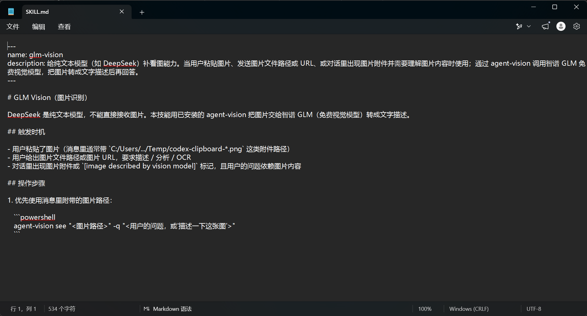 </a>

## 十、最终验证

完全退出 Codex 桌面端 → 重新打开 → 粘贴一张图片，问 AI「这张图里是什么」。

如果配置正确，模型会调用 `agent-vision`，由 GLM 识别图片后给出回答。截图、照片、动物、图表、UI 设计稿等任意图片均可。

## 常见问题

- **429 限流**：免费模型高峰期访问量过大，稍等重试，或切回 `glm-4v-flash`。
- **代理未运行**：Codex 会无法连接 DeepSeek，先执行 `agent-vision start`。
- **SKILL.md 乱码**：保存时编码必须选择 UTF-8。
- **想还原配置**：执行 `agent-vision rollback codex` 可恢复向导修改前的配置。
