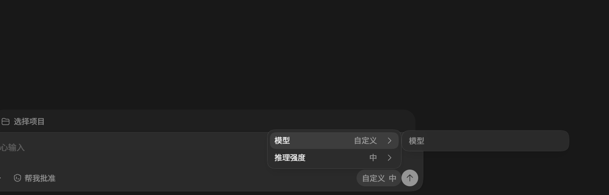
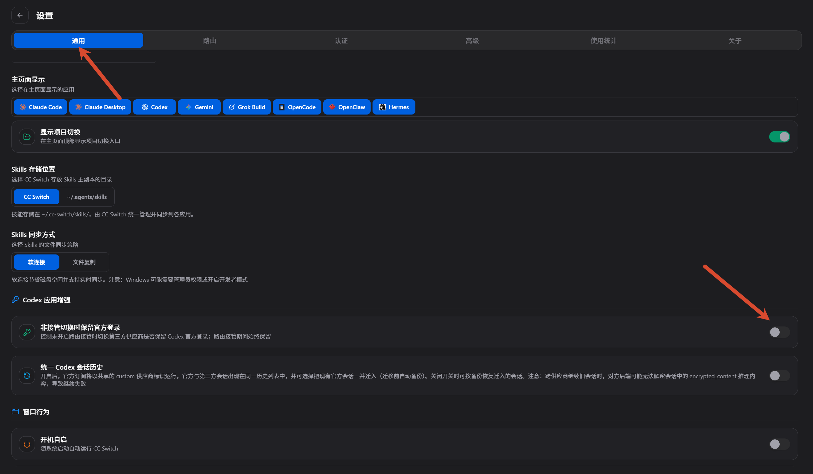
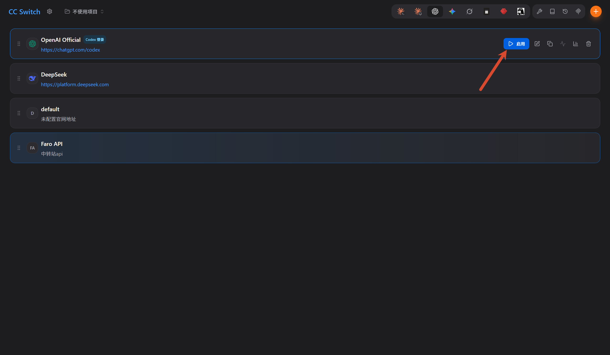
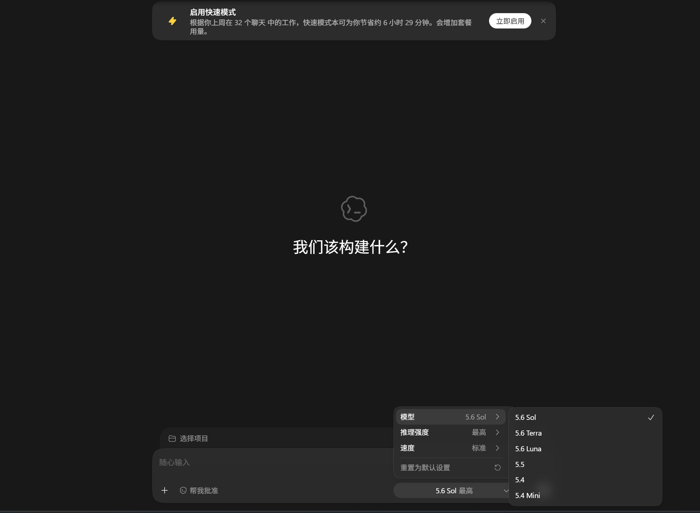
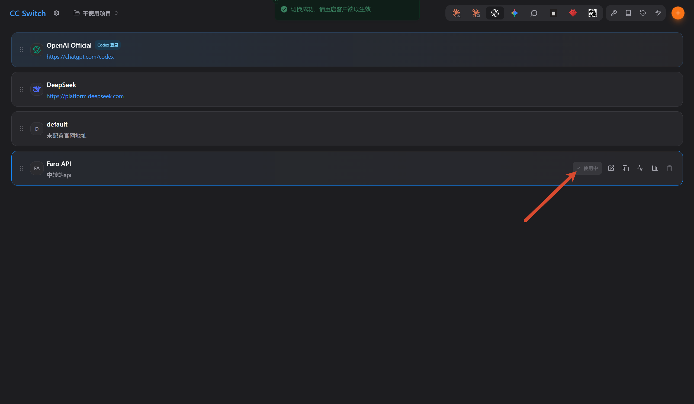
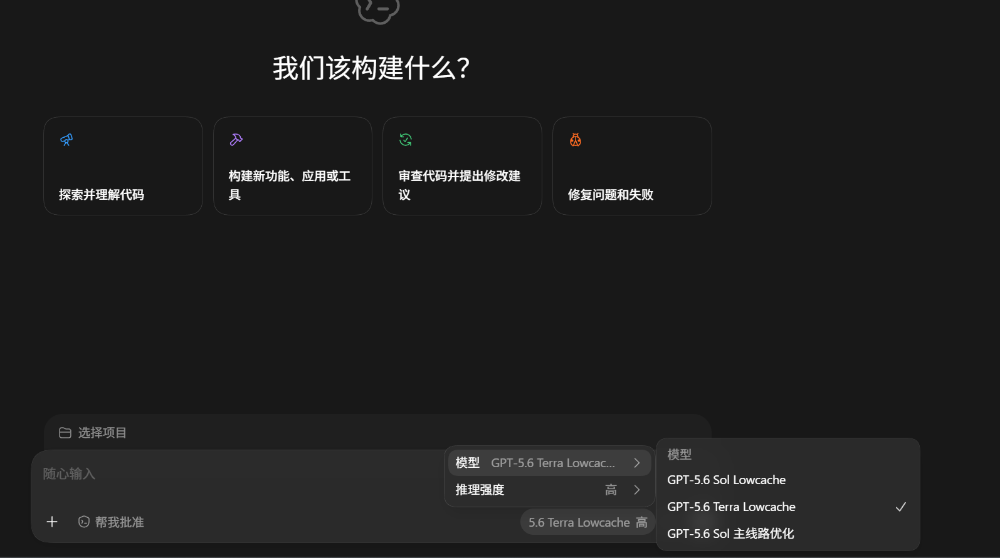
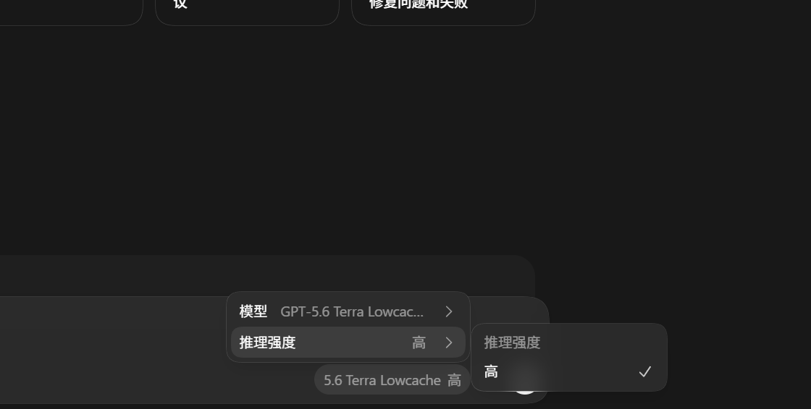
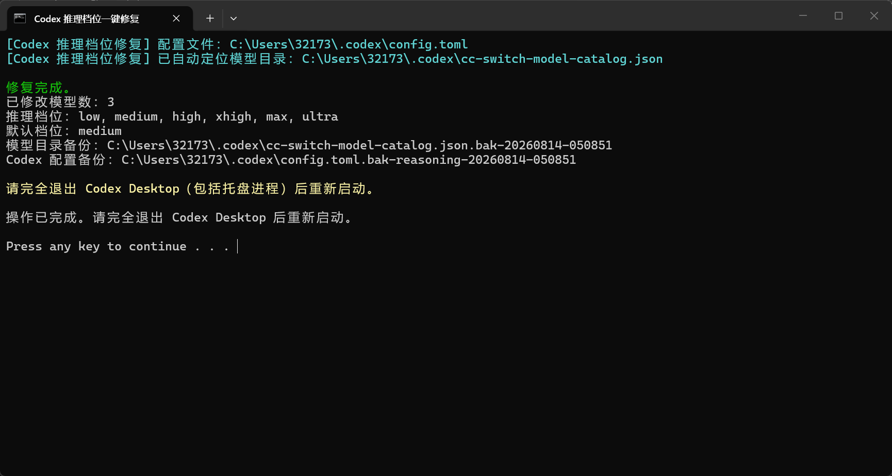
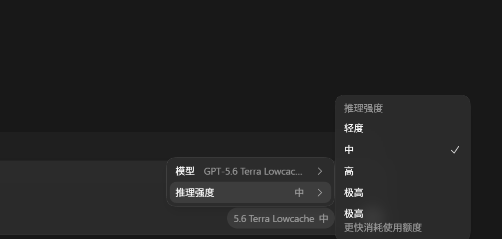

使用 ccSwitch 为 Codex Desktop 接入自定义 API 后，可能会遇到两个问题：**模型列表为空**，或者模型能够正常显示，但**推理强度只有一个选项**。

本文记录一套已经验证可用的修复流程：先通过官方登录初始化模型列表，再切回自定义配置，最后使用修复脚本补全推理强度选项。

> 操作前请保存当前任务。文中每次提到“彻底退出 Codex”，都需要同时关闭主窗口和托盘中的后台进程。

## 1. 问题现象

初次使用自定义配置时，Codex Desktop 的模型选择区域只有自定义入口，没有显示完整的模型列表。

## 2. 通过官方登录初始化模型列表

### 2.1. 保留官方登录状态

打开 ccSwitch，进入 **设置 → 通用**，启用 **非接管切换时保留官方登录**。这样在官方登录与自定义配置之间切换时，可以保留 Codex 的官方登录状态。

### 2.2. 切换到官方登录

在 ccSwitch 中将当前配置切换为 **官方登录**。

彻底退出 Codex Desktop，然后重新打开并完成官方账号登录。进入模型选择菜单后，可以看到官方模型列表已经正常加载。

## 3. 切回自定义配置

返回 ccSwitch，将当前配置切换回需要使用的自定义 API 配置。

再次彻底退出并重新打开 Codex Desktop。此时自定义配置中的模型列表应当已经恢复，可以在下拉菜单中正常切换模型。

## 4. 修复推理强度选项

模型列表恢复后，推理强度可能仍然只有一个选项。这通常是因为 ccSwitch 生成的自定义模型目录只声明了单一推理档位，需要补全模型的 `supported_reasoning_levels` 配置。

### 4.1. 下载并运行修复脚本

先彻底退出 Codex Desktop，然后下载下面的单文件修复程序：

[下载 Codex 推理档位一键修复程序](files/fix-codex-reasoning-levels.cmd)

下载完成后，双击运行该 `.cmd` 文件。脚本会自动定位 Codex 配置和模型目录，为原文件创建备份，并补全 `low`、`medium`、`high`、`xhigh`、`max`、`ultra` 六个推理档位。

### 4.2. 确认脚本执行成功

看到窗口中显示“修复完成”以及模型目录、备份位置等信息，即表示配置已经成功写入。按任意键关闭窗口即可。

### 4.3. 重新启动 Codex 验证结果

重新打开 Codex Desktop，展开 **推理强度** 菜单。此时原本缺失的多个推理档位已经恢复，可以根据任务复杂度进行选择。

## 5. 注意事项

- ccSwitch 重新生成自定义模型目录后，推理档位配置可能再次被覆盖；遇到这种情况，重新运行修复程序即可。
- 修复程序只补全本地模型目录中的推理档位，并不会改变第三方 API 本身的能力。
- 即使界面中显示了 `max` 或 `ultra`，最终是否生效仍取决于所使用的模型和 API 服务是否接受相应参数。
- 脚本会在修改前自动创建带时间戳的备份，出现异常时可以使用备份文件恢复配置。

## 6. 总结

整个修复过程可以概括为：**保留官方登录 → 切换官方登录并初始化模型列表 → 切回自定义配置 → 运行脚本补全推理档位 → 重启 Codex 验证**。

完成以上操作后，自定义模型列表和推理强度选项即可恢复正常。
