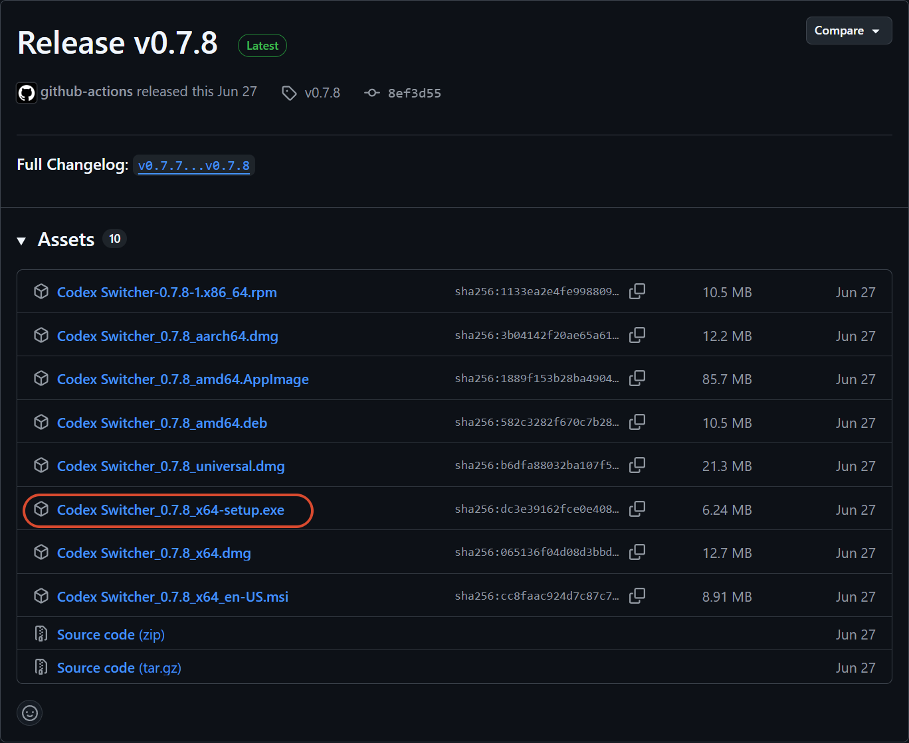
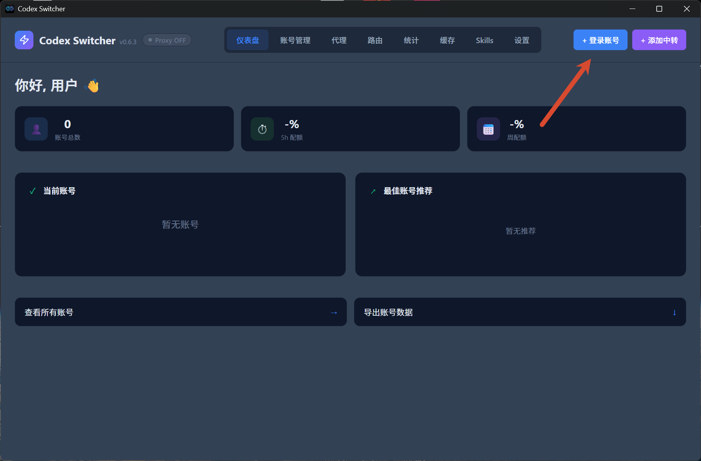
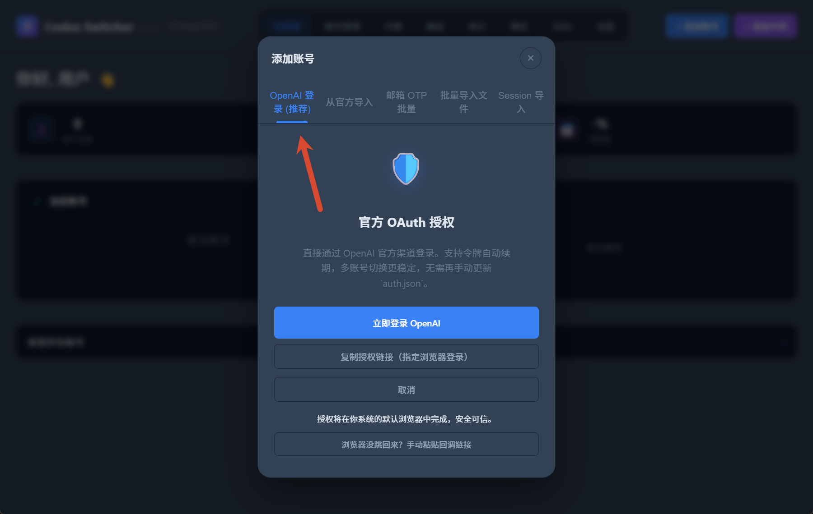
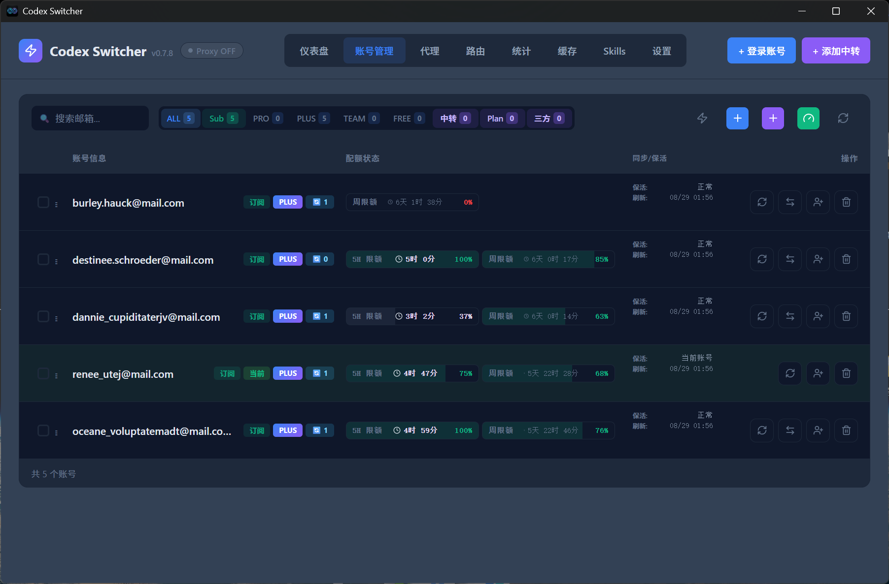
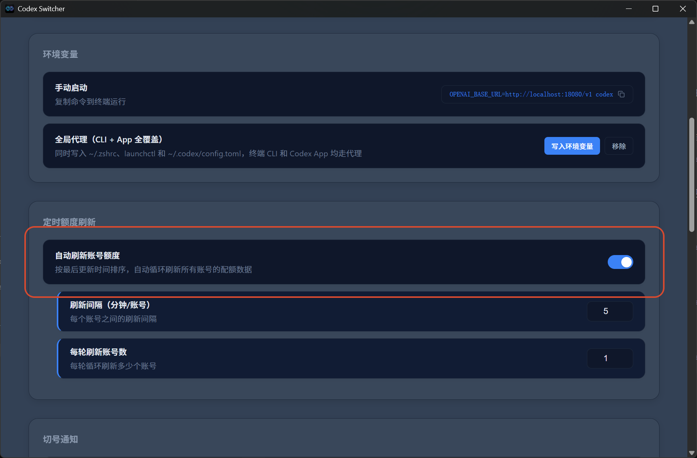
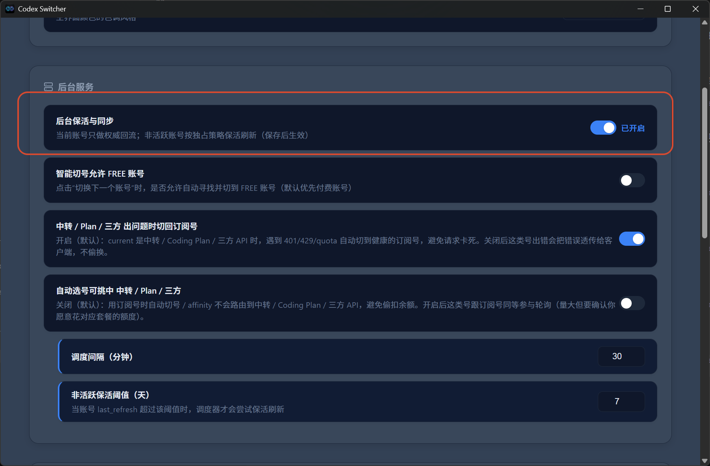
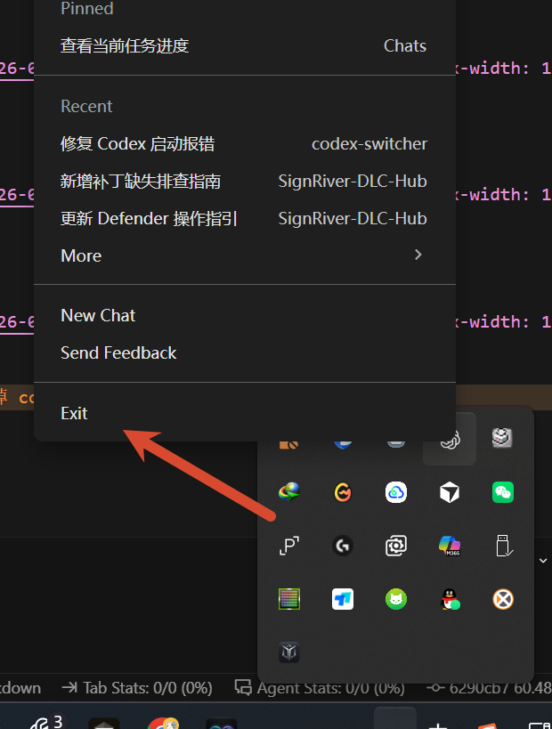
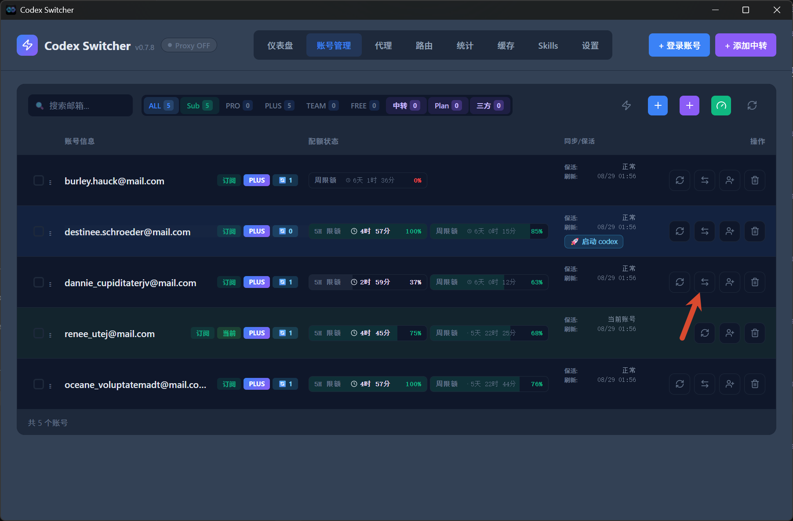

本文记录在 Windows 上安装并使用 Codex Switcher 的过程，包括添加本人控制的官方 Codex 账号、查看各账号的剩余额度和重置时间，以及在本机完成账号切换。

如果日常使用 Codex 的频率较高，单个账号的额度可能无法满足需求。频繁登录和验证不同账号也比较繁琐，因此可以使用 Codex Switcher 集中管理账号，并在额度耗尽或账号出现异常时切换到其他已登录账号。

## 1. 安装 Codex Switcher

打开 [Codex Switcher 的 Releases 页面](https://github.com/VallierDev/codex-switcher/releases)，下载适用于 Windows 的 `Codex Switcher_0.7.8_x64-setup.exe`，也可以直接使用链接下载

[安装包下载链接](https://github.com/VallierDev/codex-switcher/releases/download/v0.7.8/Codex.Switcher_0.7.8_x64-setup.exe)

下载完成后双击安装包，按照向导完成安装即可。

如果官方仓库中的程序在本机运行异常，也可以尝试我修改后的版本：
[Codex Switcher 0.7.8 MSI](https://gitlink.org.cn/signriver/file-warehouse/releases/download/Codex_Switcher/Codex%20Switcher_0.7.8_x64_en-US.msi)

## 2. 登录 Codex 账号

启动应用后，先登录需要管理的账号。

我这里有多个官方账号，因此选择列表中的第一个官方登录入口。

登录流程按页面提示完成即可。登录多个账号后，可以在账号列表中查看它们的状态、剩余额度和重置时间。

## 3. 刷新额度与保活

在**代理**界面中，可以开启**自动刷新账号额度**。

然后在**设置**界面中开启**保活**。

## 4. 切换当前账号

需要切换账号时，先彻底退出 `Codex`，确保程序已经关闭。

回到 Codex Switcher，点击目标账号对应的**切换**操作。

切换完成后重新打开 `Codex`，即可使用目标账号。这样可以减少重复登录和验证的操作。
