> **前置提示**：使用 Gemini CLI 建议准备一张外币信用卡（用于绑定 Google Cloud / AI Studio 结算以获取充足的模型调用额度），否则免费额度相对有限。

## 1. 环境准备与 Node.js 安装

Gemini CLI 依赖 Node.js 环境，首先需要下载并安装 Node.js。

前往 [Node.js 官方下载页面](https://nodejs.org/zh-cn/download)，选择适用于 Windows 的 **.msi** 安装包下载：

<a href="images/2026-08-20-19-56-31.png" target="_blank"> 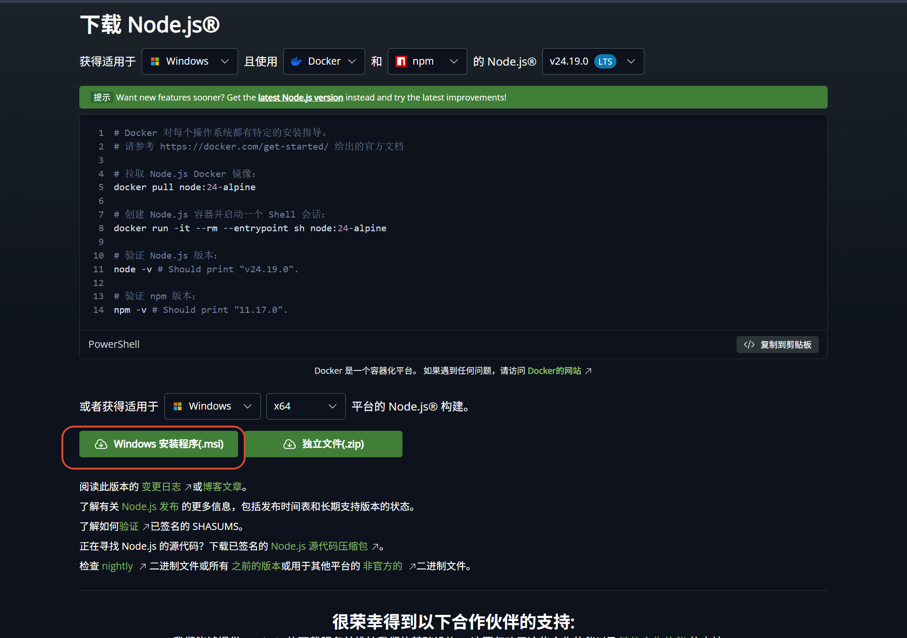 </a>

下载完成后运行安装包，一路点击 **Next** 保持默认配置直至安装完成。

安装完成后，打开一个**全新的终端窗口**，运行以下命令验证 Node.js 与 npm 是否安装成功：

```bash
node -v
npm -v
```

能够正确显示对应版本号即表示环境准备完成：

<a href="images/2026-08-20-19-58-07.png" target="_blank"> 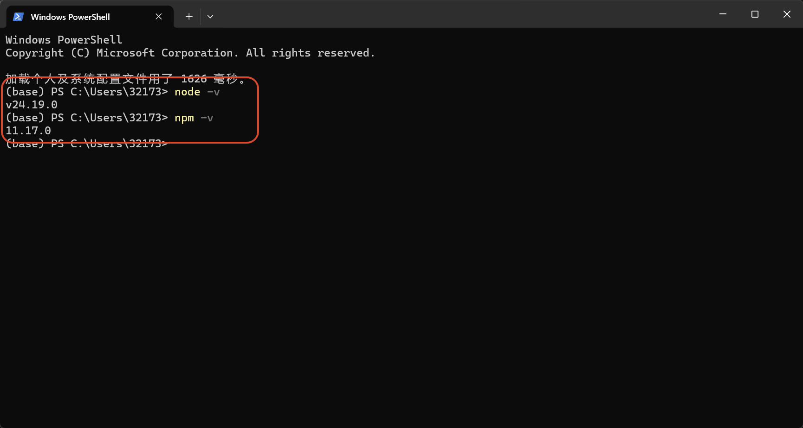 </a>

## 2. 安装 Gemini CLI

在终端中执行以下命令全局安装 Gemini CLI：

```bash
npm install -g @google/gemini-cli
```

安装完成后，运行以下命令验证版本：

```bash
gemini --version
```

终端正常输出版本号说明安装成功：

<a href="images/2026-08-20-20-00-30.png" target="_blank"> 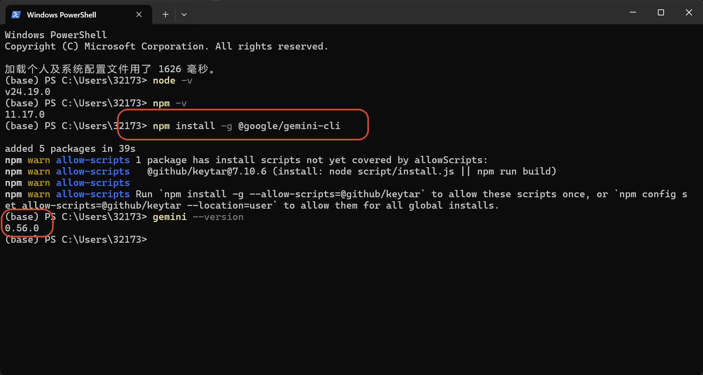 </a>

## 3. 初始化与 API Key 配置

### 3.1. 启动并选择登录方式

在终端中输入命令启动 Gemini CLI：

```bash
gemini
```

首次运行会提示是否信任当前项目目录，直接按 **Enter** 确认即可：

<a href="images/2026-08-20-20-02-04.png" target="_blank"> 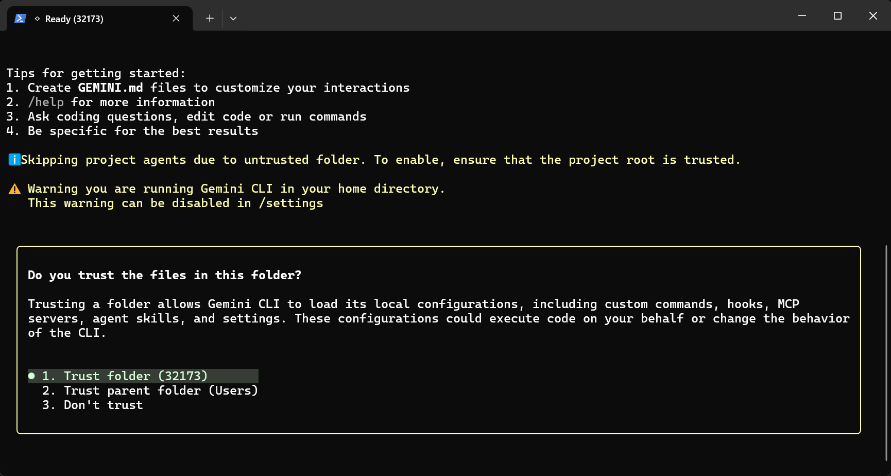 </a>

进入登录选择界面后，通过键盘选择第 2 项（输入 API Key）：

> 注：第 1 项登录方式目前已不可用，直接选择输入 API Key 即可。

<a href="images/2026-08-20-20-15-41.png" target="_blank"> 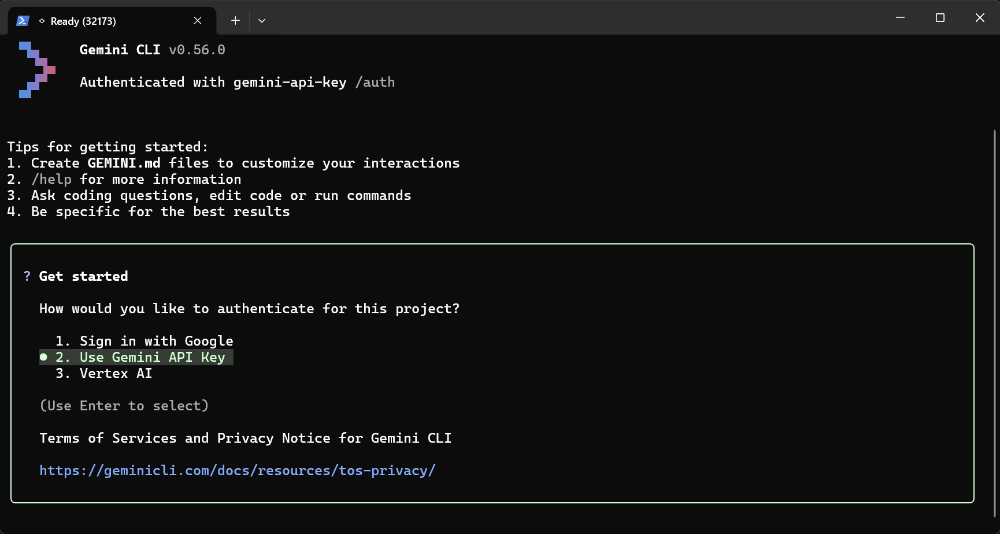 </a>

### 3.2. 获取 Google AI Studio API Key

访问 [Google AI Studio](https://aistudio.google.com/) 并登录你的 Google / Gemini 账号：

<a href="images/2026-08-20-20-17-49.png" target="_blank"> 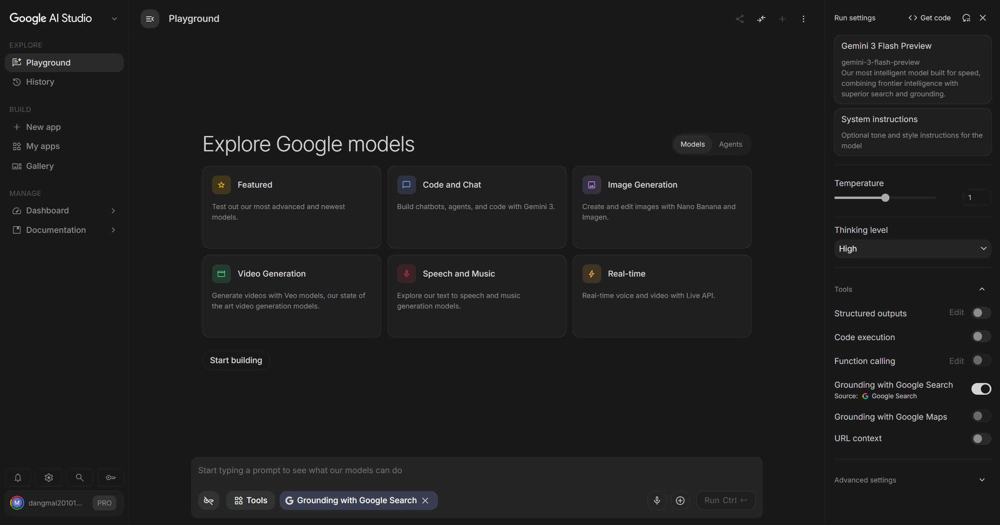 </a>

在控制台中点击 **Dashboard**：

<a href="images/2026-08-20-20-19-59.png" target="_blank"> 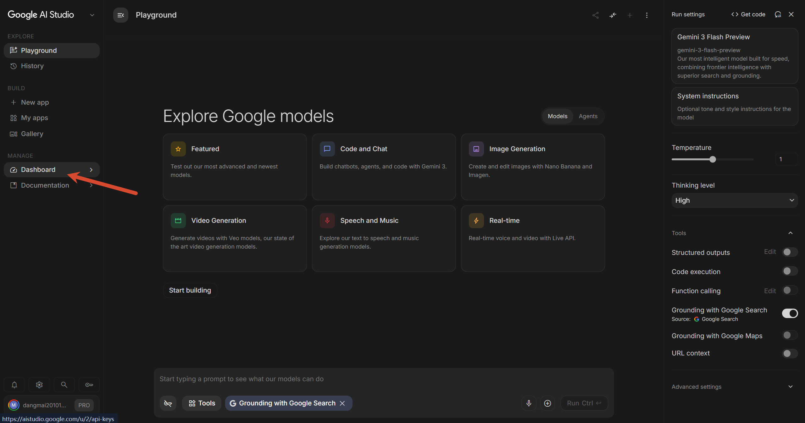 </a>

进入 API 密钥管理界面，复制创建好的 API Key：

<a href="images/2026-08-20-20-21-53.png" target="_blank"> 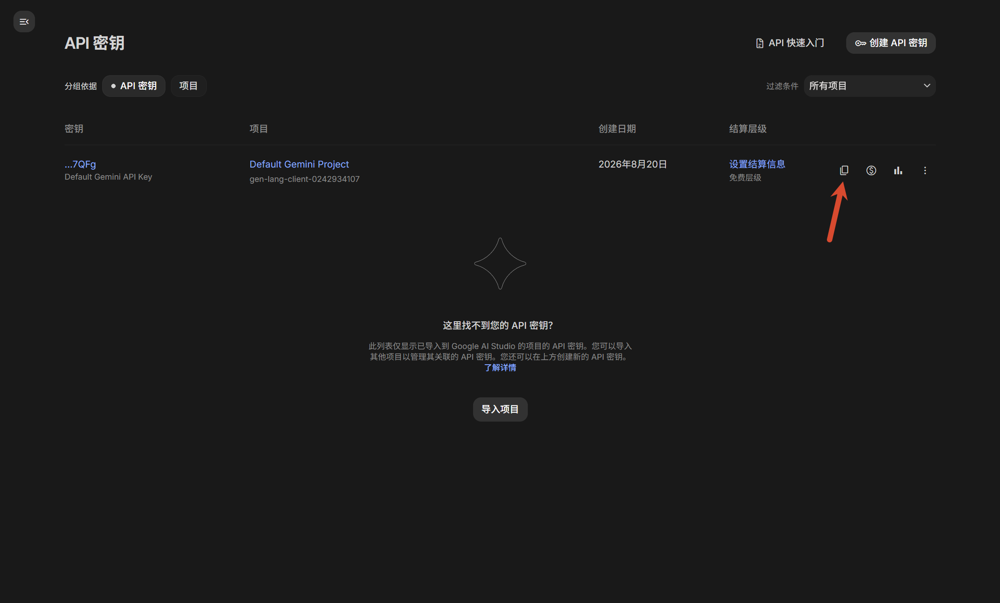 </a>

### 3.3. 完成终端鉴权

回到终端，粘贴复制好的 API Key 并按 **Enter** 提交：

<a href="images/2026-08-20-20-22-41.png" target="_blank"> 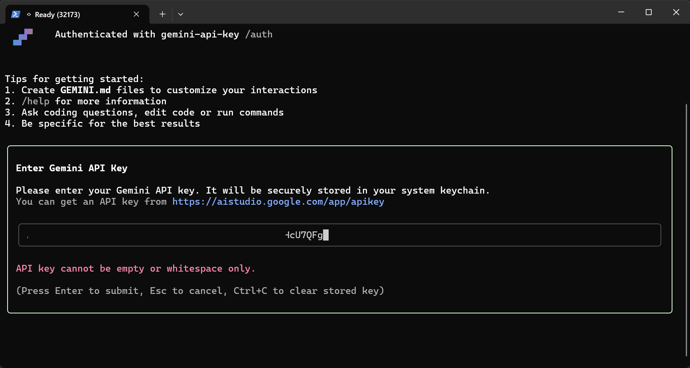 </a>

鉴权成功后，终端会显示欢迎及登录成功界面：

<a href="images/2026-08-20-20-23-47.png" target="_blank"> 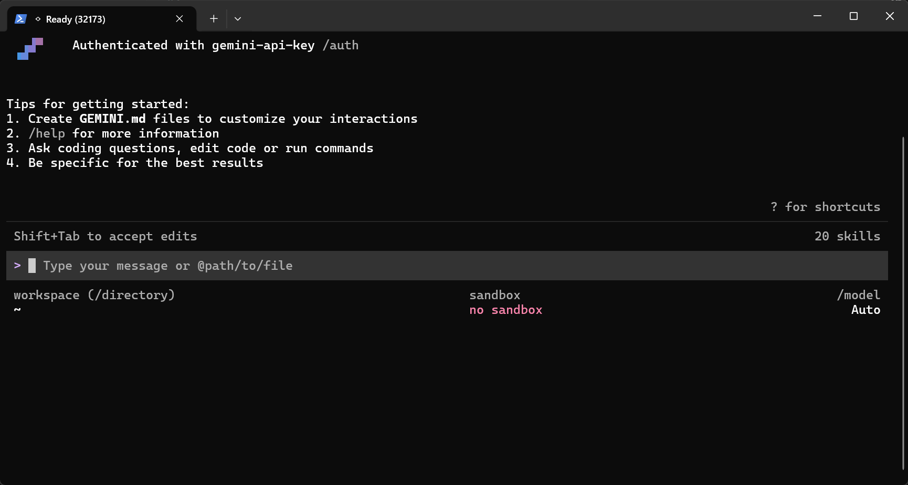 </a>

## 4. 速率限制与额度说明

返回 Google AI Studio 网页控制台，在速率限制页面可以查看各模型的调用频次限制：

<a href="images/2026-08-20-20-35-02.png" target="_blank"> 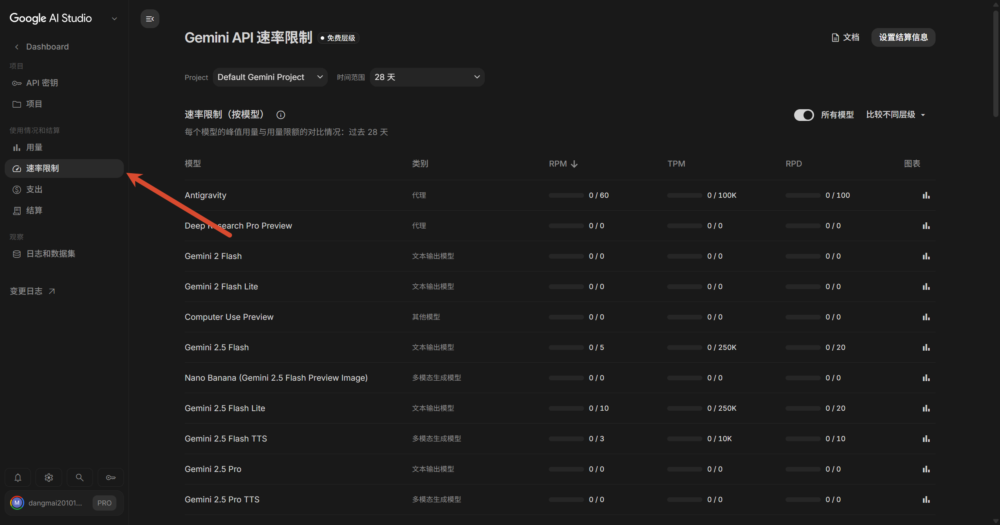 </a>

默认免费层级的调用额度与速率相对较低；如需高频或流畅调用主力模型，建议完成信用卡绑定并开启结算服务：

<a href="images/2026-08-20-41-34.png" target="_blank">  </a>

## 5. 总结

通过上述步骤即可完成 Gemini CLI 在本地的环境准备、全局安装与 API Key 鉴权配置。日常使用中可随时在终端通过 `gemini` 命令开启会话，配合 Google AI Studio 控制台监控调用配额与使用情况。
