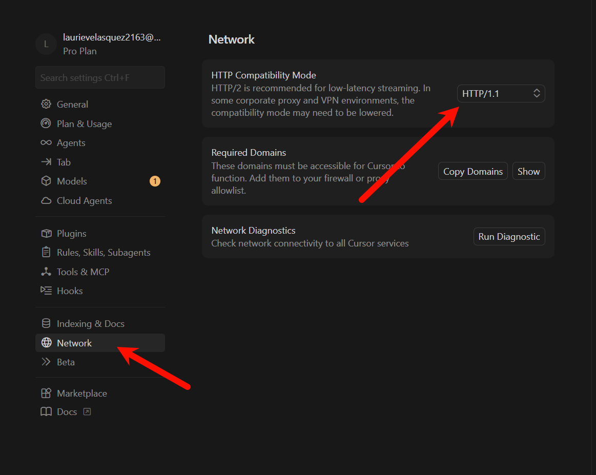
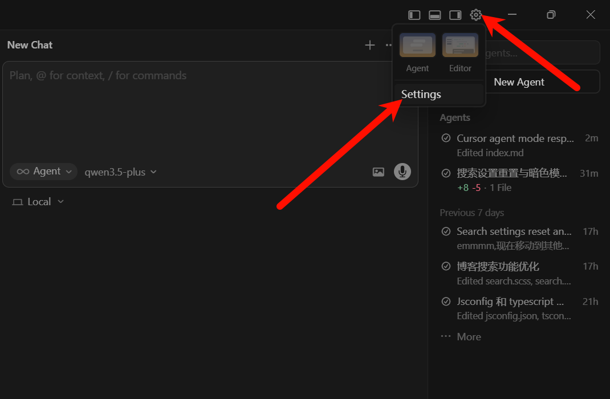
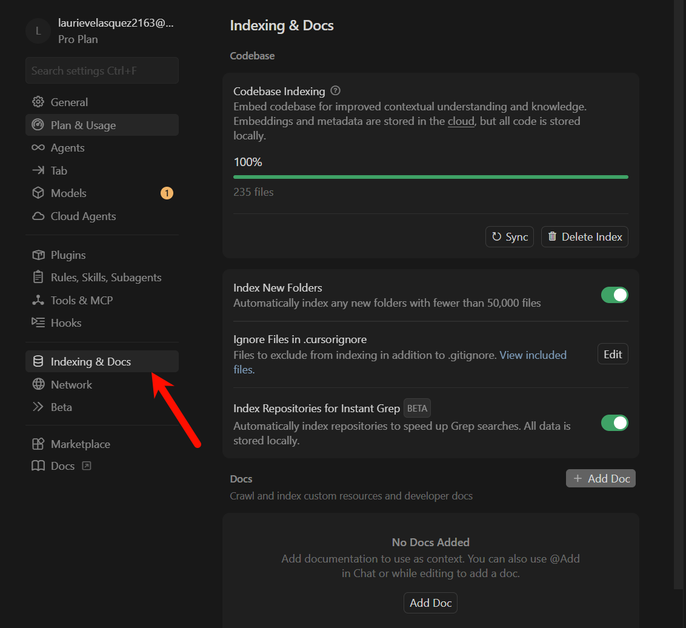
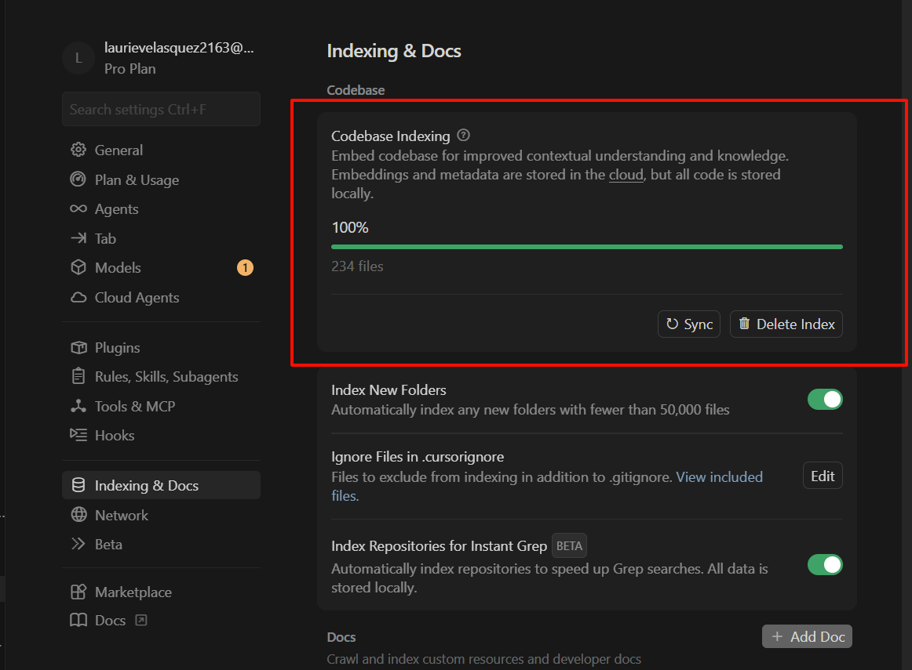
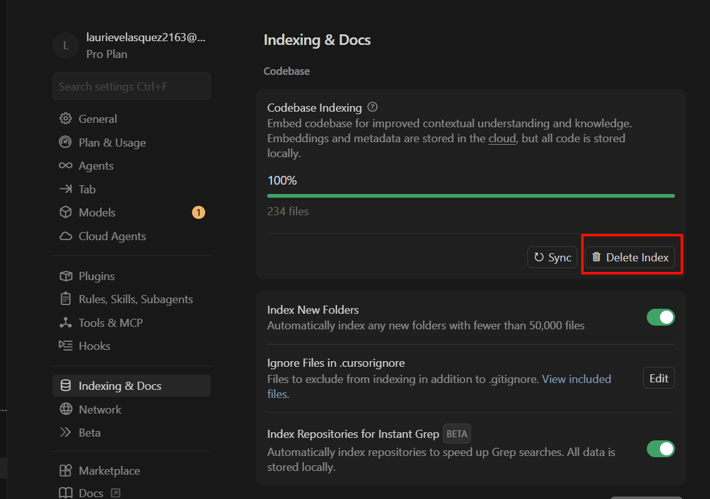
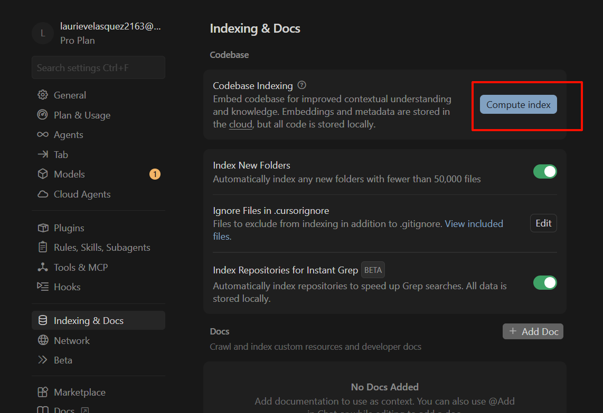
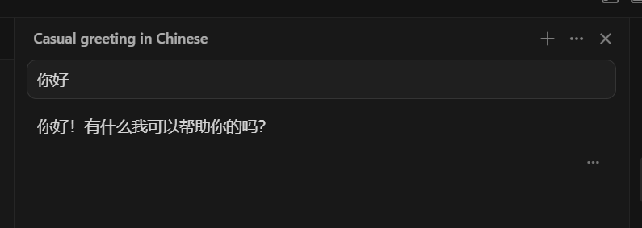

> 💡 **前言**：此教程为经验之谈，也是遇到报错后到处找解决方法总结出的解决方案。

在使用 Cursor 2.5 版本及以上的 Agent 模式进行开发时，你是否遇到过频繁的响应卡死问题？具体表现为：

- 模型刚开始回复几句，或者刚显示 `Explored X files` 后，就陷入无休止的 `Taking longer than expected...` 加载状态
- 最终会彻底断联，并抛出报错提示：`Unexpected seqno: 2 != 1. Please try again, or contact support if the issue persists.`

特别是在**后台常驻开启代理软件**的情况下，这个问题尤为高发。

## 1. 🔍 问题复现

笔者刚开始使用时就遇到这个问题，一开始以为是网络问题，所以在设置里把 HTTP/2 改成了 HTTP/1.1：

但没想到还是不行，问题依然存在。经过多次尝试和查找资料，终于找到了解决方案。

## 2. 🔍 原因分析

这个问题通常由两方面因素叠加导致：

### 2.1 网络流传输中断

代理软件的路由规则干扰了 Cursor 与大模型 API 之间的长连接（特别是 HTTP/2 多路复用），导致接收的数据包序号错乱（即 seqno 匹配不上）。

### 2.2 本地代码库索引卡死

当网络出现异常或项目频繁变动时，Cursor 在本地建立的 AI 代码向量数据库（Codebase Index）可能会损坏或陷入死循环。当 Agent 试图去检索项目上下文时，后台进程就会彻底卡死。

## 3. 🛠️ 终极解决方案：重建项目索引

这是最直接有效的方法，可以彻底清空错乱的本地缓存并恢复正常。

### 3.1 操作步骤

#### 3.1.1 第一步：打开 Cursor 设置

点击右上角齿轮图标 ⚙️，或使用快捷键 `Ctrl + ,` 打开设置界面。

#### 3.1.2 第二步：找到 Indexing & Docs

在左侧菜单栏中向下滚动，找到并点击 `Indexing & Docs` 选项。

#### 3.1.3 第三步：查看索引状态

在右侧面板的 Codebase 区域，你会看到当前项目的代码索引状态（通常会显示 100% 但其实后台已经卡死）。

#### 3.1.4 第四步：删除索引（关键步骤）

⚠️ **关键一步**：不要点 `Sync`，直接点击右侧的 🗑️ `Delete Index` 按钮，彻底清空可能损坏的向量数据库缓存。

#### 3.1.5 第五步：重新建立索引

删除后，点击 `Compute Index`（或等待其自动开始），让进度条重新跑到 100%。

## 4. ✅ 验证效果

完成上述操作后，回到聊天窗口再次尝试，卡死和报错问题即刻消失。

## 5. 📝 总结

Cursor Agent 模式的卡死问题主要由网络流传输中断和本地代码库索引损坏导致。通过重建项目索引，可以彻底解决 `Unexpected seqno` 报错和频繁卡死的问题。

希望这篇文章能帮助到遇到同样问题的朋友！如果还有什么新的方法，欢迎在评论区留言交流。
