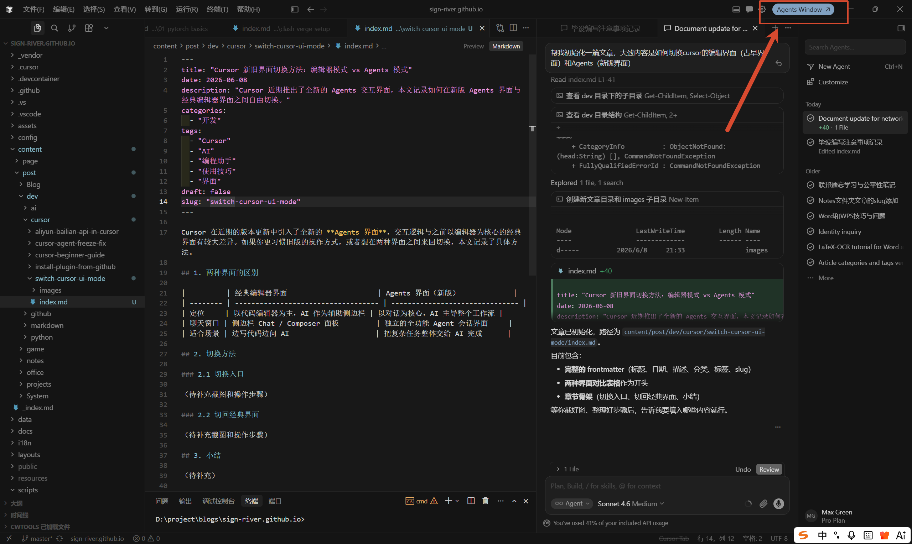
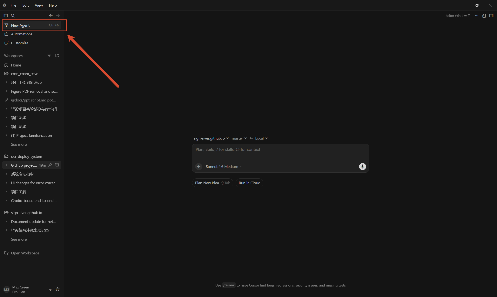
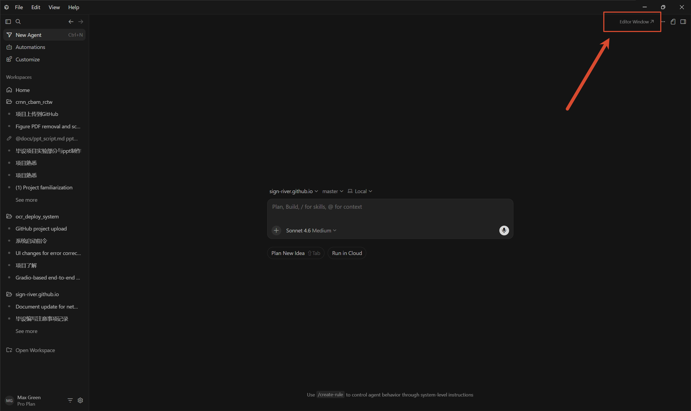

Cursor 在近期的版本更新中引入了全新的 **Agents 界面**，交互逻辑与之前以编辑器为核心的经典界面有较大差异。如果你更习惯旧版的操作方式，或者想在两种界面之间来回切换，本文记录了具体方法。

## 1. 两种界面的区别

|          | 经典编辑器界面                      | Agents 界面（新版）             |
| -------- | ----------------------------------- | ------------------------------- |
| 定位     | 以代码编辑器为主，AI 作为辅助侧边栏 | 以对话为核心，AI 主导整个工作流 |
| 聊天窗口 | 侧边栏 Chat / Composer 面板         | 独立的全功能 Agent 会话界面     |
| 适合场景 | 边写代码边问 AI                     | 把复杂任务整体交给 AI 完成      |

## 2. 切换方法

### 2.1 从编辑器界面切换到 Agents 界面

在经典编辑器界面中，点击右上角蓝色的 **Agents Window** 按钮即可切换到新版 Agents 界面。

### 2.2 从 Agents 界面切换回编辑器界面

**第一步**：点击左上角的 **New Agent**（快捷键 `Ctrl+N`）开启一个新的对话窗口。

**第二步**：点击右上角的 **Editor Window** 按钮，即可切换回经典编辑器界面。

