## 1. 下载安装包

前往 [Anaconda 官网](https://www.anaconda.com/download) 下载安装包。
进入页面后，点击 **Skip Registration**（跳过注册）即可直接下载，无需注册账号。

<a href="images/2026-03-20-23-42-46.png" target="_blank"> 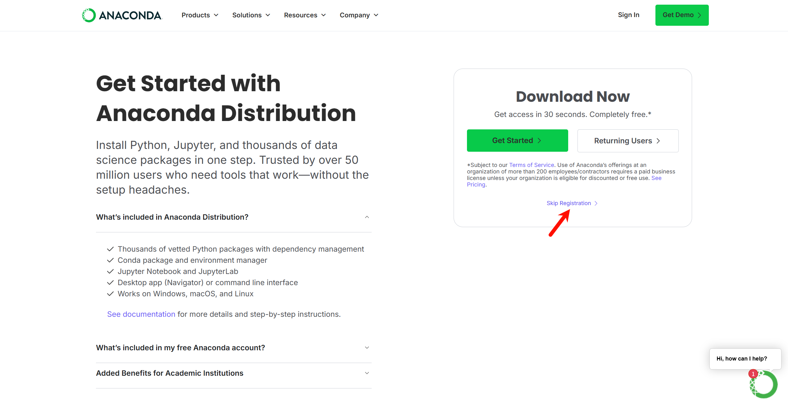 </a>

跳过注册后，根据自己的操作系统选择对应的版本下载。以 Windows 为例，点击 **Anaconda Distribution** 下的 **Windows 64-Bit Graphical Installer** 即可。

## 2. 安装

下载完成后，双击安装程序（`.exe` 文件）启动安装向导。

<a href="images/2026-03-20-23-45-39.png" target="_blank"> 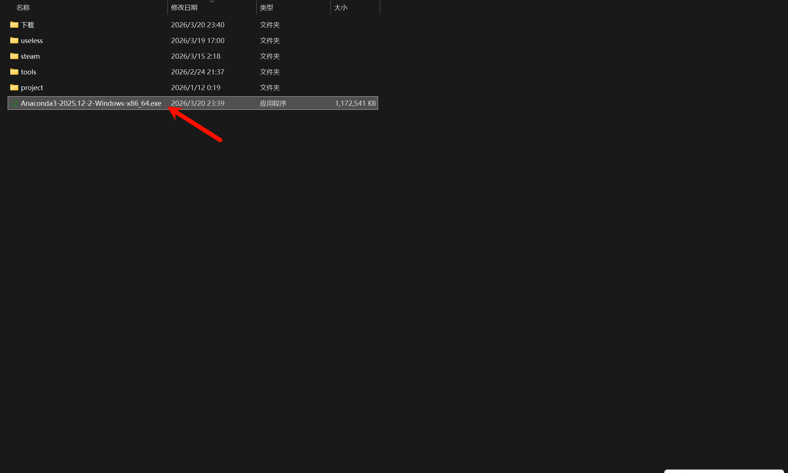 </a>

### 2.1. 欢迎界面

打开安装向导后，点击 **Next** 继续。

<a href="images/欢迎界面截图.png" target="_blank"> 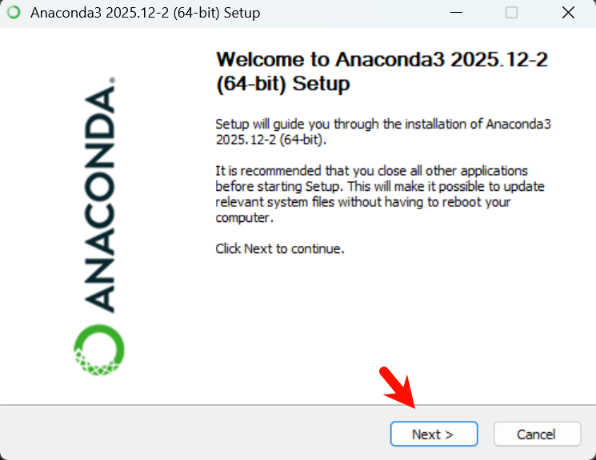 </a>

### 2.2. 许可协议

阅读许可协议后，点击 **I Agree** 同意并继续。

<a href="images/许可协议截图.png" target="_blank"> 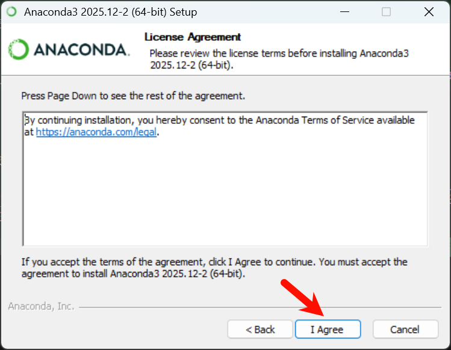 </a>

### 2.3. 选择安装类型

选择 **Just Me**（默认推荐），然后点击 **Next** 继续。

<a href="images/2026-03-21-03-14-52.png" target="_blank"> 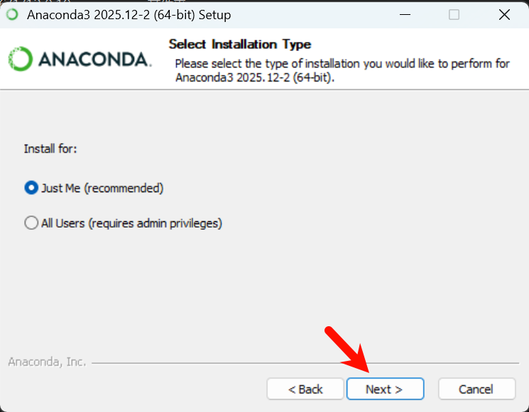 </a>

### 2.4. 选择安装位置

默认安装路径为 `C:\Users\用户名\anaconda3`，建议保持默认，直接点击 **Next** 继续。

若需要安装到其他位置，请注意：**路径中不能含有中文**，否则可能导致运行异常。

<a href="images/2026-03-21-03-15-34.png" target="_blank"> 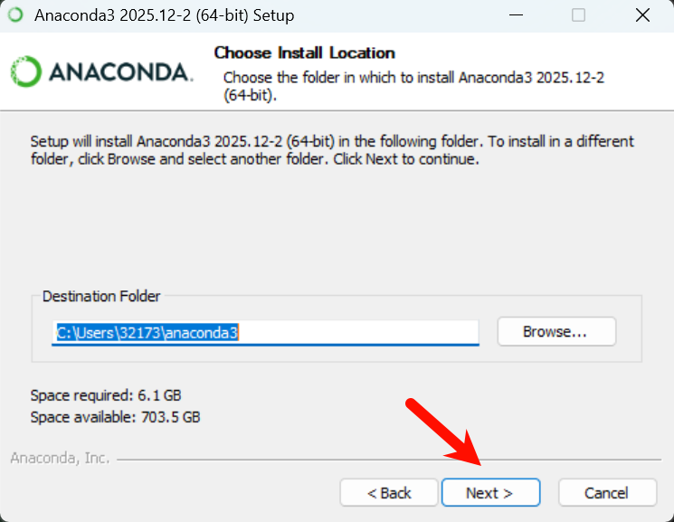 </a>

### 2.5. 高级安装选项

建议**全部勾选**，然后点击 **Install** 开始安装。

- **Create shortcuts**：创建快捷方式，方便从开始菜单启动 Anaconda 相关工具
- **Add installation to my PATH**：将 Anaconda 加入系统环境变量，这样在普通 cmd/PowerShell 中也能直接使用 `conda` 命令。虽然安装器标注了"不推荐"，但那主要是针对同时安装了多个 Python 的用户，担心产生冲突。如果你只使用 Anaconda，勾上更方便；如果你熟悉环境变量配置，也可以不勾，后续手动添加
- **Register Anaconda3 as my default Python**：将 Anaconda 的 Python 注册为系统默认 Python，VSCode、PyCharm 等工具可自动识别
- **Clear the package cache upon completion**：安装完成后清理缓存，释放磁盘空间

<a href="images/2026-03-21-03-20-03.png" target="_blank"> 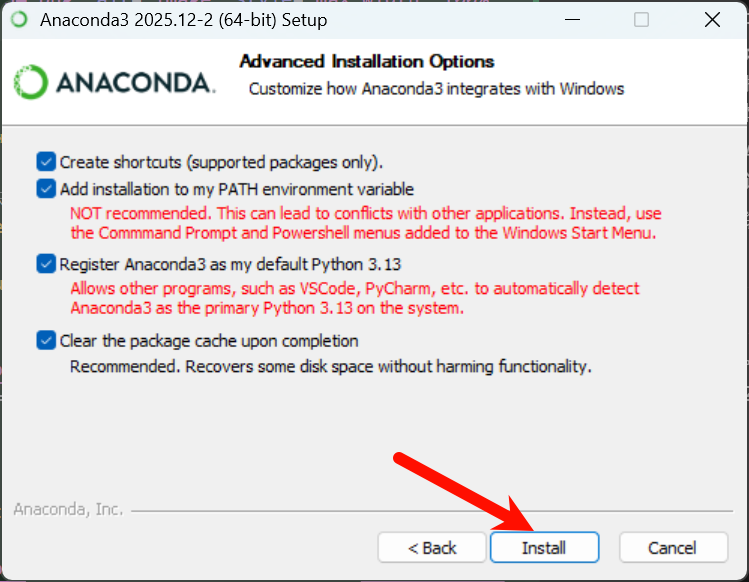 </a>

### 2.6. 安装完成

等待安装进度条跑完，提示 **Installation Complete** 后，点击 **Next** 继续。

<a href="images/安装完成截图.png" target="_blank"> 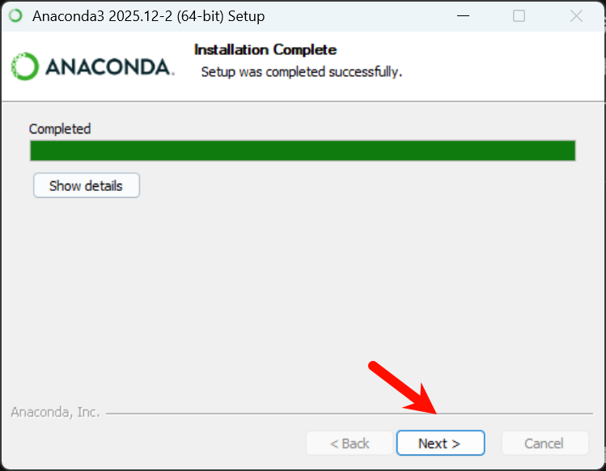 </a>

### 2.7. 云端推广页

这是 Anaconda 的云服务推广页面，直接点击 **Next** 跳过即可。

<a href="images/云端推广页截图.png" target="_blank"> 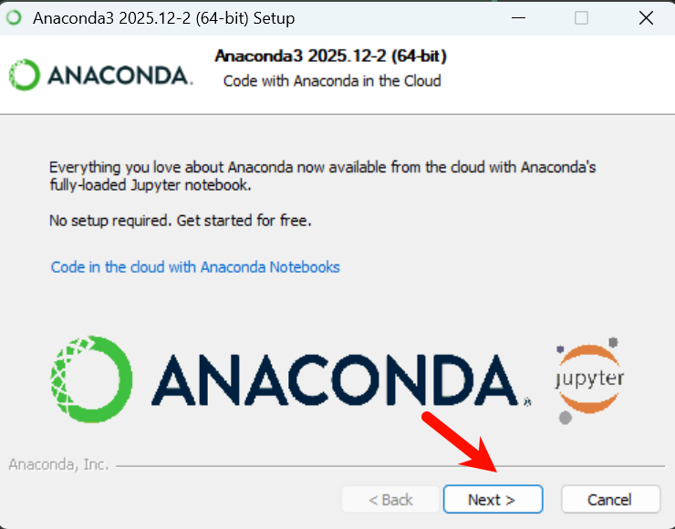 </a>

### 2.8. 完成安装

取消勾选 **Welcome to Anaconda**，然后点击 **Finish** 完成安装。

<a href="images/完成安装截图.png" target="_blank"> 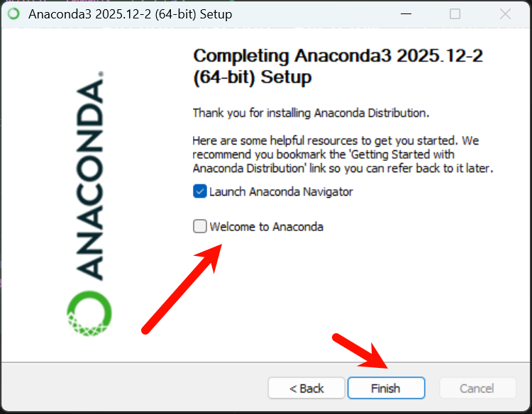 </a>

## 3. 验证安装

按 `Win + R` 打开运行窗口，输入 `cmd` 后回车打开命令提示符。

<a href="images/运行窗口截图.png" target="_blank"> 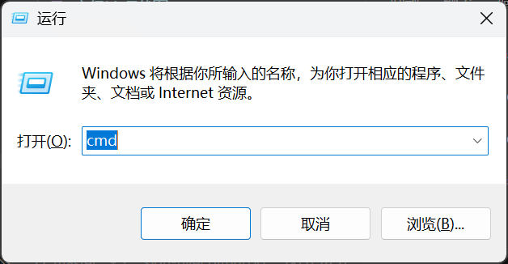 </a>

在命令提示符中依次输入以下命令验证安装是否成功：

输入 `python` 回车，若显示 Python 版本信息（如 `Python 3.13.9 | packaged by Anaconda`）则说明 Python 安装正常，输入 `exit()` 退出。

再输入 `conda --version`，若显示版本号（如 `conda 25.11.1`）则说明 Anaconda 安装成功。

<a href="images/验证截图.png" target="_blank"> 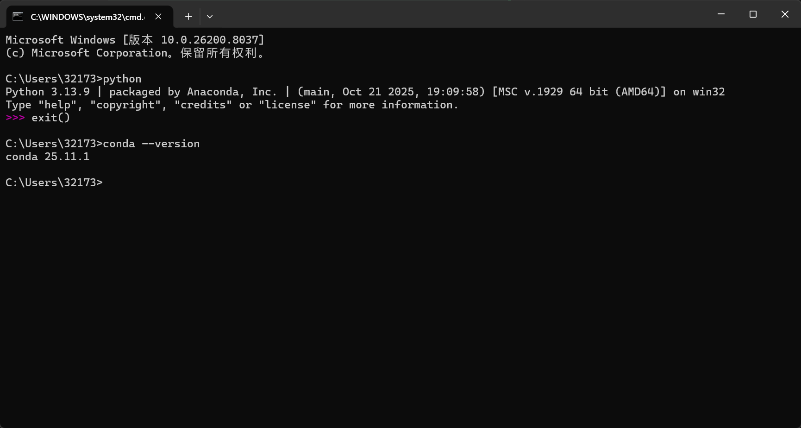 </a>
