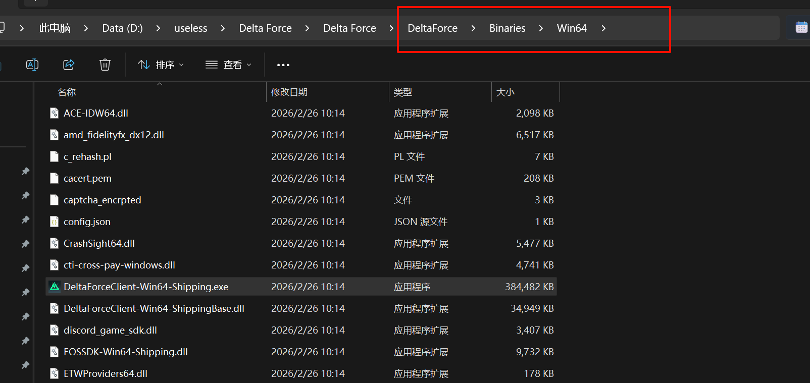
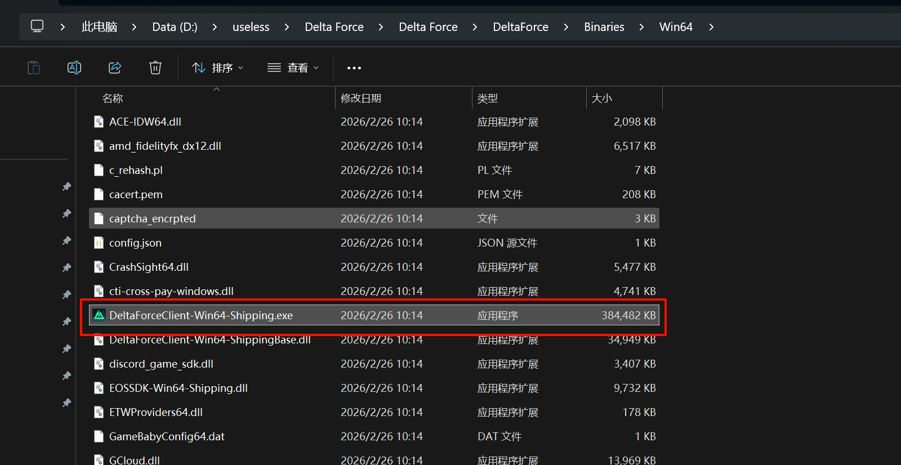
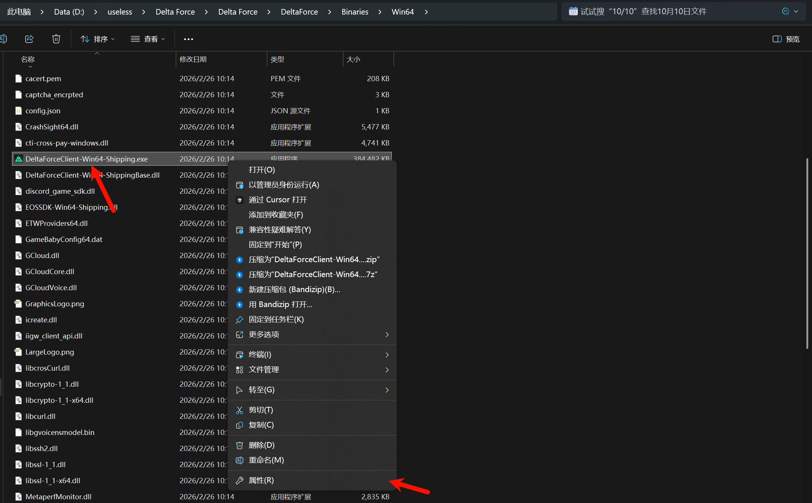
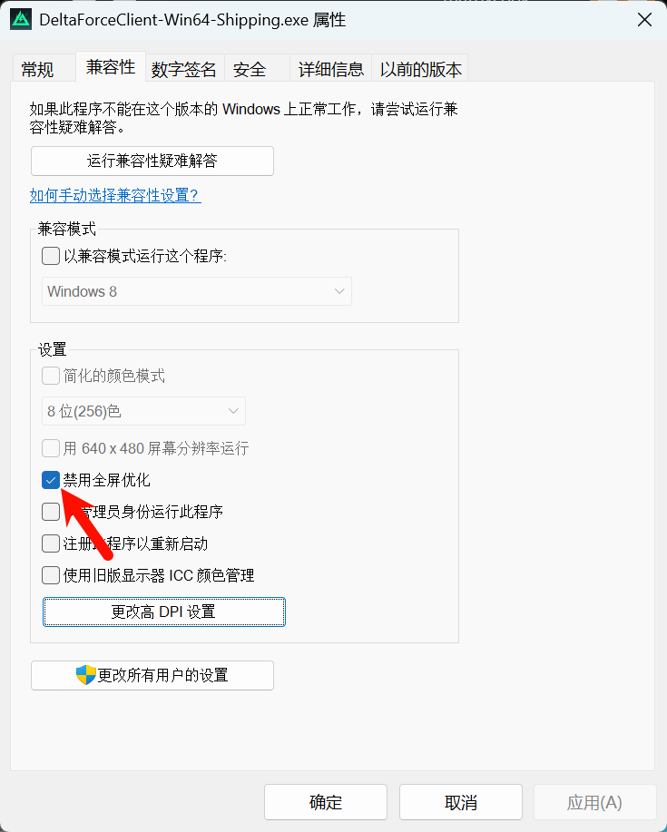
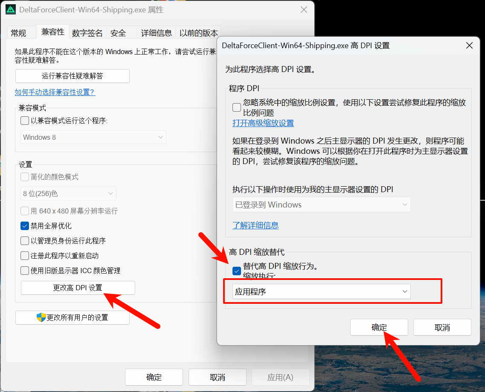
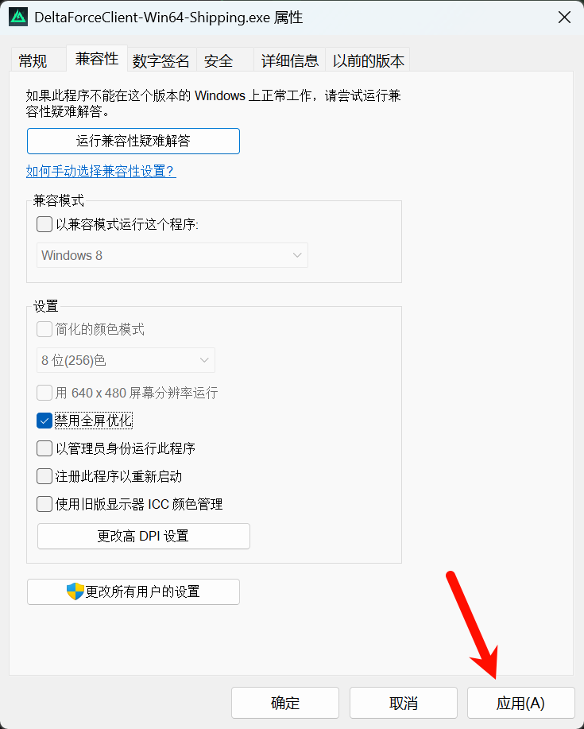

> 💡 **前言**：如果你第一次启动《三角洲行动》时遇到画面放大或纯色闪屏，别慌！这是 Windows 高 DPI 缩放与游戏引擎的冲突。本文提供解决方案。

## 1. 🔍 问题现象

第一次启动《三角洲行动》时可能遇到以下问题：

- **画面异常放大**：游戏图像被放大多倍，只能看到界面的一小部分，鼠标无法点击目标按钮
- **"假花屏"**：能听到游戏音效，但屏幕显示单一颜色交替闪动，不显示游戏内容
- **反复重启才能进**：遇到上述情况只能强退，需多次重启才能正常进入

## 2. 🔍 问题原因

**这不是显卡故障**，而是 Windows 高 DPI 缩放与游戏引擎的冲突。

使用 2.5K 或更高分辨率屏幕时，Windows 默认开启 125% 或 150% 系统缩放。游戏启动时，引擎未能正确接管屏幕，Windows 将系统缩放强加在全屏游戏画面上，造成"二次放大"，导致渲染出错，表现为画面缩小或纯色闪屏。

## 3. 🛠️ 终极解决方案

### 3.1 核心思路

找到真正的游戏引擎本体文件，禁止 Windows 对它进行缩放干预。

### 3.2 详细步骤

#### 3.2.1 第一步：找到真正的游戏本体

⚠️ **重要提示**：桌面快捷方式、WeGame 启动器或者几十 KB 的 `DeltaForceClient.exe` 统统不管用！

正确的路径是：顺着游戏安装目录往下找，依次进入文件夹：

```
DeltaForce -> Binaries -> Win64
```

<a href="images/2026-03-05-15-03-54.png" target="_blank">  </a>

#### 3.2.2 第二步：识别真正的游戏引擎

在 `Win64` 文件夹里，找到一个体积很大（约 300MB+）的文件，名字通常叫：

```
DeltaForceClient-Win64-Shipping.exe
```

这才是真正的游戏渲染引擎。

<a href="images/2026-03-05-15-03-08.png" target="_blank">  </a>

#### 3.2.3 第三步：修改兼容性设置

右键点击 `DeltaForceClient-Win64-Shipping.exe`，选择 **属性**。

<a href="images/2026-03-05-15-04-51.png" target="_blank">  </a>

在顶部标签页切换到 **兼容性**。

勾选 **禁用全屏优化**。

<a href="images/2026-03-05-15-07-02.png" target="_blank">  </a>

#### 3.2.4 第四步：覆盖高 DPI 缩放（最关键的一步）

在同一个界面点击下方的 **更改高 DPI 设置** 按钮。

在弹出的新窗口最下方，勾选 **替代高 DPI 缩放行为**。

确保下方的下拉菜单中选择的是 **应用程序**（意思是把画面的缩放权完全交给游戏自己，系统不要插手）。

<a href="images/2026-03-05-15-08-04.png" target="_blank">  </a>

#### 3.2.5 第五步：保存设置

依次点击 **确定** 和 **应用**。

<a href="images/2026-03-05-15-08-45.png" target="_blank">  </a>

## 4. ✅ 验证效果

完成上述操作后，重新打开游戏，画面应该能正常显示，不再出现放大或纯色闪屏问题。

如果问题仍然存在，可以尝试重启电脑后再启动游戏。

## 5. 📝 总结

《三角洲行动》启动时的画面放大和纯色闪屏问题，本质上是 Windows 高 DPI 缩放与游戏引擎的冲突。通过禁用全屏优化并覆盖高 DPI 缩放行为，可以让游戏正确接管画面渲染，彻底解决问题。

**关键步骤回顾：**

1. 找到真正的游戏引擎文件（`DeltaForceClient-Win64-Shipping.exe`）
2. 禁用全屏优化
3. 覆盖高 DPI 缩放行为，选择"应用程序"

希望这篇文章能帮助到遇到同样问题的朋友！如果还有什么新的方法，欢迎在评论区留言交流。
