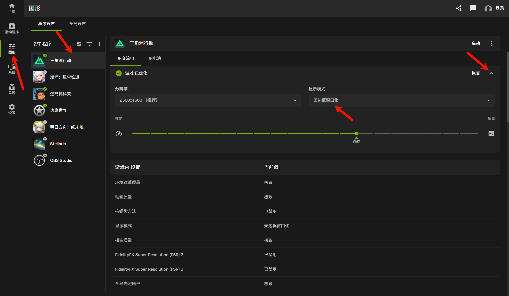

> 💡 **前言**：如果你第一次启动《三角洲行动》时遇到画面放大或纯色闪屏，别慌！这是 Windows 高 DPI 缩放与游戏引擎的冲突。本文提供解决方案。

## 1. 🔍 问题现象

第一次启动《三角洲行动》时可能遇到以下问题：

- **画面异常放大**：游戏图像被放大多倍，只能看到界面的一小部分，鼠标无法点击目标按钮
- **"假花屏"**：能听到游戏音效，但屏幕显示单一颜色交替闪动，不显示游戏内容
- **反复重启才能进**：遇到上述情况只能强退，需多次重启才能正常进入

## 2. 🔍 问题原因

**这不是显卡故障**，而是 Windows 高 DPI 缩放与游戏引擎的冲突。

使用 2.5K 或更高分辨率屏幕时，Windows 默认开启 125% 或 150% 系统缩放。游戏启动时，引擎未能正确接管屏幕，Windows 将系统缩放强加在全屏游戏画面上，造成"二次放大"，导致渲染出错，表现为画面缩小或纯色闪屏。

## 3. 🛠️ 解决方案：NVIDIA 应用设置

### 3.1 详细步骤

打开电脑上的 **NVIDIA 应用**（NVIDIA App），在左侧导航栏点击 **图形** 选项卡。

在程序列表中找到并点击 **三角洲行动**（Delta Force）。

在右侧找到 **游戏已优化** 选项，点击 **恢复** 按钮后面的小三角展开详细设置。

在展开的设置面板中，找到 **显示模式** 选项，在下拉菜单中选择 **无边框窗口化**。

设置完成后无需额外保存，直接关闭 NVIDIA 应用即可。

## 4. ✅ 验证效果

重新打开游戏，画面应该能正常显示，不再出现放大或纯色闪屏问题。

如果问题仍然存在，可以尝试重启电脑后再启动游戏。

## 5. 📝 总结

《三角洲行动》启动时的画面放大和纯色闪屏问题，本质上是 Windows 高 DPI 缩放与游戏引擎的冲突。

通过 NVIDIA 应用将显示模式设置为 **无边框窗口化**，可以让游戏正确接管画面渲染，彻底解决问题。这种方法简单快捷，无需修改任何文件属性。

希望这篇文章能帮助到遇到同样问题的朋友！如果还有什么新的方法，欢迎在评论区留言交流。
