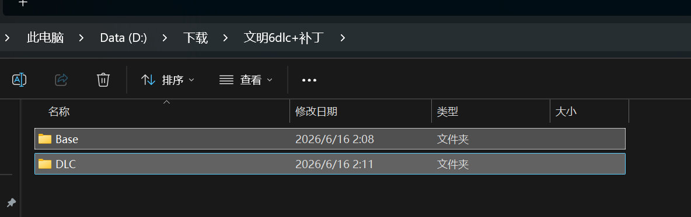

## 1. 引言

文明 6 的 DLC 内容较多，手动逐个安装比较麻烦。本补丁包将所需文件打包整理，只需下载、解压、复制粘贴三步，即可完成全部 DLC 的安装。

## 2. 使用前准备

开始之前，请确认你已具备以下条件：

- **操作系统**：Windows
- **游戏版本**：已在 Steam 安装并激活文明 6 本体

### 如何找到游戏根目录

在 Steam 中右键点击「文明 6」→ **管理** → **浏览本地文件**，打开的文件夹即为游戏根目录，路径通常如下：

```
...\Steam\steamapps\common\Sid Meier's Civilization VI\
```

## 3. 下载与解压

补丁包托管在夸克网盘，点击以下链接即可下载：

> <https://pan.quark.cn/s/ab226343129f>

下载完成后，将压缩包解压到任意方便找到的文件夹。

## 4. 安装步骤

解压后会得到 `Base` 和 `DLC` 两个文件夹，将这两个文件夹全部选中，复制后直接粘贴到文明 6 的游戏根目录。

<a href="images/2026-06-16-02-14-10.png" target="_blank">  </a>

粘贴时若提示覆盖文件，选择**全部覆盖**即可。安装完成后，通过 Steam 正常启动游戏即可。

## 5. 验证是否成功

1. 通过 Steam 启动文明 6
2. 进入游戏主菜单，打开 **额外内容**（Additional Content）
3. 确认 DLC 列表中各项内容均已显示为可用状态

若列表中能看到完整 DLC，说明补丁包已安装成功。

## 6. 重要提示

1. **仅供学习交流使用**，请支持正版游戏
2. 使用本补丁包造成的任何后果，用户自行承担
3. 建议定期备份游戏存档
