## 1. 引言

**你需要准备**：

- 一台云服务器 (VPS)：本文以 **CentOS 7** 系统为例
- 基础工具：**WinSCP**（用于传文件）、**SSH 终端**
- 一颗折腾的心：虽然步骤较多，但为了流畅的银河征途，一切都是值得的！

## 2. 服务器准备与基础环境搭建

俗话说"工欲善其事，必先利其器"。搭建群星联机节点，核心在于网络质量而非服务器的计算性能。本章将指导您完成服务器的选购及基础环境的配置。

### 2.1. 服务器选购建议

在购买 VPS 时，请重点关注以下三点：

#### 2.1.1. 带宽是核心

群星联机数据交换量较大。根据实测经验，**10Mbps 带宽**大约能支撑 **1～2 车**同时游玩（每车约 10 人），**带宽越大，后期卡顿概率越低**。

#### 2.1.2. 地理位置

尽量选择距离您和朋友们地理位置都比较近的数据中心，以物理手段降低延迟。

#### 2.1.3. 配置够用即可

如果这台服务器仅用于群星加速，CPU、内存和硬盘空间可以选最低配（如 1 核 1G），以降低成本。

### 2.2. 安装必要组件

购买并登录服务器（使用 SSH 工具）后，我们需要安装解压工具、EPEL 源以及核心软件 OpenVPN。请依次执行以下指令（本教程以 CentOS 7 为例）：

首先远程连接云服务器，这里以阿里云为例

<a href="images/2026-02-11-21-40-19.png" target="_blank"> 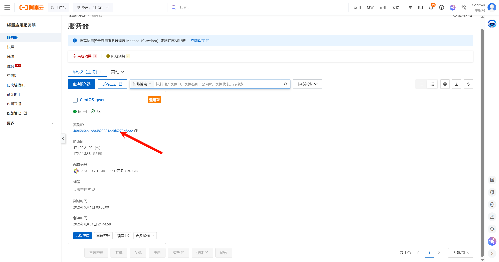 </a>
<a href="images/2026-02-11-21-40-51.png" target="_blank"> 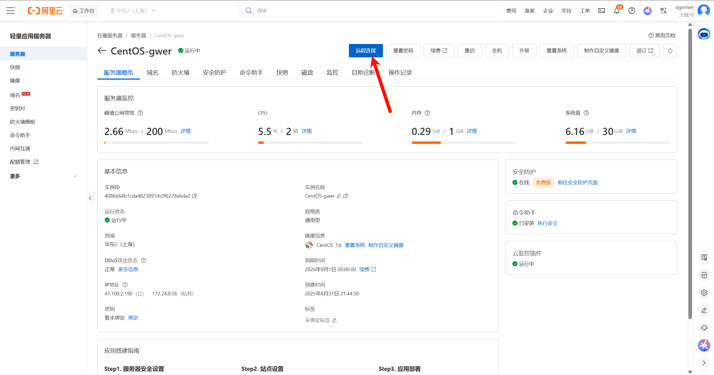 </a>
<a href="images/2026-02-11-21-41-10.png" target="_blank"> 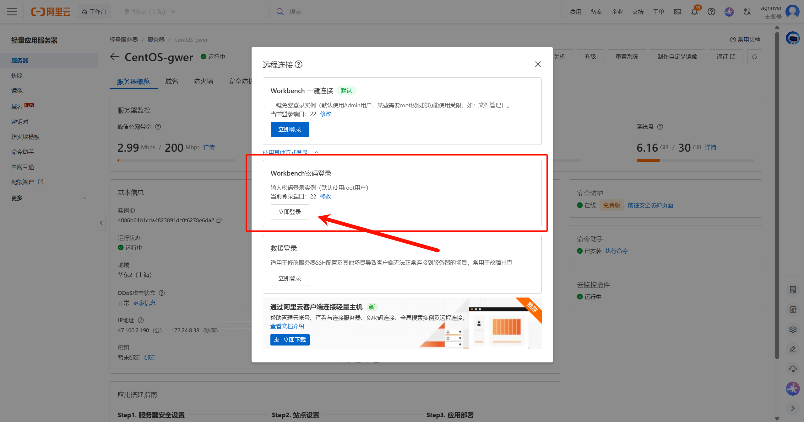 </a>

#### 2.2.1. 更新系统软件包

```bash
sudo yum update -y
```

<br>
<a href="images/2026-02-11-18-30-37.png" target="_blank"> 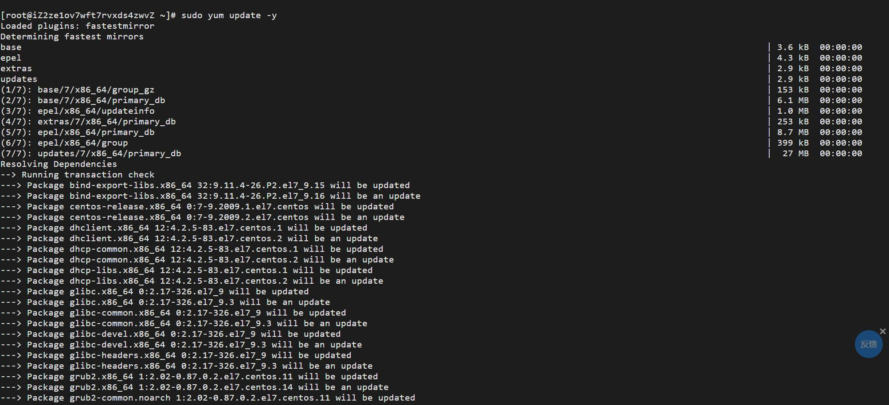 </a>

#### 2.2.2. 安装 unzip 解压工具

（后续解压服务端文件需要用到）

```bash
sudo yum install unzip -y
```

<br>
<a href="images/2026-02-11-18-31-46.png" target="_blank"> 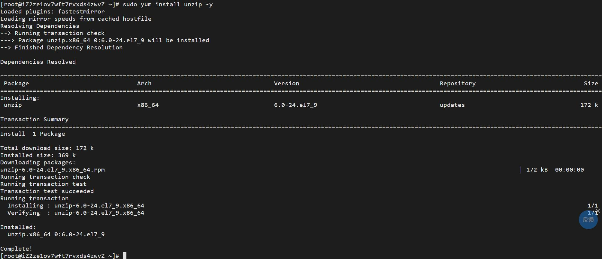 </a>

#### 2.2.3. 安装 EPEL 源

（OpenVPN 通常包含在 EPEL 源中）

```bash
sudo yum install epel-release -y
```

<br>
<a href="images/2026-02-11-18-32-10.png" target="_blank"> 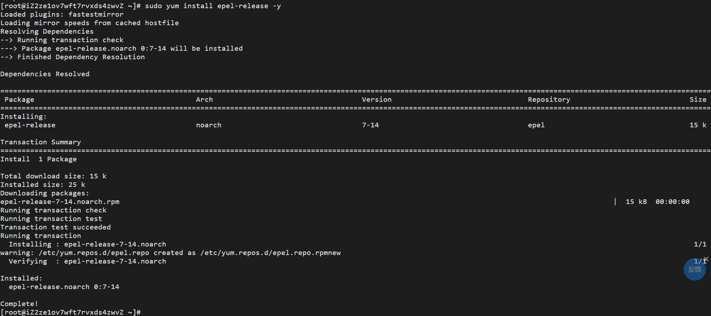 </a>

#### 2.2.4. 安装 OpenVPN

```bash
sudo yum install openvpn -y
```

<br>
<a href="images/2026-02-11-18-32-31.png" target="_blank"> 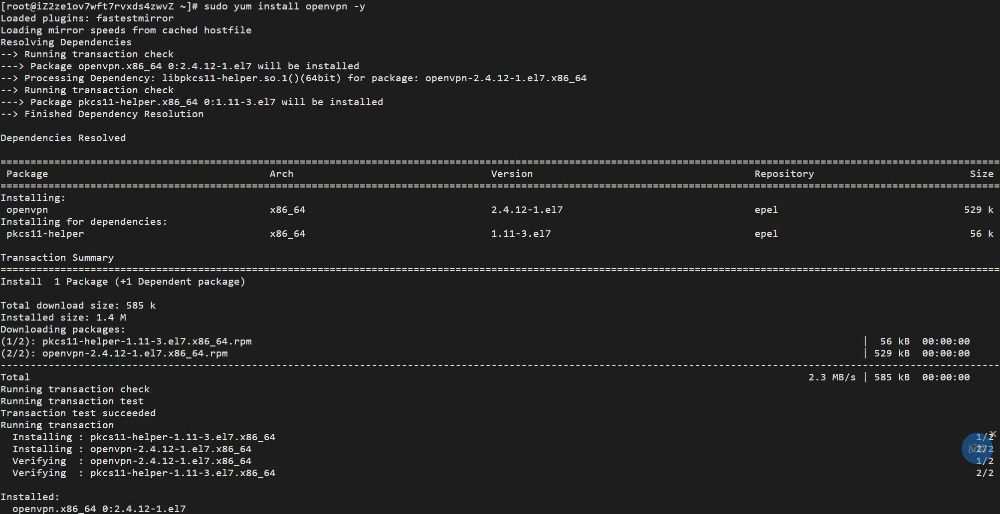 </a>
#### 2.2.5. 版本检查（重要！）

安装完成后，输入以下命令查看版本：

```bash
openvpn --version
```

<br>
<a href="images/2026-02-11-18-41-00.png" target="_blank"> 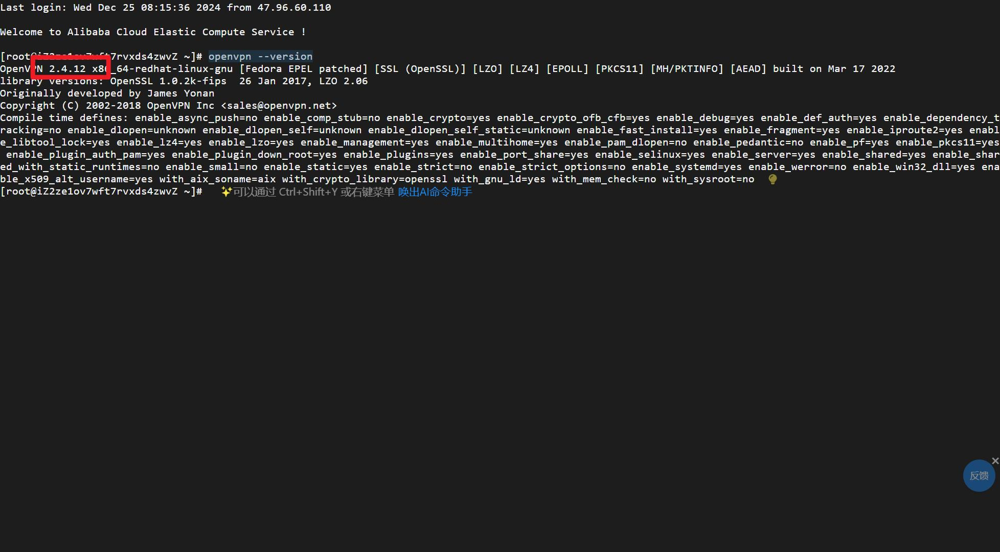 </a>

⚠️ **请根据输出的版本号，记下您的情况**：

- **情况 A：版本 < 2.5**（例如 2.4.x）
  这是 CentOS 7 默认的旧版本，与本教程提供的原始配置文件完全兼容，您在后续章节 **无需进行额外修改**。

- **情况 B：版本 ≥ 2.5**（2.5 或 2.6+）
  现在的云服务器系统（如新版 CentOS 或 Debian/Ubuntu）通常会安装较新的版本。
  ⚠️ **如果您的版本是 2.5 或更高，请务必记住这一点**。因为新版本废弃了旧的加密参数，我们在下一章部署时，**必须手动修改配置文件**（添加 `data-ciphers` 等设置）才能正常连接，否则会导致无法联机。

### 2.3. 开放防火墙端口（关键步骤）

为了让游戏数据能顺利进出服务器，我们需要开放两个特定的端口：**3074 (UDP)** 和 **3075 (TCP)**。这通常涉及两道关卡：**服务器内部防火墙**和**云厂商安全组**。

#### 2.3.1. 第一关：服务器内部防火墙 (Firewalld)

如果您的服务器开启了 firewalld，请执行以下命令放行端口：

#### 2.3.2. 检查防火墙状态

```bash
sudo systemctl status firewalld
```

如果输出如下图所示，说明你的 firewalld 防火墙服务没有启动，默认所有端口全部被放行，你可以直接跳过这一步，直接去看第二关：云厂商安全组
<a href="images/2026-02-11-18-39-01.png" target="_blank"> 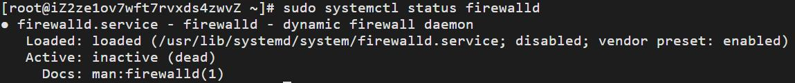 </a>
如果输出如下图所示，说明你的 firewalld 防火墙服务在正常运行，我们需要继续操作，放行端口 3074(UDP) 和 3075(TCP)
<a href="images/2026-02-11-18-42-06.png" target="_blank"> 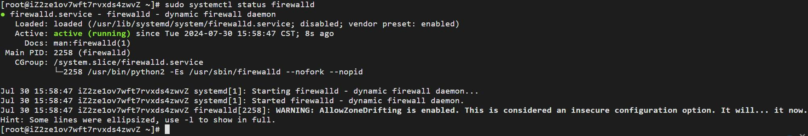 </a>

#### 2.3.3. 放行 3074 (UDP)

```bash
sudo firewall-cmd --zone=public --add-port=3074/udp --permanent
```

#### 2.3.4. 放行 3075 (TCP)

```bash
sudo firewall-cmd --zone=public --add-port=3075/tcp --permanent
```

#### 2.3.5. 重载配置使其生效

```bash
sudo firewall-cmd --reload
```

#### 2.3.6. 验证是否成功

输入以下指令查看开放列表：

```bash
sudo firewall-cmd --zone=public --list-ports
```

<br>
<a href="images/2026-02-11-18-42-27.png" target="_blank"> 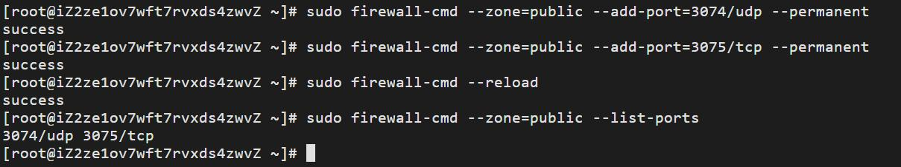 </a>
如果看到 3074/udp 3075/tcp 字样，即代表操作成功。

#### 2.3.7. 第二关：云厂商安全组 (Security Group)

⚠️ **这是新手最容易忽略的一步！**

绝大多数云服务器（阿里云、腾讯云、华为云等）在网页控制台都有一层额外的 **「安全组」** 或 **「防火墙」** 设置。

请登录您的云服务器控制台，找到 **安全组 → 配置规则 → 手动添加**，填入以下信息：
<a href="images/2026-02-11-18-42-53.png" target="_blank"> 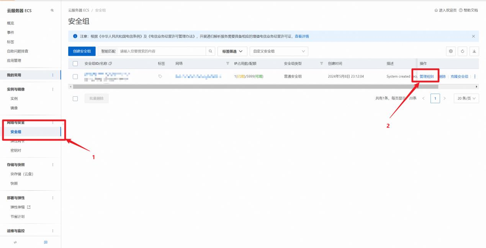 </a>
规则 1 (UDP)

- 协议类型：UDP
- 端口范围：3074/3074
- 授权对象：0.0.0.0/0（所有 IP）
- 策略：允许

规则 2 (TCP)

- 协议类型：TCP
- 端口范围：3075/3075
- 授权对象：0.0.0.0/0（所有 IP）
- 策略：允许
  <a href="images/2026-02-11-18-43-17.png" target="_blank"> 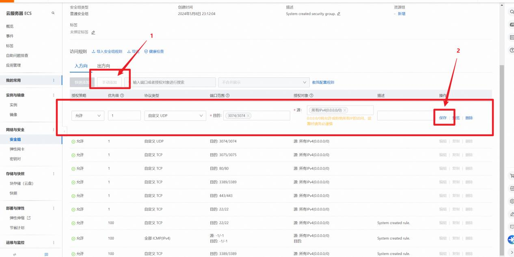 </a>
  <a href="images/2026-02-11-18-43-25.png" target="_blank">  </a>

### 2.4. 特殊情况：共享型 VPS 的端口转发（NAT 映射）

> ⚠️ **以下内容仅适用于购买了「超低价共享型 VPS」的用户，拥有独立公网 IP 的独立服务器用户可直接跳过本节。**

部分超低价 VPS 服务商并非给您一台独立的机器，而是**一台物理主机由多个用户共享**。在这种情况下，您拿到的并非一个独立的公网 IP，而是一个 **"IP:端口"** 的访问入口（例如 `160.202.254.14:10272`），其中 `10272` 是您的 SSH 登录端口。

在这种架构下，**3074 和 3075 端口由宿主机的主网关统一管理，您没有权限直接对外暴露这两个端口**，因此客户端无法通过标准端口直接连接到您服务器内的 OpenVPN 服务。

**解决方案：在服务商管理面板中配置端口转发（NAT 映射）**

您的 VPS 服务商通常会在其控制面板中提供端口转发功能，可以将宿主机上一个分配给您的外部端口，映射到您虚拟机内部的指定端口。

**操作步骤如下：**

1. 登录您的 VPS 服务商管理面板，找到您的实例
2. 找到 **端口转发（NAT / Port Forwarding）** 或类似选项
3. 添加两条转发规则（外部端口由系统分配或您自行填写）：

| 内部端口（本机 OpenVPN） | 协议 | 外部端口（映射后对外暴露） |
| :----------------------: | :--: | :------------------------: |
|           3074           | UDP  |         例：40074          |
|           3075           | TCP  |         例：40075          |

<a href="images/2026-02-21-14-27-43.png" target="_blank">  </a>

4. **记录下服务商分配给您的两个外部端口号**，在后续配置客户端时需要用到

> 💡 **注意**：内部防火墙（Firewalld）和云厂商安全组仍然需要开放 **3074（UDP）** 和 **3075（TCP）**，因为这是 OpenVPN 服务在您虚拟机内部实际监听的端口。端口转发规则是将外部流量"转进来"，服务本身不变。

## 3. 服务端文件部署与核心配置

在第一章准备好环境后，我们需要将加速器的"心脏"——服务端核心文件部署到服务器中。这一步看似简单，但文件路径的准确性和脚本的执行权限直接决定了后续服务能否启动。

首先，我们需要先从 [原作者博客](https://www.dogfight360.com/blog/1590/#comment-41142) 中下载关键文件 [教程 .zip](https://www.dogfight360.com/blog/wp-content/uploads/2021/07/%E6%95%99%E7%A8%8B.zip), 解压后从中提取出 server.zip

### 3.1. 使用 WinSCP 上传文件

为了方便管理，我们推荐使用 [WinSCP 可视化工具](https://winscp.net/eng/download.php) 将文件上传到服务器的临时目录。

#### 3.1.1. 建立连接

1. 打开 WinSCP 软件。
2. **主机名**：填写您的服务器公网 IP。
3. **用户名**：root
4. **密码**：您的服务器 SSH 登录密码。
   <a href="images/2026-02-11-18-55-12.png" target="_blank"> 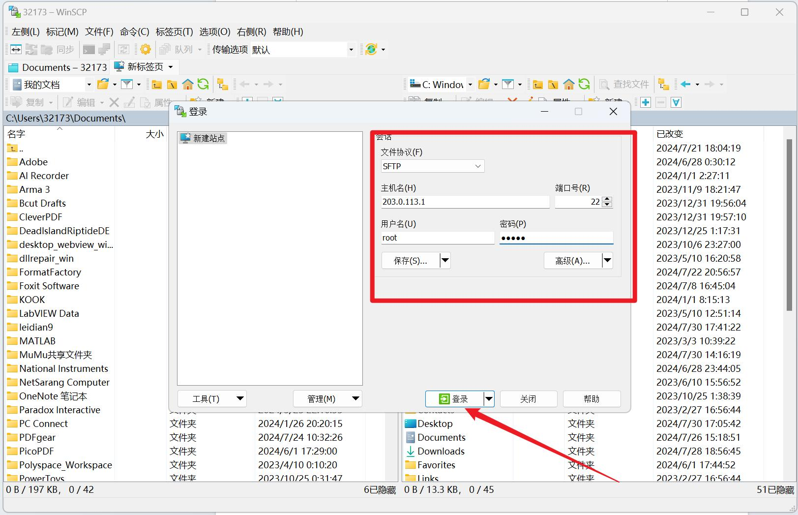 </a>
5. 点击登录，如果是首次连接，点击"是"接受密钥指纹。
   <a href="images/2026-02-11-18-56-03.png" target="_blank"> 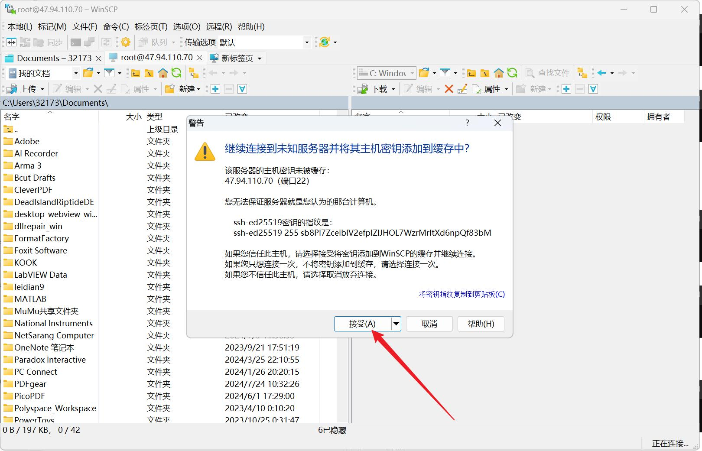 </a>

#### 3.1.2. 上传操作

1. 登录成功后，软件界面左侧代表您的电脑，右侧代表服务器。
2. 在右侧（服务器端），双击顶部的 `..` 文件夹图标返回根目录，然后找到并进入 `/tmp` 目录。
   （选择 `/tmp` 是因为它是存放临时文件的标准位置，系统重启后会自动清理，适合做中转）
   <a href="images/2026-02-11-18-57-02.png" target="_blank"> 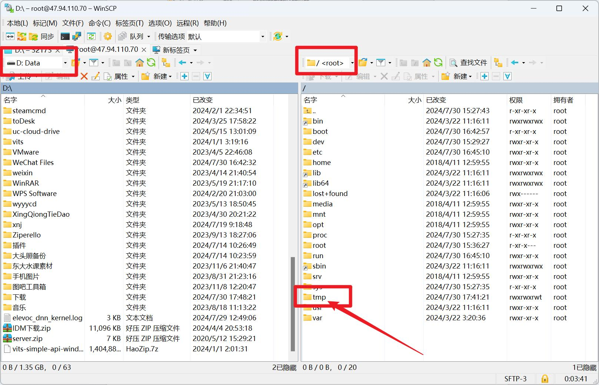 </a>
3. 在左侧（本地端），找到您电脑上的 `server.zip` 文件。
4. 将 `server.zip` 直接拖拽到右侧窗口中。
   <a href="images/2026-02-11-18-57-17.png" target="_blank"> 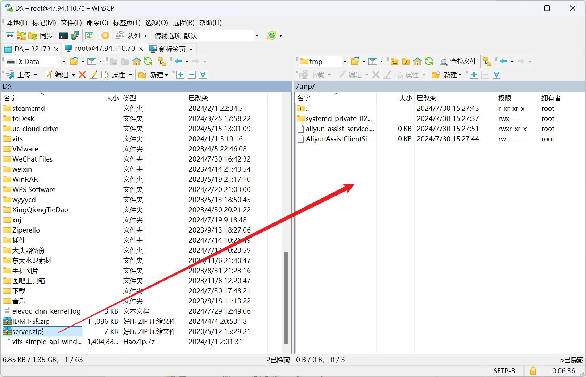 </a>
   <a href="images/2026-02-11-18-57-45.png" target="_blank"> 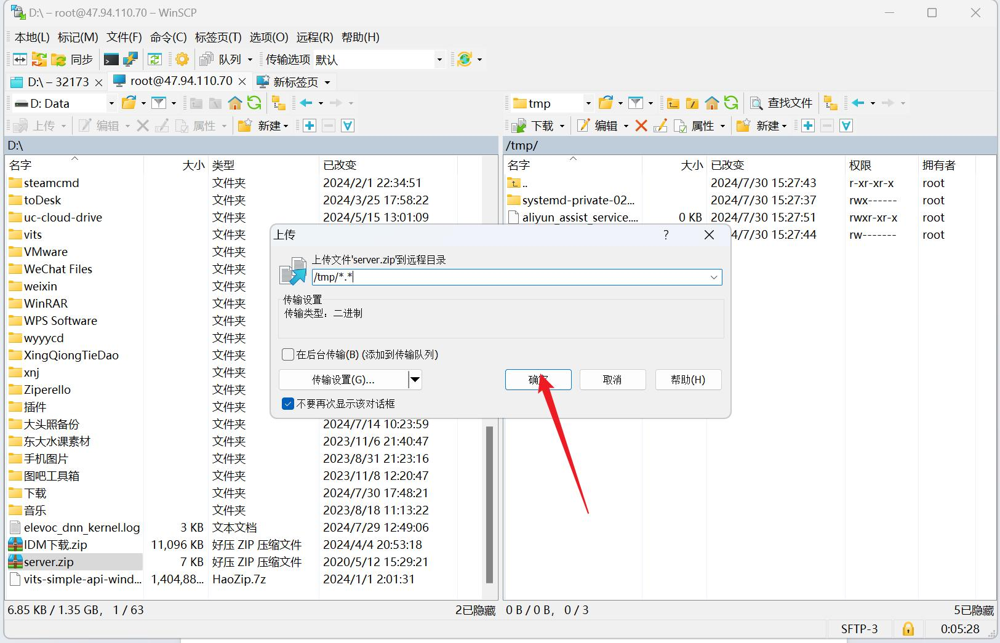 </a>
   <a href="images/2026-02-11-18-57-52.png" target="_blank"> 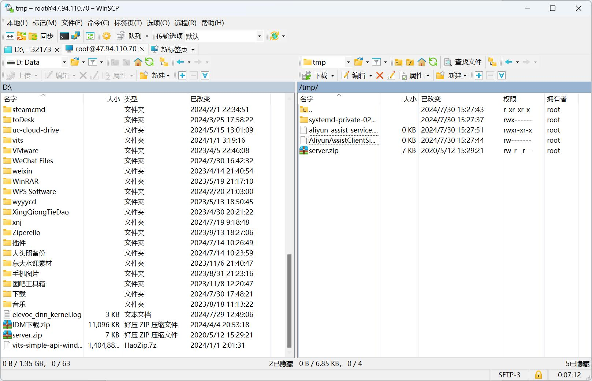 </a>

### 3.2. 解压与部署

文件上传完成后，我们需要通过 SSH 终端将其解压到 OpenVPN 的标准配置目录中。

#### 3.2.1. 创建标准目录

为了规范化管理，我们统一将文件存放在 `/etc/openvpn` 目录下。输入以下命令创建目录（如果系统已自动创建，此命令会提示已存在，忽略即可）：

```bash
sudo mkdir -p /etc/openvpn
```

#### 3.2.2. 解压文件

输入以下命令，将刚才上传到临时目录的文件解压到配置目录：

```bash
sudo unzip /tmp/server.zip -d /etc/openvpn/
```

#### 3.2.3. 验证解压结果

解压完成后，我们要确认文件是否都在。输入以下命令查看目录内容：

```bash
ls -l /etc/openvpn/
```

请仔细核对输出结果，确保目录下包含以下关键文件：

- `server_tcp.conf` （TCP 配置文件）
- `server_udp.conf`（UDP 配置文件）
- `checkpsw.sh` （密码验证脚本）
- `psw-file` （账号密码文件）

### 3.3. 关键步骤：赋予执行权限

⚠️ **这是最容易被新手忽略的一步！**

`checkpsw.sh` 是一个 Shell 脚本，OpenVPN 需要调用它来验证客户端传来的账号密码。如果它没有 **「可执行权限」**，服务器就会 **拒绝所有连接请求**，导致报错。

#### 3.3.1. 赋予权限

输入以下命令，将脚本标记为可执行文件：

```bash
sudo chmod +x /etc/openvpn/checkpsw.sh
```

#### 3.3.2. 再次验证

再次输入查看命令：

```bash
ls -l /etc/openvpn/checkpsw.sh
```

观察输出结果的第一个字段：

- 如果显示 `-rwxr-xr-x` （包含 `x` 且文件名通常变绿），说明权限设置成功。
- 如果显示 `-rw-r--r--` （没有 `x`)，说明失败，请重新执行 `chmod` 命令。

---

至此，所有的文件都已就位，且具备了运行条件。下一章我们将进入最核心、也最复杂的环节：修改配置文件以适配群星的低延迟需求及新版系统的兼容性。

## 4. 核心配置与版本兼容性修正

文件部署完成后，我们需要对 OpenVPN 的配置文件进行"手术"。本章的核心目标是：关闭加密以降低延迟，并修正新旧版本的语法差异。

### 4.1. 修改 TCP 配置文件

首先修改 TCP 协议的配置文件。此文件决定了游戏数据的传输方式之一。

#### 4.1.1. 打开 tcp 文件

输入以下命令编辑 server_tcp.conf 文件：

```bash
sudo vi /etc/openvpn/server_tcp.conf
```

<br>
<a href="images/2026-02-11-21-42-28.png" target="_blank"> 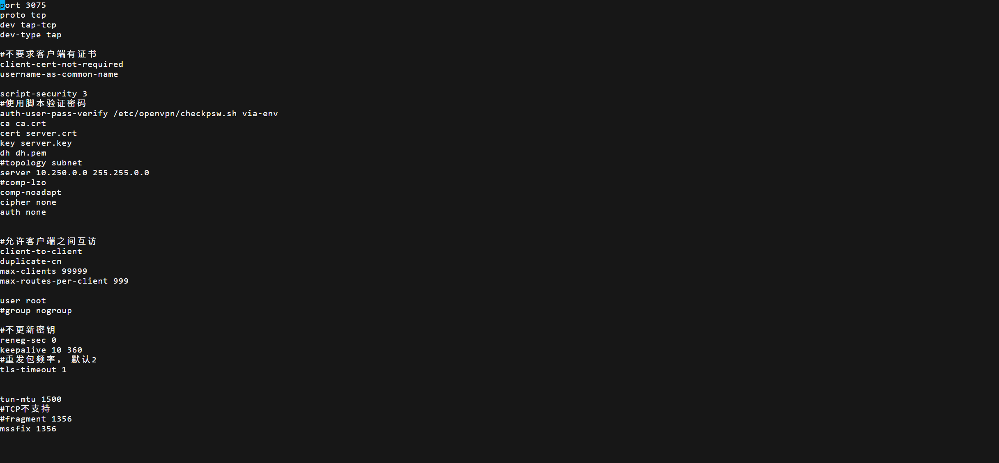 </a>

#### 4.1.2. 编辑 tcp 指南

进入编辑模式（按 i 键），请根据您的 OpenVPN 版本进行以下修改：

1. 针对 OpenVPN 2.4.x（旧版/CentOS 7 默认）
   保持以下参数不变（如果文件中是这样写的）：

```text
cipher none
client-cert-not-required
```

2. 针对 OpenVPN 2.5.x（较新版）
   旧的 cipher 指令已弃用，请找到 cipher none，将其修改或替换为：

```text
data-ciphers none
```

（如果不改，服务端日志会疯狂报错提示协商失败）
<a href="images/2026-02-11-21-44-33.png" target="_blank"> 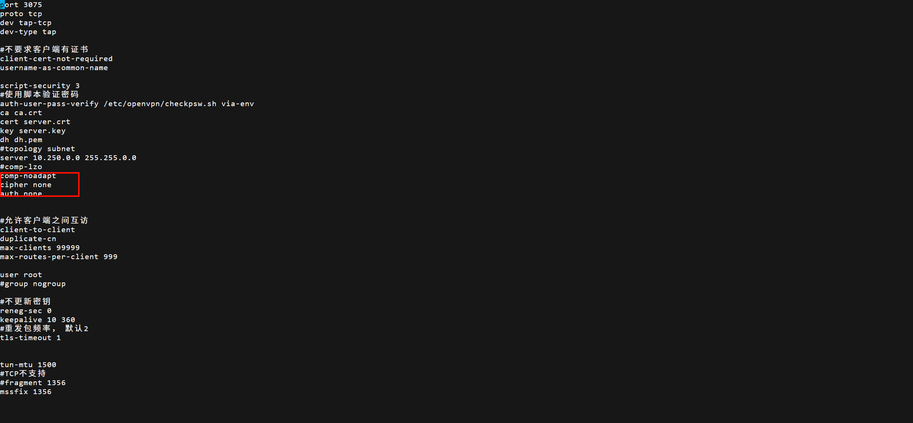 </a>

3. 针对 OpenVPN 2.6.x（最新版）
   除了执行上述 2.5.x 的修改外，还必须处理证书验证指令。
   找到 client-cert-not-required，将其**删除**并替换为：

```text
verify-client-cert none
```

（新版本彻底移除了旧指令，不替换将无法启动服务）
<a href="images/2026-02-11-21-44-58.png" target="_blank"> 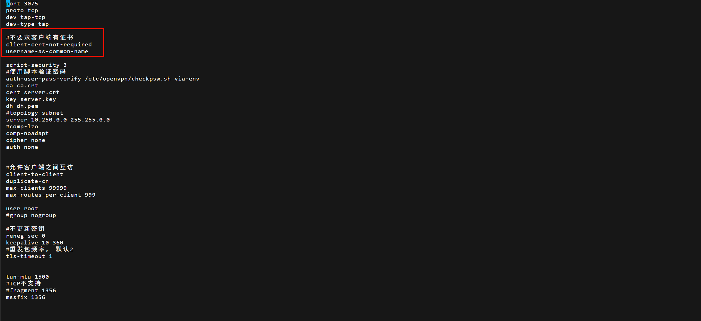 </a>

#### 4.1.3. 保存 tcp 并文件退出

修改完成后，按 Esc 键，输入 :wq 并回车。

### 4.2. 修改 UDP 配置文件

接下来修改 UDP 配置文件，通常群星联机更推荐使用 UDP 协议，因为它的延迟更低。

#### 4.2.1. 打开 udp 文件

输入以下命令：

```bash
sudo vi /etc/openvpn/server_udp.conf
```

#### 4.2.2. 编辑 udp 指南

操作逻辑与 TCP 完全一致，请重复上述步骤：

1. 版本适配

- 2.4.x：保持 cipher none 和 client-cert-not-required。

- 2.5.x：将 cipher 改为 data-ciphers none。
- 2.6.x：同上，并将 client-cert-not-required 替换为 verify-client-cert none。

#### 4.2.3. 保存 udp 文件并退出

按 Esc 键，输入 :wq 并回车。

### 4.3. 设置连接账号密码

最后，我们需要配置 checkpsw.sh 脚本读取的账号密码文件。客户端连接时必须填写这里设置的内容。

#### 4.3.1. 打开密码文件

输入以下命令：

```bash
sudo vi /etc/openvpn/psw-file
```

#### 4.3.2. 设置账号

文件内容的格式非常简单：用户名 空格 密码。
您可以删除原有的默认内容，填入您自己的账号。

示例（设置用户名为 stellaris，密码为 123456）：

```text
stellaris 123456
```

#### 4.3.3. 保存退出

按 Esc 键，输入 :wq 并回车。

---

至此，配置文件的修改工作全部完成。下一章我们将尝试启动服务，并教您如何看懂启动日志来验证修改是否成功。

## 5. 服务启动验证与自动化部署

配置文件的修改只是纸上谈兵，我们需要通过实际运行来验证服务能否启动。如果配置文件有语法错误（例如 OpenVPN 版本不兼容），在这一步就会暴露出来。确认无误后，我们将配置开机自启。

### 5.1. 手动启动测试

在后台静默运行之前，我们先在前台手动启动一次，以便直观地看到启动日志。

#### 5.1.1. 查找 OpenVPN 主程序路径

输入以下指令查找路径，通常位于 /usr/sbin/openvpn：

```bash
sudo find / -name openvpn
```

<br>
<a href="images/2026-02-11-21-49-28.png" target="_blank"> 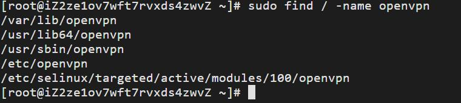 </a>

#### 5.1.2. 测试 TCP 服务

输入以下指令启动 TCP 服务端（注意路径需与上一步查到的一致）：

```bash
sudo /usr/sbin/openvpn --cd /etc/openvpn/ --config server_tcp.conf
```

<br>
<a href="images/2026-02-11-21-50-01.png" target="_blank"> 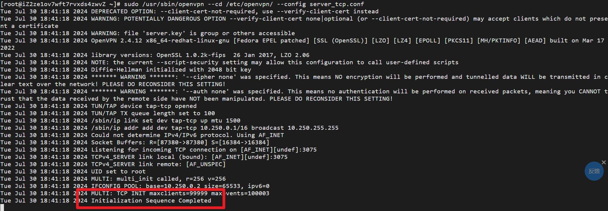 </a>

#### 5.1.3. 观察启动日志

终端会输出一长串日志。请耐心观察最后一行：

- ✅ 如果显示 **`Initialization Sequence Completed`**，说明 TCP 服务启动成功，配置文件无误。
- ❌ 如果显示 **`Exiting due to fatal error`** 或其他报错，请仔细检查报错信息（通常是 `cipher` 或 `auth` 参数写错了），并返回上一章重新修改。

确认成功后，按 `Ctrl + C` 停止服务。

#### 5.1.4. 测试 UDP 服务

重复上述步骤，测试 UDP 配置文件：

```bash
sudo /usr/sbin/openvpn --cd /etc/openvpn/ --config server_udp.conf
```

<br>
<a href="images/2026-02-11-21-49-47.png" target="_blank"> 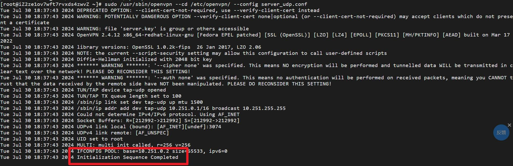 </a>

同样等待出现 **`Initialization Sequence Completed`** 后，按 `Ctrl + C` 停止。

### 5.2. 配置开机自启动

为了让加速器在服务器重启后自动运行，我们需要将启动命令添加到系统的启动脚本中。

#### 5.2.1. 编辑 rc.local 文件

输入以下命令打开启动脚本：

```bash
sudo vi /etc/rc.d/rc.local
```

<br>
<a href="images/2026-02-11-21-50-25.png" target="_blank"> 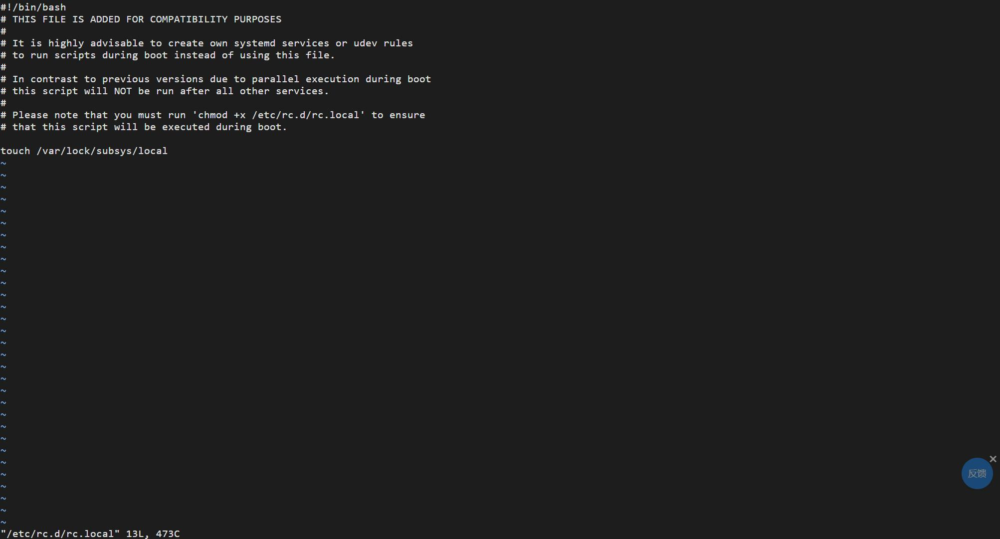 </a>

#### 5.2.2. 添加启动命令

按 i 进入插入模式，使用方向键移动到文件最底部，粘贴以下两行代码：
<a href="images/2026-02-11-21-50-42.png" target="_blank"> 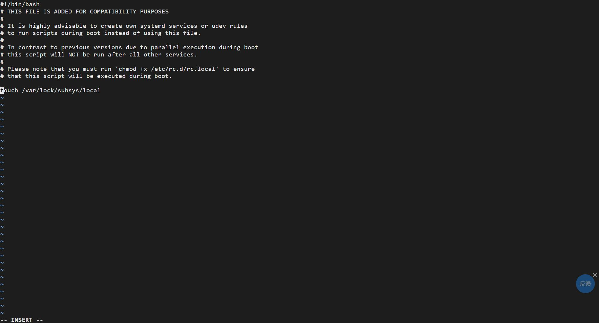 </a>

```bash
/usr/sbin/openvpn --cd /etc/openvpn/ --config server_udp.conf &
/usr/sbin/openvpn --cd /etc/openvpn/ --config server_tcp.conf &
```

- ⚠️ **注意**：命令末尾的 `&` 符号绝对不能漏！它代表「在后台运行」。如果漏掉，服务器重启后会卡在启动画面进不去系统。
  <a href="images/2026-02-11-21-50-57.png" target="_blank"> 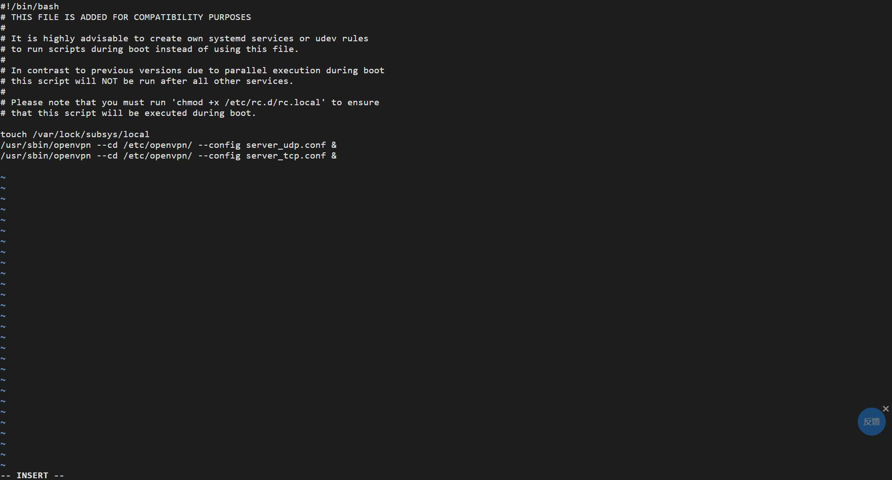 </a>

#### 5.2.3. 保存并退出

按 Esc 键，输入 :wq 并回车。

#### 5.2.4. 赋予脚本执行权限

⚠️ **这是很多教程容易漏掉的一步**。在 CentOS 7 中，`rc.local` 默认没有执行权限。如果不执行此命令，开机启动将无效：

```bash
sudo chmod +x /etc/rc.d/rc.local
```

<br>
<a href="images/2026-02-11-21-51-18.png" target="_blank">  </a>
### 5.3. 重启验证

为了确保万无一失，我们模拟一次服务器断电重启。

#### 5.3.1. 重启服务器

输入以下命令重启系统：

```bash
sudo reboot
```

此时 SSH 连接会断开，请等待 1-2 分钟。

#### 5.3.2. 验证端口监听状态

重新连接 SSH，输入以下指令检查端口是否已在运行：

```bash
sudo netstat -anp | grep 307
```

<br>
<a href="images/2026-02-11-21-51-43.png" target="_blank"> 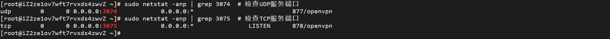 </a>

#### 5.3.3. 确认结果

观察输出结果：

- 如果看到类似 udp ... 0.0.0.0:3074 和 tcp ... 0.0.0.0:3075 的行，且状态为 LISTEN（TCP）或相关进程存在。
- 这意味着加速器已经成功在后台自动运行，服务端部署圆满成功！

## 6. 客户端深度配置与联机实测

服务端配置圆满结束后，最后一步就是配置玩家手中的客户端。本方案使用的是 **UsbEAm LAN Party**，它小巧免安装，通过 TAP 虚拟网卡技术组建虚拟局域网，非常适合群星这种 P2P 联机游戏。

### 6.1. 下载与安装

我们需要准备客户端程序和虚拟网卡驱动。

#### 6.1.1. 获取软件

请前往原作者 Dogfight360 的博客下载最新版客户端（通常名为 UsbEAm_LAN_Party_V1.x.zip）：

> <https://www.dogfight360.com/blog/1590/>
> <br>
> <a href="images/2026-02-11-21-58-56.png" target="_blank"> 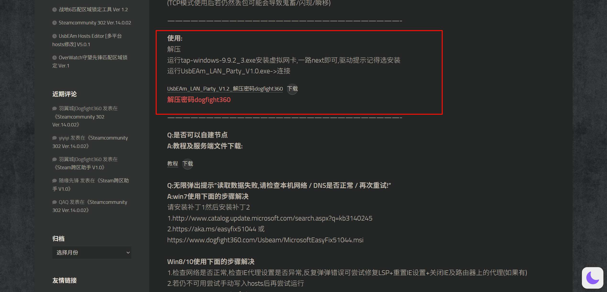 </a>

下载完成后解压，**解压密码：dogfight360**。解压后您应该会看到以下三个核心文件：

- UsbEAm LAN Party V1.2.exe（客户端主程序）
- tap-windows-9.9.2_3.exe（虚拟网卡驱动安装包）
- customize.ini（节点配置文件）

#### 6.1.2. 安装 TAP 驱动

如果是第一次使用该软件，必须安装 TAP 驱动，否则无法建立虚拟局域网。

1. 双击运行 tap-windows-9.9.2_3.exe。
2. 一路点击 Next（下一步）直到安装完成。
3. 注意：安装过程中无需更改任何默认设置。
   <a href="images/2026-02-11-22-01-59.png" target="_blank">  </a>

### 6.2. 配置节点信息

我们需要修改 customize.ini 文件，将我们服务器的信息填进去，让客户端知道去哪里连接。

#### 6.2.1. 编辑配置文件

用记事本打开 customize.ini，清空里面的内容，或者直接修改为以下标准格式：
<a href="images/2026-02-11-21-59-44.png" target="_blank">  </a>
<br>

```ini
[usbeam]
Server_List=我的群星节点
Disable_rules=1
Broadcast_fix=1

[我的群星节点]
IP=203.0.113.1
TCP_Port=3075
UDP_Port=3074
USER=stellaris
PASS=123456
```

#### 6.2.2. 参数详解（请务必核对）

- **Server List**：这里填的名字会显示在软件下拉菜单里
- **[我的群星节点]**：中括号里的名字必须与 `Server List` 保持一致
- **IP**：修改为您服务器的 **公网 IP 地址**,**如果您使用的是共享型 VPS**,只保留前面的 ip 地址即可，去掉后面的端口
- **TCP Port / UDP Port**：默认填写 `3075` 和 `3074`。**如果您使用的是共享型 VPS**，请填写您在服务商管理面板中配置的端口转发规则里对应的**外部端口号**（详见上方"特殊情况：共享型 VPS 的端口转发"一节）
- **USER**：修改为您在 `psw-file` 里设置的 **用户名**
- **PASS**：修改为您在 `psw-file` 里设置的 **密码**
- **Disable rules=1**：代表默认勾选「不使用安全规则」
- **Broadcast fix=1**：代表默认勾选「修正广播优先级」

修改完成后，保存并关闭文件。

### 6.3. 启动连接与测试

万事俱备，只欠东风。

#### 6.3.1. 启动客户端

双击运行 UsbEAm LAN Party V1.2.exe。
<a href="images/2026-02-11-22-02-15.png" target="_blank"> 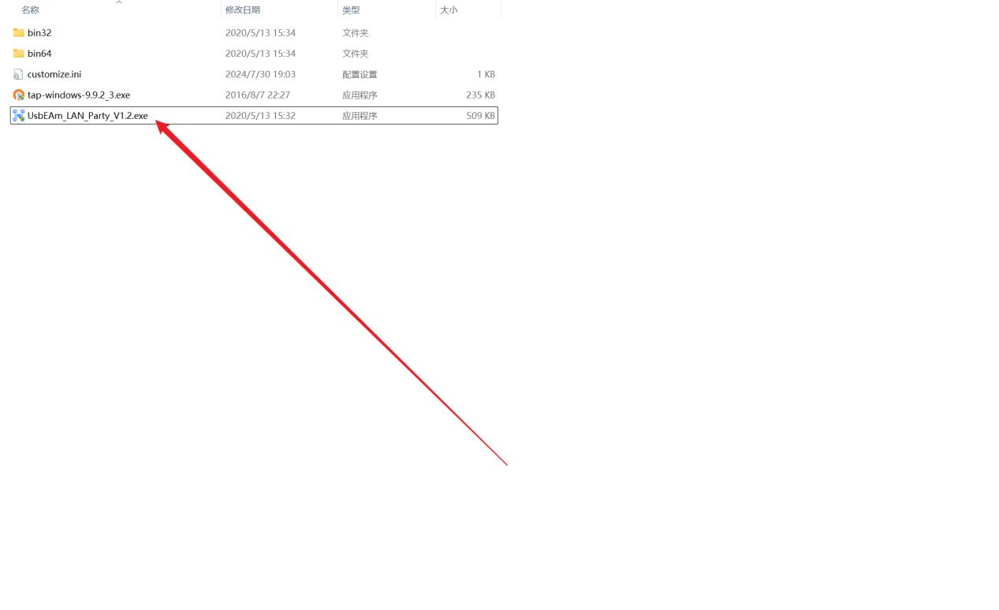 </a>

#### 6.3.2. 选择节点

在软件界面的下拉框中，找到我们刚才在配置文件里命名的节点（例如"我的群星节点"）。

#### 6.3.3. 选择模式（关键！）

在连接按钮的左侧或下方，通常有模式选择。
⚠️ **请务必勾选 UDP 模式**。

> 💡 群星联机对延迟极其敏感，**UDP 模式去除了 TCP 的握手重传机制**，能显著降低延迟，是本教程的核心优势所在。

<a href="images/2026-02-11-22-03-17.png" target="_blank"> 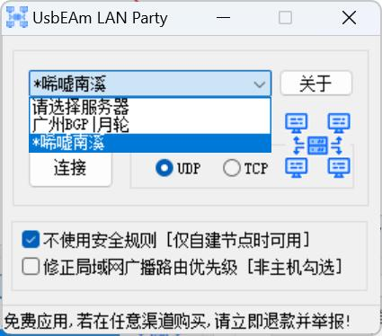 </a>

#### 6.3.4. 点击连接

点击 **连接** 按钮。

- 观察软件底部的状态栏
- ✅ 如果显示 **「连接状态：正常 (xx ms)」**，恭喜您！节点搭建成功
- ❌ 如果一直卡在「正在连接」或提示 **验证失败**，请检查：
  - 防火墙端口是否正确开放（第一章）
  - 账号密码是否填写正确（上一章）
  - 服务端是否正常运行

<a href="images/2026-02-11-22-03-31.png" target="_blank"> 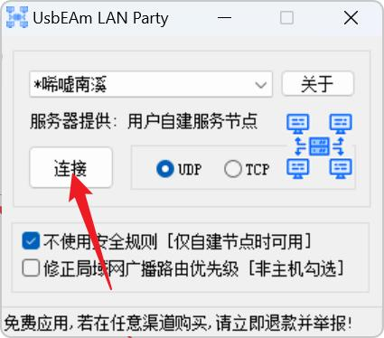 </a>

当所有小伙伴都显示 **「连接状态：正常」** 后，大家实际上已经处于同一个虚拟局域网中。

<a href="images/2026-02-11-22-03-48.png" target="_blank"> 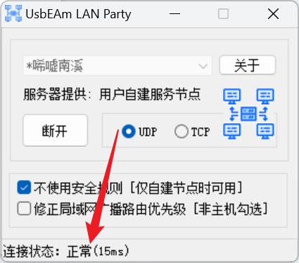 </a>

## 7. 总结

🎉 至此，您的专属群星联机加速节点已部署完毕！

**使用方法**：

1. 所有玩家启动 UsbEAm LAN Party 客户端
2. 连接到同一节点
3. 确认状态显示「正常」
4. 直接进入游戏，享受低延迟的联机体验！

祝各位征途愉快！🚀
