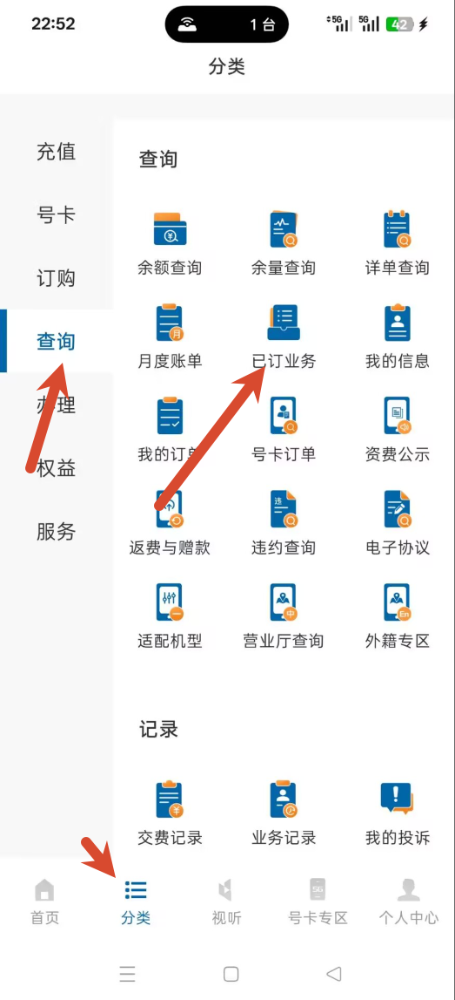
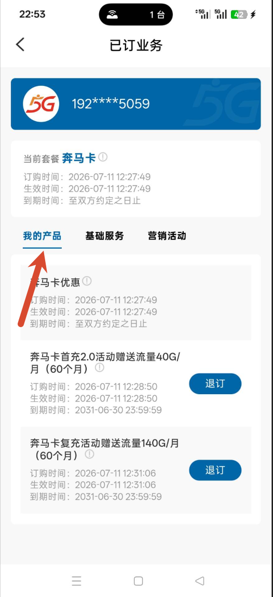
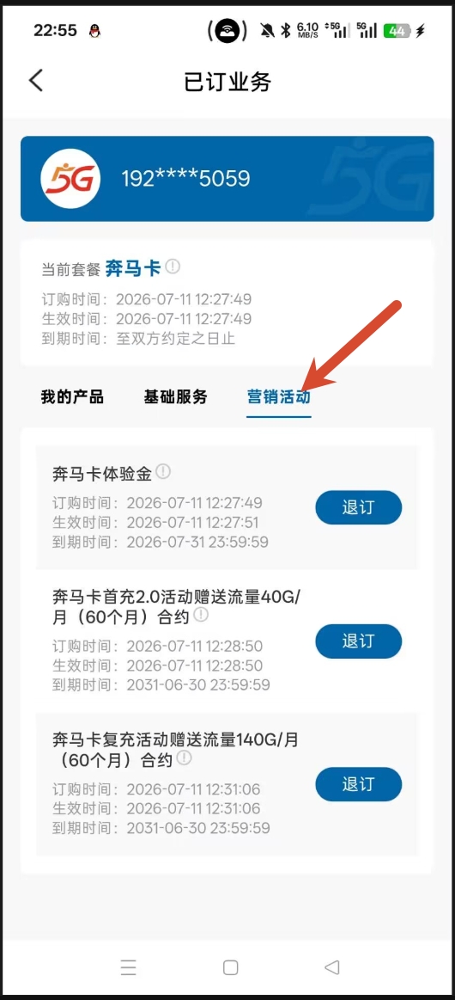
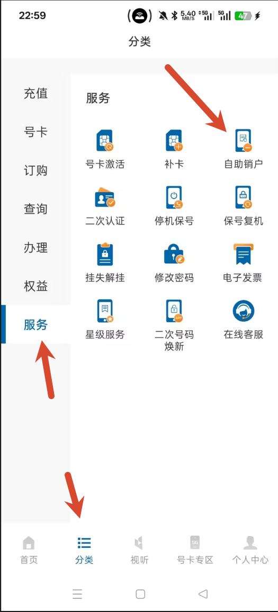

> 本文记录一次实际办理过程，页面入口、受理条件和退款时限可能因地区、套餐或运营商规则调整而变化，请以 App 页面和官方客服答复为准。

这次没有前往线下营业厅，而是直接通过中国广电 App 完成了业务退订和销户。线上办理的核心顺序是：**先退订全部业务，再提交自助销户申请**。

## 1. 登录并查看已订业务

使用需要注销的手机号登录中国广电 App，进入“分类 -> 查询”，然后点击“已订业务”。

## 2. 逐项退订产品和营销套餐

已订业务页通常包含“我的产品”和“营销套餐”两个分页。两个分页中的有效条目都需要分别退订，否则可能无法继续销户。

每次退订都需要通过手机接收验证码确认。实测中验证码存在发送间隔限制，大约一分钟只能接收一条；如果项目较多，需要预留几分钟逐项完成。

## 3. 遇到异常条目时先核对状态

我在退订“奎马体验金”时遇到了报错，页面提示关联主体不存在。结合其他条目的状态判断，这个项目可能已被此前的退订操作一并取消，只是 App 状态尚未及时刷新。

遇到类似情况时，建议先刷新页面并确认该条目是否仍然生效；如无法判断，不要反复操作，可保留截图并通过官方客服确认。

## 4. 提交自助销户申请

确认全部业务均已退订后，进入“分类 -> 服务 -> 自助销户”。随后按照页面提示完成身份验证、签字等流程即可提交申请。

## 5. 余额退还结果

本次销户完成后，App 内剩余的可退余额进入退款流程。我的退款在提交销户后的第二天到账。

到账时间和可退金额会受余额性质、套餐协议和受理规则影响。建议在提交前截图保留余额信息，并保存销户受理记录；若超过页面或客服承诺的时限仍未到账，可凭记录向官方客服查询处理进度。

## 6. 注意事项

- 先检查“我的产品”和“营销套餐”两个分页，避免遗漏有效业务。
- 退订验证码可能存在发送间隔，不要连续重复提交。
- 遇到异常提示时先核对业务状态，必要时通过官方渠道确认。
- 销户前后保留余额截图、退订记录和受理凭证，便于跟进退款。
