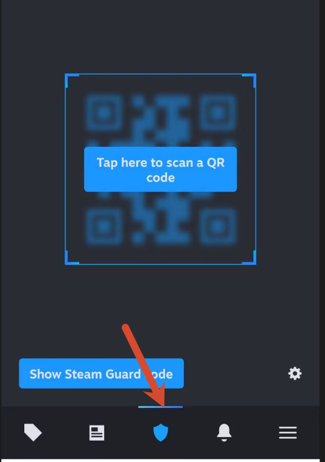
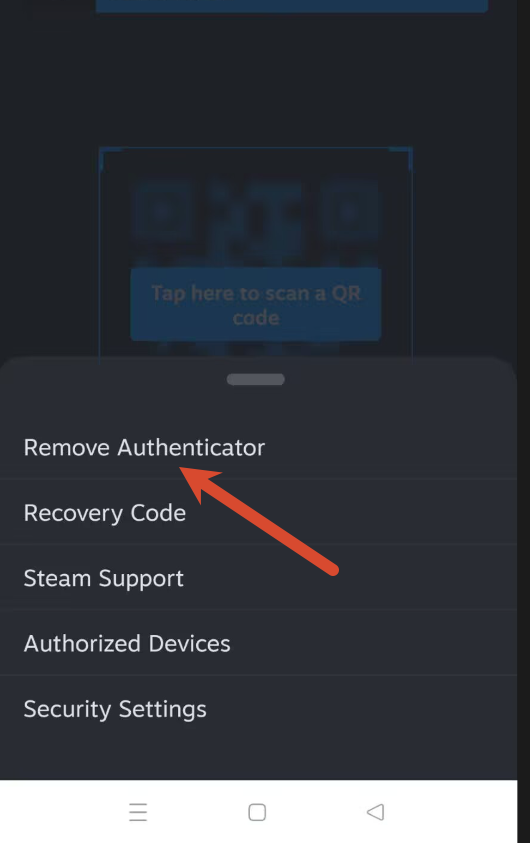
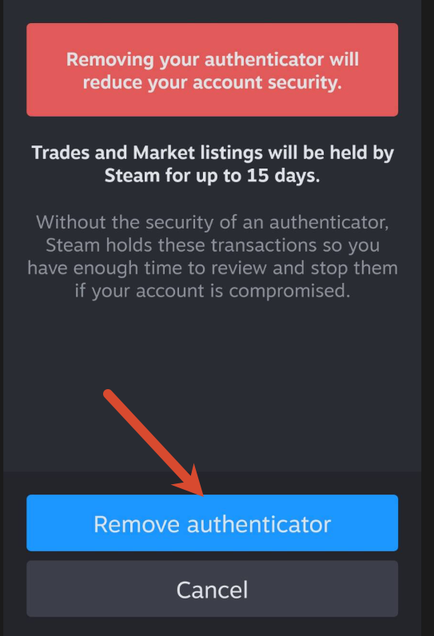

> 关闭手机令牌会降低账户保护强度，并可能影响交易、社区市场或其他账户功能。操作前请确认仍可访问绑定邮箱，并妥善保存恢复代码。

## 1. 打开手机令牌页面

打开 Steam 手机版 App，点击底部中间的令牌入口，进入 Steam Guard 手机令牌页面。

## 2. 选择移除令牌

在令牌页面中选择“移除令牌”，然后按页面提示完成确认。

## 3. 确认交易限制提示

确认前，Steam 会提示移除令牌后可能产生的限制。我的页面提示交易会在 15 天内受到影响；具体限制范围和时长应以账户当前显示的说明为准。

如果账户中有需要保护的库存、余额或交易权限，建议保留手机令牌。只有在确认不再需要该验证方式，并且能够承担相应限制时再继续移除。

确认移除后，操作即完成。建议重新登录或返回账户安全设置，确认 Steam Guard 状态符合预期。
