---
title: "论文阅读：DPUL - Dual-Phase Federated Deep Unlearning via Weight-Aware Rollback and Reconstruction"
description: "Zhou 等 - 2025 - DPUL: 基于权重感知回滚与重建的双阶段联邦深度遗忘 论文个人分析"
slug: "dpul-paper-reading"
date: 2026-03-21
categories:
  - "笔记"
tags:
  - 联邦遗忘学习
  - Federated Unlearning
  - Federated Learning
  - DPUL
  - 论文阅读
  - 深度学习
image:
math: true
draft: false
---

> **学术声明 / Academic Statement**
> 本文是个人学习笔记，仅用于学术交流和知识分享，非商业用途。
> 文中观点为作者个人理解和分析，不代表原论文作者立场。
> 如需引用原论文，请查阅官方出版版本。
> 版权归原论文作者所有。

## 1. 论文基本信息

- **标题**：Dual-Phase Federated Deep Unlearning via Weight-Aware Rollback and Reconstruction
- **作者**：Changjun Zhou, Jintao Zheng, Leyou Yang, Pengfei Wang
- **单位**：Zhejiang Normal University / Nanjing University of Information Science and Technology / Dalian University of Technology
- **发表会议**：IEEE INFOCOM 2026（已接收）
- **预印本**：[arXiv:2512.13381](https://arxiv.org/abs/2512.13381) [cs.LG], 2025
- **DOI**：[10.48550/arXiv.2512.13381](https://doi.org/10.48550/arXiv.2512.13381)
- **GitHub**：[https://github.com/00taotao/DPUL](https://github.com/00taotao/DPUL)

## 2. 背景与痛点

<a href="images/2026-03-21-22-51-07.png" target="_blank"> 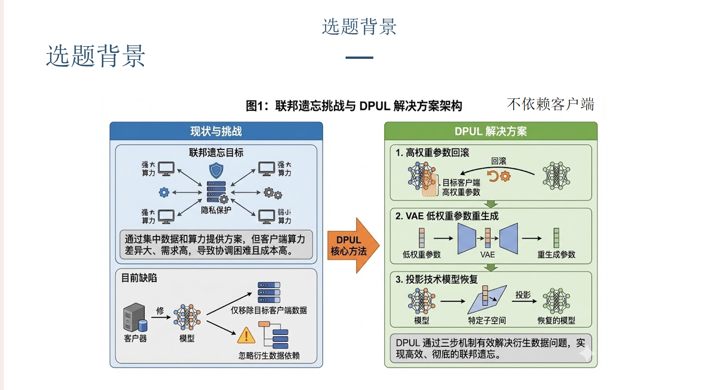 </a>

联邦遗忘旨在通过联合各个客户端的数据与算力来实现模型的隐私保护，然而在实际应用中，各客户端的算力差异较大，且整体计算开销较高，导致协作成本昂贵、协同过程复杂。目前，多数方法主要在服务端对模型进行参数修改，但往往仅能移除目标客户端的数据，未充分考虑那些依赖于目标客户端数据所引发的间接影响。

DPUL 针对上述问题提出了一种创新的方案：方法包括三个核心组件。首先，针对目标客户端高权重的重要参数采用权重回滚机制；其次，利用变分自编码器（VAE）对低权重参数进行再生成与修复；最后，通过投影技术进一步增强和恢复模型性能。这一双阶段机制兼顾了遗忘彻底性和模型的恢复效果。

<a href="images/2026-03-21-22-55-56.png" target="_blank"> 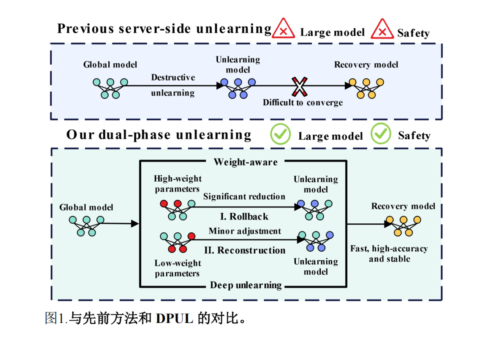 </a>

传统方法在处理遗忘时，往往采用破坏性的参数移除策略，不仅导致模型结构受损，遗忘效果难以保证，而且后续如知识蒸馏等技术也难以实现有效收敛，存在较大安全隐患。

DPUL 针对上述不足，实现了高效且安全的遗忘机制。其思路是对不同权重级别的参数采用有针对性的策略：对于影响较大的高权重参数，直接回滚以彻底消除其历史影响；对于低权重参数，则通过微调配合 VAE 网络重构，进一步抹除潜在的隐私痕迹。该方法兼容大规模模型，并且大幅提升了模型安全性和实用性。

## 3. 算法核心思路与详细设计

<a href="images/2026-03-21-22-58-58.png" target="_blank"> 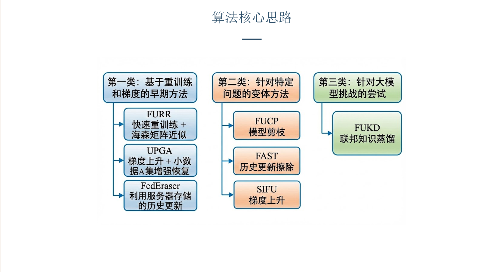 </a>

作者首先梳理了现有的主要方法，包括早期的重训练策略、针对特定场景的问题定制算法，以及面向大模型的联邦知识蒸馏方法。由于本研究的算法同样能够适配大模型，因此联邦知识蒸馏成为了对比分析中的核心参考对象。

DPUL 适配大模型的关键在于引入了 **LoRA（Low-Rank Adaptation）** 微调技术。其核心思想是：大模型在微调时，参数变化量虽然表面上是一个巨大的矩阵，但其内在维度极低——真正有意义的变化只集中在少数几个主方向上。因此，可以用两个小矩阵的乘积来近似这一变化量，训练时只修改两个小矩阵。

## 4. 核心方法详解

### 4.1 记忆回滚（Memory Rollback）

<a href="images/2026-03-21-23-08-16.png" target="_blank"> 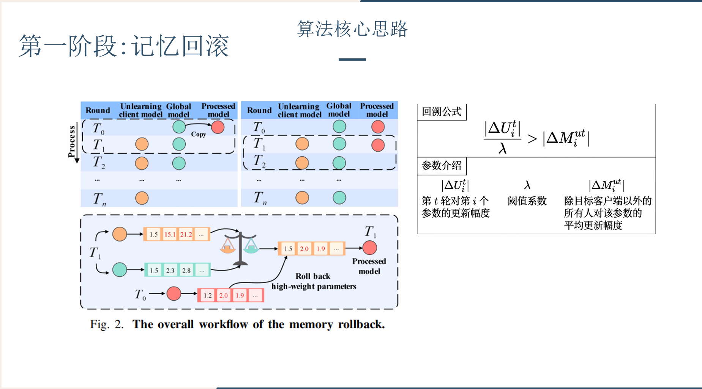 </a>

图中橙色表示待遗忘模型，绿色代表全局模型，红色则是对高权重参数进行了回溯处理后的预处理模型。具体流程为：算法从初始轮次开始，每轮递增，逐步对比当前轮次下待遗忘模型与全局模型的参数。当发现待遗忘模型中某些参数的变化幅度显著（视为高权重参数）时，系统会调用上一轮次的预处理模型，并用上一轮中对应的参数直接覆盖本轮的高权重参数，实现快速回滚。高权重参数的判定方式基于阈值设定：如图所示，公式左侧分子为客户端在第 t 轮第 i 个参数的变化幅度，分母 λ 为作者设定的阈值系数，右侧则是除目标客户端外其余客户端在该参数上的平均更新幅度。当目标客户端对某参数的更新幅度超过其他全部客户端平均更新幅度的 λ 倍时，即触发回溯机制。

### 4.2 重建遗忘（Reconstruction Unlearning）

<a href="images/2026-03-21-23-11-43.png" target="_blank"> 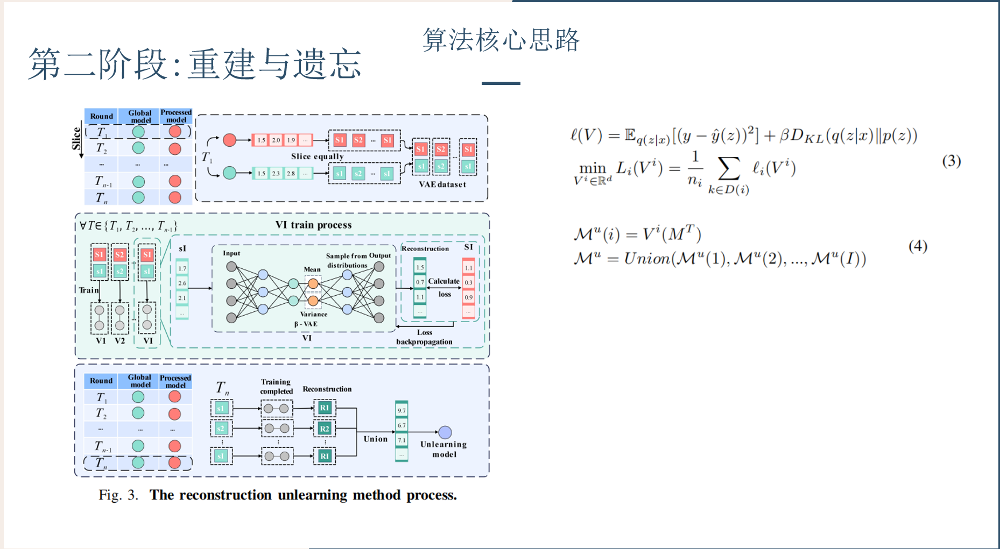 </a>

作者采用分治的方式，将模型参数均匀切片，分别对原始模型和预处理模型中的对应切片配对，作为 VAE 的输入样本。每一对切片独立训练一个 β-VAE，大大降低了大模型训练的计算与存储压力。在训练阶段，VAE 先将输入映射为均值和方差，通过重参数化采样生成新参数。随后，根据采样结果重建参数，并利用损失函数端到端地反向传播优化网络，从而让 VAE 学习如何将历史原始模型映射到历史预处理模型。具体而言，损失函数如图所示：左侧重构损失用于拉近当前模型重建参数与目标模型参数的相似度，右侧 KL 散度正则项则用于去除低权重参数中的噪声。最终，将训练好的所有切片 VAE 集合应用到当前模型，对各参数分片分别生成并拼接，形成最终满足遗忘要求的遗忘模型。

### 4.3 投影增强恢复（Projected Boost Recovery）

<a href="images/2026-03-21-23-07-22.png" target="_blank"> 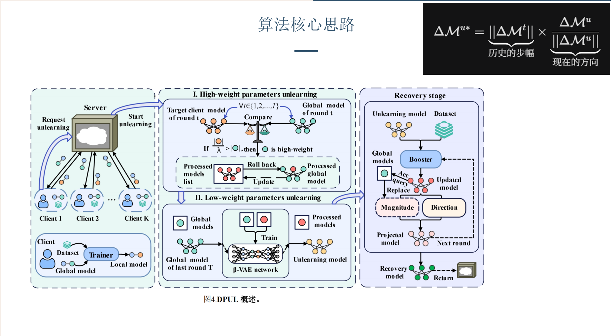 </a>

整体流程如下：当客户端发起遗忘请求后，服务器启动遗忘机制，首先检查历史全局模型，并与历史客户端模型进行对比，识别出受目标客户端影响显著的高权重参数，通过参数回滚方式生成预处理模型。随后，利用原始模型与上一步得到的原始预处理模型共同训练 VAE 网络，再以当前原始模型为输入，经过 VAE 重构后获得初步遗忘模型。接下来，通过一小部分用于模型校准的绿色辅助数据集，来确定优化方向，提升遗忘模型的性能。加速器组件则基于当前模型准确率，检索相应历史全局模型，借用其更新步长，并结合当前更新方向，计算出最终的参数更新向量，实现投影增强，生成投影模型。如此循环多个轮次，最终得到性能恢复后的遗忘模型作为最终结果。

## 5. 实验设计与结果

<a href="images/2026-03-21-23-29-40.png" target="_blank"> 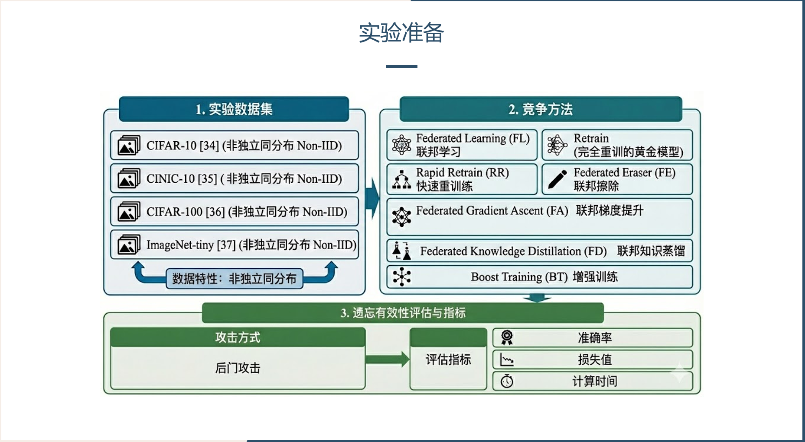 </a>

本实验选用了四个主流图像分类数据集：CIFAR-10、CINIC-10、CIFAR-100 和 ImageNet-Tiny，并均按照非独立同分布（Non-IID）方式进行划分。CIFAR-10 和 CIFAR-100 分别包含 10 类和 100 类常见物体的低分辨率彩色图片；CINIC-10 是对 CIFAR-10 的扩展，图片数量更多，数据更加复杂；ImageNet-Tiny 是从 ImageNet 精简获取的小型子集，分辨率更低但包含丰富类别。这些数据集能够更真实地模拟联邦学习环境下各客户端数据分布的多样性。

对比方法方面，实验涵盖了标准的联邦学习（FL）、重训练（Retrain）、快速重训练（Rapid Retrain, RR）、参数回滚（Federated Eraser, FE）、梯度上升（Projected Gradient Ascent, PGA）、联邦知识蒸馏（Federated Knowledge Distillation, FKD）和辅助提升（Boost Training, BT）等典型方法。

为了全面评估遗忘效果与安全性，攻击方式选用后门注入攻击。评测指标则包括模型的准确率、损失值和计算消耗时间。

<a href="images/2026-03-21-23-34-17.png" target="_blank"> 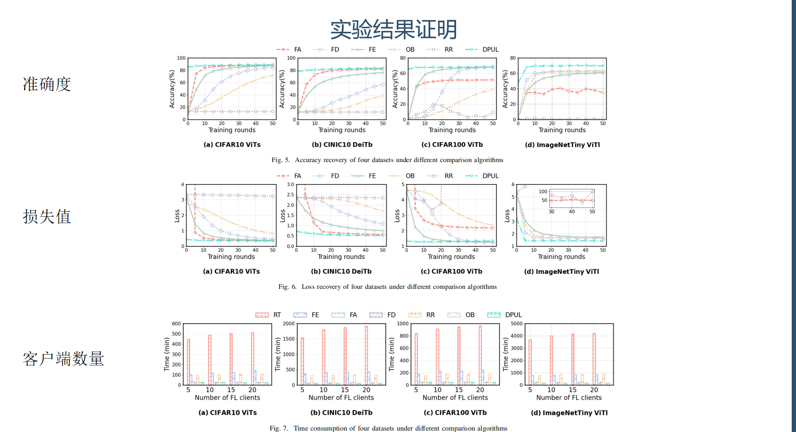 </a>

图 5 展示了不同算法的准确率恢复速度，可以看到我们的 DPUL 算法不仅稳定，而且准确率比其他算法都要高出 1%-5%

图 6 展示了损失值变化，DPUL 展示出最快的下降幅度，同时没有像 FA 和 RR 一样展现出意外上升的情况，彰显了 DPUL 方法卓越的稳定性

图 7 展示了不同算法随着客户端数量增加计算时长的变化，因为 DPUL 不依靠客户端，所以计算时长不随客户端数量增加而变化，确保了运行时间的稳定，训练速度比完全重训快 12 倍，比 FE 和 RR 快 4 倍

<a href="images/2026-03-21-23-38-42.png" target="_blank"> 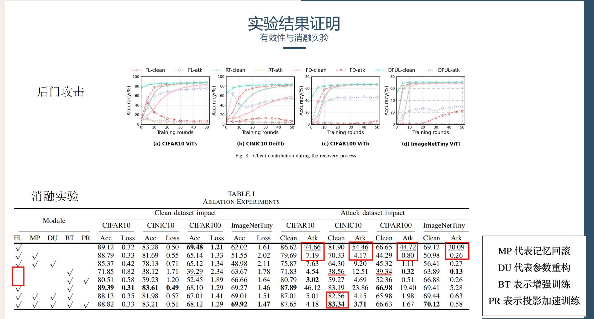 </a>

图 8 用后门攻击准确率展示模型对客户端数据的遗忘效果，可以看到 DPUL 的攻击数据准确率和重训模型相当，证明 DPUL 能有效清除客户端的贡献，同时与同样运行在服务器的联邦蒸馏来比，展现出卓越的稳定性，因为联邦蒸馏后面出现了反弹的迹象

表一展示了消融实验的结果。可以看到，仅仅进行记忆回滚，就能将后门攻击的识别概率有效压制到个位数，说明记忆回滚是实现有效遗忘的核心环节。VAE 部分进一步作用于低权重参数，虽然会带来轻微的准确率下降，但这种损失是为了确保彻底遗忘而付出的合理代价。实验中还对比了未使用受污染模型、仅通过额外训练和投影增强进行恢复的方式，虽然这种情况下后门识别率同样很低，但这是因为模型根本未暴露于后门数据，导致模型准确率大幅下跌，缺乏实际可用性，说明单纯追求遗忘而忽视能力恢复并不可取。此外，若在受污染模型上直接进行增强训练，遗忘效果显著变差，再次印证记忆回滚的重要性。最后，随着各个核心组件的逐步引入，模型各项指标持续提升，验证了算法各部分的实际价值与协同作用。

<a href="images/2026-03-21-23-44-39.png" target="_blank"> 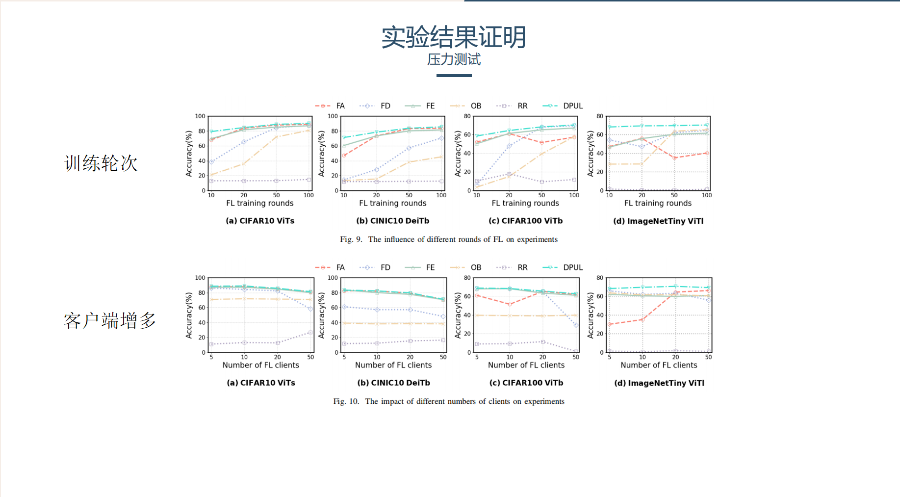 </a>

图 9 随着训练轮次变化模型的准确率，可以看到在低训练轮次，DPUL 拥有碾压的效果，即使训练波次上涨，其他算法的准确率也上涨，但是 DPUL 依旧处于第一

图 10 展示随着客户端增多准确率的变化，因为随着客户端增多，数据量增加，模型难以学到统一特征导致算法性能均有下降，但是在其中 DPUL 还是尽量保持稳定，而联邦蒸馏则出现断崖式下跌

<a href="images/2026-03-21-23-46-20.png" target="_blank"> 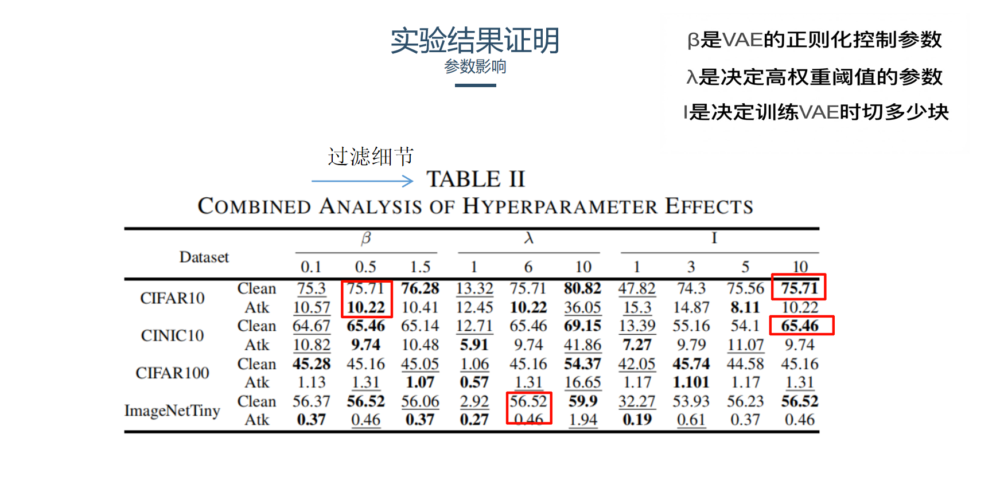 </a>

参数对实验性能的影响，β是 VAE 的正则化控制参数，越小越不能过滤隐私细节，越大越容易损失结构，λ是决定高权重阈值的参数，I 是决定训练 VAE 时切多少块

## 6. 参考文献

**原文引用格式（arXiv）：**

```
C. Zhou, J. Zheng, L. Yang, and P. Wang,
"Dual-Phase Federated Deep Unlearning via Weight-Aware Rollback and Reconstruction,"
arXiv preprint arXiv:2512.13381, 2025.
```

**相关链接：**

- 论文预印本：<https://arxiv.org/abs/2512.13381>
- 代码仓库：<https://github.com/00taotao/DPUL>
