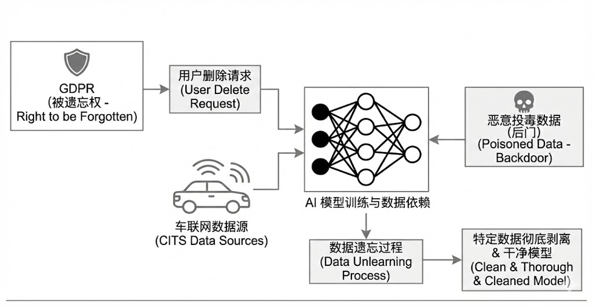
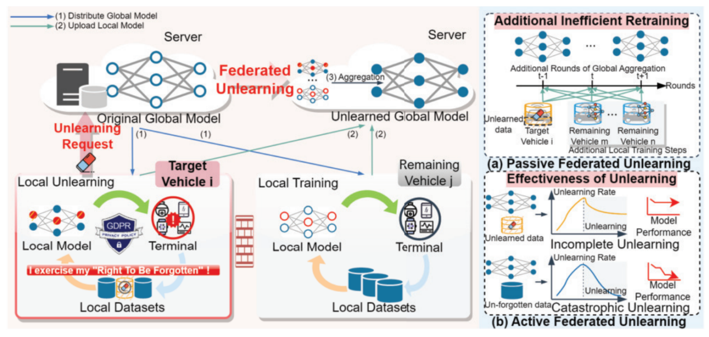

> **学术声明 / Academic Statement**  
> 本文是个人学习笔记，仅用于学术交流和知识分享，非商业用途。  
> 文中观点为作者个人理解和分析，不代表原论文作者立场。  
> 如需引用原论文，请查阅官方出版版本。  
> 版权归原论文作者和 IEEE 所有。

---

## 一、论文基本信息

- **标题**：FedEditor: Efficient and Effective Federated Unlearning in Cooperative Intelligent Transportation Systems
- **作者**：Xiaohan Yuan, Jiqiang Liu, Bin Wang, Guorong Chen, Xiangrui Xu, Junyong Wang, Tao Li, Wei Wang
- **单位**：Beijing Jiaotong University, Haihe Lab of ITAI
- **发表期刊**：IEEE Transactions on Information Forensics and Security, Vol. 20, 2025
- **页码**：6560-6575
- **DOI**：[10.1109/TIFS.2025.3583231](https://doi.org/10.1109/TIFS.2025.3583231)
- **GitHub**：[https://github.com/XXiaoY/Fededitor](https://github.com/XXiaoY/Fededitor)

---

## 二、背景与痛点

<a href="images/2026-02-13-19-14-20.png" target="_blank">  </a>

在车联网时代，AI 模型极其依赖海量数据的训练。但随之而来的是严峻的隐私挑战。
随着 GDPR 等法规的出台，‘被遗忘权’成了硬性指标。无论是用户要求删除隐私数据，还是我们发现某批数据被恶意投毒，系统都必须具备一种能力：从训练好的模型中，干净彻底地剥离掉特定数据的影响。

<a href="images/2026-02-15-10-28-39.png" target="_blank">  </a>

左边展示了联邦忘却学习在车联网中的标准流程，目标车辆在发起遗忘请求后，服务器将全局模型分发给所有客户端，目标车辆在对模型进行修改，剩余车辆则继续进行本地训练，最后所有车辆把修改后的模型传回服务器，服务器对所有客户端的模型进行聚合后得到遗忘后的全局模型。

虽然流程已经定型，但是细节上却出现了各种问题，首先对于被动遗忘算法来说，他需要服务器带着所有客户端回退模型版本同时依靠剩余数据进行多轮重训，虽然他确实能达到较好的遗忘效果以及保持剩余数据预测的精确度，到那时他需要所有客户端在线且耗时间很长，这对于车联网的应用场景是不可接受的，首先路况瞬息万变，长时间的训练会导致客户端无法及时获取最新的数据，不能及时应对变化的路况，其次车辆与服务器间的带宽无法支撑如此大规模的数据传输，最后，服务器无法确保能联系到所有车辆，如果车辆开上高速或开进山村，这都会导致服务器和车辆失联，所以被动联邦遗忘学习无法适用协作智能交通系统的场景.
而主动联邦遗忘算法，因为缺乏明确的优化目标，只能笼统的进行优化，这就可能会导致模型为达到遗忘的目标大幅修改参数，最终导致数据遗忘不彻底，或者是剩余数据灾难性遗忘的结果。为此有人提出对参数的修改范围进行界定，通过预设阈值的方法尝试使遗忘模型和原始模型对剩余数据的表现一致，但是由于没有先验只是，没人人清楚删除待遗忘数据后的模型参数长什么样，所以这个阈值难以设定。

为此，我们提出了 FedEditor 算法，首先在定位上他是一个高效的主动遗忘算法，与被动重训不同，它允许车辆在本地主动进行修改，其次在方法上 FedEditor 创新性的提出了表征层面的局部遗忘策略
他包含两个核心部件，一个是目标导向遗忘，他通过引入错误质心来作为目标，解决了我们刚才提到的缺乏目标的问题
另一个是模型性能修复，他利用剩余数据和正则化约束保护模型想关键知识，防止灾难性遗忘
接下来我们将详细讲解算法细节

---

## 三、方法概述

---

## 四、核心方法详解

---

## 五、实验设计与结果

---

## 六、总结与思考

---

## 参考文献

**原文引用格式（IEEE 格式）：**

```
X. Yuan, J. Liu, B. Wang, G. Chen, X. Xu, J. Wang, T. Li, and W. Wang,
"FedEditor: Efficient and Effective Federated Unlearning in Cooperative
Intelligent Transportation Systems," IEEE Transactions on Information
Forensics and Security, vol. 20, pp. 6560-6575, 2025.
DOI: 10.1109/TIFS.2025.3583231
```

**相关链接：**

- 论文 DOI: <https://doi.org/10.1109/TIFS.2025.3583231>
- 代码仓库：<https://github.com/XXiaoY/Fededitor>

---
