这篇文章以 LM Studio 为例，记录如何在 Windows 上下载并运行第一个本地大语言模型。完成后，你可以直接在本机与模型对话；后续文章会在此基础上继续介绍 API 服务和更多使用方式。

## 一、开始前的准备

先确认电脑的内存、显存和磁盘空间。LM Studio 官方建议 Windows 设备至少具备 16GB 内存和 4GB 独立显存。显存越充足，可运行的模型越大，能够设置的上下文也越长。

磁盘建议至少预留 20GB。单个 4B 量化模型通常不需要这么多空间，但实际使用时很容易继续下载不同规模或不同量化版本的模型，例如：

- Qwen3.5-4B、Qwen3.5-9B 等不同参数规模的模型；
- 同一模型的不同量化版本；
- 微调后导出的模型文件。

模型文件建议存放在空间充足的 SSD 上，例如 D 盘。这样既能避免系统盘很快被占满，也能缩短模型加载时间。

## 二、下载安装 LM Studio

前往 [LM Studio 官方下载页面](https://lmstudio.ai/download)，选择 Windows 版本：

<a href="images/2026-07-31-01-12-10.png" target="_blank">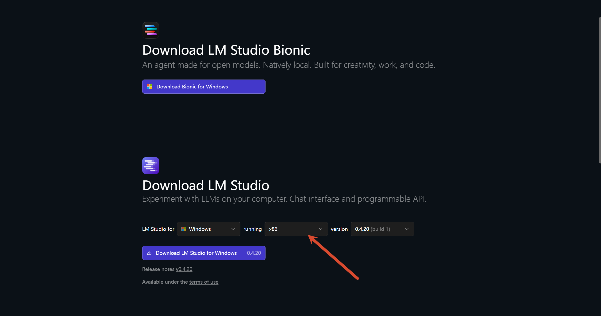</a>

下载完成后运行安装程序，通常按默认选项安装即可。LM Studio 支持 Windows x64；处理器需要支持 AVX2，近年的 Intel 与 AMD 桌面处理器一般都满足这一要求。

安装时若选择“为所有用户安装”后安装程序异常退出，可以改为“仅为我安装”。安装完成后启动 LM Studio。首次启动时如果提示下载模型，可以先跳过，稍后在应用内选择模型更方便。

建议在初始设置中开启以下两项：

1. `Turn on Developer Mode`：开启开发者模式，为后续调用本地服务做准备。
2. `Start local LLM service on login`：登录 Windows 后在后台自动启动 LM Studio 的本地模型服务。

<a href="images/2026-07-31-01-23-15.png" target="_blank">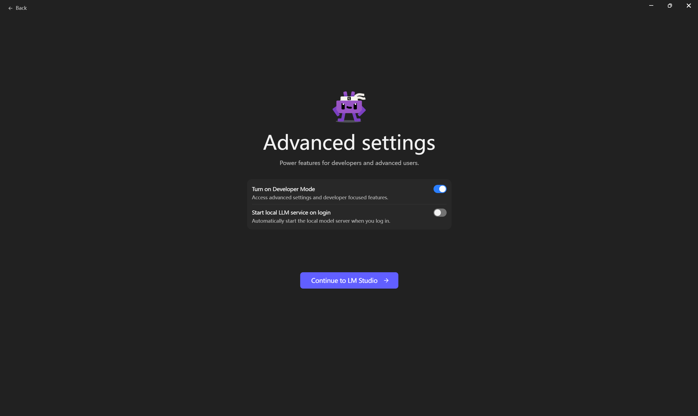</a>

### 切换为简体中文

LM Studio 已提供简体中文界面。点击左下角的 **Settings**：

<a href="images/2026-07-31-01-24-11.png" target="_blank">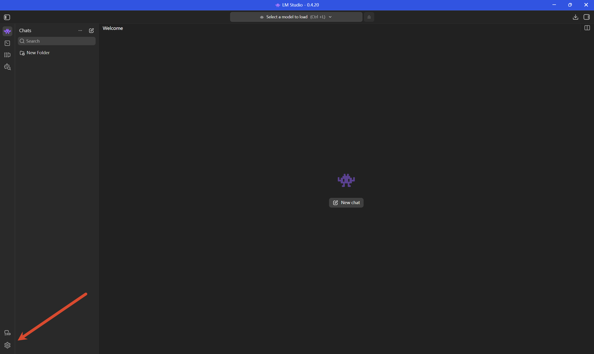</a>

在 **General** 中将语言改为“简体中文”：

<a href="images/2026-07-31-01-28-11.png" target="_blank">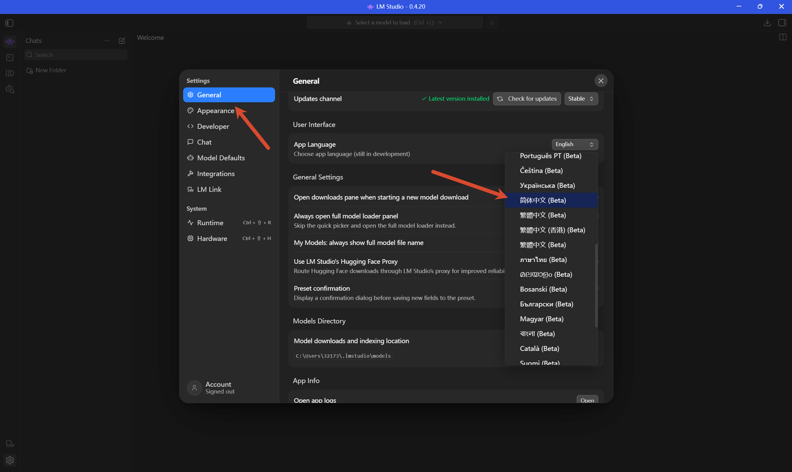</a>

部分界面暂未完成汉化，属于正常情况，并非设置没有生效。

## 三、下载第一个模型

点击右侧的模型下载入口：

<a href="images/2026-07-31-01-30-41.png" target="_blank">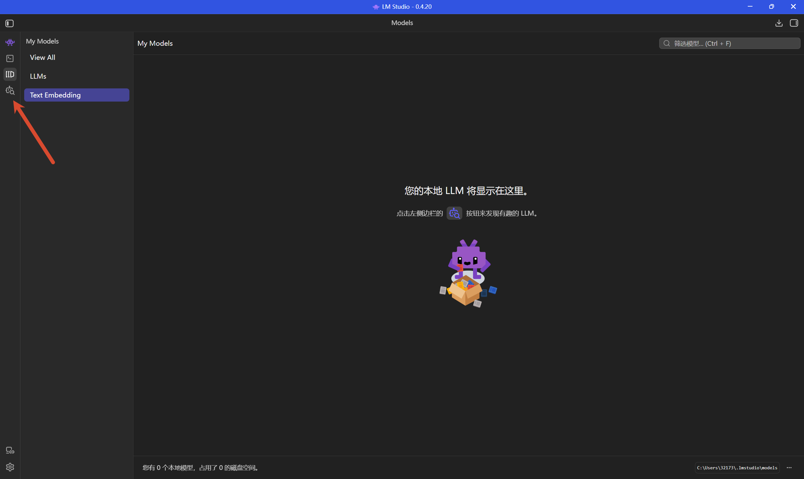</a>

以 8GB 显存的 RTX 5070 Laptop GPU 为例，推荐先下载 `qwen/qwen3.5-4b` 的 **GGUF / Q4_K_M** 版本。该量化文件约为 3.75GB，支持中文、图片输入和推理模式；对于 8GB 显存来说，它能为上下文缓存和桌面显示预留一定空间，适合作为首次部署的起点。

在搜索框输入模型名称，选择列表中推荐的第一个量化文件并点击下载：

<a href="images/2026-07-31-01-33-42.png" target="_blank">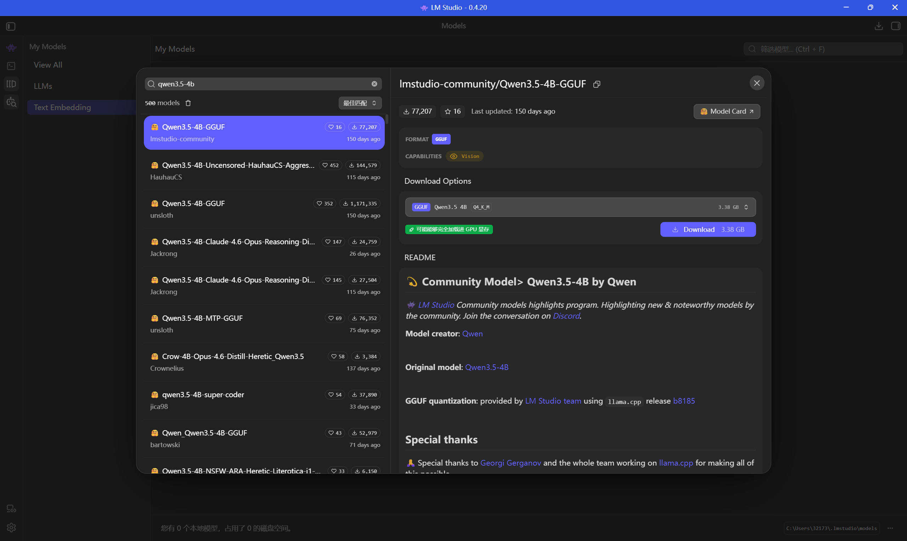</a>

如果磁盘空间和下载时间允许，也可以同时下载其他模型进行比较，例如 9B 模型或不同微调版本。模型越大，对显存、内存和加载参数的要求也越高；建议先确认 4B 模型可以稳定运行，再尝试更大的模型。

<a href="images/2026-08-01-00-53-54.png" target="_blank">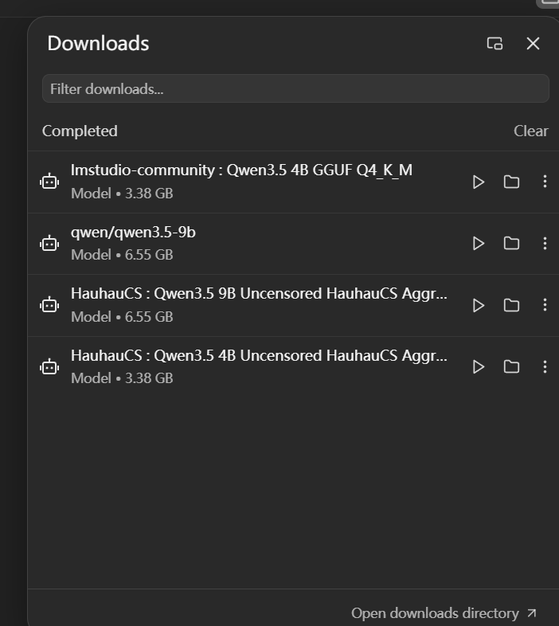</a>

右上角的下载列表会显示下载进度、速度和剩余时间：

<a href="images/2026-07-31-01-55-18.png" target="_blank">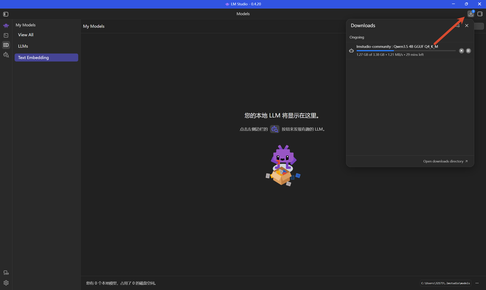</a>

## 四、确认硬件设置

打开 **Settings -> Hardware**：

<a href="images/2026-08-01-00-47-41.png" target="_blank">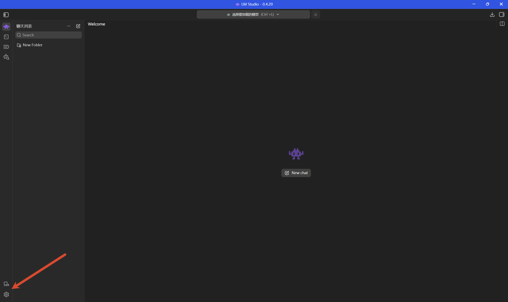</a>

确认 LM Studio 已识别到显卡，并开启图中标出的三项：

- 启用 NVIDIA GPU：允许 LM Studio 使用 CUDA 在显卡上推理；
- 限制模型卸载使用的 GPU 内存：让 LM Studio 按可用显存与内存评估模型加载，降低资源不足时卡死或加载失败的概率；
- 将 KV 缓存卸载到 GPU 内存：把上下文缓存尽量放到显存中，通常能提升生成速度。

<a href="images/2026-08-01-00-48-14.png" target="_blank">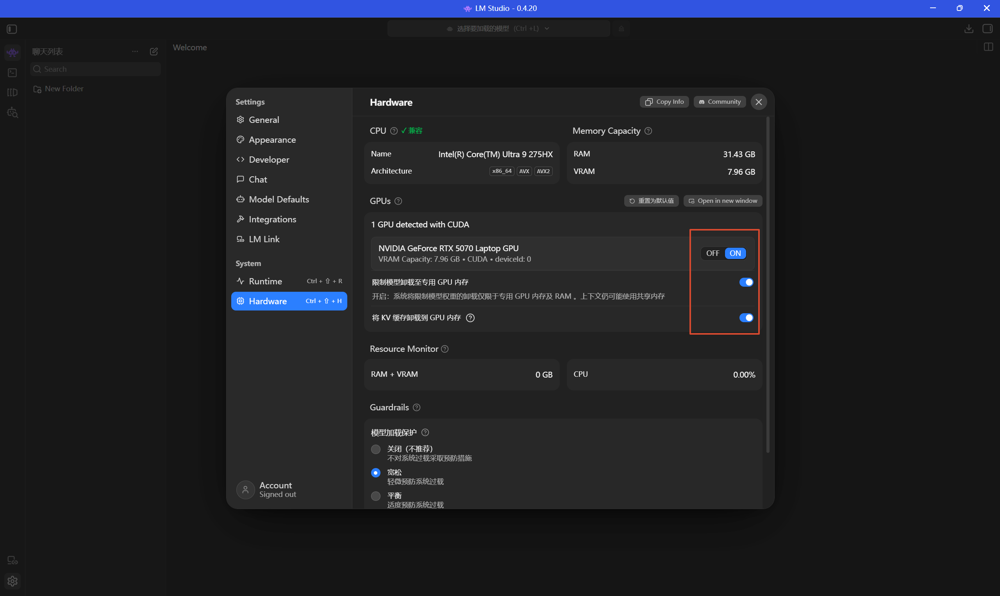</a>

如果没有识别到 CUDA 显卡，请先检查 NVIDIA 驱动是否正常安装。此时仍可使用 CPU 运行模型，但速度会慢很多。

## 五、加载模型并完成首次对话

点击顶部的模型选择器，选择刚刚下载的模型：

<a href="images/2026-08-01-00-55-15.png" target="_blank">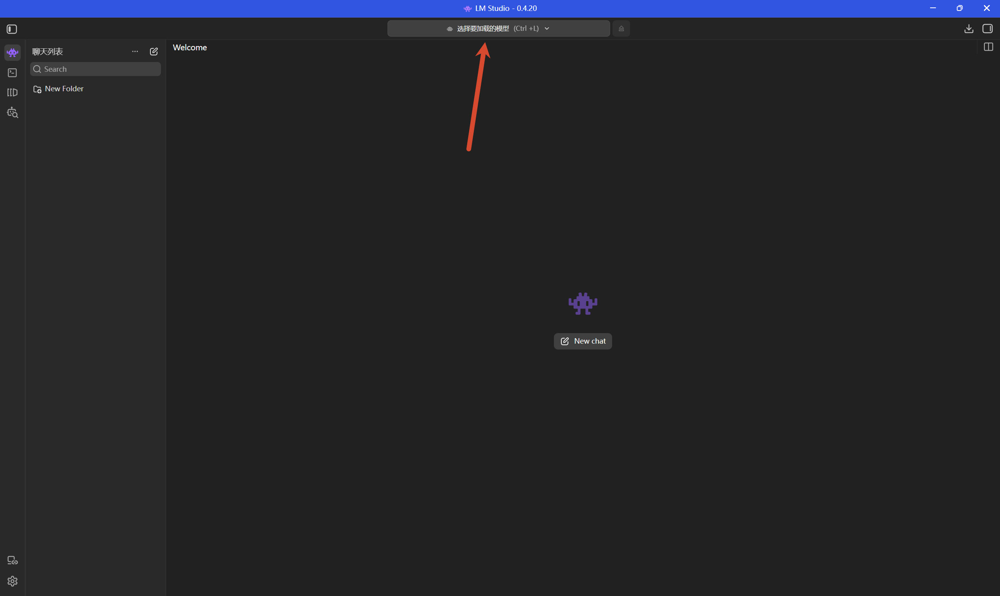</a>

首次加载建议勾选手动设置模型参数，先使用最基础的预设确认模型是否可以正常运行：

<a href="images/2026-08-01-00-57-01.png" target="_blank">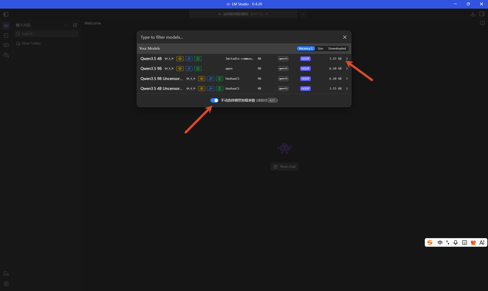</a>

对于前面的 Qwen3.5-4B 示例，可使用以下设置：

- **上下文长度**：保持 `8192`；
- **GPU 卸载**：保持 `32`。滑到最右侧表示尽可能将模型层放入显卡；
- **预计显存占用**：约 `3.73GB`，可作为是否适配当前设备的参考；
- **Remember settings for qwen3.5-4b**：勾选后，下次加载该模型无需重复设置；
- **Show advanced settings**：首次验证运行时不必开启。

设置完成后点击加载模型：

<a href="images/2026-08-01-01-00-34.png" target="_blank">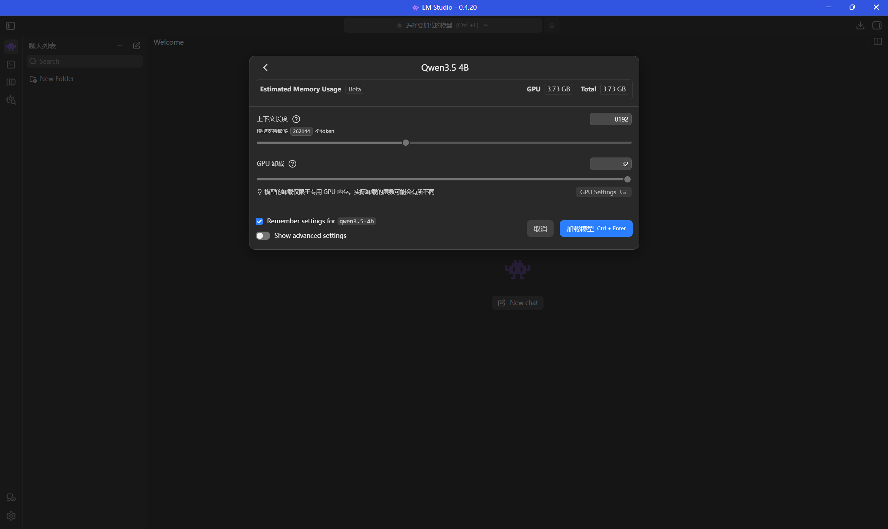</a>

如果顶部模型选择器没有切换成功，点击图中的按钮重新选择一次：

<a href="images/2026-08-01-01-01-55.png" target="_blank">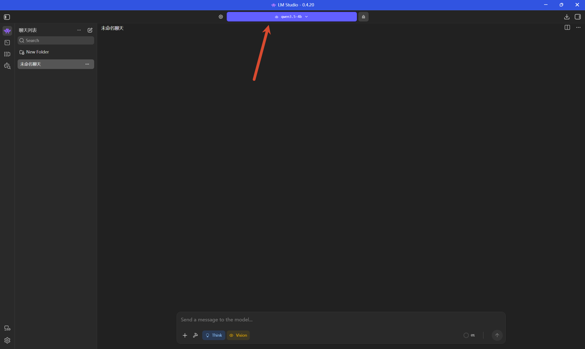</a>

随后输入一条简单的测试消息，例如：

> 请用中文介绍你自己，并说明你能完成哪些任务。

能够正常生成中文回复，就说明本地模型已经成功运行。

<a href="images/2026-08-01-01-03-11.png" target="_blank">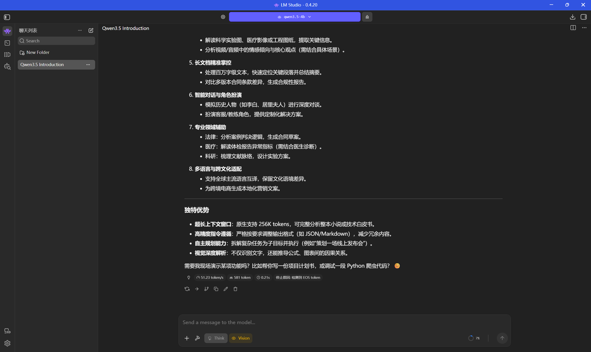</a>

## 六、8GB 显存尝试 9B 模型

8GB 显存运行 9B 模型属于较紧张的配置。若加载失败、显存不足或生成不稳定，可以在加载页面适当降低参数：

- **上下文长度**：`8192` 调整为 `4096`；
- 在高级设置中，将 **Max Concurrent Predictions** 从 `4` 改为 `1`。个人对话通常只需要同时生成一个回复；
- 将 **评估批处理大小** 从 `2048` 降至 `512`。稳定后可以再尝试提升到 `1024`；
- 将 **Physical Batch Size** 从 `512` 降至 `256`。

这些调整会牺牲一部分吞吐量，换取更低的峰值显存占用和更好的稳定性。不同模型、量化版本和后台程序的资源占用并不相同，应以 LM Studio 显示的预计显存占用与实际运行情况为准。

<a href="images/2026-08-01-01-10-35.png" target="_blank">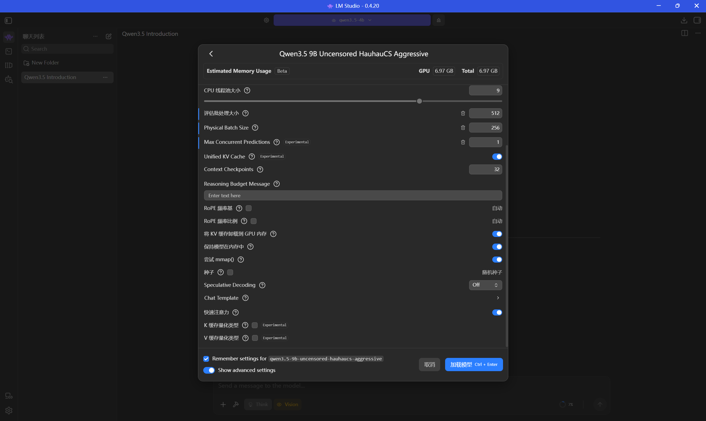</a>

至此，Windows 上的本地模型运行环境已经准备完成。下一步可以继续配置本地 API 服务，让其他工具也能调用这个模型。
