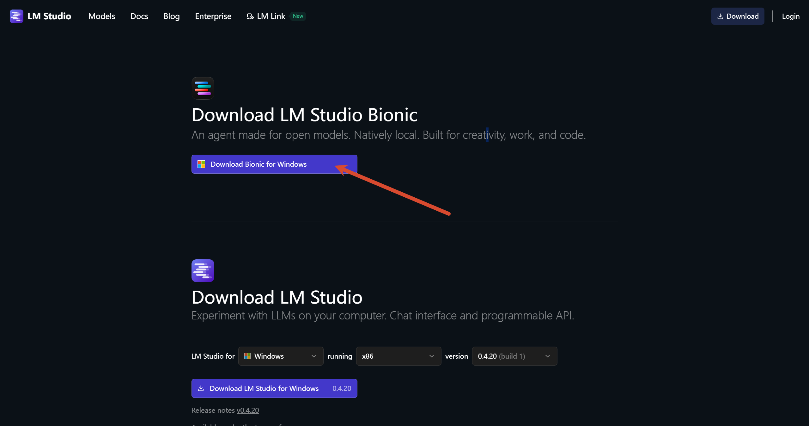
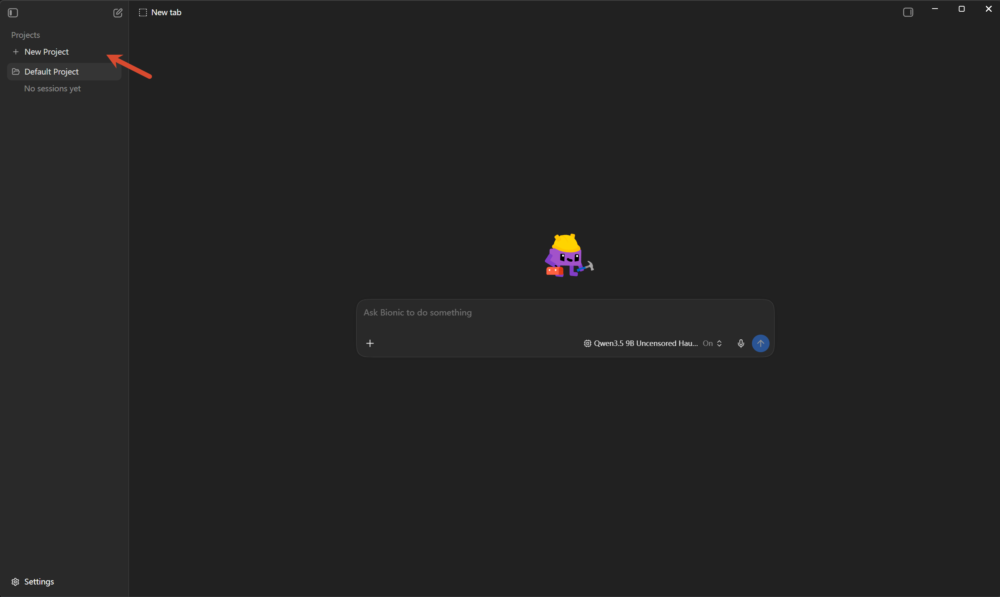
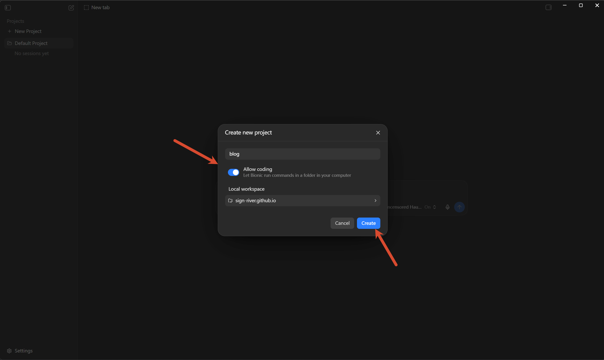
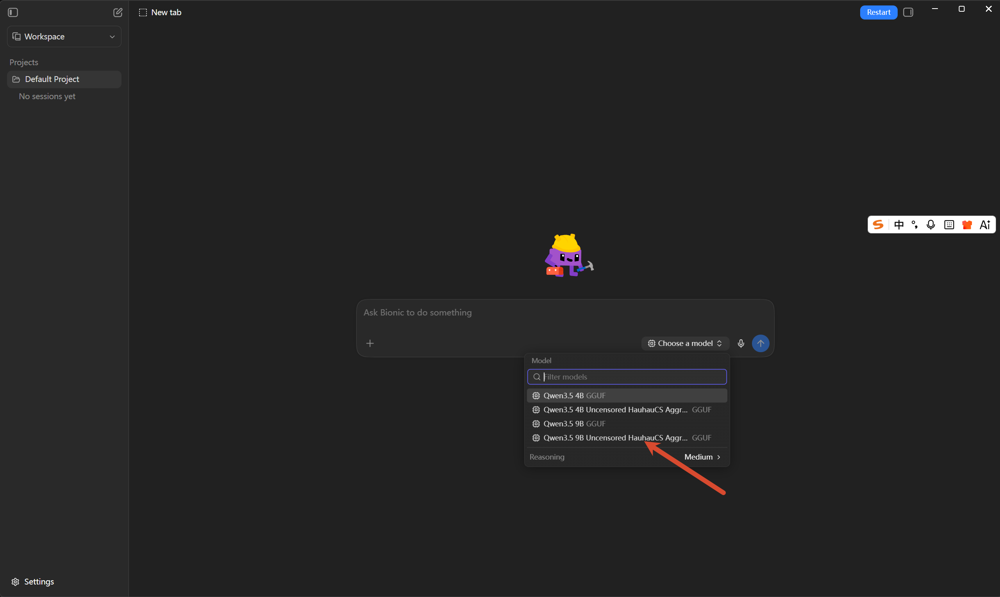
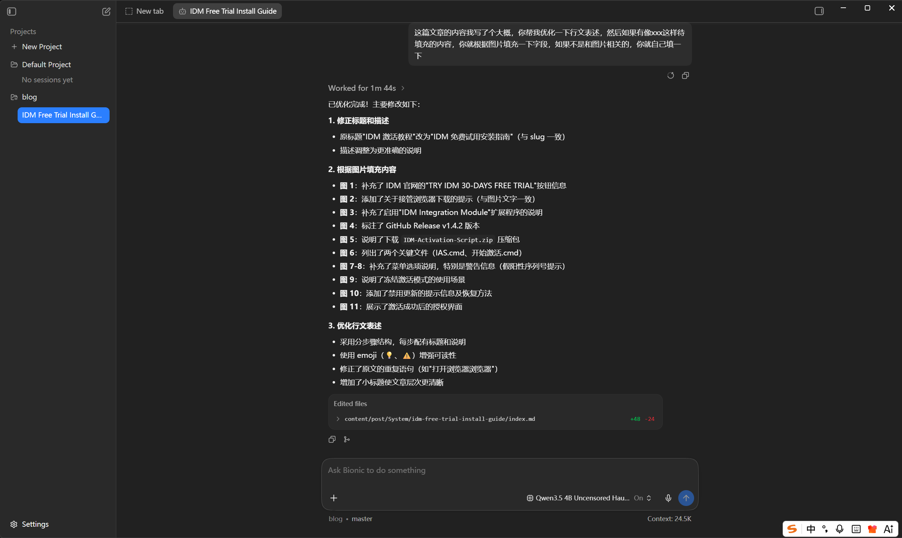

上一篇已经完成了 LM Studio 和本地模型的部署。本文继续使用同一批本地模型，借助 Bionic 读取项目上下文、执行修改，并检查改动是否符合预期。

## 一、为什么要使用 Bionic

在 LM Studio 中，本地模型可以回答问题、解释代码和生成代码片段；不过，聊天内容默认不会直接作用于电脑中的项目文件。

Bionic 为本地模型提供了项目工作区。将项目目录加入工作区并授予相应权限后，模型便能结合项目上下文分析问题、修改文件，必要时还可以运行命令辅助完成任务。

这类能力也意味着更高的操作风险。建议先在可回退的小项目中练习，或为现有项目创建独立分支；不要直接让模型修改唯一的生产副本。

## 二、下载并安装 Bionic

打开 [LM Studio 下载页面](https://lmstudio.ai/download)，在 **Download LM Studio Bionic** 区域选择适用于当前系统的安装包。

下载完成后运行安装程序，按提示完成安装即可。Bionic 与 LM Studio 会竞争本机的模型和 GPU 资源，因此开始使用 Bionic 前，建议先退出 LM Studio。

## 三、创建项目工作区

启动 Bionic 后，点击左侧的 **New Project**，为项目填写名称并选择本地工作区目录。

如需让 Bionic 修改文件或运行项目命令，开启 **Allow coding**，然后点击 **Create** 创建项目。此权限允许工具在所选目录中执行命令，只应对自己信任、且已备份或受版本控制保护的目录开启。

## 四、选择本地模型并提出任务

进入新建的项目后，在输入框右下角打开模型选择器，选择上一篇已下载的本地模型。首次尝试建议优先使用能够稳定运行的较小模型；确认流程无误后，再根据显存和任务复杂度切换到更大的模型。

接着用清晰、可验证的方式描述任务。除了说明要实现什么，还应限定修改范围，并写明完成条件。例如：

> 请阅读这篇文章，优化语言表达和标题层级。保留原有技术结论与图片，不修改文章以外的文件；完成后列出修改摘要，并检查 Markdown 链接和图片路径是否正确。

任务范围越明确，模型越不容易进行无关改动。对于复杂任务，也可以先让它分析并给出修改计划，确认方向后再要求执行。

## 五、检查改动并完成验证

任务执行完成后，Bionic 会列出修改过的文件及其增删行数。先阅读修改摘要，再逐个检查实际变更，重点确认模型是否只改动了预期文件，且没有删除必要内容。

最后仍需由人工完成验证：文本或配置类项目可检查格式、链接和构建结果；代码项目则应运行测试、构建或启动流程。只有在验证通过后，再提交版本控制记录。

至此，本地模型已经不再局限于聊天窗口，而是可以在受控的项目工作区中协助完成实际修改。下一步可以继续练习如何拆分任务、审查模型改动，并将本地模型纳入日常开发流程。
