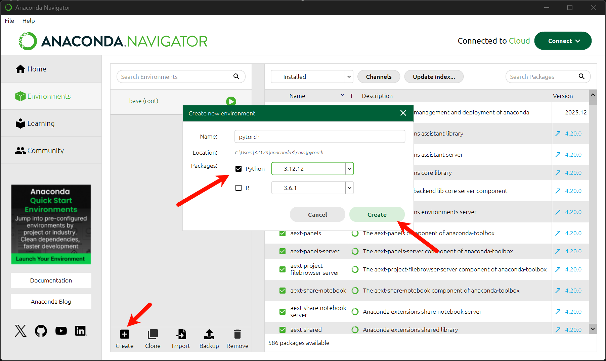
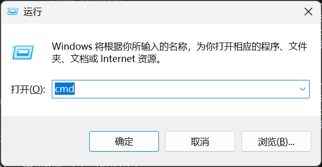
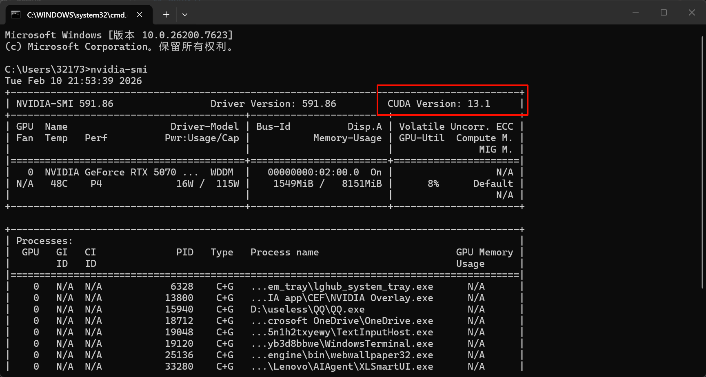
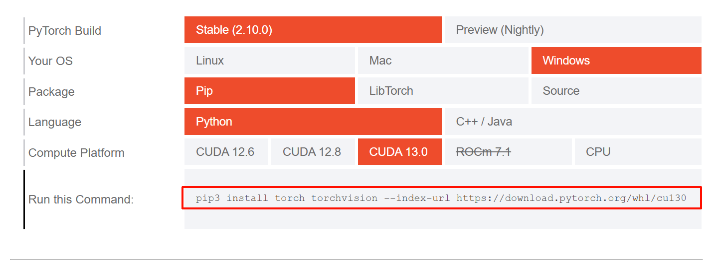
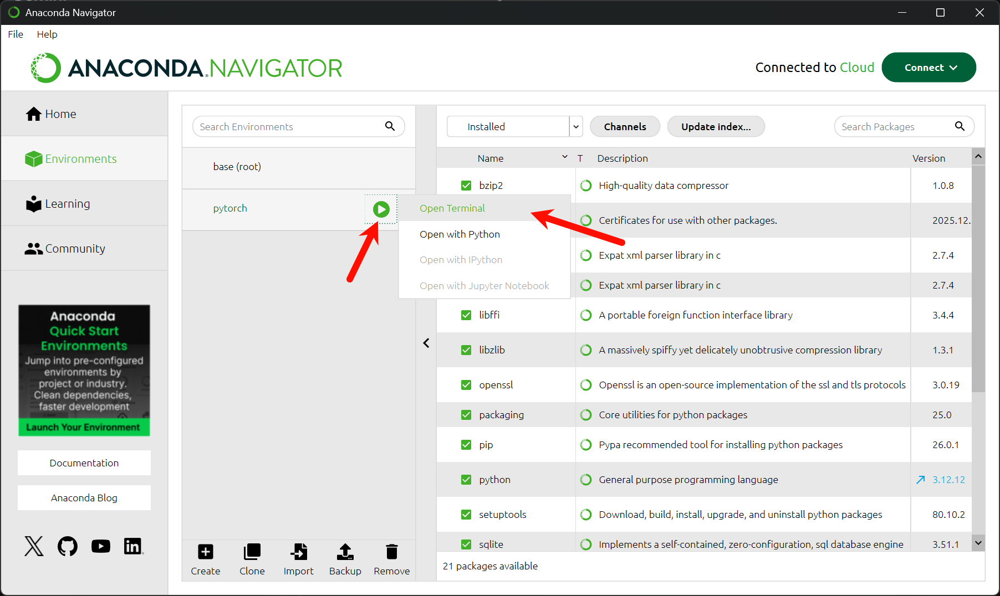
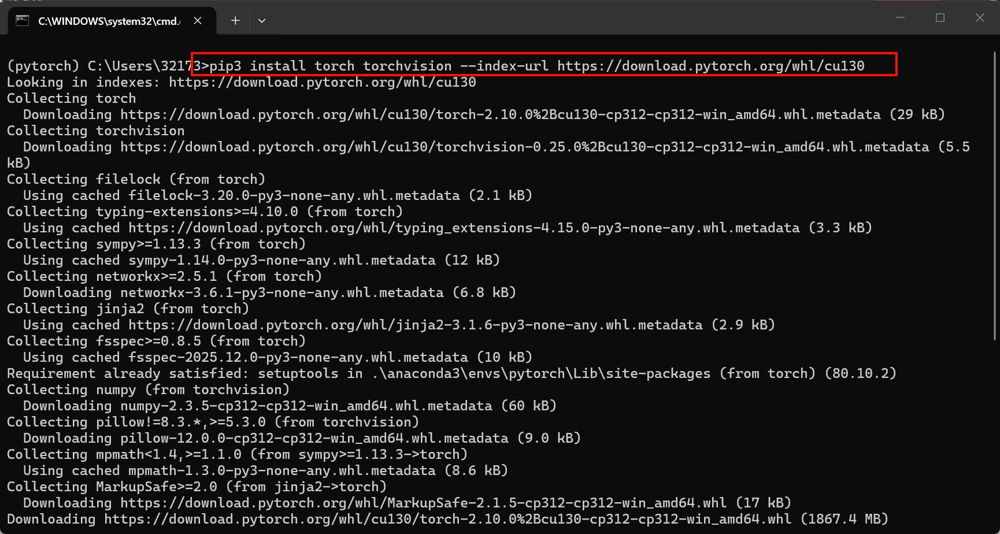
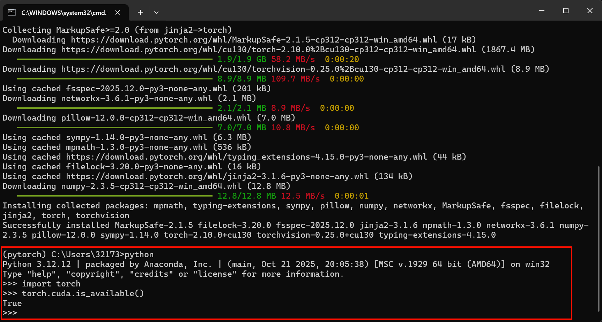

## 前言

开始学习 PyTorch，记录基础知识和学习心得。

## PyTorch 简介

PyTorch 是一个基于 Python 的科学计算包，主要用于：

- 替代 NumPy，利用 GPU 加速
- 提供灵活的深度学习研究平台

## 环境配置

### 配置 Anaconda

在开始 PyTorch 学习前，使用 Anaconda 进行环境隔离是最佳选项，避免不同项目的依赖冲突。

操作步骤：

点击底部的 Create 按钮。

Name (名称)：设置为 pytorch（清晰明了，便于识别）。

Packages (版本选择)：勾选 Python，并选择 3.12 版本。

<a href="images/2026-02-10-21-30-21.png" target="_blank">  </a>

💡 版本选择思路 (2026 Q1)：推荐选择 Python 3.12。相比于旧版本，它拥有更好的性能；相比于最新的 3.13+ 版本，它在 PyTorch 生态圈（包括 NumPy, Pandas 等依赖库）中的兼容性最为成熟稳定。

### 安装 PyTorch

1. 确认显卡驱动与 CUDA 版本

在安装 GPU 版本的 PyTorch 前，必须确认显卡驱动支持的最高 CUDA 版本。

操作：Win + R 打开运行 -> 输入 cmd -> 输入指令 nvidia-smi。

关键信息：查看右上角的 CUDA Version（例如：13.1）。

⚠️ 重要原则：官网下载时选择的 CUDA 版本（Runtime）必须 <= 电脑显示的 CUDA 版本（Driver）。

win+r，输入 cmd 回车打开终端，在终端输入 nvidia-smi 回车，第一行最右边就是适合你选择的 CUDA 版本

<a href="images/2026-02-10-21-53-17.png" target="_blank">  </a>

<a href="images/2026-02-10-21-53-50.png" target="_blank">  </a>

2. 获取安装指令

前往 [PyTorch 官网](https://pytorch.org/get-started/locally/)，根据机器配置选择：

PyTorch Build: Stable

Your OS: Windows

Package: Pip

Language: Python

Compute Platform: CUDA 13.0 (根据上一步确认的版本选择，这里选 13.0 是安全的，因为 13.0 < 13.1)

<a href="images/2026-02-10-21-55-27.png" target="_blank">  </a>

3. 执行安装

打开 Anaconda Navigator，找到 pytorch 环境。

点击播放键 ▶️ -> 选择 Open Terminal（这一步确保了命令是在虚拟环境中运行）。

<a href="images/2026-02-10-22-00-24.png" target="_blank">  </a>

粘贴并运行官网生成的指令：

(注：下载文件较大，约 2GB+，请耐心等待)

<a href="images/2026-02-10-22-02-31.png" target="_blank">  </a>

4. 验证安装 (Verification)

安装完成后，必须验证 PyTorch 能否正确调用 GPU。在当前终端输入 python 进入交互模式：

```
import torch
# 检查 CUDA 是否可用，返回 True 即为成功
torch.cuda.is_available()
```

<br/>
<a href="images/2026-02-10-22-08-48.png" target="_blank">  </a>

## 总结

## 参考资料

- [PyTorch 官方文档](https://pytorch.org/docs/stable/index.html)
- [PyTorch 官方教程](https://pytorch.org/tutorials/)
