## 1. 前置准备

本工具基于 Python 运行，建议使用 Anaconda 管理 Python 环境。如果尚未安装，可以参考：[Anaconda 安装教程](/p/anaconda-install-guide/)

## 2. 安装 LaTeX-OCR

按 `Win` 键搜索 **Anaconda Prompt**，打开它。

<a href="images/2026-03-21-19-17-13.png" target="_blank"> 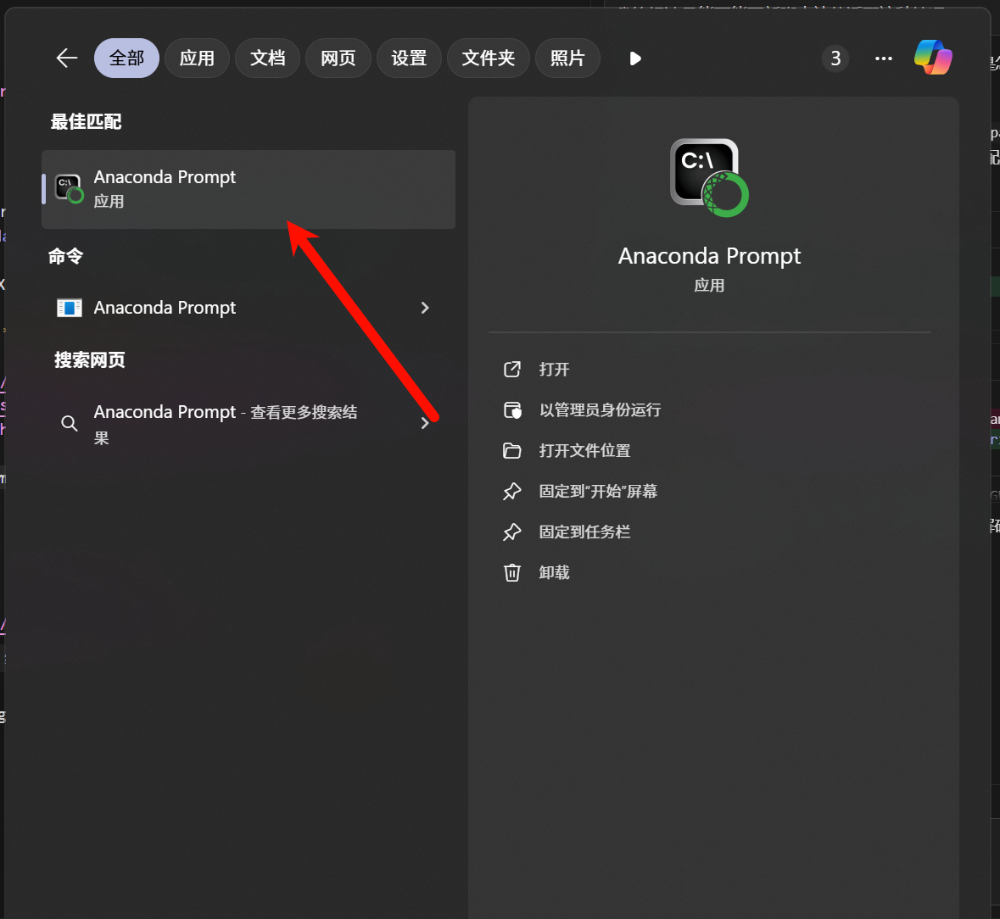 </a>

在 Anaconda Prompt 中依次输入以下命令，创建并激活一个独立的虚拟环境：

```bash
conda create -n latexocr python=3.12
```

<a href="images/2026-03-21-03-45-36.png" target="_blank"> 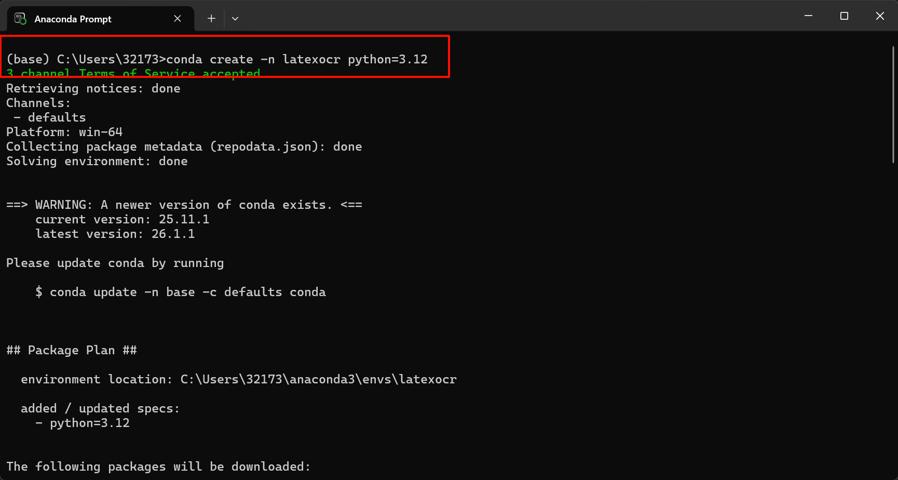 </a>

```bash
conda activate latexocr
```

<a href="images/2026-03-21-03-45-49.png" target="_blank"> 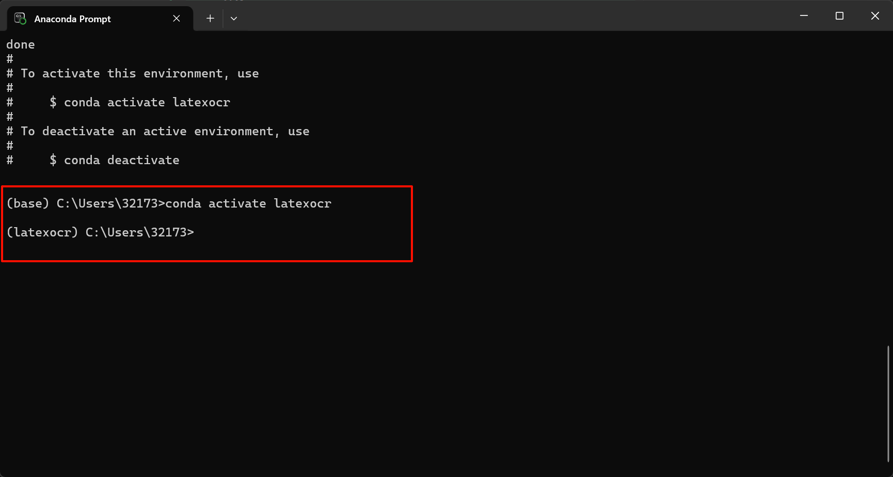 </a>

### 2.2. 安装 PyTorch

LaTeX-OCR 依赖 PyTorch 运行模型。由于每个人的显卡和系统环境不同，建议前往 [PyTorch 官网](https://pytorch.org/get-started/locally/) 根据自己的配置生成对应的安装指令。

<a href="images/2026-03-21-19-17-59.png" target="_blank"> 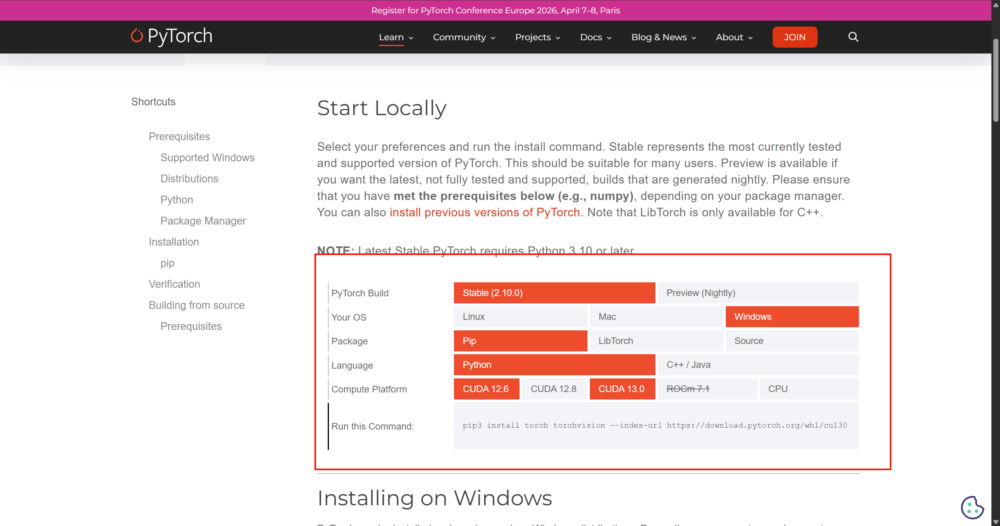 </a>

各选项说明：

- **PyTorch Build**：选 `Stable`（稳定版）
- **Your OS**：选对应操作系统，Windows 用户选 `Windows`
- **Package**：选 `Pip`
- **Language**：选 `Python`
- **Compute Platform**：有 NVIDIA 显卡选对应的 CUDA 版本，没有独显或不确定选 `CPU`

> 如何确认自己的 CUDA 版本：按 `Win + R` 输入 `cmd` 回车，在终端输入 `nvidia-smi`，右上角显示的即为支持的最高 CUDA 版本。选择时要保证选的版本 **≤** 该数字。

选好后复制页面生成的命令，粘贴到 Anaconda Prompt 中执行即可（文件较大约 2GB+，请耐心等待）。

以 CUDA 13.0 为例：

```bash
pip3 install torch torchvision --index-url https://download.pytorch.org/whl/cu130
```

### 2.3. 安装 pix2tex

PyTorch 安装完成后，继续输入以下命令安装 LaTeX-OCR（含 GUI 界面）：

```bash
pip install "pix2tex[gui]"
```

安装完成后，首次运行时会自动下载模型权重文件（约 100MB+），下载完毕后 GUI 窗口会自动弹出。

## 3. 使用方法

安装完成后，在 Anaconda Prompt 中输入以下命令启动 LaTeX-OCR：

```bash
latexocr
```

<a href="images/启动命令截图.png" target="_blank"> 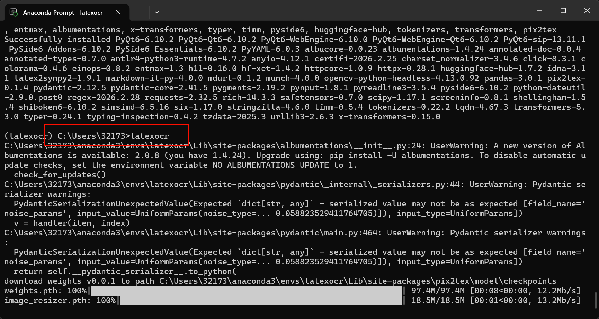 </a>

启动后界面如下：

<a href="images/GUI界面截图.png" target="_blank"> 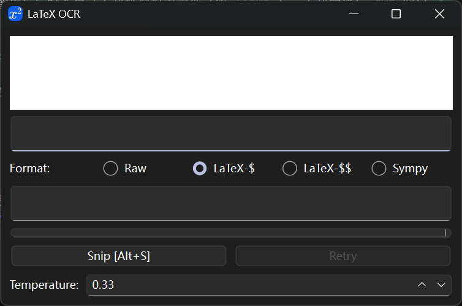 </a>

界面各选项说明：

- **Format**：输出格式选择
  - `Raw`：原始 LaTeX 代码
  - `LaTeX-$`：行内公式格式（适合嵌在文字中间）
  - `LaTeX-$$`：独立公式格式（适合单独一行展示）
  - `Sympy`：Python sympy 格式（复杂公式容易报错，日常不推荐）
- **Snip [Alt+S]**：截图识别快捷键
- **Temperature**：识别参数，值越低越保守准确，默认 0.33 即可

有三种方式输入公式图片：

1. 用其他截图工具截图后，直接将图片**粘贴**到顶部白色区域
2. 点击 **Snip** 按钮，使用程序内置截图框选公式区域
3. 先单击程序窗口使其成为焦点，再按 **Alt+S** 快捷键截图

截图后程序会自动识别公式，结果显示在中间文本框中，直接复制即可。

<a href="images/2026-03-21-04-05-48.png" target="_blank"> 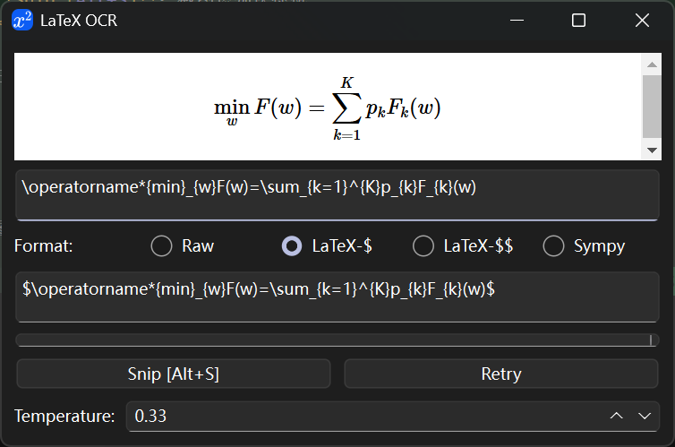 </a>

## 4. 插入 Word

识别完成后，下方文本框中即为可直接使用的 LaTeX 代码，复制它。

以下图为例，识别结果为：

```
\operatorname*{min}_{w}F(w)=\sum_{k=1}^{K}p_{k}F_{k}(w)
```

<a href="images/识别结果截图.png" target="_blank"> 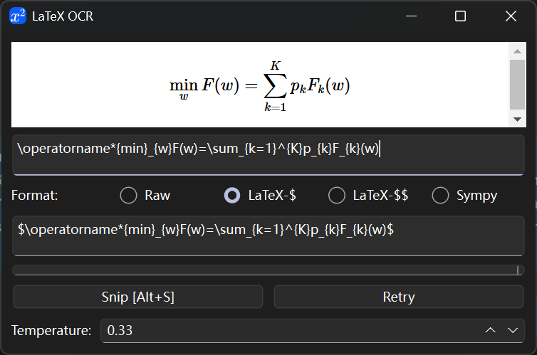 </a>

在 WPS 或 Word 中，光标定位到需要插入公式的位置，点击菜单栏**插入 → 公式**，在弹出的公式编辑框中将识别结果粘贴进去即可。

<a href="images/2026-03-21-19-20-05.png" target="_blank"> 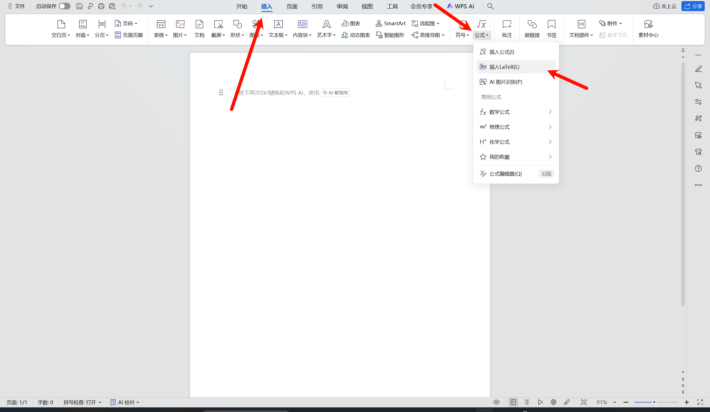 </a>

<a href="images/2026-03-21-04-47-58.png" target="_blank"> 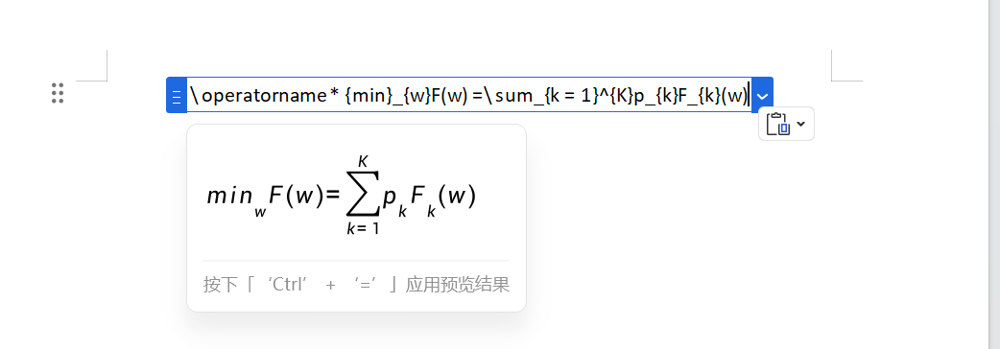 </a>

> **Word 用户注意**：
>
> 1. 粘贴后需要手动切换两个设置，否则公式无法正确渲染：左上角输入类型选择 **LaTeX**（默认是 Unicode）；右侧格式选择**专业**（选"线性"则公式不会转换为排版格式）。
> 2. Word 不支持 `\operatorname*` 语法和 `$...$` 包裹，粘贴前需手动处理：删去开头的 `$\operatorname*` 及结尾的 `$`。例如 WPS 可直接使用的 `$\operatorname*{min}_{w}F(w)=\sum_{k=1}^{K}p_{k}F_{k}(w)$`，在 Word 中需改为 `{min}_{w}F(w)=\sum_{k=1}^{K}p_{k}F_{k}(w)`。

<a href="images/2026-03-21-19-25-18.png" target="_blank"> 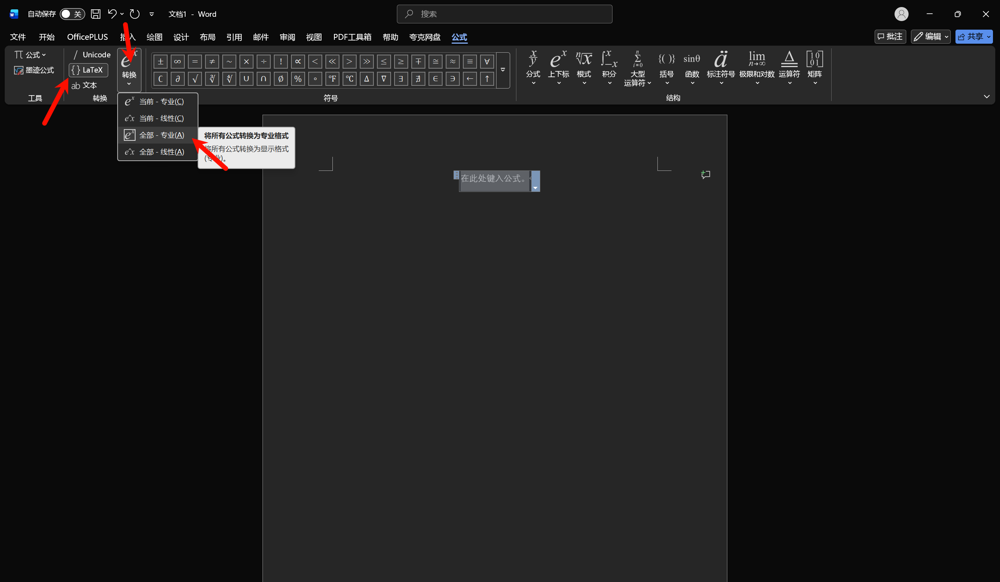 </a>

## 5. 创建一键启动脚本

每次使用都要打开 Anaconda Prompt 再手动输命令比较繁琐，可以创建一个批处理脚本实现双击启动。

在桌面新建一个文本文档，输入以下内容：

```vbs
Set ws = CreateObject("Wscript.Shell")
ws.run "cmd /c conda run -n latexocr latexocr", 0
```

<a href="images/2026-03-21-04-25-44.png" target="_blank"> 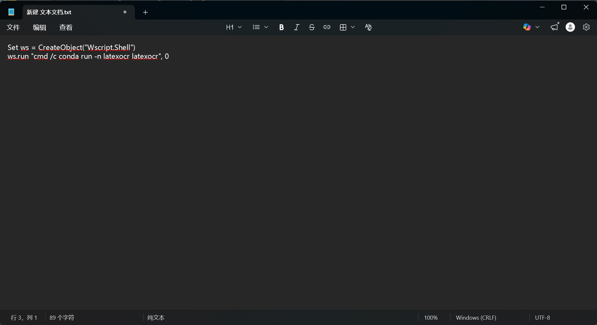 </a>

按 `Ctrl+S` 保存。如果看不到文件后缀名，在文件资源管理器中点击顶部**查看 → 显示 → 文件扩展名**将其勾选。

<a href="images/显示文件扩展名截图.png" target="_blank"> 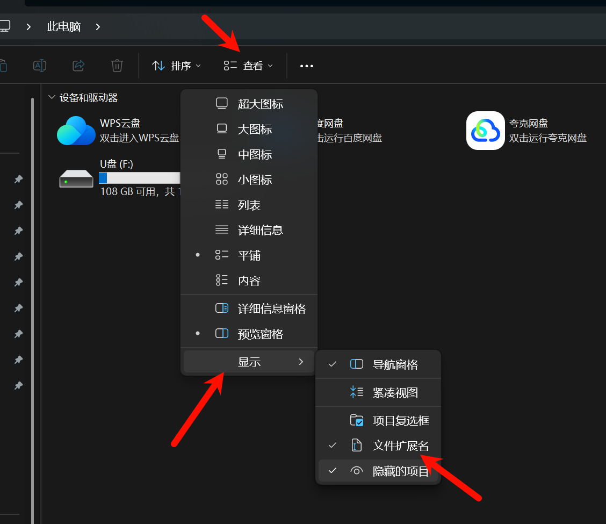 </a>

之后选中文件按 `F2` 重命名，将其改为 `公式识别.vbs`，双击即可静默启动 LaTeX-OCR（不会弹出黑色命令行窗口）。

> 双击后不会立即弹出窗口，后台仍需要激活环境并启动程序，请耐心等待几秒钟。如果怎么双击都没有反应，可以检查一下 vbs 文件是否保存成功、内容是否为空。

<a href="images/2026-03-21-04-24-56.png" target="_blank">  </a>
