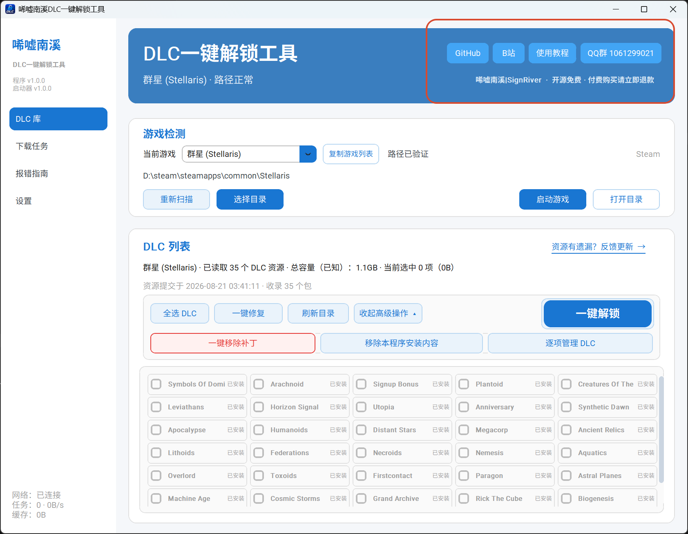
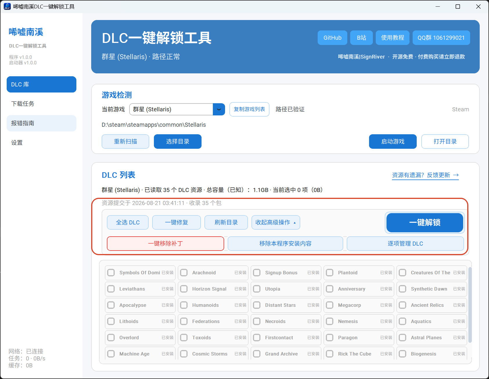
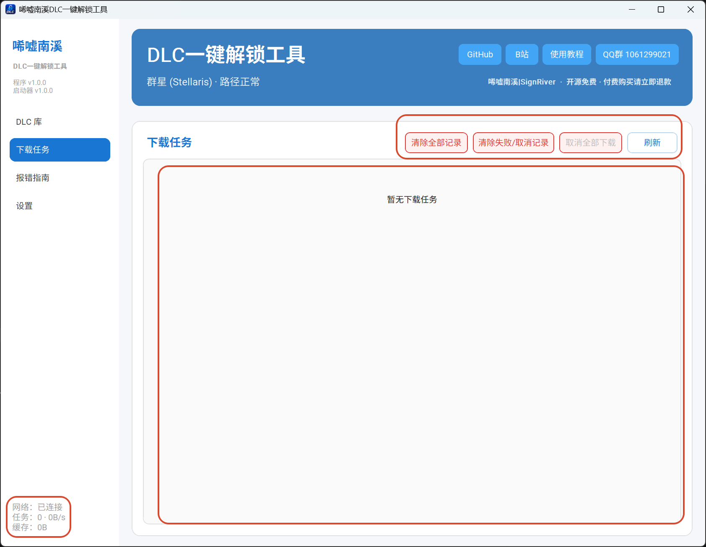
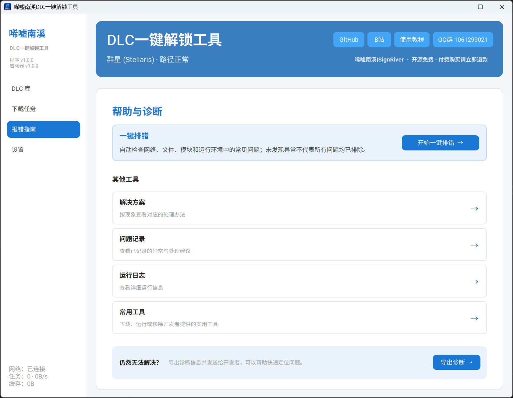
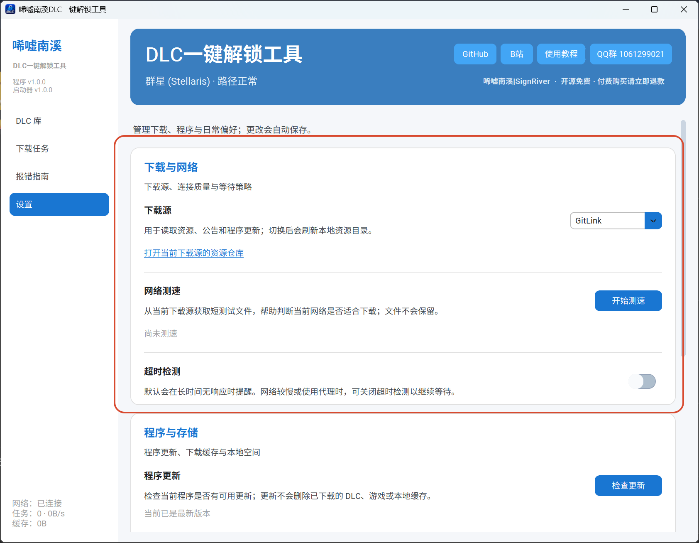
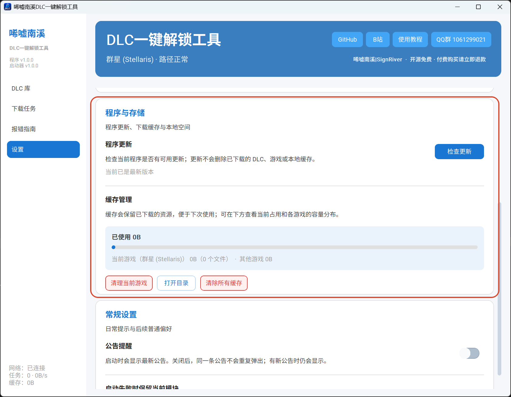
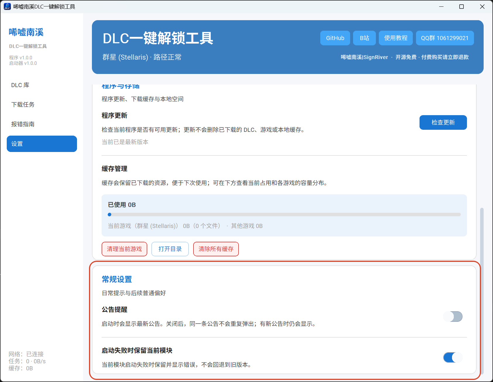

首页顶端有 xxxx，功能是 xxxxx

在首页除了一键解锁还有 xxxx 按钮，点开高级操作还有 xxx 按钮，他们的功能是 xxxxx

在下载过程中可以关注程序左下角的 xxxx 判断网路状态以及下载速度，通过右上角的 xxxx 按钮可以实现 xxxx 的功能，中间会有待下载，下载中，下载完成或是下载失败的条目，供参考 xxxx

如果有报错问题可以进入报错指南界面，报错指南的详细操作参考常见问题页，这里不多赘述

在设置的下载与网络模块中有 xxxxx 可以 xxxxxxx

在程序与存储中有 xxxx，可以 xxxx

最后的常规设置则是有 xxxx 功用，第一个负责 xxxx，第二个如果不懂就没必要调整，保持开启即可

