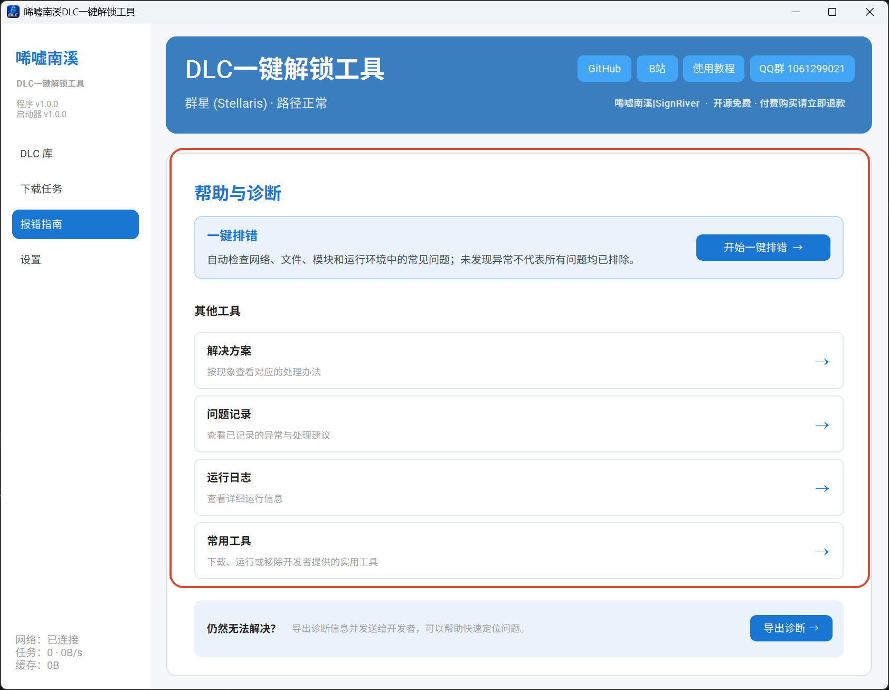
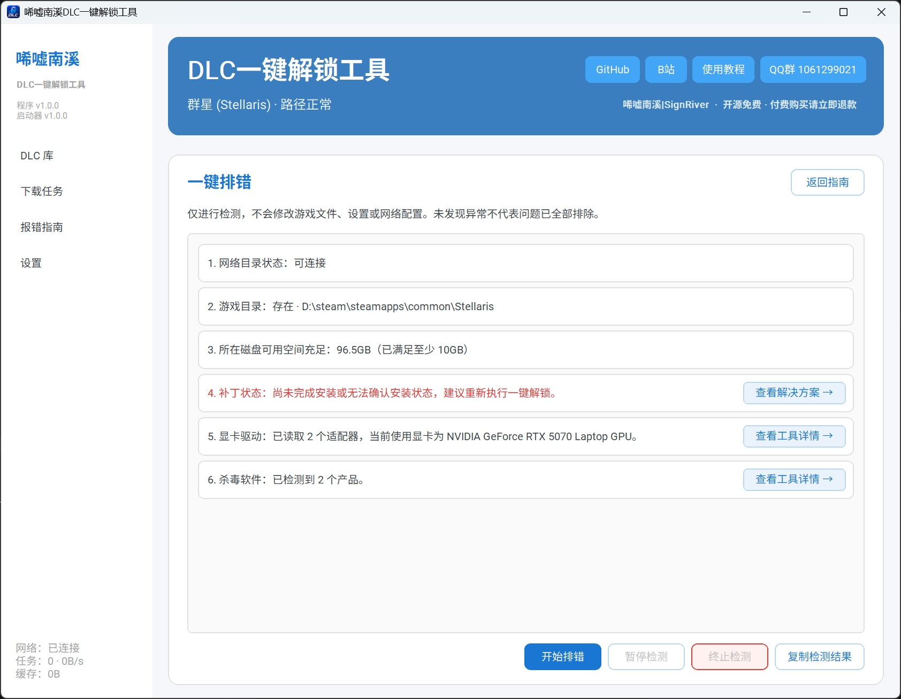
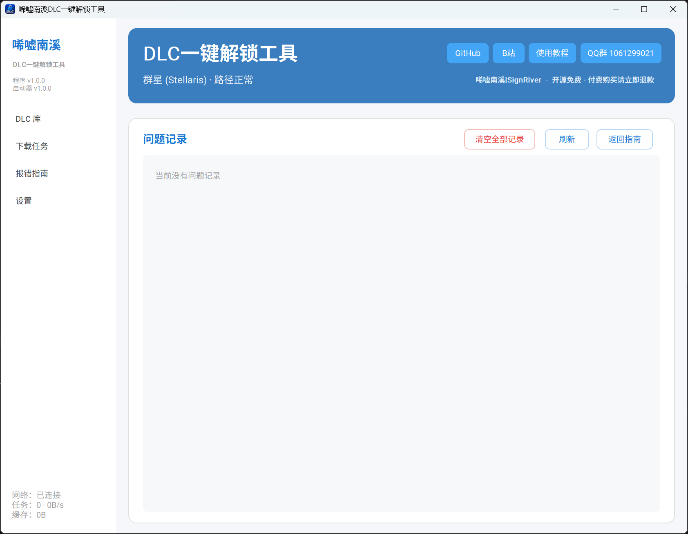
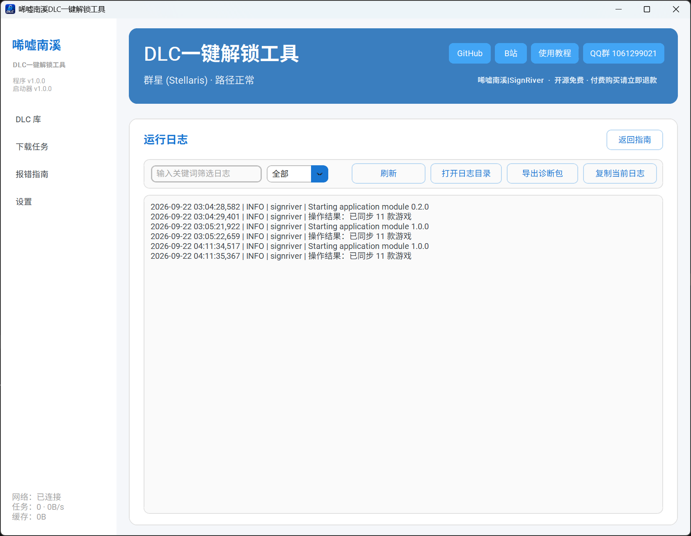
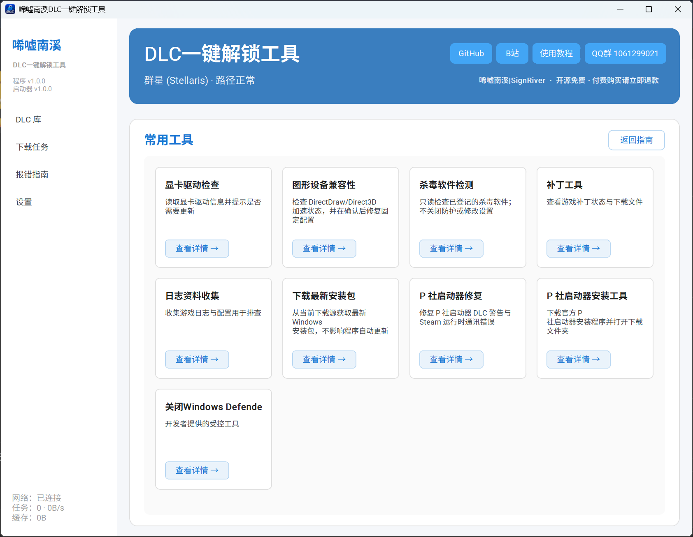

这里主要讲报错指南的使用，如果你打开程序时出了问题，这里只有一个参考建议，解压后再使用

再报错指南中分为 xxxx 内容

首先一键排错可以检查基本的小问题并给出解决建议或提供工具跳转窗口

而问题记录会把经典问题记录在案 xxxxx

运行日志记录 xxxxx，和问题记录一样，主要是出问题后交由开发者参考修复 bug 的

工具则是比较考验用户主观能动性的一个 xxxxx，里面常用的有补丁管理，杀毒软件检测，日志收集等，xxxxx

最后如果有解决不了的问题欢迎来群，有空一定帮忙解决
