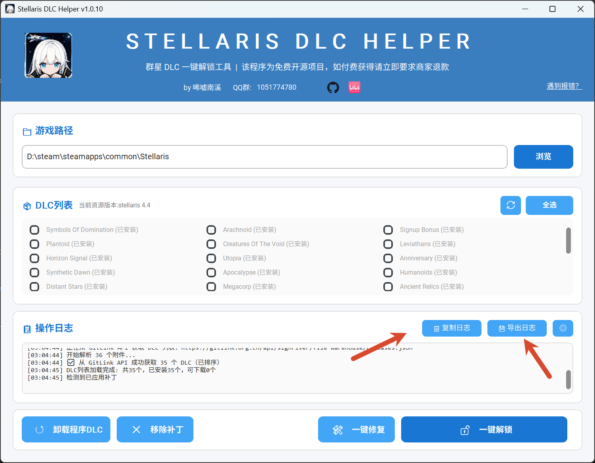
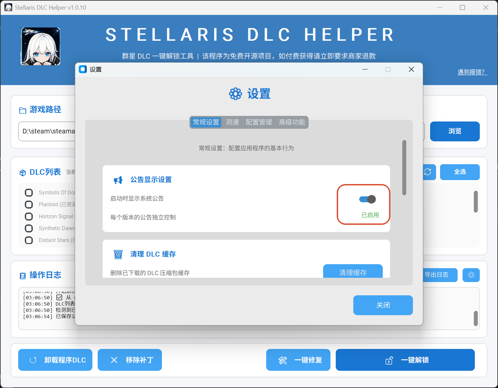
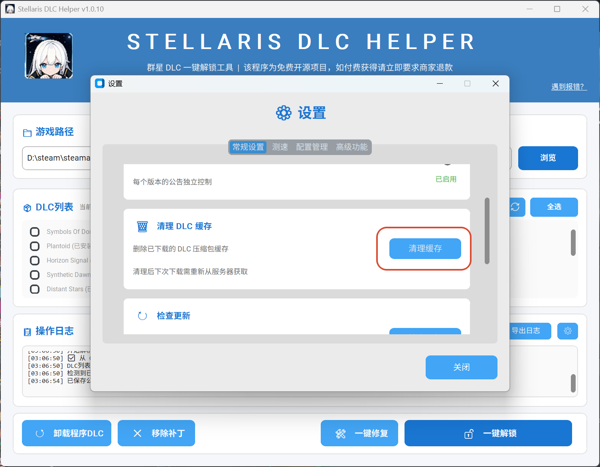
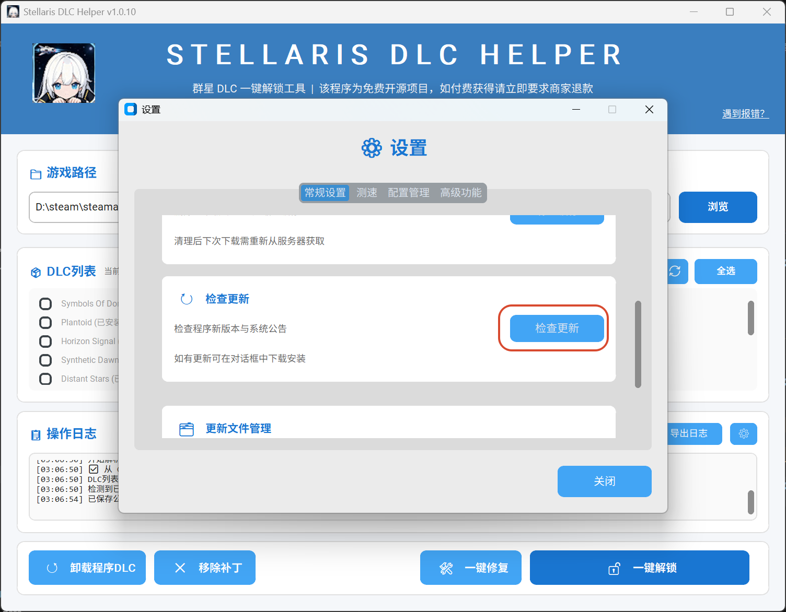
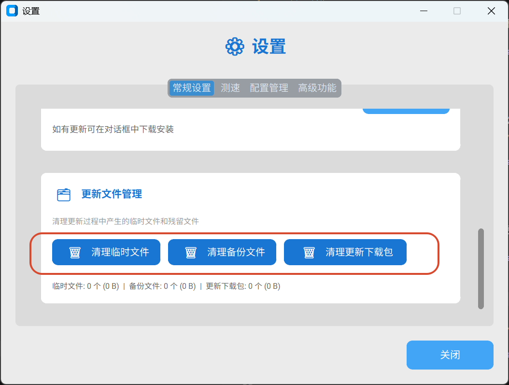
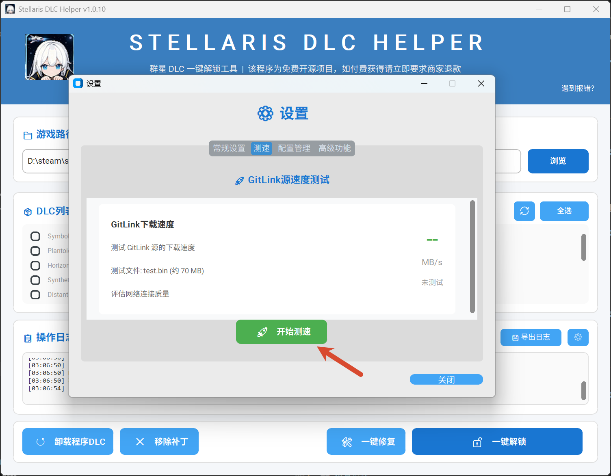
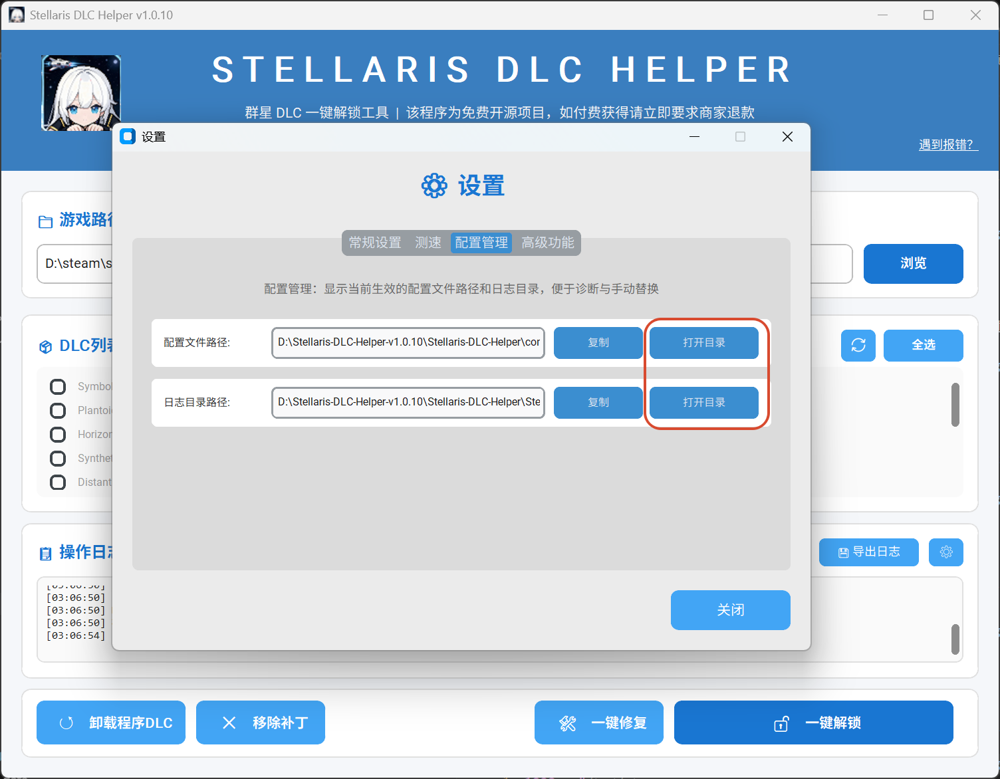
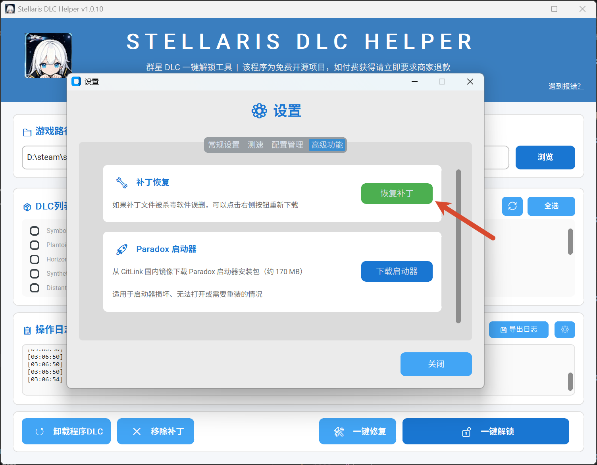
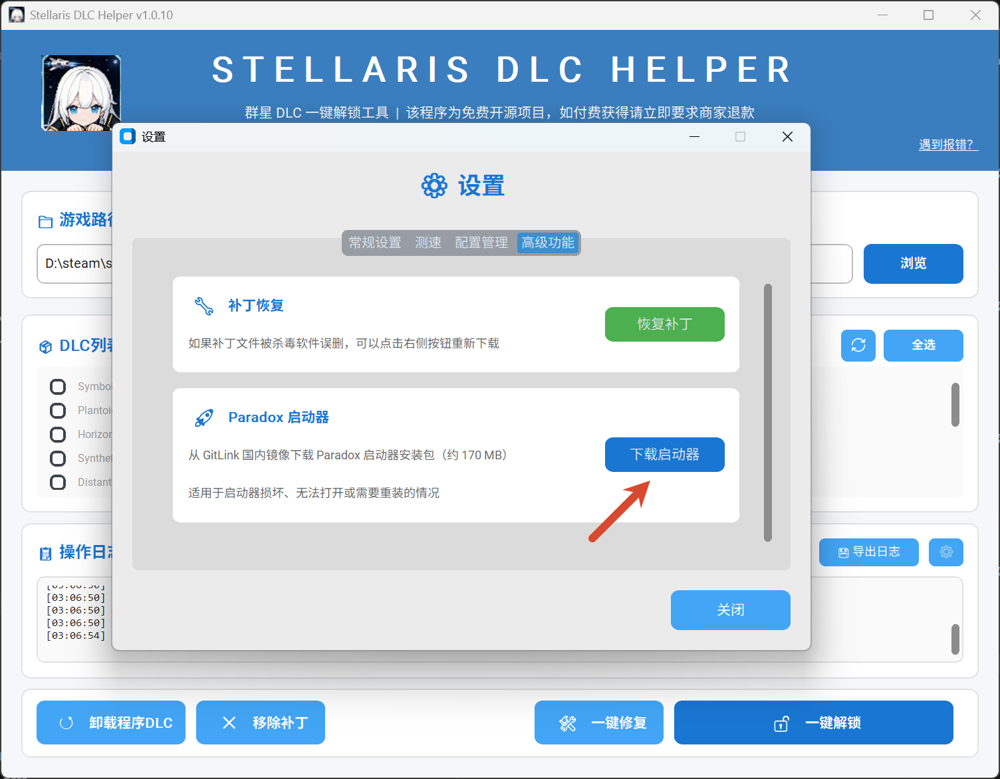

## 日志功能

程序会将所有的操作以及报错内容输出到日志中，当程序遇到报错，可以选择将复制日志内容或导出日志文件，把文件内容发给开发者或者 ai 以解决程序问题

## 公告显示提示

每次打开软件后会弹出公告，如果不想重复看同一篇公告可以在设置中关闭这一按钮，这样同一份公告就不会再次显示，但当有新公告发布时，仍然会显示，相对的，如果你在公告界面失误勾选了本版本不再显示公告而想再看一次公告，可以打开这一按钮并重启程序，这样公告就会再次弹出

## 清理 dlc 缓存

在安装 dlc 后程序文件夹中会缓存 dlc 文件，方便在下次安装 dlc 时跳过从云端的下载，如果觉得占地方可以在设置中清理掉这些缓存，不过代价是下次下载需要重新从云端获取

## 检查更新

一般程序会自动检查更新，如果自动检查更新没生效，可以选择手动在设置中检查更新来安装新版本

## 更新文件管理

顾名思义就是管理下载更新文件时产生的临时文件和备份文件，觉得占地方可以选择删除

## 测速功能

在测速功能页面可以选择对下载源进行测速判断当前网络与下载源是否连通以及的下载速度

## 配置文件管理

小白不用管，如果想调整程序配置可以通过展示的路径找到配置文件以及日志文件

## 补丁恢复

有时补丁会被杀毒软件删除，当加入白名单后可以用补丁恢复还原程序的补丁并可以重新使用程序的所有功能

## p 社启动器下载

一个拓展功能，用来不挂代理的下载 p 社启动器，如果版本低了可以去群里找我更新

