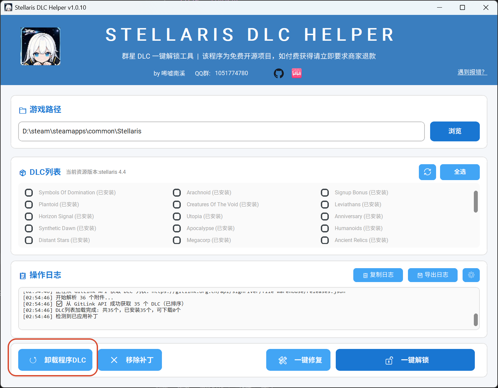
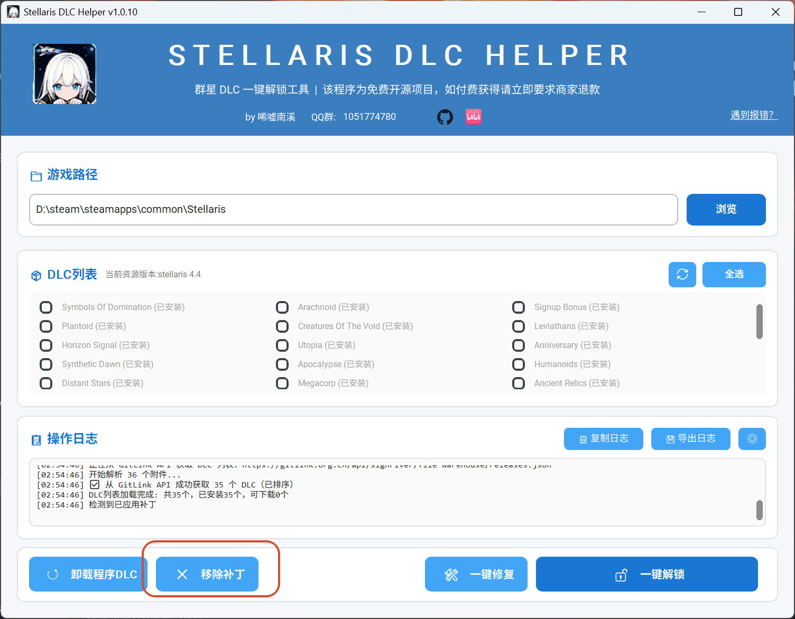
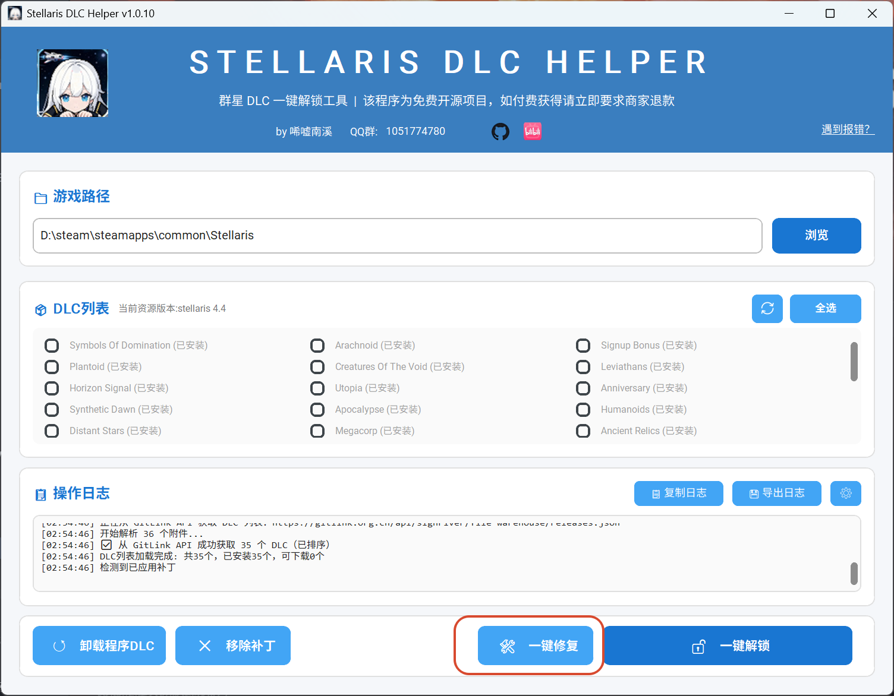

程序还有一些附带的操作功能，比如卸载程序 dlc

## 卸载程序 dlc

点击卸载程序 dlc 会删除程序下载的所有 dlc 内容，方便恢复游戏到初始状态

## 移除补丁

和卸载 dlc 效果相似，移除程序安装的补丁，还原游戏文件

## 一键修复

简单粗暴的功能，删除全部 dlc 和补丁后重新下载一遍，解决部分用户因为文件结构损坏而导致的游戏崩溃问题

日志、缓存和其他界面功能见 [进阶功能](/p/stellaris-dlc-helper/advanced/)。
