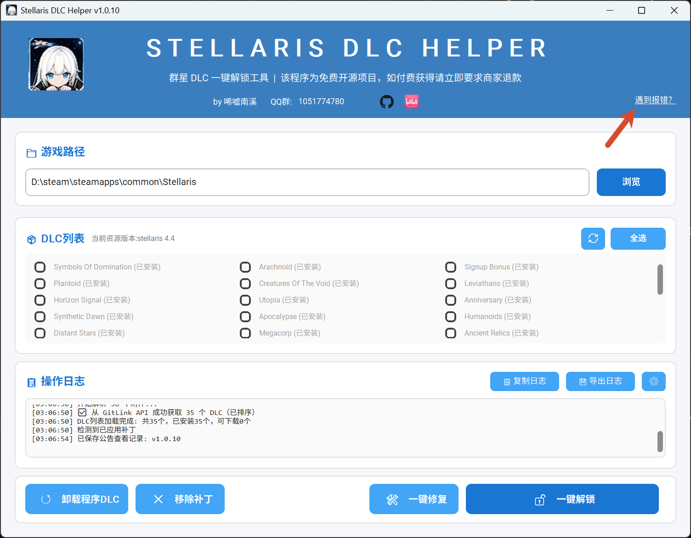

## 下载失败

检查网络连接；随后在“设置 -> 测速”中手动测速并切换可用来源，再重试操作。

## 文件缺失

在“设置”的高级功能中按界面提示恢复缺失文件。如果安全软件阻止了文件，请先核对来源与文件安全性，再按自己的安全策略处理。

## 解锁后游戏报错

点击程序右上角遇到报错跳转链接打开报错指南，根据报错指南内容找到对应报错的解决方案

## 需要更多帮助

可以在 [GitHub Issues](https://github.com/sign-river/Stellaris-DLC-Helper/issues) 提交可复现的情况、程序版本和相关日志。
