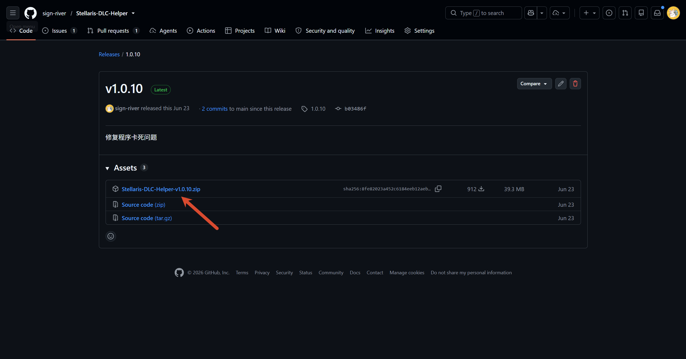
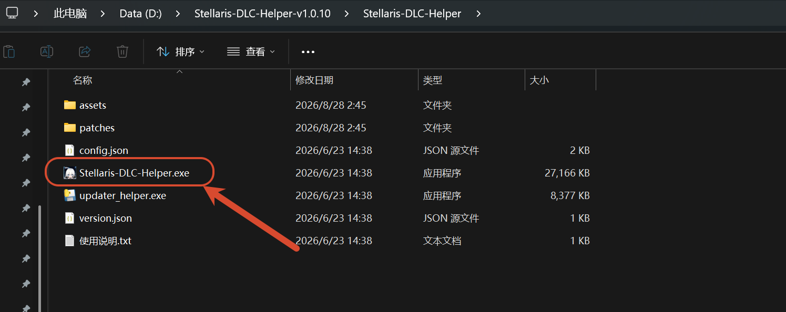
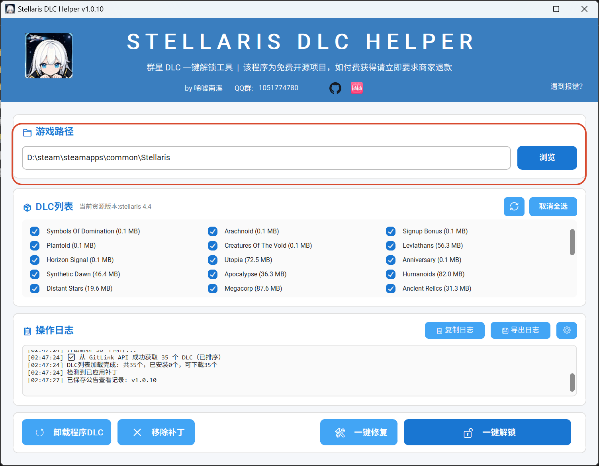
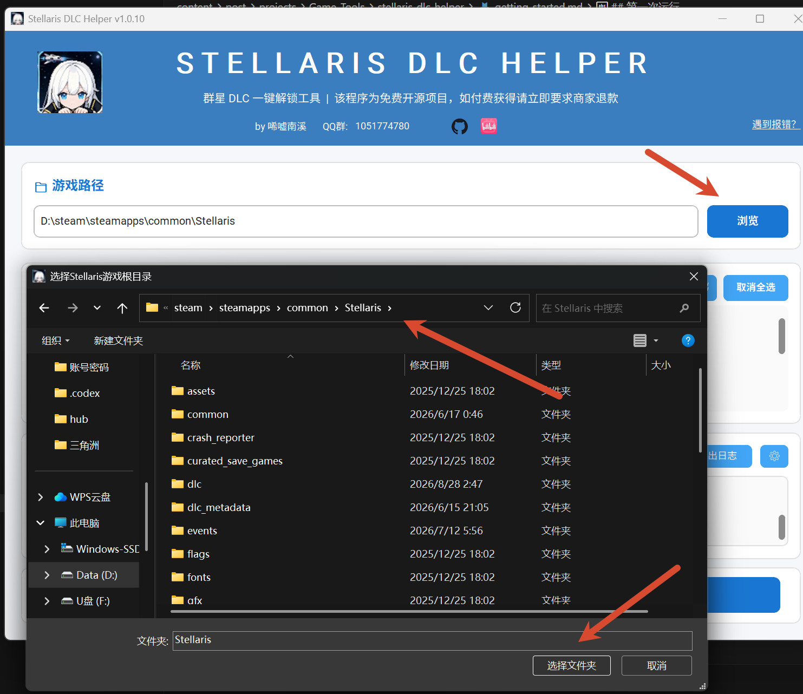
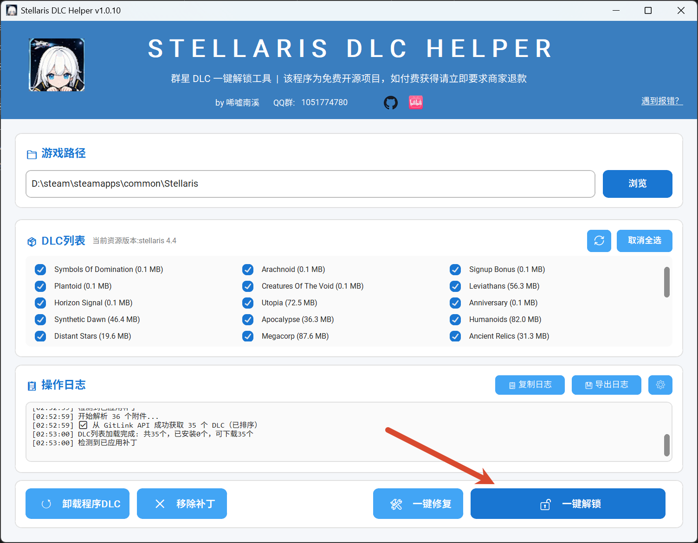
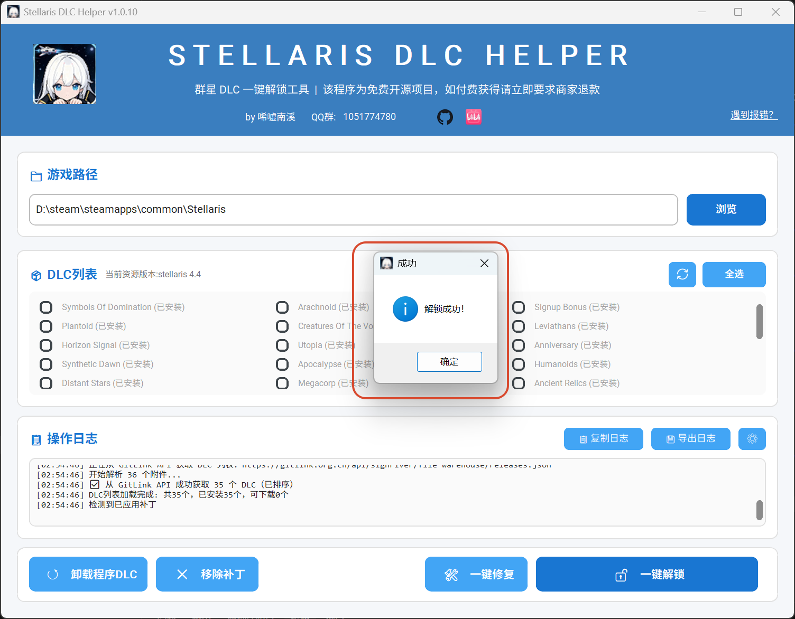

## 下载工具

从 [GitHub Releases](https://github.com/sign-river/Stellaris-DLC-Helper/releases/latest) 下载最新版本，并解压到方便找到的位置。

## 第一次运行

双击 `Stellaris_DLC_Helper.exe`。程序会检查更新并显示公告；同时程序会自动识别游戏安装目录。

如果没有自动识别到目录，可通过“浏览”手动选择。所选目录应包含 `stellaris.exe`。

## 完成操作

确认目录无误后，点击一键解锁即可。进度和结果会显示在程序中；完成后通过 Steam 启。

进度和结果会显示在程序中；完成后可通过 Steam 启动查看效果。

如图 dlc 图标下均有绿色✅️即为成功

> 仅支持 Windows。使用前建议备份存档和重要的游戏文件。
