## Stellaris DLC Helper - 快速上手指南

> 三分钟学会使用本工具，解锁群星全部 DLC

---

## 💡 这个工具是干什么的？

一个帮你给群星游戏解锁所有 DLC 的小工具，简单来说就是：**点几下鼠标，所有 DLC 就能用了**。
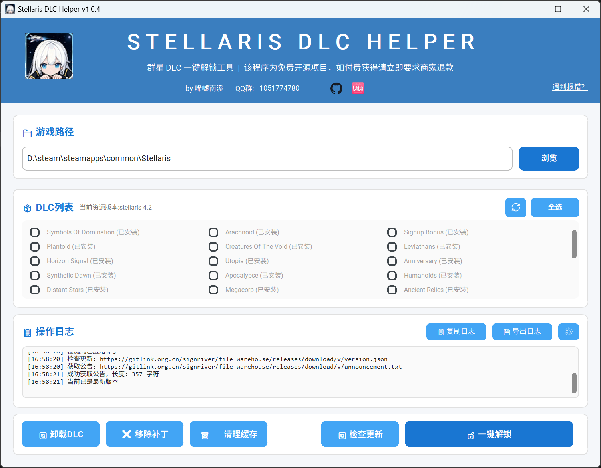

---

## 🚀 怎么开始？

### 第一步：下载工具

1. 去 [Releases 页面](https://github.com/sign-river/Stellaris-DLC-Helper/releases/latest) 或者[群文件](https://qm.qq.com/q/ZNGagKl346)下载最新版本
2. 下载后解压到任意文件夹（建议放在容易找到的地方）
3. 双击 `Stellaris_DLC_Helper.exe` 运行
   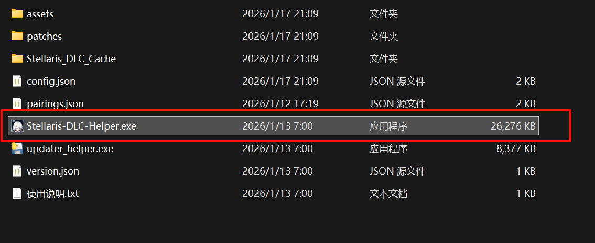

**注意：** 这个工具只支持 Windows 系统！

---

## 📖 使用教程

### 第一次使用

#### 运行程序

- 双击 exe 文件启动程序
- 第一次运行会弹出更新检查和公告
- 如果不想每次打开都看公告的话可以勾选"本版本不再显示此公告"
  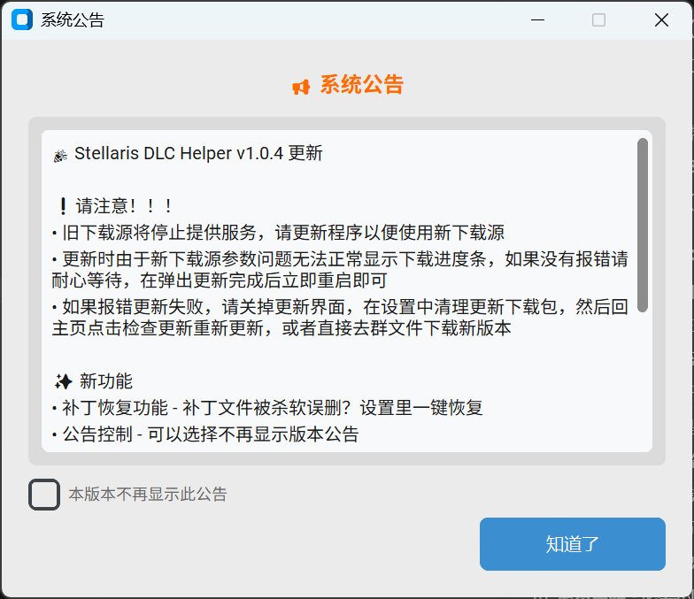

#### 选择游戏目录

- 程序会自动尝试找到你的群星游戏安装位置
- 如果没找到，点击"浏览"按钮，手动选择游戏文件夹
  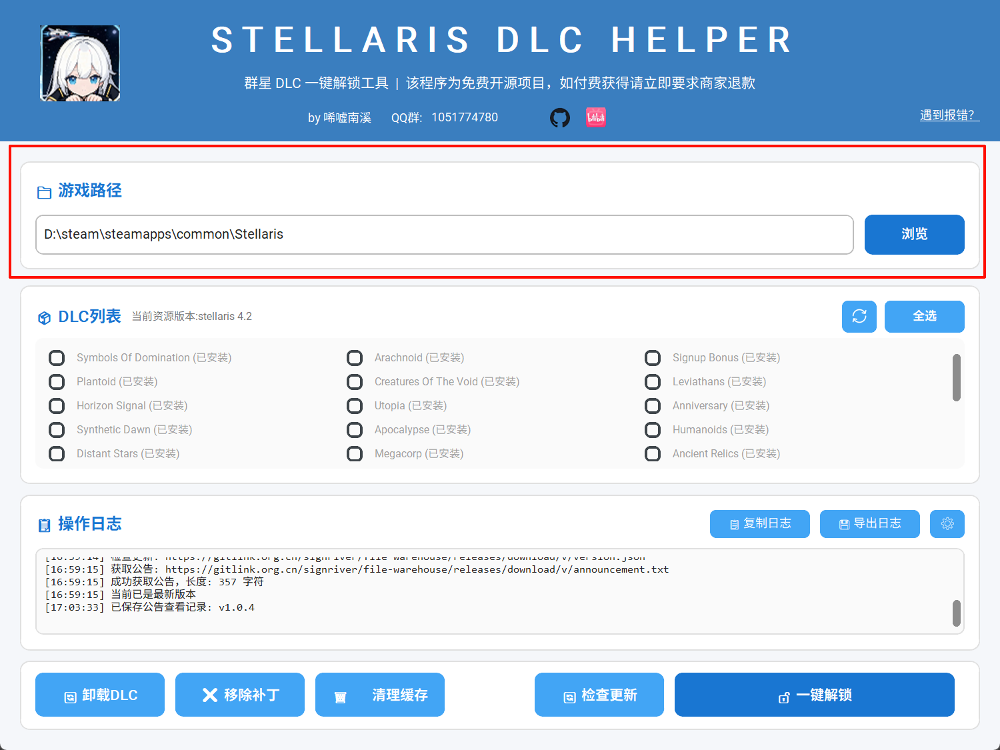

#### 点击"一键解锁"

- 点一下，剩下的交给程序自动完成
- 它会自动：
  - 打上解锁补丁
  - 下载所有 DLC 文件
  - 安装 DLC

  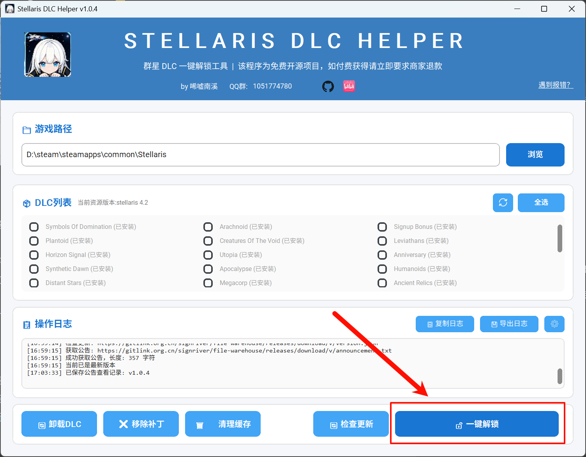

#### 等待完成

- 下载过程中会显示实时速度和进度
- 下载完成后会自动安装
- 看到"解锁成功"提示就好了
  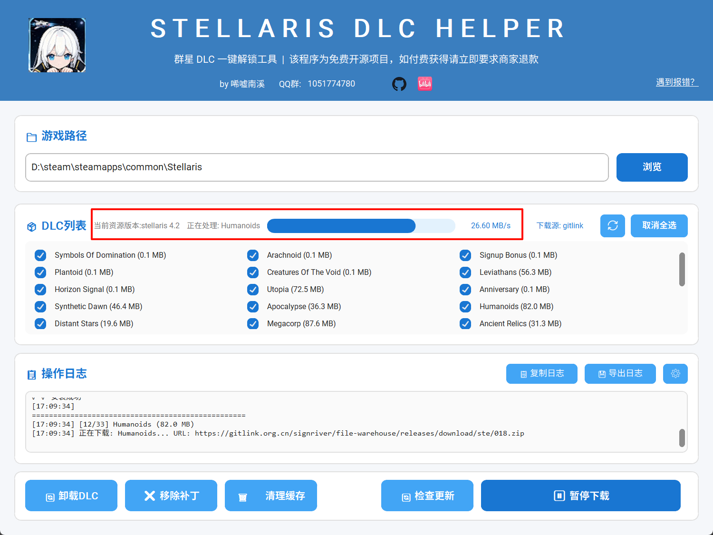
  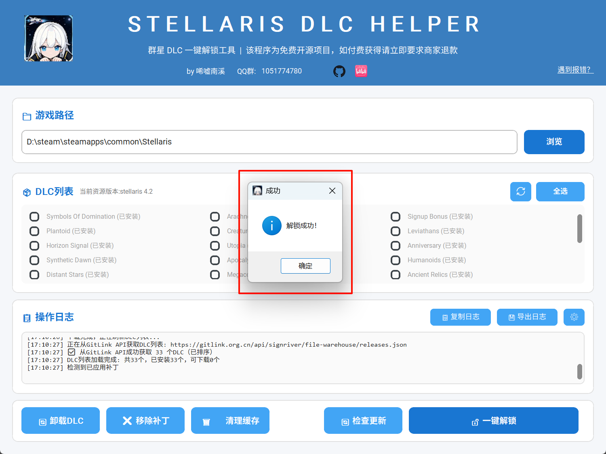

#### 启动游戏

- 正常通过 Steam 启动群星游戏
- 进入游戏后就能看到所有 DLC 了

---

## 🎮 日常使用

### 游戏更新了怎么办？

1. 打开工具
2. 再次点击"一键解锁"
3. 程序会自动下载新版本的 DLC
4. 完成后就能玩了

#### 手动测速

- 点击"设置"按钮
- 切换到"测速"选项卡
- 点击"开始测速"查看下载速度
  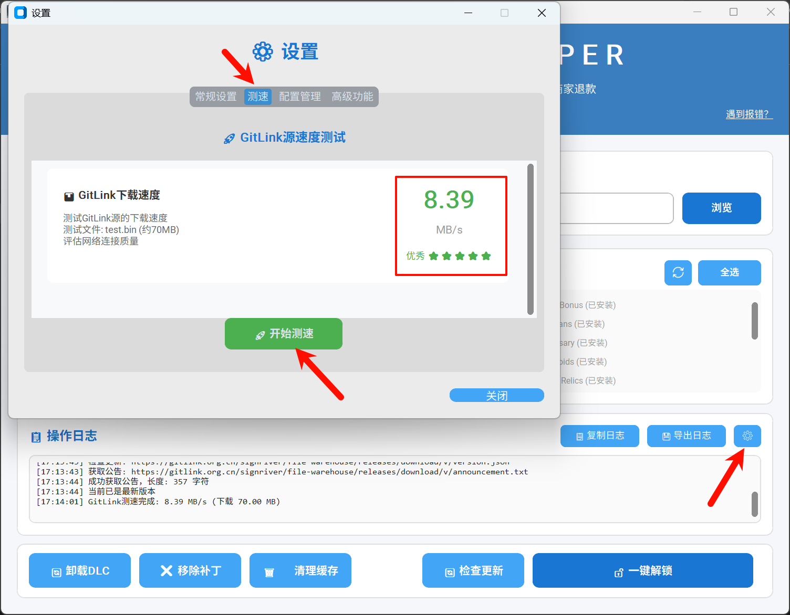

### 暂停/继续下载

- 下载过程中可以点击"暂停下载"
- 想继续下载时点击"继续下载"
- 支持断点续传，不用担心网络中断
  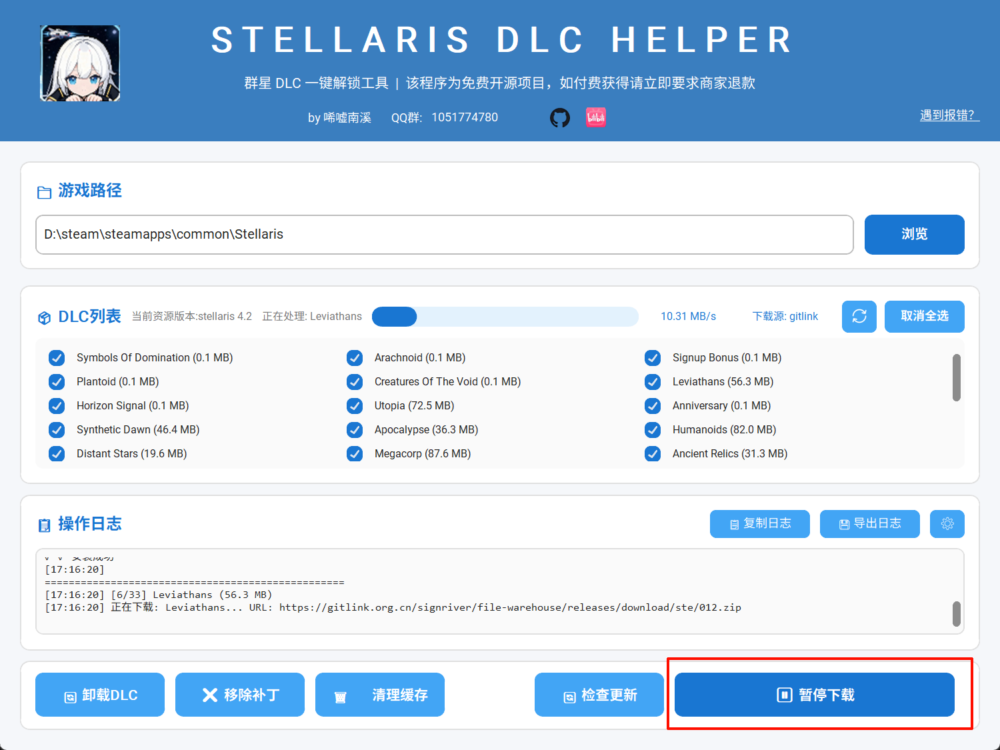
  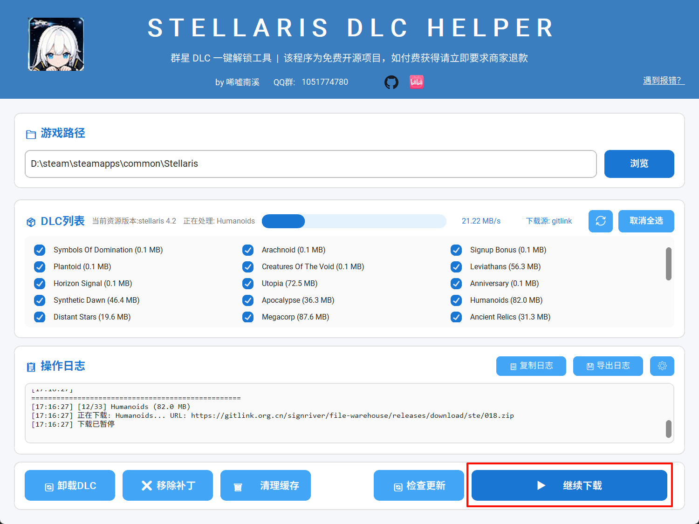

---

## 🔧 工具按钮说明

| 按钮         | 作用                                                 |
| ------------ | ---------------------------------------------------- |
| **一键解锁** | 自动完成所有操作：下载→安装→打补丁                   |
| **浏览**     | 手动选择游戏安装目录                                 |
| **设置**     | 打开设置窗口，可以测速、查看日志、清理缓存、恢复补丁 |
| **还原游戏** | 把游戏恢复到原始状态（移除所有 DLC 和补丁）          |
| **暂停下载** | 暂停正在进行的下载                                   |
| **继续下载** | 继续之前暂停的下载                                   |

---

## ❓ 常见问题

### 第一次用，需要准备什么？

什么都不用准备！只需要：

- Windows 电脑
- 已经在 steam 激活了正版群星本体
- 能上网

### 会不会封号？

这是一个本地工具，只修改你电脑上的游戏文件，**不涉及 Steam 账号**，所以不会封号。

### 下载的文件保存在哪里？

默认保存在工具目录下的 `Stellaris_DLC_Cache` 文件夹里。

### 怎么知道 DLC 装成功了？

启动游戏后：

- 进入游戏主菜单
- 点击"内容"或查看 DLC 列表
- 看到所有 DLC 都显示可用即安装成功
  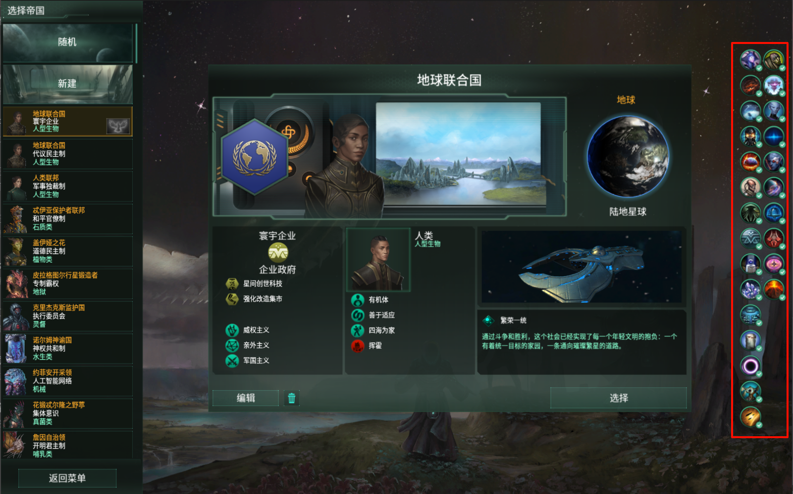

### 检测到补丁文件缺失

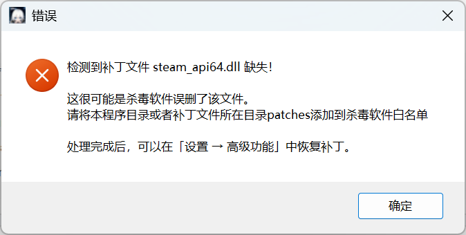

- 点击"设置"按钮
- 切换到"高级功能"选项卡
- 点击"恢复补丁"下载补丁内容

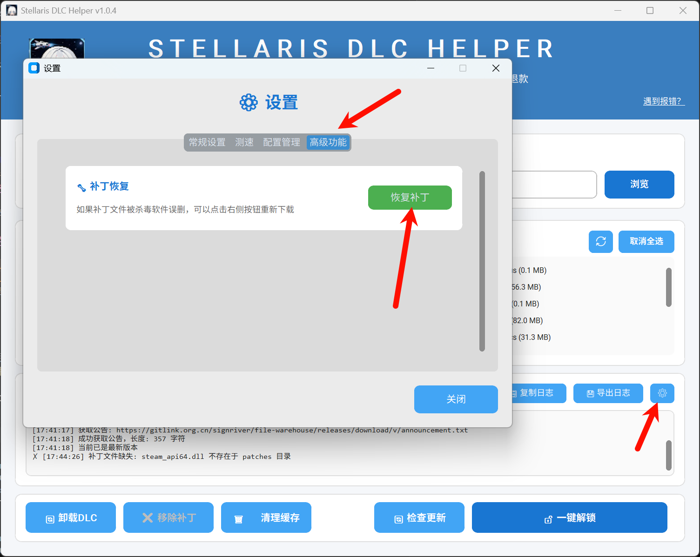

- 如果还是缺失，则为杀毒软件误杀补丁，请把补丁添加进杀毒软件的白名单，补丁存放路径如下 Stellaris-DLC-Helper\patches

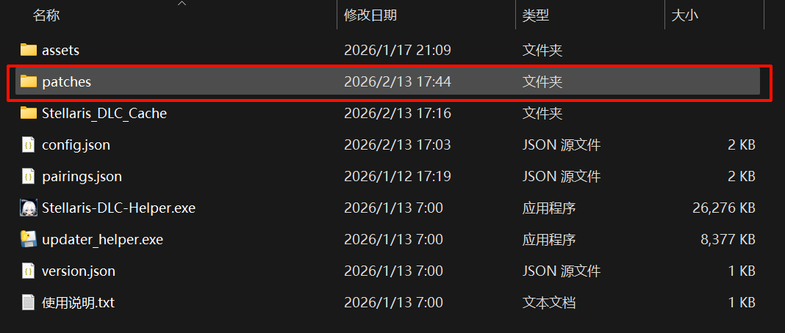

### 工具下载的是什么？

下载的是：

- DLC 的资源文件（.dlc 文件）
- CreamAPI 补丁（用于解锁 DLC）
- 游戏必需的配置文件

### 想要卸载 DLC 和补丁怎么办？

在工具里点击"卸载 dlc"和"移除补丁"按钮即可
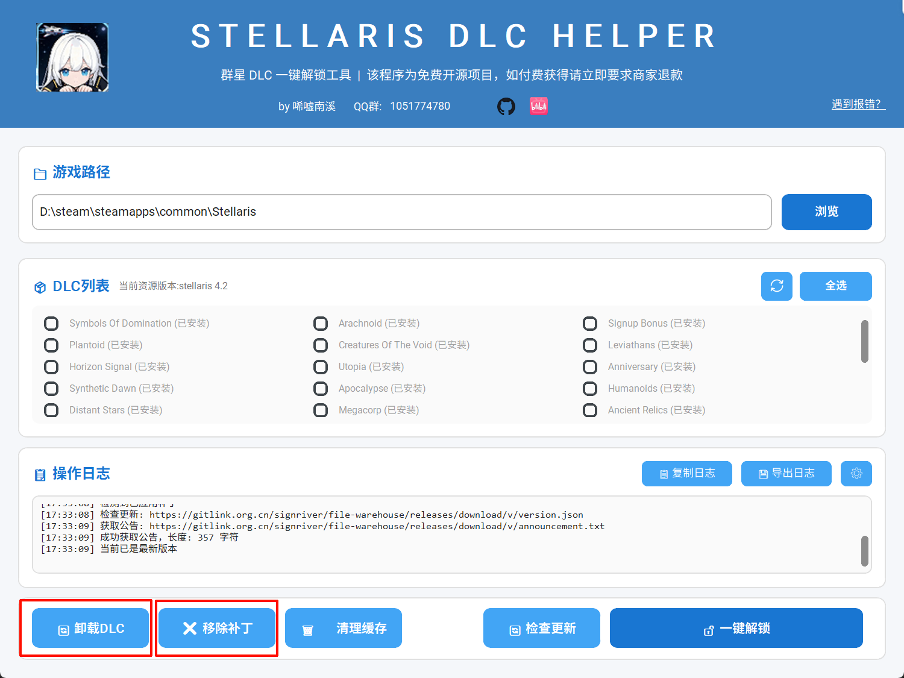

### 提示"找不到游戏目录"？

- 点击"浏览"按钮
- 找到 Stellaris 游戏的安装文件夹
- 正确的文件夹里应该有 `stellaris.exe` 文件

### 下载失败或者出错了？

1. 检查网络连接
2. 尝试在"设置→测速"里手动测速，换个源
3. 点击"一键解锁"重新试一次
4. 如果还是不行，到 [Issues](https://github.com/sign-river/Stellaris-DLC-Helper/issues) 反馈

### 工具会自动更新吗？

A: 会的！

- 每次启动都会检查更新
- 有新版本会提示你
- 可以选择更新或跳过

### 占用多少空间？

- 工具本身：约 30 MB
- DLC 缓存：约 1GB（可以在设置里清理）
- 总共：约 1GB

---

## 🛠️ 进阶功能

### 手动选择 DLC

1. 在主界面取消勾选不需要的 DLC
2. 只下载你需要的部分
   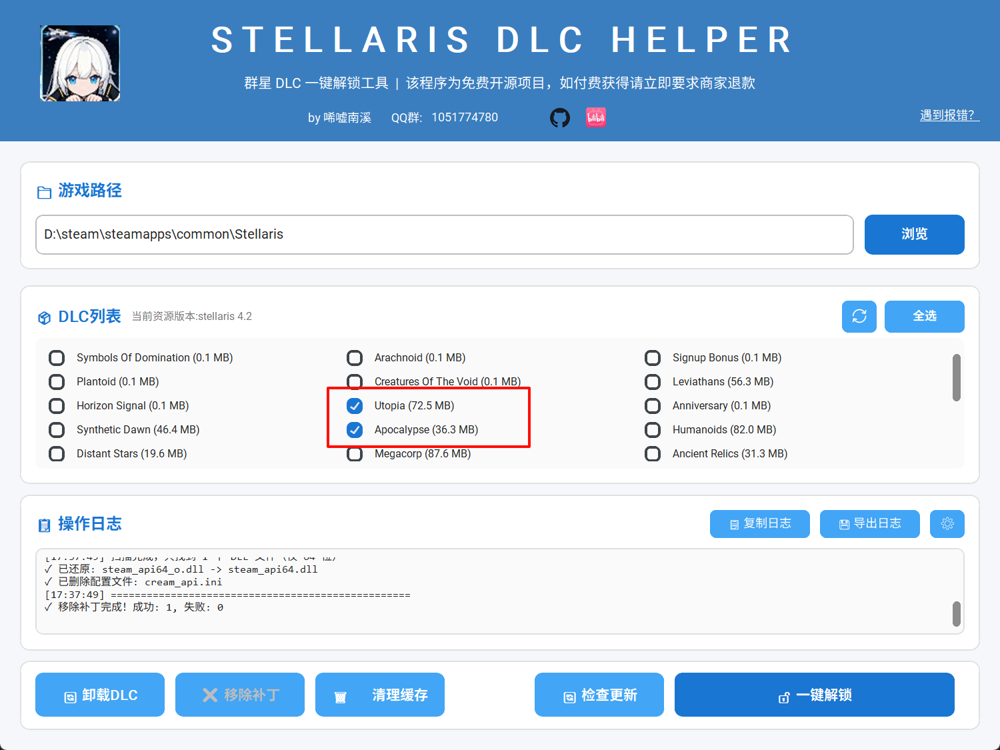

### 查看操作日志

1. 点击"设置"
2. 切换到"日志"选项卡
3. 可以查看所有操作记录
   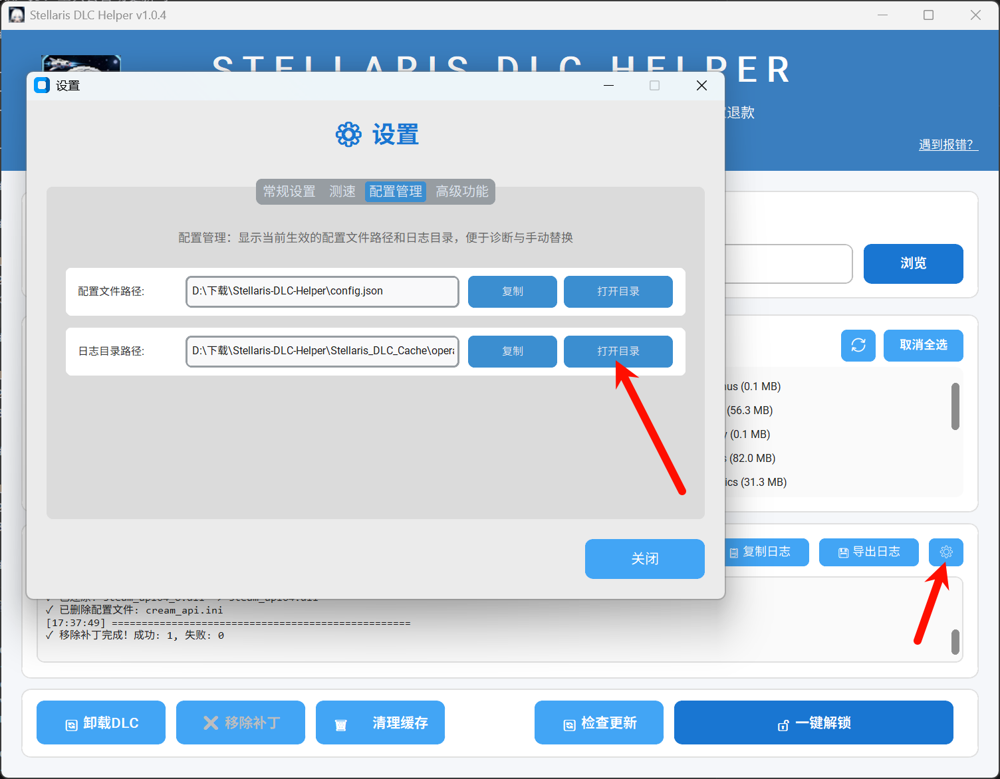

### 清理缓存

在工具里点击"清理缓存"按钮即可
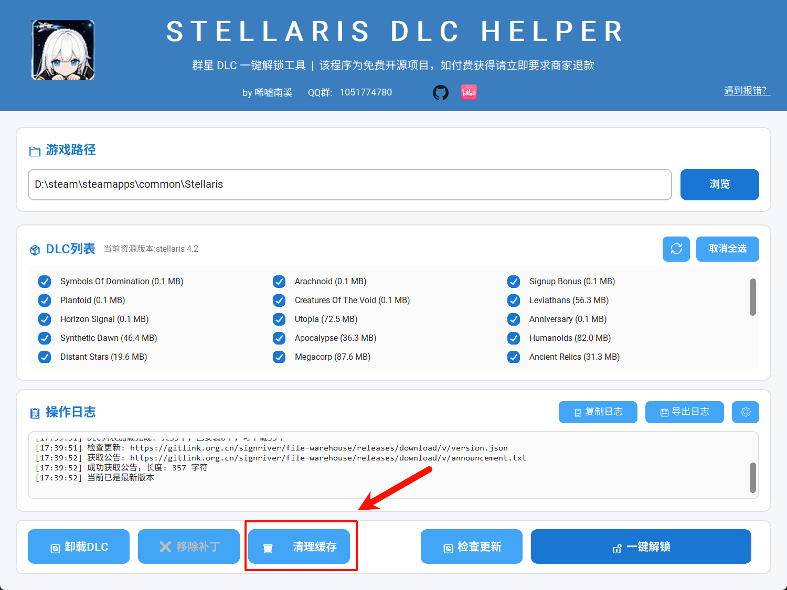

---

## 💬 需要帮助？

- **查看报错指南**：[完整使用手册](https://www.kdocs.cn/l/cdVvg4OgHMzj)
- **反馈问题**：[GitHub Issues](https://github.com/sign-river/Stellaris-DLC-Helper/issues)
- **加入 QQ 群**：1051774780

---

## ⚠️ 重要提示

1. **仅供学习交流使用**，请支持正版游戏
2. 使用本工具造成的任何后果，用户自行承担
3. 建议定期备份游戏存档

---

## 🎉 开始使用吧

就这么简单：

1. ✅ 下载工具
2. ✅ 运行程序
3. ✅ 点击"一键解锁"
4. ✅ 启动游戏

**祝你游戏愉快！** 🚀
