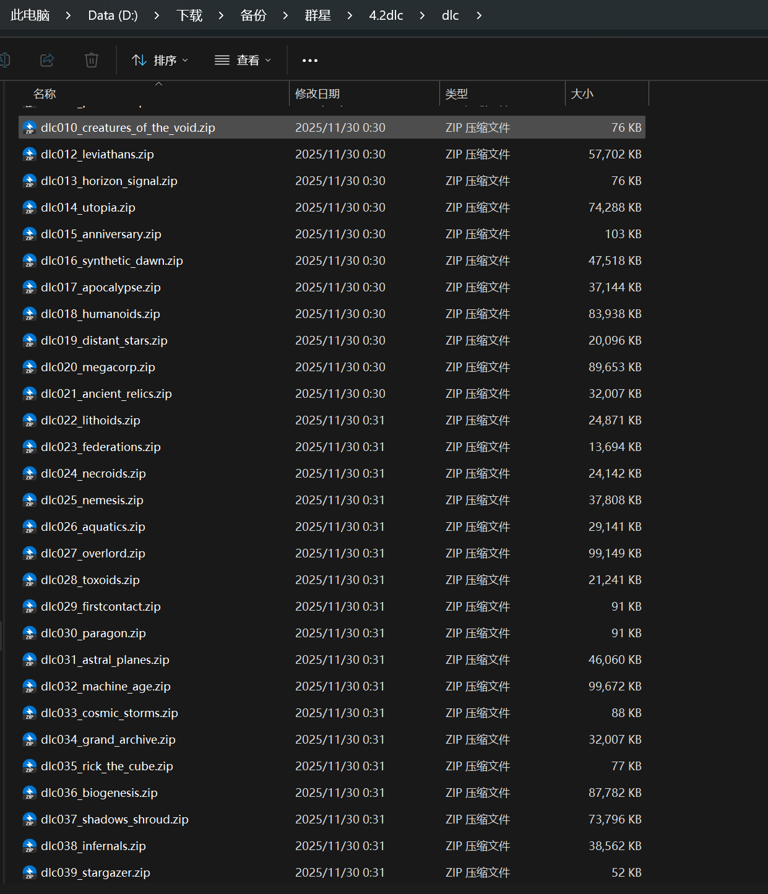
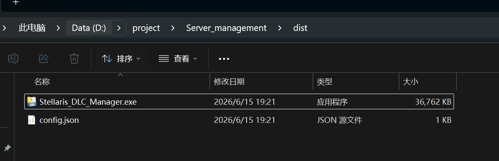
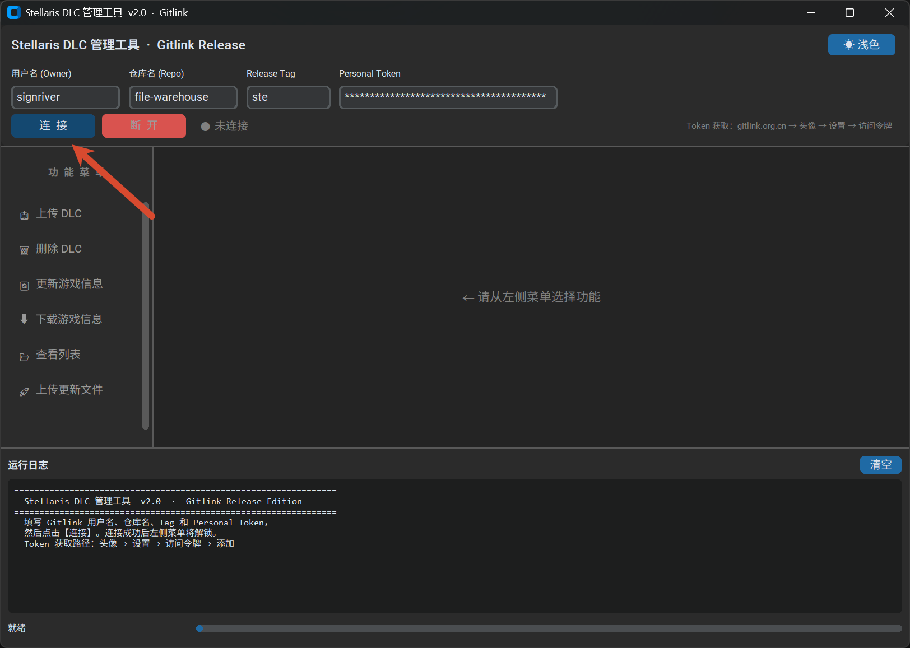
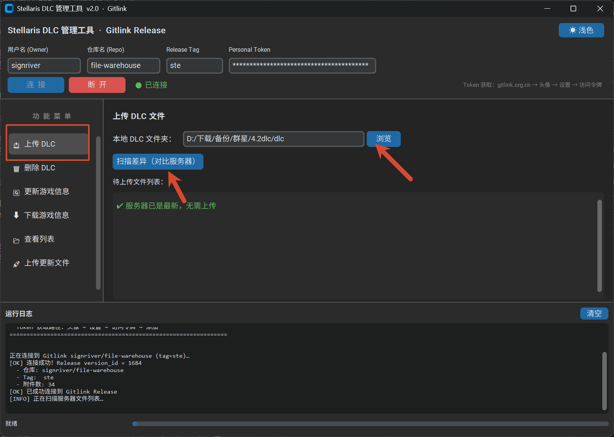
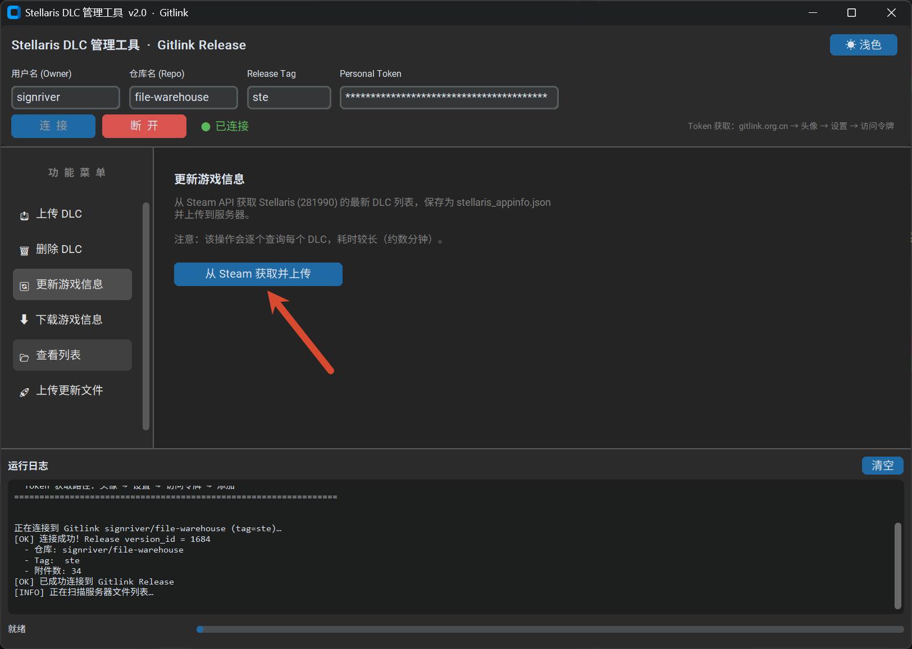
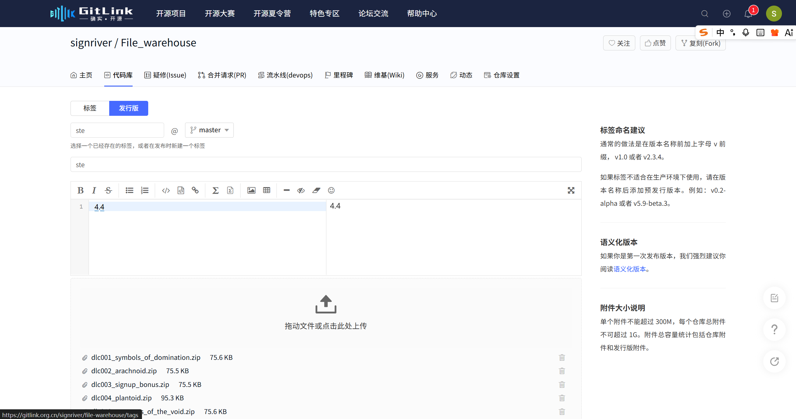
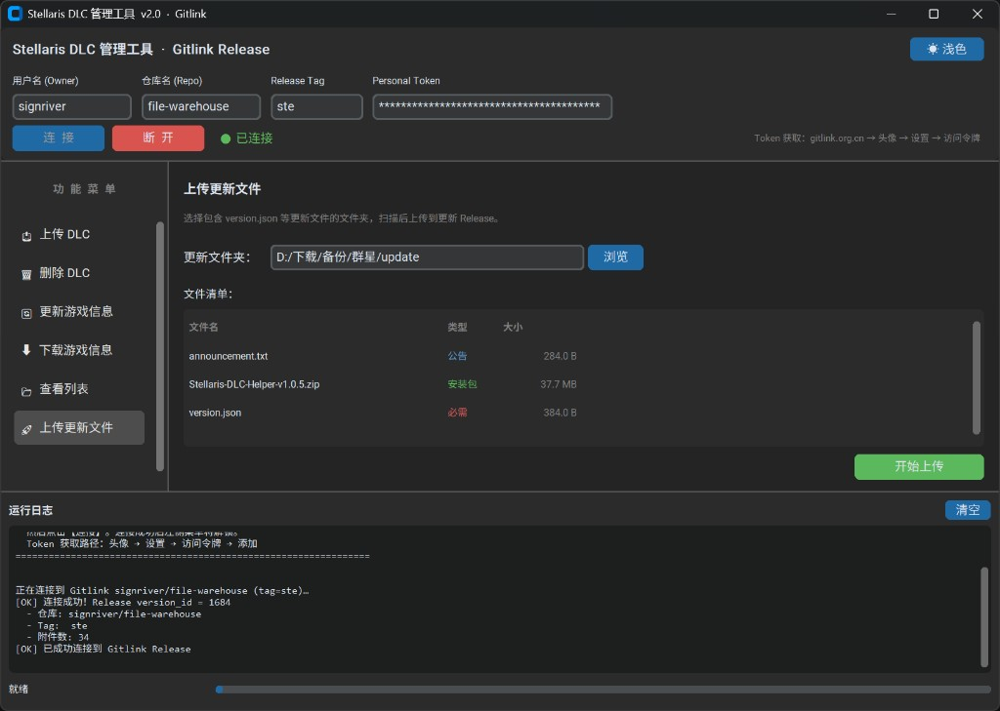

> 🚀 [点此返回主文章](/p/stellaris-dlc-helper/)

## 1. 概述

本文记录当群星（Stellaris）游戏版本或 DLC 更新时，作为服务器管理员需要在后台执行的完整操作流程，供个人备查。

## 2. 更新操作步骤

### 2.1. 第一步：压缩更新的 DLC 文件并放入备份文件夹

将本次更新涉及的 DLC 文件逐一压缩为 `.zip` 格式，命名规则与现有文件保持一致（如 `dlc036_biogenesis.zip`），然后放入压缩 DLC 备份文件夹中。

### 2.2. 第二步：打开服务器管理程序

进入 `Server_management/dist/` 目录，双击运行 `Stellaris_DLC_Manager.exe`。

### 2.3. 第三步：连接 Gitlink 仓库

程序启动后，确认顶部的**用户名（Owner）**、**仓库名（Repo）**、**Release Tag** 和 **Personal Token** 均已填写，然后点击蓝色的**连接**按钮。连接成功后左侧菜单功能将解锁。

### 2.4. 第四步：上传新增 DLC 文件

1. 点击左侧菜单的**上传 DLC** 分页
2. 点击**浏览**，选择第一步准备好的压缩 DLC 文件夹
3. 点击**扫描差异（对比服务器）**，程序会自动比对本地与服务端的文件差异，列出待上传文件
4. 确认列表无误后，点击上传，将新 DLC 同步至服务器

> 若显示「✅ 服务器已是最新，无需上传」则说明当前 DLC 文件与服务端完全一致，无需操作。

### 2.5. 第五步：更新游戏信息

点击左侧菜单的**更新游戏信息**分页，然后点击**从 Steam 获取并上传**按钮。程序会从 Steam API 拉取 Stellaris 最新的 DLC 列表，生成 `stellaris_appinfo.json` 并自动上传至服务器。

> 注意：该操作会逐个查询每个 DLC，耗时较长（约数分钟），请耐心等待。

### 2.6. 第六步：更新适配版本

在 gitlink 中更新适配版本号

### 2.7. 第七步：上传客户端更新文件（可选）

> 若本次**只有 DLC 更新、客户端程序本身没有新版本**，跳过此步骤即可。

如果客户端也有新版本，需在更新文件夹中提前放置以下三个文件：

| 文件名                            | 类型   | 说明               |
| --------------------------------- | ------ | ------------------ |
| `announcement.txt`                | 公告   | 本次更新的公告内容 |
| `Stellaris-DLC-Helper-vX.X.X.zip` | 安装包 | 新版客户端压缩包   |
| `version.json`                    | 必需   | 版本信息描述文件   |

准备好后，点击左侧菜单的**上传更新文件**分页，点击**浏览**选择更新文件夹，确认文件清单无误后点击**开始上传**。

