项目结构

<a href="images/2026-04-18-13-06-26.png" target="_blank"> 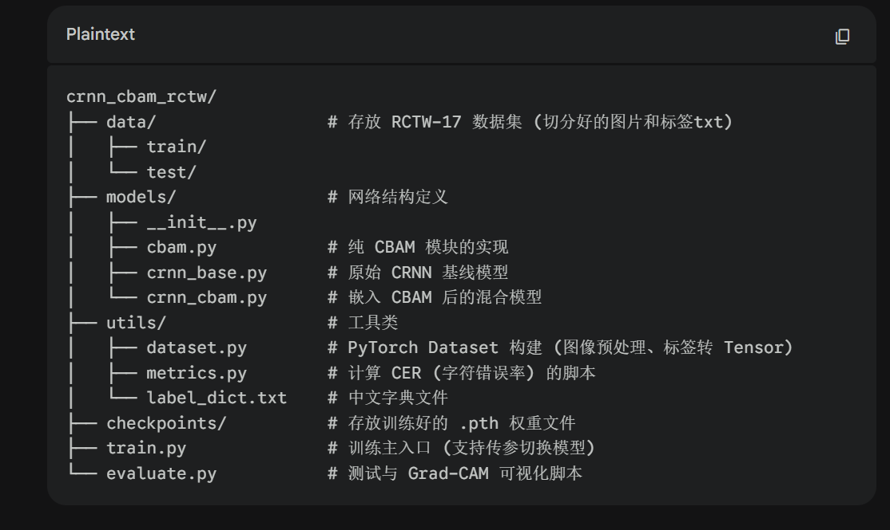 </a>

消融实验初设

<a href="images/2026-04-18-13-06-44.png" target="_blank"> 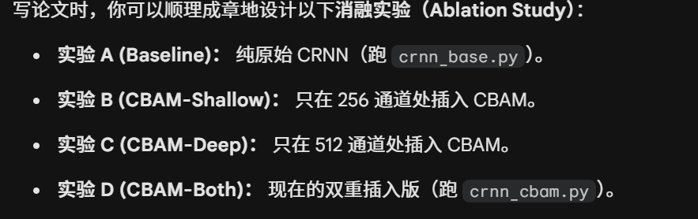 </a>

RCTW-17 下载地址

https://rctw.vlrlab.net/dataset

第一次基线训练结果：

<!-- #region CRNN 基线训练日志（最优 CER=0.6410） -->

```
(crnn_cbam) d:\project\crnn_cbam_rctw>python train.py --model crnn --epochs 50 --batch_size 64 --num_workers 8
d:\project\crnn_cbam_rctw\train.py:178: FutureWarning: `torch.cuda.amp.GradScaler(args...)` is deprecated. Please use `torch.amp.GradScaler('cuda', args...)` instead.
scaler = torch.cuda.amp.GradScaler(enabled=device.type == "cuda")
Epoch [001/50] train_loss=15.7665 val_loss=5.5935 CER=1.0000 Acc=0.0000 (89.2s)
Epoch [002/50] train_loss=5.6556 val_loss=5.5511 CER=1.0000 Acc=0.0000 (58.8s)
Epoch [003/50] train_loss=5.6175 val_loss=5.5299 CER=1.0000 Acc=0.0000 (58.3s)
Epoch [004/50] train_loss=5.5978 val_loss=5.4967 CER=1.0000 Acc=0.0000 (57.7s)
Epoch [005/50] train_loss=5.5083 val_loss=6.6944 CER=1.0000 Acc=0.0000 (57.7s)
Epoch [006/50] train_loss=5.3453 val_loss=5.2053 CER=1.0000 Acc=0.0000 (58.1s)
Epoch [007/50] train_loss=5.2161 val_loss=5.0856 CER=1.0000 Acc=0.0000 (58.2s)
Epoch [008/50] train_loss=5.1227 val_loss=5.0181 CER=0.9996 Acc=0.0020 (58.3s)
Epoch [009/50] train_loss=5.0514 val_loss=5.0321 CER=0.9984 Acc=0.0038 (57.9s)
Epoch [010/50] train_loss=4.9820 val_loss=4.9059 CER=0.9982 Acc=0.0036 (57.8s)
Epoch [011/50] train_loss=4.9270 val_loss=4.9073 CER=0.9984 Acc=0.0056 (58.1s)
Epoch [012/50] train_loss=4.8550 val_loss=4.8657 CER=0.9962 Acc=0.0038 (57.8s)
Epoch [013/50] train_loss=4.7449 val_loss=4.6870 CER=0.9847 Acc=0.0069 (58.3s)
Epoch [014/50] train_loss=4.5663 val_loss=4.4477 CER=0.9521 Acc=0.0109 (58.7s)
Epoch [015/50] train_loss=4.3081 val_loss=4.2170 CER=0.9119 Acc=0.0196 (58.5s)
Epoch [016/50] train_loss=4.0212 val_loss=3.9541 CER=0.8596 Acc=0.0252 (58.7s)
Epoch [017/50] train_loss=3.7382 val_loss=3.7434 CER=0.8326 Acc=0.0330 (58.4s)
Epoch [018/50] train_loss=3.4846 val_loss=3.5714 CER=0.8043 Acc=0.0395 (58.6s)
Epoch [019/50] train_loss=3.2662 val_loss=3.3950 CER=0.7872 Acc=0.0433 (58.5s)
Epoch [020/50] train_loss=3.0652 val_loss=3.2559 CER=0.7566 Acc=0.0493 (58.5s)
Epoch [021/50] train_loss=2.8810 val_loss=3.1669 CER=0.7489 Acc=0.0509 (58.3s)
Epoch [022/50] train_loss=2.7073 val_loss=3.0383 CER=0.7332 Acc=0.0569 (58.6s)
Epoch [023/50] train_loss=2.5568 val_loss=2.9309 CER=0.7190 Acc=0.0607 (58.4s)
Epoch [024/50] train_loss=2.4154 val_loss=2.8241 CER=0.7086 Acc=0.0652 (58.8s)
Epoch [025/50] train_loss=2.2882 val_loss=2.7530 CER=0.7021 Acc=0.0670 (58.5s)
Epoch [026/50] train_loss=2.1768 val_loss=2.7074 CER=0.6890 Acc=0.0681 (58.4s)
Epoch [027/50] train_loss=2.0739 val_loss=2.6583 CER=0.6823 Acc=0.0710 (58.5s)
Epoch [028/50] train_loss=1.9748 val_loss=2.6025 CER=0.6841 Acc=0.0699 (58.1s)
Epoch [029/50] train_loss=1.8894 val_loss=2.5931 CER=0.6717 Acc=0.0728 (58.3s)
Epoch [030/50] train_loss=1.8014 val_loss=2.5649 CER=0.6678 Acc=0.0770 (58.0s)
Epoch [031/50] train_loss=1.7293 val_loss=2.5352 CER=0.6687 Acc=0.0761 (58.2s)
Epoch [032/50] train_loss=1.6589 val_loss=2.5031 CER=0.6588 Acc=0.0804 (58.1s)
Epoch [033/50] train_loss=1.5898 val_loss=2.4959 CER=0.6603 Acc=0.0777 (58.1s)
Epoch [034/50] train_loss=1.5267 val_loss=2.4881 CER=0.6586 Acc=0.0808 (58.3s)
Epoch [035/50] train_loss=1.4629 val_loss=2.4756 CER=0.6527 Acc=0.0806 (58.1s)
Epoch [036/50] train_loss=1.4213 val_loss=2.4872 CER=0.6489 Acc=0.0821 (58.5s)
Epoch [037/50] train_loss=1.3787 val_loss=2.4669 CER=0.6494 Acc=0.0833 (58.6s)
Epoch [038/50] train_loss=1.3364 val_loss=2.4672 CER=0.6485 Acc=0.0824 (58.1s)
Epoch [039/50] train_loss=1.2970 val_loss=2.4688 CER=0.6454 Acc=0.0839 (58.2s)
Epoch [040/50] train_loss=1.2690 val_loss=2.4723 CER=0.6446 Acc=0.0842 (58.3s)
Epoch [041/50] train_loss=1.2340 val_loss=2.4562 CER=0.6455 Acc=0.0835 (58.0s)
Epoch [042/50] train_loss=1.2059 val_loss=2.4638 CER=0.6431 Acc=0.0846 (58.0s)
Epoch [043/50] train_loss=1.1911 val_loss=2.4606 CER=0.6412 Acc=0.0866 (58.3s)
Epoch [044/50] train_loss=1.1725 val_loss=2.4621 CER=0.6421 Acc=0.0857 (58.4s)
Epoch [045/50] train_loss=1.1572 val_loss=2.4633 CER=0.6420 Acc=0.0862 (58.2s)
Epoch [046/50] train_loss=1.1443 val_loss=2.4580 CER=0.6410 Acc=0.0859 (58.2s)
Epoch [047/50] train_loss=1.1408 val_loss=2.4585 CER=0.6428 Acc=0.0857 (58.0s)
Epoch [048/50] train_loss=1.1323 val_loss=2.4560 CER=0.6412 Acc=0.0866 (57.9s)
Epoch [049/50] train_loss=1.1262 val_loss=2.4575 CER=0.6414 Acc=0.0866 (58.1s)
Epoch [050/50] train_loss=1.1263 val_loss=2.4536 CER=0.6416 Acc=0.0866 (58.0s)
训练完成。最优 CER=0.6410
```

<!-- #endregion -->

第一次优化模型训练结果：

<!-- #region CRNN+CBAM 训练日志（最优 CER=0.6482） -->

```
(crnn_cbam) d:\project\crnn_cbam_rctw>python train.py --model crnn_cbam --epochs 50 --batch_size 64 --num_workers 8
d:\project\crnn_cbam_rctw\train.py:178: FutureWarning: `torch.cuda.amp.GradScaler(args...)` is deprecated. Please use `torch.amp.GradScaler('cuda', args...)` instead.
scaler = torch.cuda.amp.GradScaler(enabled=device.type == "cuda")
Epoch [001/50] train_loss=15.8792 val_loss=5.5919 CER=1.0000 Acc=0.0000 (92.9s)
Epoch [002/50] train_loss=5.6570 val_loss=5.5389 CER=1.0000 Acc=0.0000 (61.4s)
Epoch [003/50] train_loss=5.5828 val_loss=5.4170 CER=1.0000 Acc=0.0000 (61.2s)
Epoch [004/50] train_loss=5.3555 val_loss=5.3413 CER=1.0000 Acc=0.0000 (61.1s)
Epoch [005/50] train_loss=5.1837 val_loss=5.0802 CER=0.9991 Acc=0.0049 (61.4s)
Epoch [006/50] train_loss=5.0885 val_loss=5.0127 CER=0.9993 Acc=0.0036 (61.4s)
Epoch [007/50] train_loss=5.0224 val_loss=4.9801 CER=0.9991 Acc=0.0007 (61.7s)
Epoch [008/50] train_loss=4.9507 val_loss=4.8770 CER=0.9952 Acc=0.0056 (61.5s)
Epoch [009/50] train_loss=4.8757 val_loss=4.8022 CER=0.9929 Acc=0.0042 (60.9s)
Epoch [010/50] train_loss=4.7680 val_loss=4.7216 CER=0.9910 Acc=0.0049 (61.4s)
Epoch [011/50] train_loss=4.6275 val_loss=4.5521 CER=0.9549 Acc=0.0094 (61.6s)
Epoch [012/50] train_loss=4.4378 val_loss=4.4509 CER=0.9179 Acc=0.0134 (61.6s)
Epoch [013/50] train_loss=4.2253 val_loss=4.1872 CER=0.8755 Acc=0.0225 (61.3s)
Epoch [014/50] train_loss=3.9856 val_loss=3.9772 CER=0.8598 Acc=0.0272 (61.6s)
Epoch [015/50] train_loss=3.7447 val_loss=3.7428 CER=0.8248 Acc=0.0353 (60.8s)
Epoch [016/50] train_loss=3.5181 val_loss=3.6075 CER=0.8033 Acc=0.0397 (61.1s)
Epoch [017/50] train_loss=3.3084 val_loss=3.3951 CER=0.7935 Acc=0.0442 (60.8s)
Epoch [018/50] train_loss=3.1216 val_loss=3.2919 CER=0.7657 Acc=0.0513 (61.2s)
Epoch [019/50] train_loss=2.9420 val_loss=3.2417 CER=0.7730 Acc=0.0480 (60.9s)
Epoch [020/50] train_loss=2.7912 val_loss=3.1163 CER=0.7498 Acc=0.0513 (61.4s)
Epoch [021/50] train_loss=2.6512 val_loss=3.0186 CER=0.7335 Acc=0.0574 (61.1s)
Epoch [022/50] train_loss=2.5223 val_loss=2.9020 CER=0.7166 Acc=0.0598 (61.2s)
Epoch [023/50] train_loss=2.4071 val_loss=2.8980 CER=0.7083 Acc=0.0625 (61.4s)
Epoch [024/50] train_loss=2.2956 val_loss=2.8050 CER=0.7043 Acc=0.0623 (61.2s)
Epoch [025/50] train_loss=2.1999 val_loss=2.7695 CER=0.6954 Acc=0.0636 (61.2s)
Epoch [026/50] train_loss=2.1038 val_loss=2.7026 CER=0.6939 Acc=0.0679 (61.4s)
Epoch [027/50] train_loss=2.0241 val_loss=2.6399 CER=0.6834 Acc=0.0730 (61.3s)
Epoch [028/50] train_loss=1.9361 val_loss=2.6265 CER=0.6804 Acc=0.0721 (60.8s)
Epoch [029/50] train_loss=1.8679 val_loss=2.6195 CER=0.6761 Acc=0.0741 (61.3s)
Epoch [030/50] train_loss=1.7941 val_loss=2.5791 CER=0.6724 Acc=0.0732 (61.2s)
Epoch [031/50] train_loss=1.7292 val_loss=2.5897 CER=0.6751 Acc=0.0754 (61.3s)
Epoch [032/50] train_loss=1.6736 val_loss=2.5352 CER=0.6656 Acc=0.0748 (61.4s)
Epoch [033/50] train_loss=1.6154 val_loss=2.5238 CER=0.6611 Acc=0.0797 (60.9s)
Epoch [034/50] train_loss=1.5681 val_loss=2.5297 CER=0.6647 Acc=0.0788 (61.4s)
Epoch [035/50] train_loss=1.5177 val_loss=2.5143 CER=0.6569 Acc=0.0808 (61.4s)
Epoch [036/50] train_loss=1.4771 val_loss=2.5161 CER=0.6568 Acc=0.0819 (61.3s)
Epoch [037/50] train_loss=1.4430 val_loss=2.4823 CER=0.6580 Acc=0.0790 (61.4s)
Epoch [038/50] train_loss=1.4018 val_loss=2.4745 CER=0.6529 Acc=0.0833 (61.4s)
Epoch [039/50] train_loss=1.3693 val_loss=2.4867 CER=0.6561 Acc=0.0801 (61.6s)
Epoch [040/50] train_loss=1.3406 val_loss=2.4775 CER=0.6534 Acc=0.0808 (61.1s)
Epoch [041/50] train_loss=1.3133 val_loss=2.4859 CER=0.6496 Acc=0.0846 (61.1s)
Epoch [042/50] train_loss=1.2915 val_loss=2.4727 CER=0.6522 Acc=0.0839 (61.4s)
Epoch [043/50] train_loss=1.2756 val_loss=2.4690 CER=0.6500 Acc=0.0835 (61.1s)
Epoch [044/50] train_loss=1.2586 val_loss=2.4701 CER=0.6489 Acc=0.0855 (61.2s)
Epoch [045/50] train_loss=1.2423 val_loss=2.4724 CER=0.6494 Acc=0.0833 (61.0s)
Epoch [046/50] train_loss=1.2358 val_loss=2.4698 CER=0.6483 Acc=0.0842 (61.7s)
Epoch [047/50] train_loss=1.2244 val_loss=2.4693 CER=0.6482 Acc=0.0844 (61.3s)
Epoch [048/50] train_loss=1.2238 val_loss=2.4673 CER=0.6489 Acc=0.0837 (61.2s)
Epoch [049/50] train_loss=1.2188 val_loss=2.4710 CER=0.6482 Acc=0.0830 (61.3s)
Epoch [050/50] train_loss=1.2175 val_loss=2.4713 CER=0.6484 Acc=0.0833 (61.5s)
训练完成。最优 CER=0.6482
```

<!-- #endregion -->

问题原因：

<!-- #region 根因分析：字典缺字 + 静默丢弃 -->

```
一、症状速览
指标 CRNN CRNN+CBAM
best CER
0.6410
0.6482
best Acc
0.0866
0.0855
train_loss(末)
1.13
1.22
val_loss(末)
2.45
2.47
两个曲线几乎重合，CBAM 反而略差。两模型都严重过拟合（train↓val 平台），且 CER 卡在 0.64 不动 —— 这个数字非常可疑。

二、根因（最重要）：字典缺字 + 静默丢弃
我统计了 data/all/ 的 44799 个标签和 utils/label_dict.txt：

字典只有 4076 个字符（4000 汉字 + 10 数字 + 52 字母 + 14 其它）
数据里出现了 2457 个字典外字符，覆盖大量高频字和常见标点：
OOV top 20:
' ' 4334 # 3877 电 1176:1116，1049
的 862 美 758 店 708 话 646 市 638
车 633 生 633 行 622 心 609 有 606
武 578 新 538 汉 531、513 年 508
41.5% 的字符是 OOV
76.9% 的样本至少包含一个 OOV 字符
而代码里这一行：

dataset.py
Lines 100-102
def encode_label(self, text: str) -> List[int]:
"""将字符串转为 index 序列，跳过字典中不存在的字符。"""
return [self.char2idx[ch] for ch in text if ch in self.char2idx]
静默把 OOV 字符从 label 里丢掉，导致两个致命后果：

训练标签错位。比如 GT="新华书店"，字典里只有"新"，传给 CTC 的 label 就只剩 [新]，但图像还是四个字。CTCLoss 会强迫模型把整个"新华书店"图像区域只对齐到一个字，监督信号是错的。整个训练集 77% 的样本都被这样污染。
CER 评测天然不可能低。compute_metrics 里 all_gts 用的是原始 label_str（含 OOV），而模型输出空间里根本没有 OOV 字符 → 这部分错误怎么训都消不掉。CER 下界 ≈ OOV 比例 ≈ 0.41，加上对齐崩坏带来的额外错误，最终落到 0.64 完全合理。
CBAM 加不加都救不了被污染的标签，所以差异看不出来。

三、次要问题
过拟合：train_loss=1.12 vs val_loss=2.45，gap 很大，但没用 dropout、没 weight decay、增强很弱（仅 ColorJitter + ±3° 仿射）。
ResizeKeepRatio 把宽度 >512 的图直接 crop，文本却保留全长 → CTC 又一次 mismatch。所幸这种样本只有 ~1.8%，影响小。
AMP 下计算 CTCLoss：你看到 epoch 5 val_loss 突然飙到 6.69，是 AMP+CTC 早期常见的不稳定现象。CTC 对数值精度比较敏感，建议放在 fp32 下算。
torch.cuda.amp.GradScaler 已弃用，警告里提示用 torch.amp.GradScaler('cuda', ...)。
```

<!-- #endregion -->

改动汇总

<!-- #region 代码改动清单 -->

```
新增
build_dict.py — 扫描标签目录按字符频次自动生成字典，可设 --min_freq，打印覆盖率。
修改
utils/label_dict.txt — 已重新生成。从原来的 4076（OOV 41%）→ 现在 2773（训练集覆盖 99.74%，测试集 99.24%）。
utils/dataset.py
新增 oov_policy 参数：filter（默认，丢弃含 OOV 样本）/ clean（去掉 OOV 字符保留样本）/ keep（旧行为，仅复现）。
新增 max_label_len=40，过滤 CTC 时间步不够的超长样本。
扫描时打印 OOV / 过长 / 实际保留的样本数。
数据增强加强：ColorJitter 幅度↑、新增 shear、RandomPerspective(0.1, p=0.3)、GaussianBlur、RandomErasing(p=0.2)。
ResizeKeepRatio 改为按比例缩放（不再右侧裁剪），杜绝图像截断 vs 标签错位。
models/crnn_base.py / models/crnn_cbam.py
BidirectionalLSTM 增加 dropout 参数；CRNN / CRNN_CBAM 透传 dropout。
train.py
Adam → AdamW，新增 --weight_decay（默认 1e-4）。
学习率：cosine → warmup（线性）+ cosine，--warmup_epochs（默认 2）。
CTCLoss 强制在 fp32 计算（在 autocast 外做 log_softmax），杜绝早期数值不稳。
修弃用 API：torch.cuda.amp.GradScaler → torch.amp.GradScaler('cuda', ...)。
新增 --no_amp、--dropout、--oov_policy、--max_label_len CLI 参数。
训练日志加上当前 lr 打印。
打印字典 / 数据集统计信息便于排查。
```

<!-- #endregion -->

第二次基线训练结果：

<!-- #region 修复字典后 CRNN 训练日志（最优 CER=0.3797） -->

```
[字典] utils/label_dict.txt chars=2773 num_classes(含 blank)=2774
[Dataset] data\train: 总样本=40319 丢弃 (OOV)=522 丢弃 (过长>40)=58 清洗后空=0 => 实际保留=39739
[Dataset] data\test: 总样本=4480 丢弃 (OOV)=118 丢弃 (过长>40)=8 清洗后空=0 => 实际保留=4354
Epoch [001/50] lr=1.00e-03 train_loss=12.6611 val_loss=6.9154 CER=0.9906 Acc=0.0115 (90.3s)
Epoch [002/50] lr=1.00e-03 train_loss=6.9080 val_loss=6.7028 CER=0.9888 Acc=0.0092 (56.4s)
Epoch [003/50] lr=9.99e-04 train_loss=6.6303 val_loss=6.5298 CER=0.9821 Acc=0.0106 (56.1s)
Epoch [004/50] lr=9.96e-04 train_loss=6.4328 val_loss=6.4114 CER=0.9811 Acc=0.0062 (56.7s)
Epoch [005/50] lr=9.90e-04 train_loss=6.2741 val_loss=6.3681 CER=0.9820 Acc=0.0122 (57.9s)
Epoch [006/50] lr=9.83e-04 train_loss=6.1078 val_loss=6.0234 CER=0.9720 Acc=0.0149 (56.6s)
Epoch [007/50] lr=9.73e-04 train_loss=5.9040 val_loss=5.8354 CER=0.9621 Acc=0.0188 (56.5s)
Epoch [008/50] lr=9.62e-04 train_loss=5.6797 val_loss=5.6902 CER=0.9395 Acc=0.0198 (55.6s)
Epoch [009/50] lr=9.48e-04 train_loss=5.4095 val_loss=5.2945 CER=0.8528 Acc=0.0363 (55.5s)
Epoch [010/50] lr=9.33e-04 train_loss=5.0942 val_loss=5.0460 CER=0.7911 Acc=0.0528 (57.3s)
Epoch [011/50] lr=9.16e-04 train_loss=4.7764 val_loss=4.7567 CER=0.7415 Acc=0.0673 (57.1s)
Epoch [012/50] lr=8.97e-04 train_loss=4.4889 val_loss=4.4696 CER=0.7076 Acc=0.0822 (56.1s)
Epoch [013/50] lr=8.76e-04 train_loss=4.2322 val_loss=4.2380 CER=0.6620 Acc=0.0939 (56.1s)
Epoch [014/50] lr=8.54e-04 train_loss=3.9945 val_loss=4.1467 CER=0.6417 Acc=0.1040 (56.7s)
Epoch [015/50] lr=8.30e-04 train_loss=3.7948 val_loss=3.9736 CER=0.6040 Acc=0.1233 (56.1s)
Epoch [016/50] lr=8.04e-04 train_loss=3.5940 val_loss=3.7801 CER=0.5785 Acc=0.1371 (56.3s)
Epoch [017/50] lr=7.78e-04 train_loss=3.4227 val_loss=3.6601 CER=0.5583 Acc=0.1491 (56.4s)
Epoch [018/50] lr=7.50e-04 train_loss=3.2576 val_loss=3.6328 CER=0.5595 Acc=0.1442 (56.2s)
Epoch [019/50] lr=7.21e-04 train_loss=3.1006 val_loss=3.4817 CER=0.5269 Acc=0.1663 (55.4s)
Epoch [020/50] lr=6.91e-04 train_loss=2.9721 val_loss=3.3976 CER=0.5120 Acc=0.1752 (55.8s)
Epoch [021/50] lr=6.61e-04 train_loss=2.8484 val_loss=3.2898 CER=0.4903 Acc=0.1950 (56.1s)
Epoch [022/50] lr=6.29e-04 train_loss=2.7305 val_loss=3.2509 CER=0.4771 Acc=0.2005 (56.0s)
Epoch [023/50] lr=5.98e-04 train_loss=2.6329 val_loss=3.1908 CER=0.4696 Acc=0.2072 (56.0s)
Epoch [024/50] lr=5.65e-04 train_loss=2.5384 val_loss=3.1367 CER=0.4605 Acc=0.2230 (57.2s)
Epoch [025/50] lr=5.33e-04 train_loss=2.4375 val_loss=3.0791 CER=0.4499 Acc=0.2294 (56.5s)
Epoch [026/50] lr=5.00e-04 train_loss=2.3492 val_loss=3.0649 CER=0.4453 Acc=0.2379 (56.5s)
Epoch [027/50] lr=4.67e-04 train_loss=2.2845 val_loss=3.0485 CER=0.4385 Acc=0.2478 (56.7s)
Epoch [028/50] lr=4.35e-04 train_loss=2.2078 val_loss=2.9836 CER=0.4296 Acc=0.2563 (56.4s)
Epoch [029/50] lr=4.02e-04 train_loss=2.1443 val_loss=2.9835 CER=0.4259 Acc=0.2545 (56.8s)
Epoch [030/50] lr=3.71e-04 train_loss=2.0794 val_loss=2.9384 CER=0.4170 Acc=0.2602 (56.2s)
Epoch [031/50] lr=3.39e-04 train_loss=2.0178 val_loss=2.9088 CER=0.4107 Acc=0.2618 (57.0s)
Epoch [032/50] lr=3.09e-04 train_loss=1.9712 val_loss=2.8688 CER=0.4070 Acc=0.2657 (56.5s)
Epoch [033/50] lr=2.79e-04 train_loss=1.9142 val_loss=2.8649 CER=0.4052 Acc=0.2729 (56.8s)
Epoch [034/50] lr=2.50e-04 train_loss=1.8734 val_loss=2.8599 CER=0.4014 Acc=0.2761 (56.0s)
Epoch [035/50] lr=2.22e-04 train_loss=1.8299 val_loss=2.8405 CER=0.4008 Acc=0.2814 (55.8s)
Epoch [036/50] lr=1.96e-04 train_loss=1.7968 val_loss=2.8289 CER=0.3967 Acc=0.2823 (55.8s)
Epoch [037/50] lr=1.70e-04 train_loss=1.7590 val_loss=2.8180 CER=0.3926 Acc=0.2830 (57.1s)
Epoch [038/50] lr=1.46e-04 train_loss=1.7219 val_loss=2.8012 CER=0.3896 Acc=0.2880 (56.7s)
Epoch [039/50] lr=1.24e-04 train_loss=1.6897 val_loss=2.8089 CER=0.3885 Acc=0.2876 (56.5s)
Epoch [040/50] lr=1.03e-04 train_loss=1.6670 val_loss=2.8059 CER=0.3885 Acc=0.2880 (56.8s)
Epoch [041/50] lr=8.43e-05 train_loss=1.6483 val_loss=2.7902 CER=0.3866 Acc=0.2894 (58.1s)
Epoch [042/50] lr=6.70e-05 train_loss=1.6199 val_loss=2.7840 CER=0.3816 Acc=0.2960 (57.4s)
Epoch [043/50] lr=5.16e-05 train_loss=1.6079 val_loss=2.7854 CER=0.3840 Acc=0.2947 (57.1s)
Epoch [044/50] lr=3.81e-05 train_loss=1.5928 val_loss=2.7799 CER=0.3825 Acc=0.2944 (57.7s)
Epoch [045/50] lr=2.65e-05 train_loss=1.5811 val_loss=2.7745 CER=0.3815 Acc=0.2947 (57.6s)
Epoch [046/50] lr=1.70e-05 train_loss=1.5826 val_loss=2.7712 CER=0.3804 Acc=0.2949 (56.2s)
Epoch [047/50] lr=9.61e-06 train_loss=1.5627 val_loss=2.7715 CER=0.3807 Acc=0.2963 (57.1s)
Epoch [048/50] lr=4.28e-06 train_loss=1.5611 val_loss=2.7698 CER=0.3799 Acc=0.2972 (56.8s)
Epoch [049/50] lr=1.07e-06 train_loss=1.5554 val_loss=2.7689 CER=0.3806 Acc=0.2960 (56.9s)
Epoch [050/50] lr=0.00e+00 train_loss=1.5559 val_loss=2.7679 CER=0.3797 Acc=0.2977 (57.3s)
训练完成。最优 CER=0.3797
```

<!-- #endregion -->

对比：

<a href="images/2026-04-19-06-06-04.png" target="_blank"> 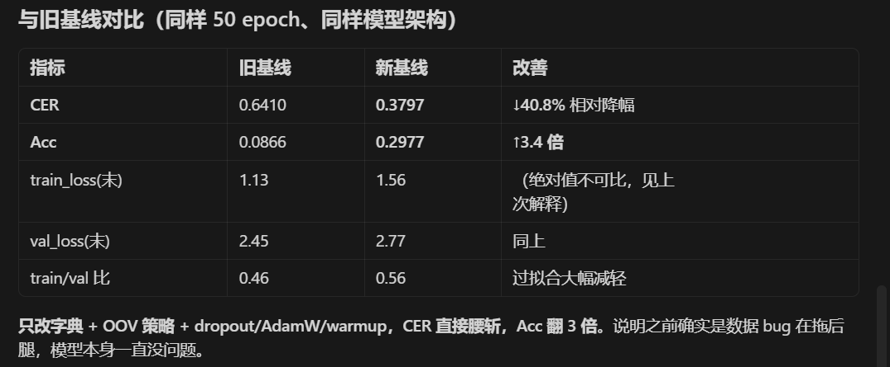 </a>

第二次 vanilla CBAM 训练结果

<!-- #region xxx 训练日志（最优 CER=0.4661） -->

```
[字典] utils/label_dict.txt chars=2773 num_classes(含 blank)=2774
[Dataset] data\train: 总样本=40319 丢弃 (OOV)=522 丢弃 (过长>40)=58 清洗后空=0 => 实际保留=39739
[Dataset] data\test: 总样本=4480 丢弃 (OOV)=118 丢弃 (过长>40)=8 清洗后空=0 => 实际保留=4354
Epoch [001/50] lr=1.00e-03 train_loss=12.6027 val_loss=6.9530 CER=0.9914 Acc=0.0085 (93.2s)
Epoch [002/50] lr=1.00e-03 train_loss=6.9671 val_loss=6.9428 CER=0.9922 Acc=0.0078 (61.2s)
Epoch [003/50] lr=9.99e-04 train_loss=6.8799 val_loss=6.8771 CER=0.9918 Acc=0.0108 (62.1s)
Epoch [004/50] lr=9.96e-04 train_loss=6.8345 val_loss=6.8710 CER=0.9919 Acc=0.0115 (61.8s)
Epoch [005/50] lr=9.90e-04 train_loss=6.8007 val_loss=6.8714 CER=0.9938 Acc=0.0101 (61.6s)
Epoch [006/50] lr=9.83e-04 train_loss=6.7695 val_loss=6.8419 CER=0.9932 Acc=0.0103 (61.9s)
Epoch [007/50] lr=9.73e-04 train_loss=6.6963 val_loss=6.8385 CER=0.9974 Acc=0.0085 (62.5s)
Epoch [008/50] lr=9.62e-04 train_loss=6.5459 val_loss=6.6408 CER=0.9862 Acc=0.0117 (60.6s)
Epoch [009/50] lr=9.48e-04 train_loss=6.4296 val_loss=6.5020 CER=0.9818 Acc=0.0136 (61.6s)
Epoch [010/50] lr=9.33e-04 train_loss=6.3204 val_loss=6.4402 CER=0.9837 Acc=0.0108 (63.4s)
Epoch [011/50] lr=9.16e-04 train_loss=6.2272 val_loss=6.3300 CER=0.9750 Acc=0.0129 (62.1s)
Epoch [012/50] lr=8.97e-04 train_loss=6.1273 val_loss=6.2499 CER=0.9731 Acc=0.0129 (61.7s)
Epoch [013/50] lr=8.76e-04 train_loss=6.0119 val_loss=6.0383 CER=0.9675 Acc=0.0152 (60.2s)
Epoch [014/50] lr=8.54e-04 train_loss=5.8469 val_loss=5.8462 CER=0.9454 Acc=0.0163 (60.7s)
Epoch [015/50] lr=8.30e-04 train_loss=5.6285 val_loss=5.6270 CER=0.9057 Acc=0.0186 (61.0s)
Epoch [016/50] lr=8.04e-04 train_loss=5.3958 val_loss=5.3820 CER=0.8564 Acc=0.0198 (61.5s)
Epoch [017/50] lr=7.78e-04 train_loss=5.1592 val_loss=5.1239 CER=0.8193 Acc=0.0271 (61.2s)
Epoch [018/50] lr=7.50e-04 train_loss=4.9365 val_loss=4.9065 CER=0.7803 Acc=0.0372 (62.7s)
Epoch [019/50] lr=7.21e-04 train_loss=4.7051 val_loss=4.7351 CER=0.7455 Acc=0.0452 (60.8s)
Epoch [020/50] lr=6.91e-04 train_loss=4.5040 val_loss=4.5221 CER=0.7064 Acc=0.0613 (61.7s)
Epoch [021/50] lr=6.61e-04 train_loss=4.3149 val_loss=4.4327 CER=0.6913 Acc=0.0657 (63.6s)
Epoch [022/50] lr=6.29e-04 train_loss=4.1361 val_loss=4.2466 CER=0.6502 Acc=0.0802 (62.9s)
Epoch [023/50] lr=5.98e-04 train_loss=3.9783 val_loss=4.1766 CER=0.6430 Acc=0.0891 (62.3s)
Epoch [024/50] lr=5.65e-04 train_loss=3.8242 val_loss=4.0129 CER=0.6165 Acc=0.0944 (62.6s)
Epoch [025/50] lr=5.33e-04 train_loss=3.6911 val_loss=3.9084 CER=0.5988 Acc=0.1073 (62.2s)
Epoch [026/50] lr=5.00e-04 train_loss=3.5514 val_loss=3.8611 CER=0.5878 Acc=0.1125 (62.0s)
Epoch [027/50] lr=4.67e-04 train_loss=3.4454 val_loss=3.7541 CER=0.5657 Acc=0.1247 (61.7s)
Epoch [028/50] lr=4.35e-04 train_loss=3.3367 val_loss=3.6976 CER=0.5552 Acc=0.1369 (61.2s)
Epoch [029/50] lr=4.02e-04 train_loss=3.2370 val_loss=3.6290 CER=0.5435 Acc=0.1412 (63.0s)
Epoch [030/50] lr=3.71e-04 train_loss=3.1542 val_loss=3.5849 CER=0.5303 Acc=0.1454 (61.5s)
Epoch [031/50] lr=3.39e-04 train_loss=3.0763 val_loss=3.5892 CER=0.5298 Acc=0.1504 (61.3s)
Epoch [032/50] lr=3.09e-04 train_loss=3.0095 val_loss=3.4967 CER=0.5132 Acc=0.1644 (60.8s)
Epoch [033/50] lr=2.79e-04 train_loss=2.9425 val_loss=3.4476 CER=0.5080 Acc=0.1702 (61.1s)
Epoch [034/50] lr=2.50e-04 train_loss=2.8713 val_loss=3.4223 CER=0.4998 Acc=0.1706 (61.7s)
Epoch [035/50] lr=2.22e-04 train_loss=2.8202 val_loss=3.4115 CER=0.4915 Acc=0.1716 (61.6s)
Epoch [036/50] lr=1.96e-04 train_loss=2.7673 val_loss=3.3658 CER=0.4892 Acc=0.1796 (62.0s)
Epoch [037/50] lr=1.70e-04 train_loss=2.7245 val_loss=3.3615 CER=0.4855 Acc=0.1863 (61.8s)
Epoch [038/50] lr=1.46e-04 train_loss=2.6804 val_loss=3.3310 CER=0.4779 Acc=0.1860 (61.8s)
Epoch [039/50] lr=1.24e-04 train_loss=2.6518 val_loss=3.3081 CER=0.4786 Acc=0.1840 (63.4s)
Epoch [040/50] lr=1.03e-04 train_loss=2.6216 val_loss=3.2991 CER=0.4780 Acc=0.1897 (62.1s)
Epoch [041/50] lr=8.43e-05 train_loss=2.5880 val_loss=3.2877 CER=0.4732 Acc=0.1932 (63.2s)
Epoch [042/50] lr=6.70e-05 train_loss=2.5637 val_loss=3.2808 CER=0.4721 Acc=0.1961 (61.7s)
Epoch [043/50] lr=5.16e-05 train_loss=2.5500 val_loss=3.2664 CER=0.4703 Acc=0.1975 (61.8s)
Epoch [044/50] lr=3.81e-05 train_loss=2.5282 val_loss=3.2698 CER=0.4668 Acc=0.1975 (63.0s)
Epoch [045/50] lr=2.65e-05 train_loss=2.5127 val_loss=3.2667 CER=0.4681 Acc=0.1998 (62.1s)
Epoch [046/50] lr=1.70e-05 train_loss=2.5040 val_loss=3.2575 CER=0.4668 Acc=0.2000 (62.6s)
Epoch [047/50] lr=9.61e-06 train_loss=2.4934 val_loss=3.2480 CER=0.4665 Acc=0.2021 (61.9s)
Epoch [048/50] lr=4.28e-06 train_loss=2.4882 val_loss=3.2508 CER=0.4664 Acc=0.1994 (63.5s)
Epoch [049/50] lr=1.07e-06 train_loss=2.4891 val_loss=3.2502 CER=0.4662 Acc=0.2017 (62.1s)
Epoch [050/50] lr=0.00e+00 train_loss=2.4761 val_loss=3.2499 CER=0.4661 Acc=0.2000 (62.6s)
训练完成。最优 CER=0.4661
```

<!-- #endregion -->

第二次 残差 CRNN+CBAM

```
[Run] 模型=crnn_cbam  run_name=crnn_cbam_residual  cbam_residual=True  cbam_init_gate=0.5
[字典] utils/label_dict.txt  chars=2773  num_classes(含 blank)=2774
[Dataset] data\train: 总样本=40319  丢弃 (OOV)=522  丢弃 (过长>40)=58  清洗后空=0  => 实际保留=39739
[Dataset] data\test: 总样本=4480  丢弃 (OOV)=118  丢弃 (过长>40)=8  清洗后空=0  => 实际保留=4354
Epoch [001/50] lr=1.00e-03  train_loss=12.2400  val_loss=6.9379  CER=0.9911  Acc=0.0083  (107.7s)
Epoch [002/50] lr=1.00e-03  train_loss=6.8657  val_loss=6.6628  CER=0.9825  Acc=0.0106  (71.8s)
Epoch [003/50] lr=9.99e-04  train_loss=6.5697  val_loss=6.6812  CER=0.9877  Acc=0.0101  (68.7s)
Epoch [004/50] lr=9.96e-04  train_loss=6.3817  val_loss=6.3645  CER=0.9800  Acc=0.0122  (70.7s)
Epoch [005/50] lr=9.90e-04  train_loss=6.2060  val_loss=6.2729  CER=0.9732  Acc=0.0142  (72.8s)
Epoch [006/50] lr=9.83e-04  train_loss=6.0062  val_loss=5.8527  CER=0.9509  Acc=0.0207  (73.5s)
Epoch [007/50] lr=9.73e-04  train_loss=5.7739  val_loss=5.6283  CER=0.8983  Acc=0.0248  (75.6s)
Epoch [008/50] lr=9.62e-04  train_loss=5.5189  val_loss=5.4002  CER=0.8564  Acc=0.0282  (73.2s)
Epoch [009/50] lr=9.48e-04  train_loss=5.2785  val_loss=5.2297  CER=0.8222  Acc=0.0388  (76.2s)
Epoch [010/50] lr=9.33e-04  train_loss=5.0422  val_loss=5.1696  CER=0.8251  Acc=0.0420  (74.4s)
Epoch [011/50] lr=9.16e-04  train_loss=4.8059  val_loss=4.7671  CER=0.7490  Acc=0.0661  (72.2s)
Epoch [012/50] lr=8.97e-04  train_loss=4.5699  val_loss=4.5612  CER=0.7125  Acc=0.0776  (72.3s)
Epoch [013/50] lr=8.76e-04  train_loss=4.3284  val_loss=4.3902  CER=0.6878  Acc=0.0914  (71.2s)
Epoch [014/50] lr=8.54e-04  train_loss=4.1247  val_loss=4.2159  CER=0.6559  Acc=0.1008  (74.6s)
Epoch [015/50] lr=8.30e-04  train_loss=3.9244  val_loss=4.0933  CER=0.6330  Acc=0.1109  (72.4s)
Epoch [016/50] lr=8.04e-04  train_loss=3.7612  val_loss=3.9615  CER=0.6155  Acc=0.1233  (73.7s)
Epoch [017/50] lr=7.78e-04  train_loss=3.6039  val_loss=3.8504  CER=0.5933  Acc=0.1316  (73.4s)
Epoch [018/50] lr=7.50e-04  train_loss=3.4411  val_loss=3.7422  CER=0.5738  Acc=0.1454  (74.4s)
Epoch [019/50] lr=7.21e-04  train_loss=3.3100  val_loss=3.6510  CER=0.5580  Acc=0.1500  (77.0s)
Epoch [020/50] lr=6.91e-04  train_loss=3.1782  val_loss=3.6002  CER=0.5490  Acc=0.1610  (72.0s)
Epoch [021/50] lr=6.61e-04  train_loss=3.0554  val_loss=3.5358  CER=0.5326  Acc=0.1693  (70.3s)
Epoch [022/50] lr=6.29e-04  train_loss=2.9478  val_loss=3.4866  CER=0.5197  Acc=0.1789  (70.6s)
Epoch [023/50] lr=5.98e-04  train_loss=2.8422  val_loss=3.4005  CER=0.5102  Acc=0.1899  (69.9s)
Epoch [024/50] lr=5.65e-04  train_loss=2.7512  val_loss=3.3485  CER=0.4964  Acc=0.1952  (70.2s)
Epoch [025/50] lr=5.33e-04  train_loss=2.6591  val_loss=3.3125  CER=0.4893  Acc=0.2023  (70.4s)
Epoch [026/50] lr=5.00e-04  train_loss=2.5814  val_loss=3.2550  CER=0.4762  Acc=0.2147  (69.9s)
Epoch [027/50] lr=4.67e-04  train_loss=2.5041  val_loss=3.2135  CER=0.4683  Acc=0.2170  (70.3s)
Epoch [028/50] lr=4.35e-04  train_loss=2.4264  val_loss=3.2348  CER=0.4675  Acc=0.2203  (69.5s)
Epoch [029/50] lr=4.02e-04  train_loss=2.3537  val_loss=3.1774  CER=0.4585  Acc=0.2288  (70.1s)
Epoch [030/50] lr=3.71e-04  train_loss=2.2970  val_loss=3.1334  CER=0.4552  Acc=0.2352  (70.0s)
Epoch [031/50] lr=3.39e-04  train_loss=2.2395  val_loss=3.1455  CER=0.4484  Acc=0.2430  (70.1s)
Epoch [032/50] lr=3.09e-04  train_loss=2.1808  val_loss=3.1254  CER=0.4450  Acc=0.2416  (70.2s)
Epoch [033/50] lr=2.79e-04  train_loss=2.1314  val_loss=3.0692  CER=0.4371  Acc=0.2455  (70.2s)
Epoch [034/50] lr=2.50e-04  train_loss=2.0850  val_loss=3.0734  CER=0.4408  Acc=0.2506  (70.4s)
Epoch [035/50] lr=2.22e-04  train_loss=2.0356  val_loss=3.0271  CER=0.4305  Acc=0.2547  (70.5s)
Epoch [036/50] lr=1.96e-04  train_loss=2.0008  val_loss=3.0158  CER=0.4295  Acc=0.2545  (70.2s)
Epoch [037/50] lr=1.70e-04  train_loss=1.9624  val_loss=2.9990  CER=0.4272  Acc=0.2591  (70.3s)
Epoch [038/50] lr=1.46e-04  train_loss=1.9346  val_loss=3.0089  CER=0.4271  Acc=0.2637  (70.1s)
Epoch [039/50] lr=1.24e-04  train_loss=1.9040  val_loss=2.9913  CER=0.4250  Acc=0.2609  (70.3s)
Epoch [040/50] lr=1.03e-04  train_loss=1.8814  val_loss=2.9776  CER=0.4196  Acc=0.2660  (70.2s)
Epoch [041/50] lr=8.43e-05  train_loss=1.8531  val_loss=2.9694  CER=0.4184  Acc=0.2685  (69.9s)
Epoch [042/50] lr=6.70e-05  train_loss=1.8303  val_loss=2.9588  CER=0.4176  Acc=0.2699  (70.0s)
Epoch [043/50] lr=5.16e-05  train_loss=1.8116  val_loss=2.9548  CER=0.4154  Acc=0.2722  (70.5s)
Epoch [044/50] lr=3.81e-05  train_loss=1.7974  val_loss=2.9578  CER=0.4151  Acc=0.2729  (70.3s)
Epoch [045/50] lr=2.65e-05  train_loss=1.7837  val_loss=2.9530  CER=0.4141  Acc=0.2719  (70.8s)
Epoch [046/50] lr=1.70e-05  train_loss=1.7768  val_loss=2.9508  CER=0.4140  Acc=0.2729  (69.8s)
Epoch [047/50] lr=9.61e-06  train_loss=1.7666  val_loss=2.9496  CER=0.4143  Acc=0.2724  (70.2s)
Epoch [048/50] lr=4.28e-06  train_loss=1.7659  val_loss=2.9492  CER=0.4135  Acc=0.2726  (70.4s)
Epoch [049/50] lr=1.07e-06  train_loss=1.7622  val_loss=2.9472  CER=0.4137  Acc=0.2738  (69.5s)
Epoch [050/50] lr=0.00e+00  train_loss=1.7543  val_loss=2.9471  CER=0.4135  Acc=0.2724  (69.7s)
训练完成。最优 CER=0.4135
```

实验对比

<a href="images/2026-04-19-08-23-52.png" target="_blank"> 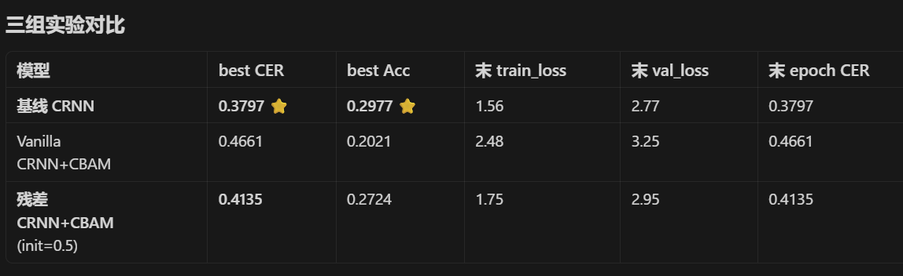 </a>

为什么 CBAM 这次没赢
CBAM 是给图像分类设计的，spatial attention 假设"图像里有需要重点关注的区域"。OCR 里整张图都是字，没什么"背景"要忽略。
空间注意力的位置太靠后：你看 CNN 经过两次 MaxPool((2,1)) 后高度只剩 H=2，再来个 7×7 spatial 卷积，根本没有空间维度可"attend"。
CRNN 自带时序注意力：双向 LSTM + CTC 已经在做"序列对齐"，CBAM 的功能跟它有冗余。
额外参数没换来回报：CBAM 多了 ~135K 参数，但同样 50 epoch 内消化不了。


实验记录

<a href="images/2026-04-20-00-04-03.png" target="_blank"> 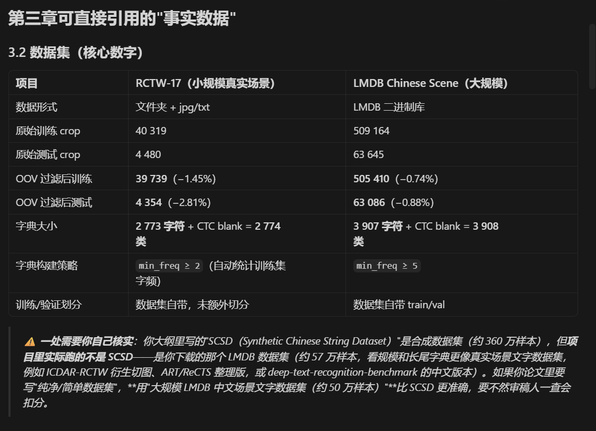 </a>

<a href="images/2026-04-20-00-04-25.png" target="_blank"> 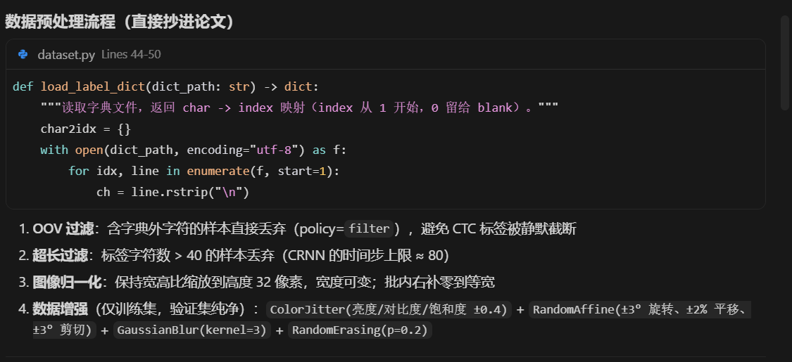 </a>

<a href="images/2026-04-20-00-04-42.png" target="_blank"> 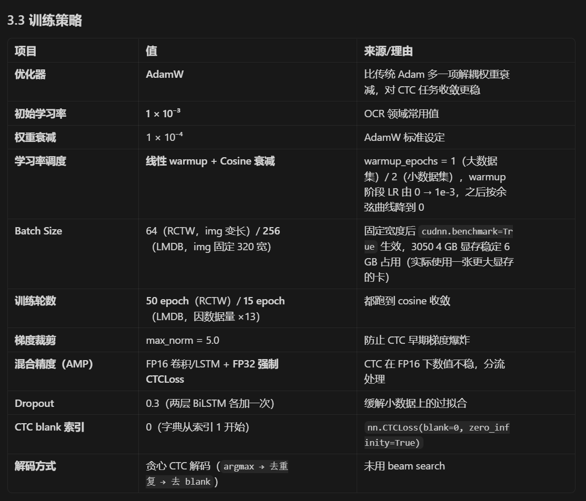 </a>

<a href="images/2026-04-20-00-05-25.png" target="_blank"> 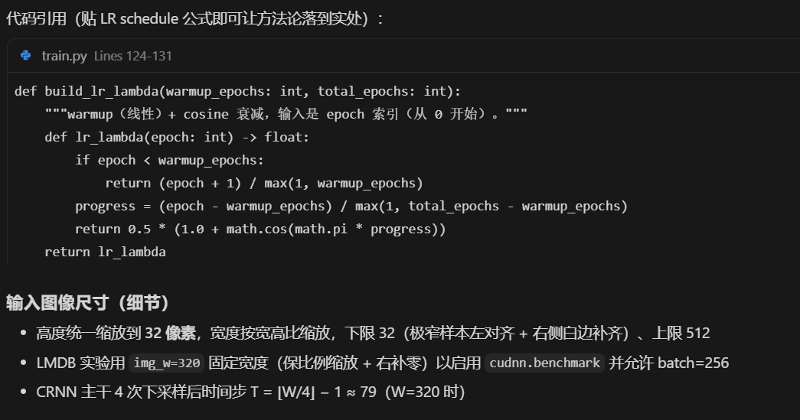 </a>

<a href="images/2026-04-20-00-05-41.png" target="_blank"> 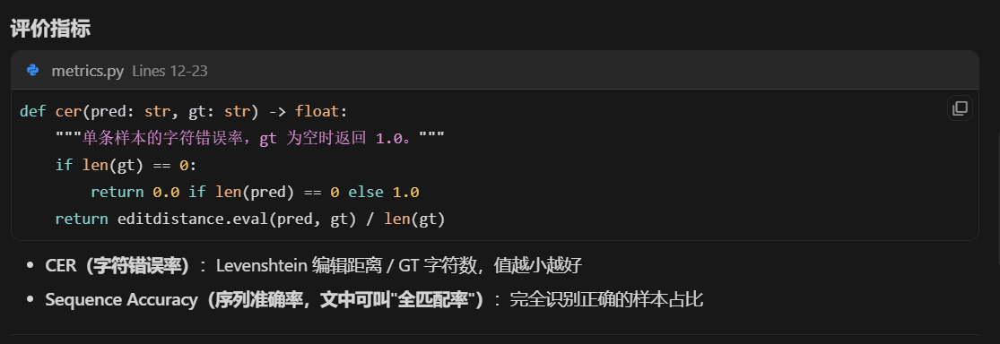 </a>

<a href="images/2026-04-20-00-06-02.png" target="_blank"> 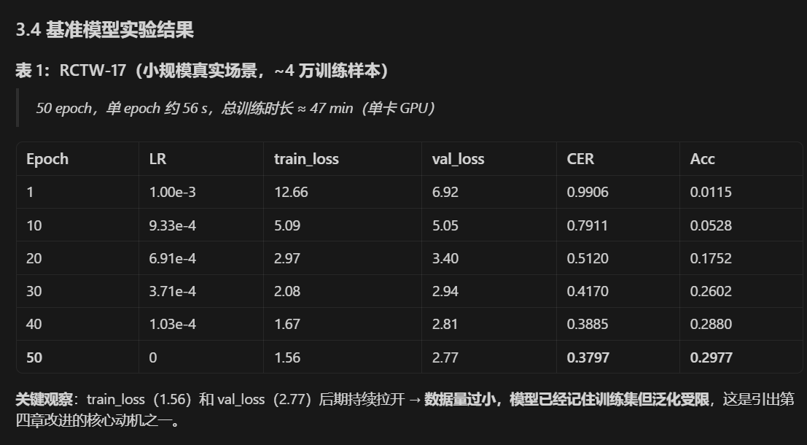 </a>

<a href="images/2026-04-20-00-07-09.png" target="_blank">  </a>

<a href="images/2026-04-20-00-07-33.png" target="_blank"> 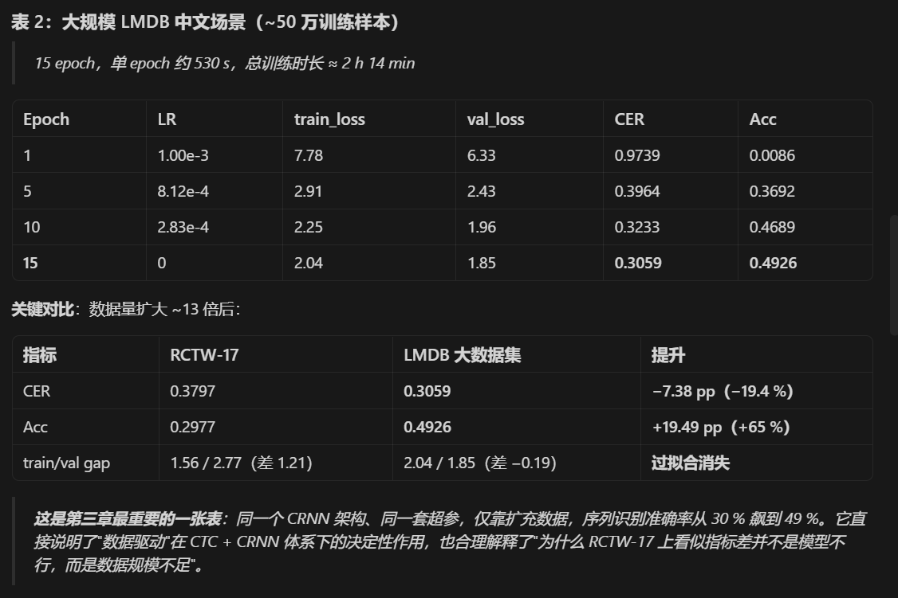 </a>

<a href="images/2026-04-20-00-08-07.png" target="_blank"> 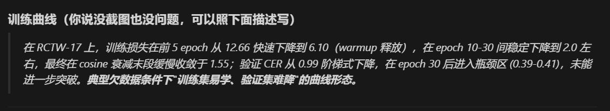 </a>

<a href="images/2026-04-20-00-08-30.png" target="_blank"> 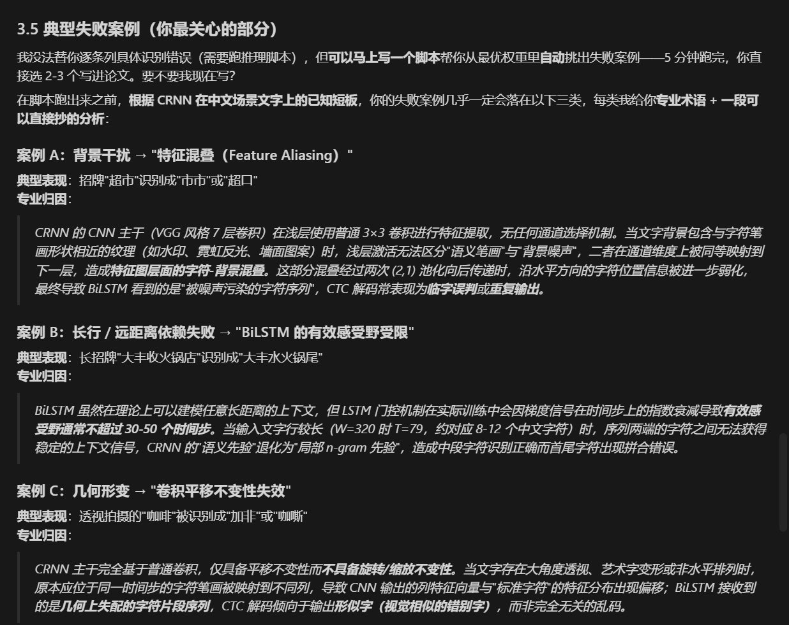 </a>
