## 1. 前言

本教程将指导你如何在 Cursor 编辑器中配置阿里云百炼 API，让你可以使用通义千问等国产大模型进行代码编写和 Agent 任务。

> **重要提示**：配置阿里云百炼的请求地址和 API Key 后，Cursor 将仅能调用阿里云百炼平台的模型。如需切换回其他模型提供商（如 OpenAI），需要关闭 **OpenAI API Key** 和 **Override OpenAI Base URL** 设置。请在接入前根据实际需求谨慎选择。

## 2. 获取阿里云百炼 API Key

1. 登录[阿里云百炼平台](https://bailian.console.aliyun.com/)
2. 进入 **Coding Plan** 界面
3. 选择合适的套餐并完成购买

<a href="images/2026-03-03-18-06-50.png" target="_blank"> 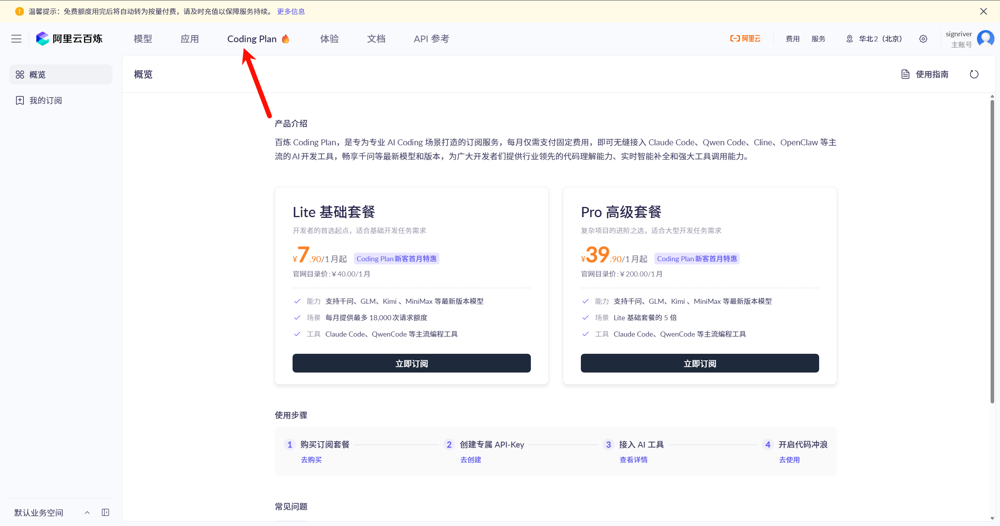 </a>

4. 进入 **我的订阅** 页面
5. 创建新的 API Key
6. 复制生成的 API Key 备用

<a href="images/2026-03-03-18-14-21.png" target="_blank"> 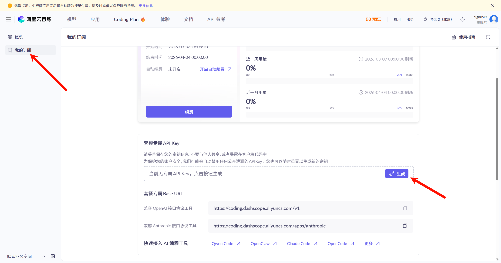 </a>

## 3. 在 Cursor 中配置阿里云百炼

### 3.1. 打开模型设置

1. 打开 Cursor 编辑器
2. 点击右上角设置按钮，进入 **Settings**

<a href="images/2026-03-03-18-15-25.png" target="_blank"> 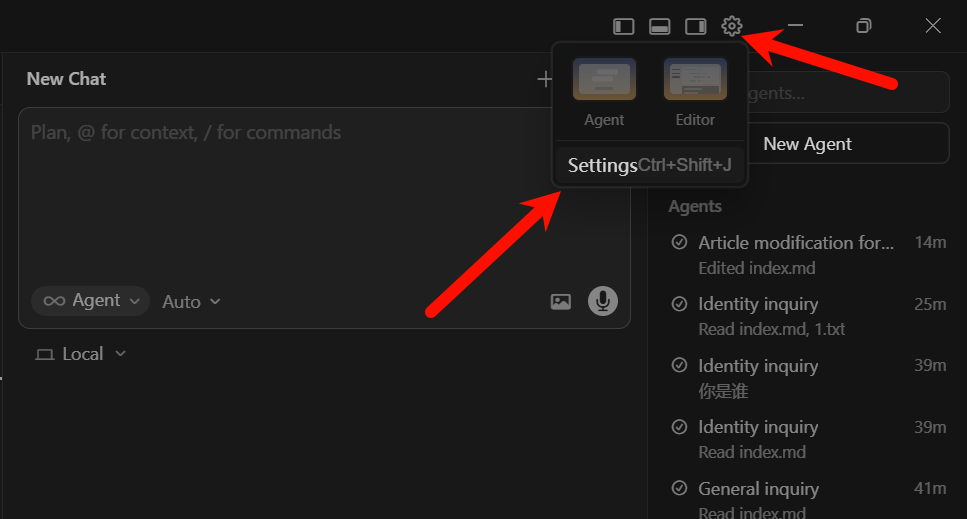 </a>

3. 在左侧导航栏找到 **Models** 标签页

### 3.2. 配置 API Key 和请求地址

1. 点击 **API Keys** 展开 API 设置区域
2. 开启 **OpenAI API Key** 开关，在下方文本框中输入刚才复制的 API Key
3. 开启 **Override OpenAI Base URL** 开关，在下方文本框输入：



<a href="images/2026-03-03-18-21-54.png" target="_blank"> 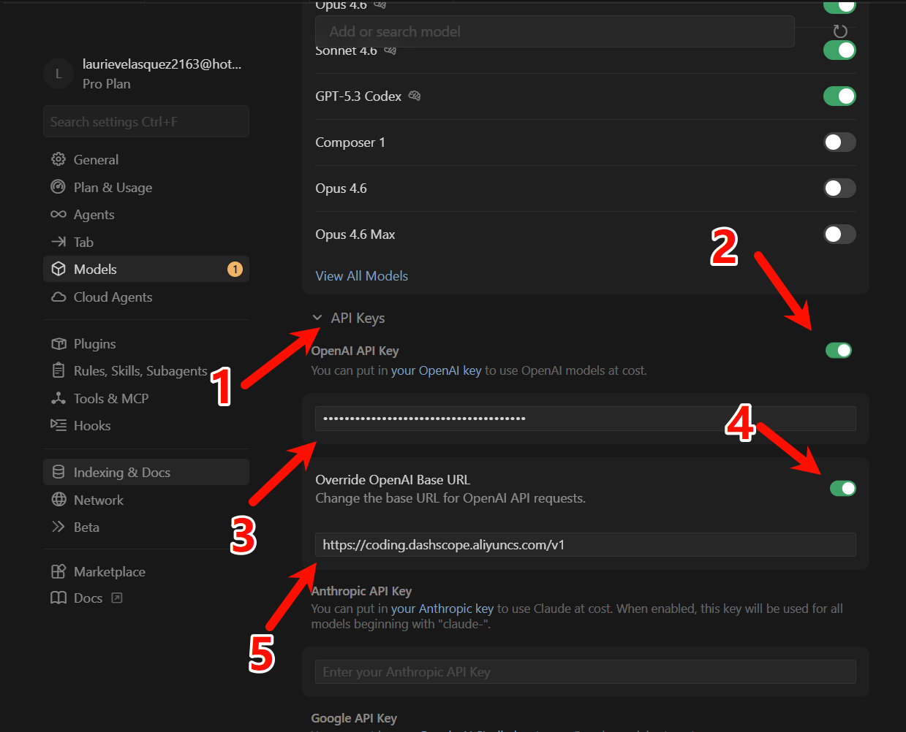 </a>

### 3.3. 添加自定义模型

1. 点击 **View All Models** 按钮
2. 滚动到页面底部

<a href="images/2026-03-03-18-23-44.png" target="_blank"> 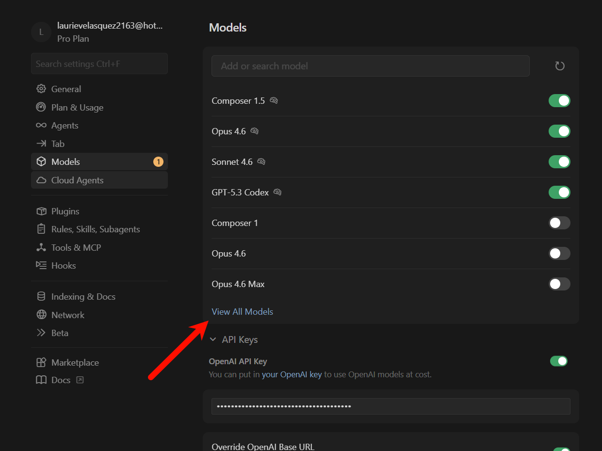 </a>

3. 点击 **Add Custom Model** 按钮
4. 依次填入模型名称并点击 **Add** 添加

<a href="images/2026-03-03-18-24-50.png" target="_blank"> 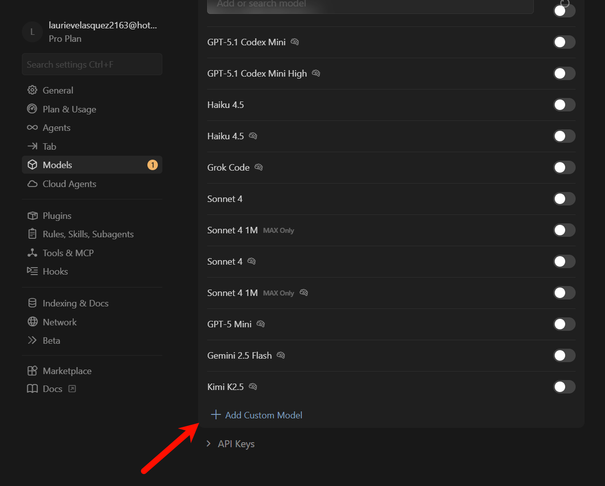 </a>

#### 3.3.1. 可用模型列表

| 品牌    | 模型                                       | 模型能力                     |
| ------- | ------------------------------------------ | ---------------------------- |
| 千问    |          | 文本生成、深度思考、视觉理解 |
| 千问    |  | 文本生成、深度思考           |
| 千问    |      | 文本生成                     |
| 千问    |      | 文本生成                     |
| 智谱    |                 | 文本生成、深度思考           |
| 智谱    |               | 文本生成、深度思考           |
| Kimi    |             | 文本生成、深度思考、视觉理解 |
| MiniMax |          | 文本生成、深度思考           |

> **推荐配置**：
>
> - **日常使用**：（综合性能最佳）
> - **复杂问题**：（处理高难度任务）

5. 添加完成后，开启模型对应的开关（显示绿色表示已启用）

<a href="images/2026-03-03-18-32-08.png" target="_blank"> 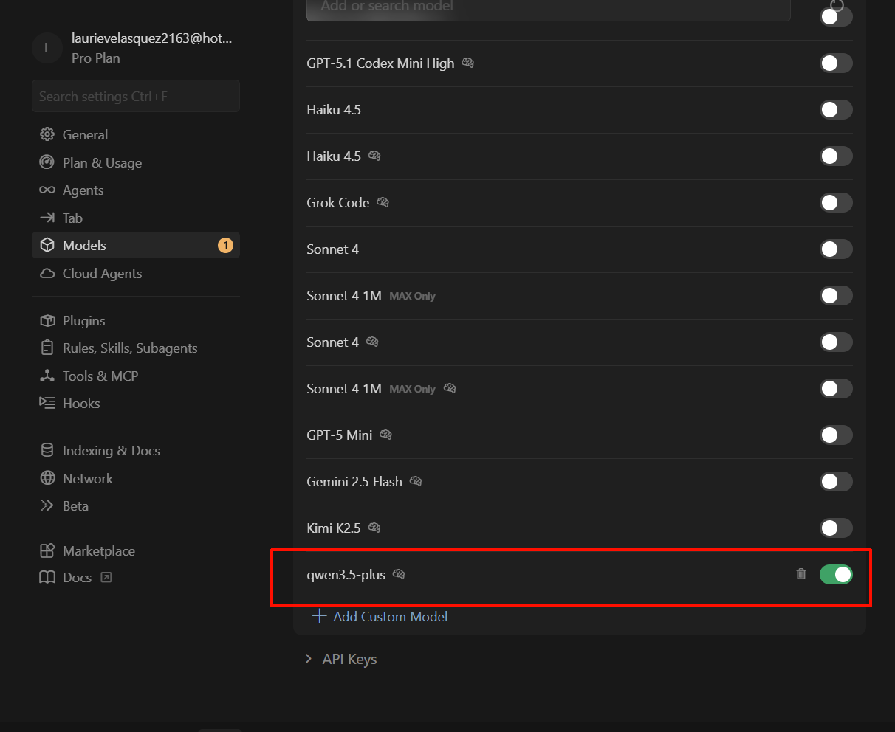 </a>

### 3.4. 关闭其他模型（可选）

为避免误调用，建议关闭其他不可用的模型提供商。注意：接入阿里云百炼后，仅阿里云平台的模型可用。

<a href="images/2026-03-03-18-41-56.png" target="_blank"> 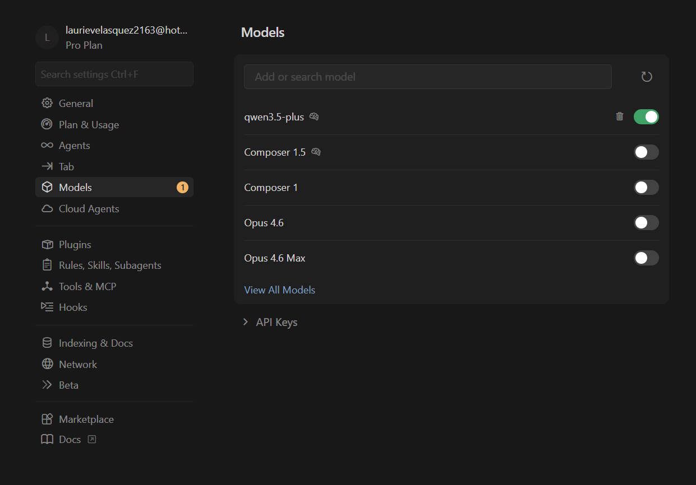 </a>

## 4. 开始使用

配置完成后，返回 Cursor 主界面的聊天栏，点击模型选择器切换到刚才添加的阿里云百炼模型，即可开始使用。

<a href="images/2026-03-03-18-58-12.png" target="_blank"> 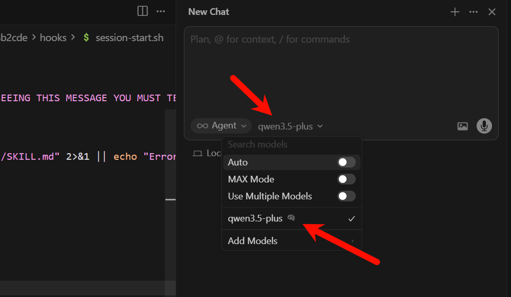 </a>

## 5.常见问题

### 5.1. 报错提示“模型不存在”

#### 问题现象：

在使用过程中，系统突然报错并提示模型不存在（如下图）。

<a href="images/2026-03-04-18-11-39.png" target="_blank"> 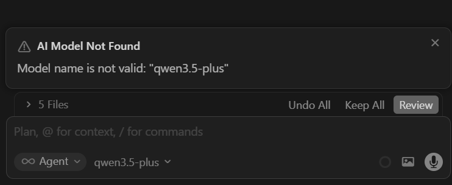 </a>

#### 原因与解决方法：

这通常是因为系统自动禁用了 OpenAI API Key。**只需前往设置将其重新开启即可恢复正常。**

<a href="images/2026-03-04-18-12-17.png" target="_blank"> 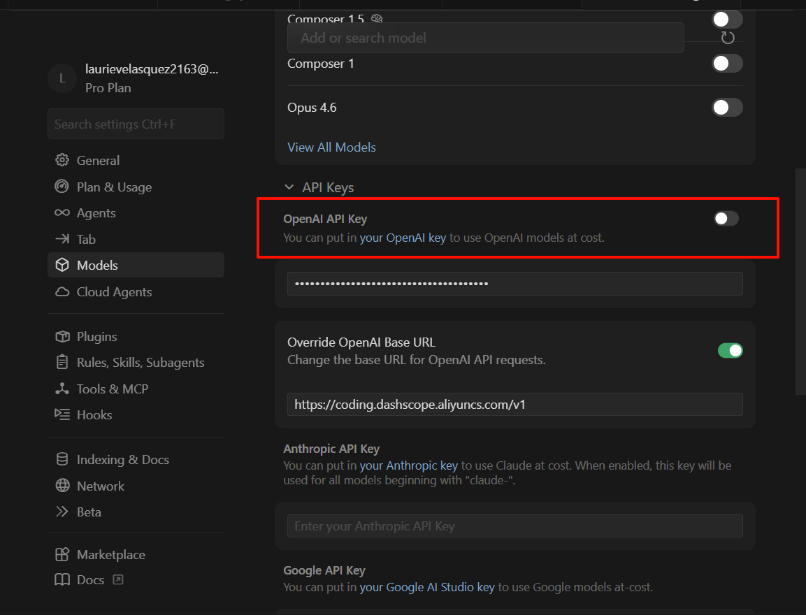 </a>
