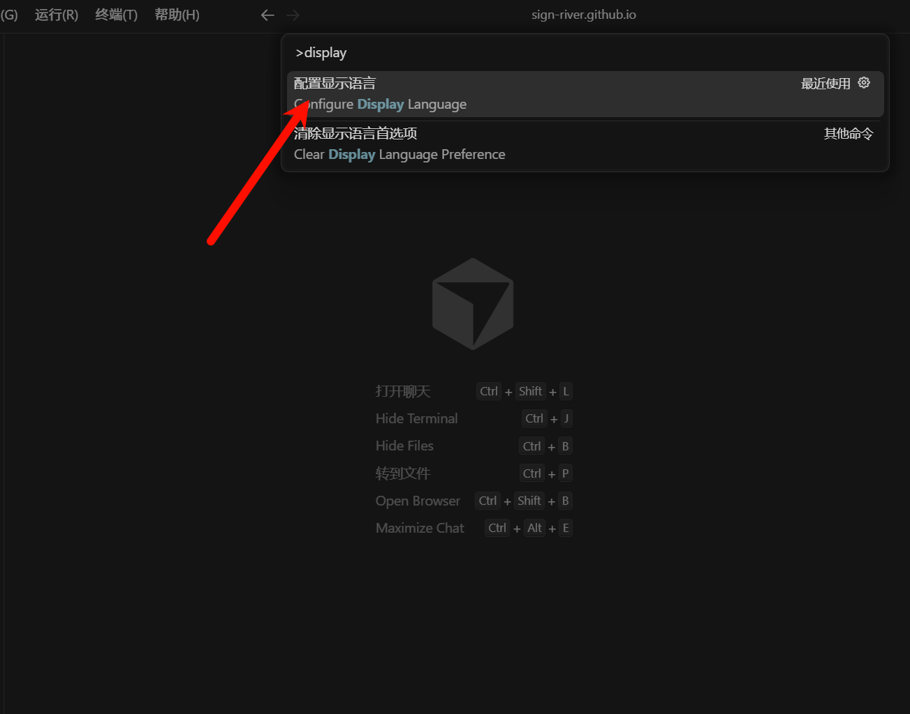
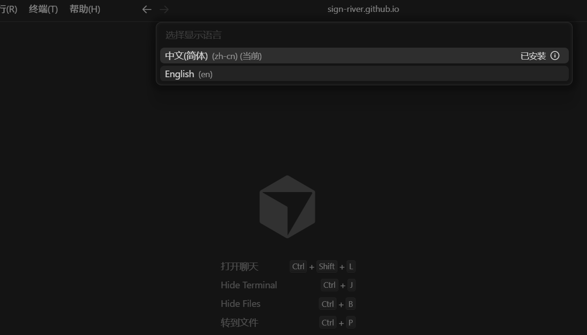
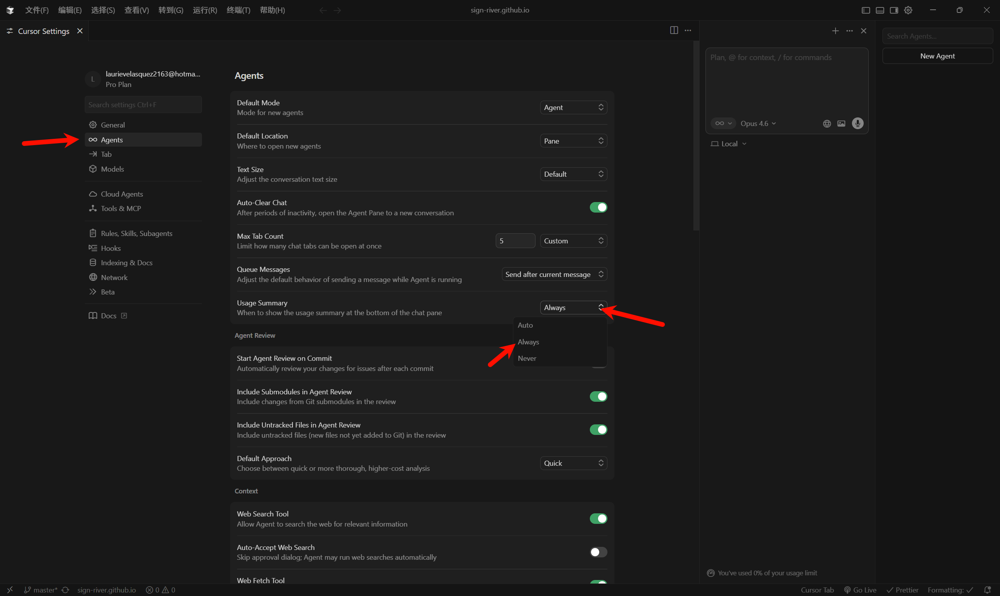
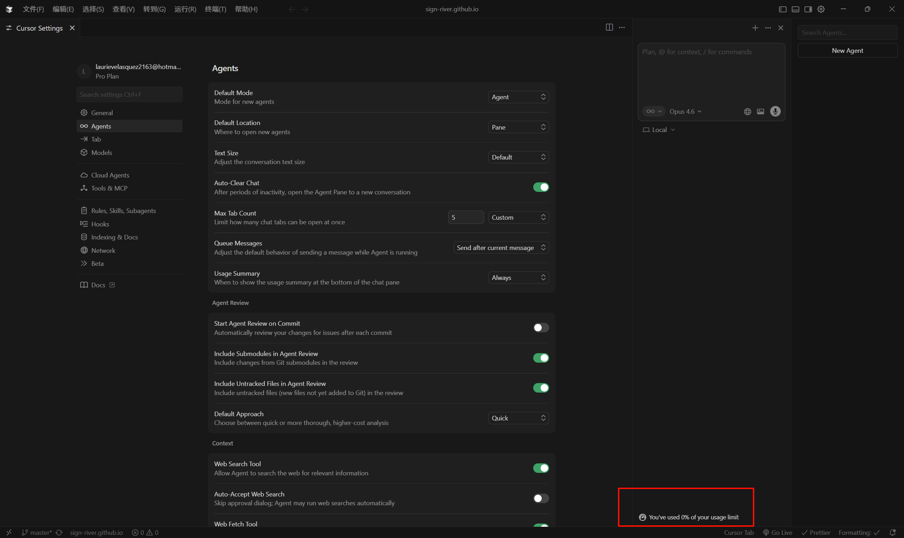
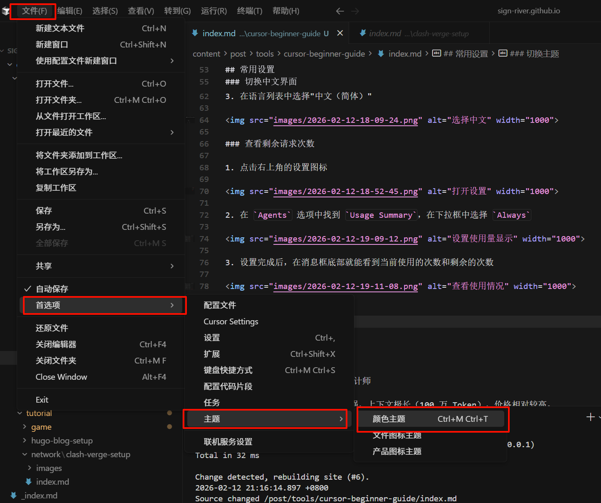
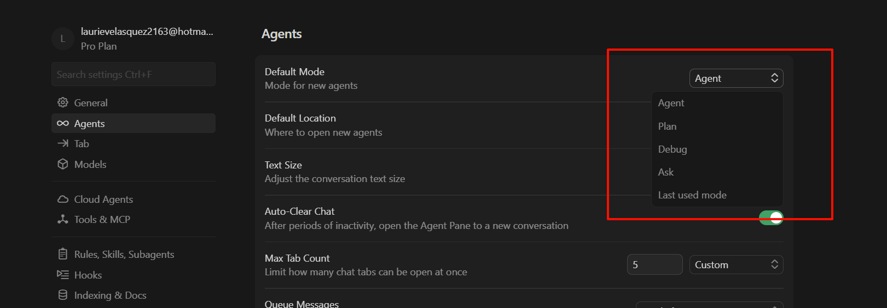
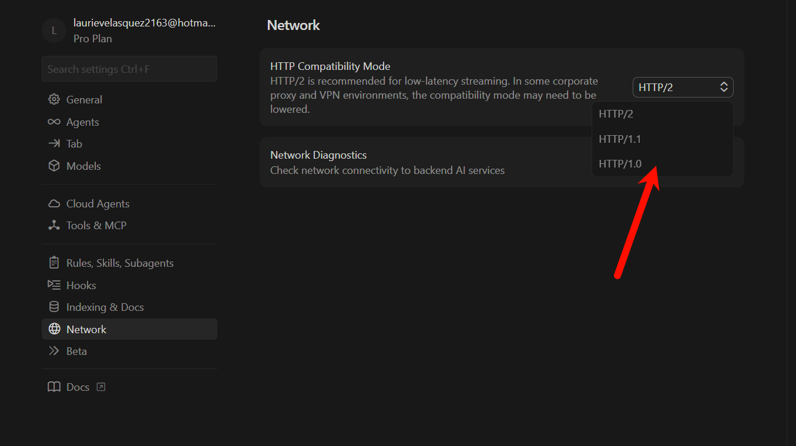

## 常用设置

### 切换中文界面

1. 按下 `Ctrl + Shift + P` 打开命令面板
2. 输入 `display`，选择"配置显示语言"

3. 在语言列表中选择"中文（简体）"

### 查看剩余请求次数

1. 点击右上角的设置图标

2. 在 `Agents` 选项中找到 `Usage Summary`，在下拉框中选择 `Always`

3. 设置完成后，在消息框底部就能看到当前使用的次数和剩余的次数

### 切换主题

依次点击菜单栏的 文件 > 首选项 > 主题 > 颜色主题。 在弹出的列表中，您可以上下浏览预览效果，点击即可应用您喜欢的配色。

---

## 工作模式介绍

Cursor 提供了多种工作模式，可根据不同场景选择使用：

### Agent（自动执行模式）

**功能**：全自动执行模式，也是默认模式。可自动搜索代码库、修改多个文件、运行终端命令。

**适用场景**：有明确功能需求时，例如"为模型添加数据增强模块"、"实现用户登录功能"等具体开发任务。

### Plan（规划模式）

**功能**：先规划后执行。深入分析项目后输出详细的 Markdown 格式方案文档，待用户确认后再执行。

**适用场景**：复杂任务或重大重构，需要在动手前审查方案，例如"重构整个项目架构"、"设计数据库方案"等。

### Debug（调试模式）

**功能**：专注于问题排查。针对错误提出假设，自动插入临时日志代码辅助定位问题。

**适用场景**：程序报错、逻辑错误、性能问题等需要深入调试的情况。

### Ask（问答模式）

**功能**：仅回答问题和解释原理，不会修改任何代码文件。

**适用场景**：学习原理、理解代码逻辑、概念解释等，例如"解释 CTC Loss 的计算原理"、"这段代码的作用是什么"等。

### Last Used Mode（上次使用模式）

**功能**：快捷切换到上一次使用的工作模式，方便模式间快速切换。

---

## 模型选择指南

### Claude Opus 4.6 —— 总设计师

**特点**：思考缓慢但推理深度强，上下文极长（100 万 Token），价格相对较高。

**适用场景**：

- **架构设计**：规划新项目的目录结构、数据库方案等从 0 到 1 的设计工作
- **疑难问题**：涉及多线程、分布式一致性等难以复现的复杂 Bug
- **全局重构**：修改核心数据结构，需要确保几十个相关文件不出错的任务

> **注意**：该模型会消耗"思维 Token"进行规划，虽然价格较贵，但能有效避免返工。

### GPT-5.3 Codex —— 极速执行者

**特点**：响应速度极快，擅长命令行操作，但有时会使用占位符敷衍了事。

**适用场景**：

- **交互式编程**：快速调整前端样式（CSS/React 组件）、编写简单脚本
- **错误修复**：针对终端报错进行快速自动修复
- **快速原型**：需要在短时间内尝试多种方案

### Composer 1.5 —— 多文件管家

**特点**：Cursor 原生模型，专门强化了同时编辑多个文件的能力。

**适用场景**：

- **跨文件任务**：例如"把整个项目的登录方式从 JWT 改成 OAuth2"等需要修改多个文件的任务，它能记住任务状态，避免遗漏

### Claude Sonnet 4.5 —— 主力中场

**特点**：性能均衡，速度比 Opus 快且价格便宜，稳定性比 Codex 好。

**适用场景**：

- **日常开发**：80% 的常规编码任务（编写接口、SQL 等）都可以使用该模型

### Gemini 3 Pro —— 文档专家

**特点**：上下文特别大（200 万+ Token），读取文档的成本很低。

**适用场景**：

- **查阅资料**：处理大量技术文档，在整个代码库中进行全局检索

---

### 关于自动模式（Auto Mode）

⚠️ **强烈建议关闭自动模式**，手动选择模型。主要原因：

#### 1. 成本优先导致能力下降

虽然理论上应该根据任务难度分配模型，但实际上为了节省成本，经常将复杂任务分配给能力较弱的低价模型（比如 mini 版），导致代码质量下降。

#### 2. 存在严重 Bug

存在"Zombie Revert"（僵尸回滚）问题，频繁切换模型可能导致文件状态冲突，代码被悄悄回滚到旧版本。

#### 3. 计费不透明

即使分配了能力较弱的模型，也可能按溢价计费，除非任务极简单，否则不建议使用。

---

## 常见问题

### 模型不工作：Model not available

如果遇到模型不可用的问题，可以尝试以下解决方案：

1. 在设置中找到 `Network` 选项
2. 将网络协议改为 `HTTP 1.0`

### 模型耗token太快

为了节省 Token 额度，强烈建议勤开新对话。因为 AI 模型本身不记事，在同一个对话框里，每次提问它都会被迫把之前所有的历史记录（包括旧代码和长篇问答）重新读取一遍。对话越长，‘上下文包袱’越重，导致你问一个简单问题都可能消耗数千 Token。及时开启 New Chat 可以切断这些不必要的旧上下文，是节省额度最直接有效的方法

## 总结

Cursor 作为一款 AI 编程助手，提供了多种工作模式和模型选择，能够满足不同场景的开发需求。合理选择工作模式和模型，可以显著提升开发效率。建议：

- **日常开发**：使用 Claude Sonnet 4.5
- **复杂架构**：使用 Claude Opus 4.6
- **快速原型**：使用 GPT-5.3 Codex
- **多文件重构**：使用 Composer 1.5
- **文档查阅**：使用 Gemini 3 Pro

手动选择模型比自动模式更可靠！
