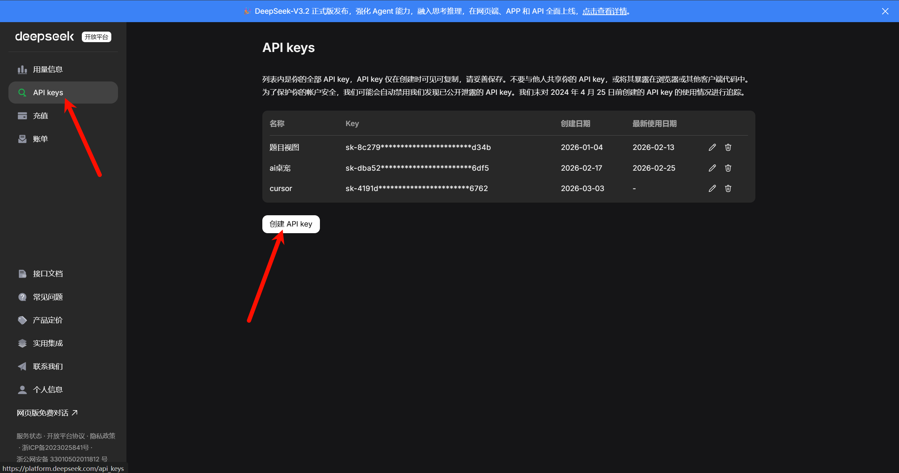
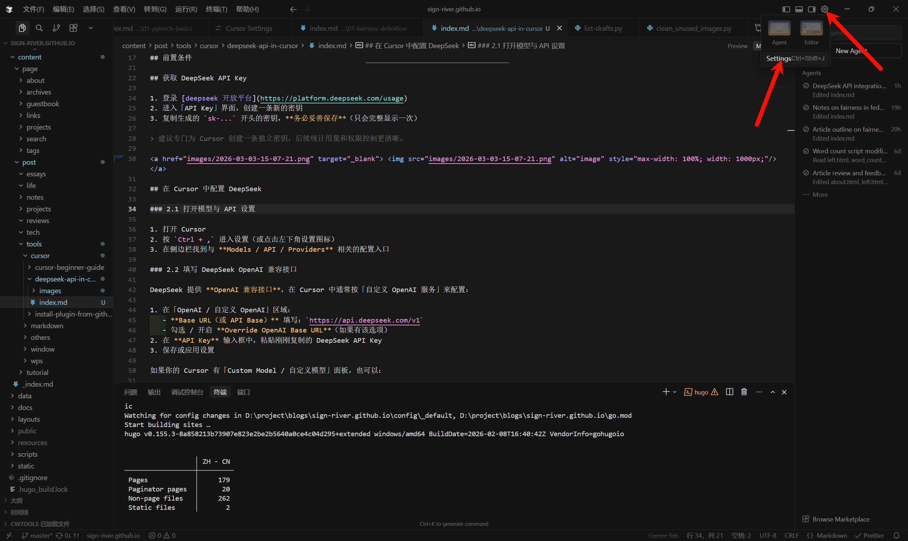
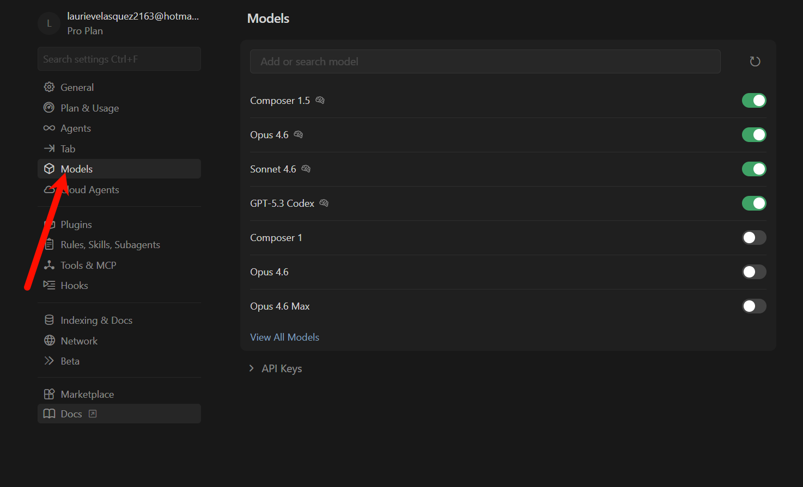
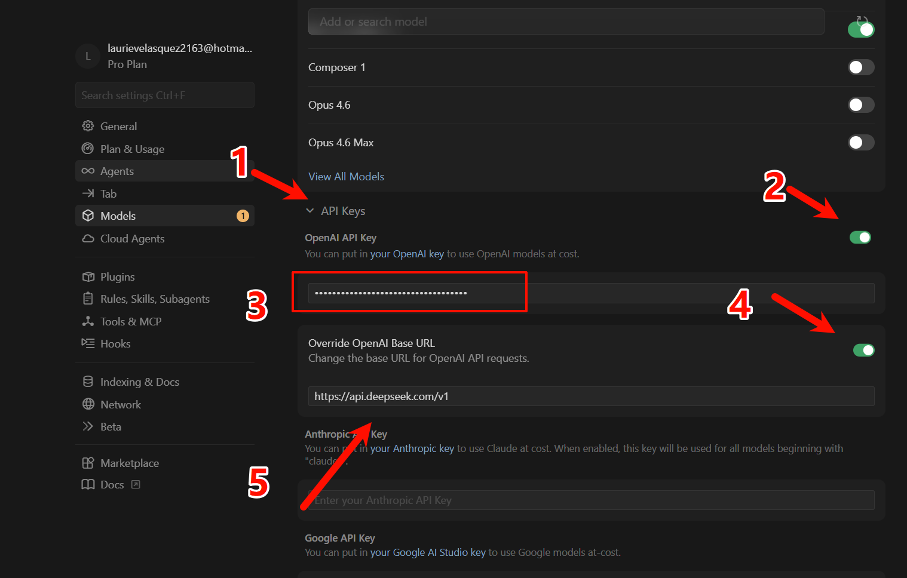

## 前置条件

- 已安装 **Cursor**
- 已注册 **DeepSeek 账号**，并登录 [deepseek 开放平台](https://platform.deepseek.com/usage)

## 获取 DeepSeek API Key

1. 登录 [deepseek 开放平台](https://platform.deepseek.com/usage)
2. 进入「API Key」界面，创建一条新的密钥
3. 复制生成的 `sk-...` 开头的密钥，**务必妥善保存**（只会完整显示一次）

> 建议专门为 Cursor 创建一条独立密钥，后续统计用量和权限控制更清晰。

## 在 Cursor 中配置 DeepSeek

### 打开模型与 API 设置

1. 打开 Cursor
2. 按点击右上角的设置按钮，然后点击 Settings 进入设置

3. 在侧边栏找到与 **Models** 标签页

### 填写 DeepSeek OpenAI 兼容接口

DeepSeek 提供 **OpenAI 兼容接口**，在 Cursor 中通常按「自定义 OpenAI 服务」来配置：

1. 点击 API Keys 展开列表
2. 打开 OpenAI API Key，将刚才创建的 deepseek API keys 粘贴进下面的文本框
3. 打开 Override OpenAl Base URL，在下方的文本框里粘贴

如果你的 Cursor 有「Custom Model / 自定义模型」面板，也可以：

- Provider 选择：`OpenAI Compatible`（或类似选项）
- Base URL：`https://api.deepseek.com/v1`
- API Key：填入 DeepSeek 的密钥

### 2.3 常用 DeepSeek 模型名称示例

根据当前公开信息，DeepSeek 的部分常用模型名（实际以官网 / 控制台为准）：

- 通用对话：`deepseek-chat`
- 编程/代码：`deepseek-coder`
- 推理/思考：`deepseek-reasoner` 或 `deepseek-r1` / `deepseek-v3` 等

在 Cursor 的模型下拉框中，如果支持输入自定义模型名，可以手动填入上述名称并保存。

## 三、在对话与 Agent 中使用 DeepSeek

### 3.1 聊天 / 代码补全中使用

1. 打开 Cursor 的聊天窗口
2. 在模型选择区域，选择你刚配置的 DeepSeek 模型（例如 `deepseek-coder`）
3. 直接开始提问或让它改代码即可

> 建议：日常写代码用 `deepseek-coder`，需要长推理或复杂规划时再切到推理类模型。

### 3.2 Agent / 多文件自动修改中使用

1. 将工作模式切换到 `Agent`（自动执行模式）
2. 在模型选择里同样选择 DeepSeek 模型
3. 让 Cursor 完成「新建项目骨架」「重构多文件」等任务

**注意**：有的 DeepSeek 模型对上下文长度、流式输出支持稍有差异，如遇异常（比如无法多文件编辑、响应中断），可以尝试：

- 换一个 DeepSeek 模型（例如从 `v3` 换到 `coder` / `chat`）
- 确认网络、代理和系统证书没有问题

## 四、常见问题排查

### 4.1 提示 401 / 403 或鉴权失败

- 检查 Base URL 是否为：`https://api.deepseek.com/v1`
- 确认没有在 URL 后额外拼接 `/chat/completions` 等路径
- 确认 API Key 未过期、未被删除，粘贴时无前后空格

### 4.2 提示超时或网络错误

- 浏览器中直接访问 `https://api.deepseek.com/v1/models`，看是否能返回 JSON（哪怕是鉴权错误也说明网络是通的）
- 若公司 / 学校网络限制，可尝试系统代理或 Clash / v2ray 等工具，并在 Cursor 中保持与系统网络一致

### 4.3 模型列表中找不到 DeepSeek

部分版本的 Cursor 不会自动列出 DeepSeek，需要你**手动配置**：

- 优先使用「自定义 OpenAI / Custom Model」方案
- 确认模型名称拼写与 DeepSeek 控制台一致

## 五、个人使用建议

- **分环境密钥**：工作 / 个人 / 测试项目各用一条 API Key，方便控制配额
- **善用推理模型**：大重构、复杂调试时，用 DeepSeek 推理类模型做规划，再用 coder 类模型具体实现
- **控制上下文长度**：定期开新对话，避免历史上下文过长导致 token 消耗迅速增加

到这里，Cursor 已经可以正常走 DeepSeek 的 API 了。后续你可以再补几张配置截图，放在对应小节下方作为完整图文教程。
