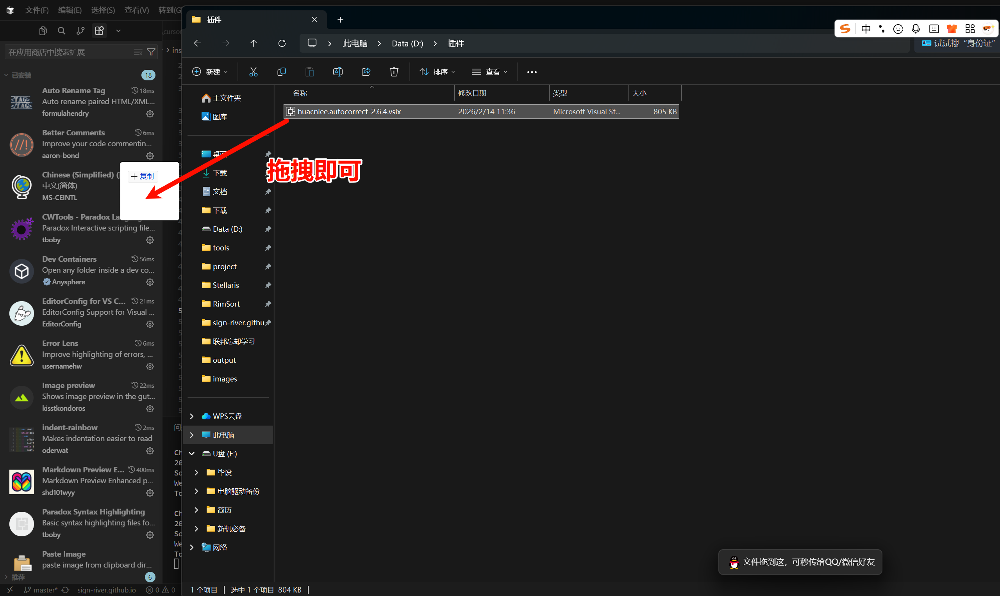
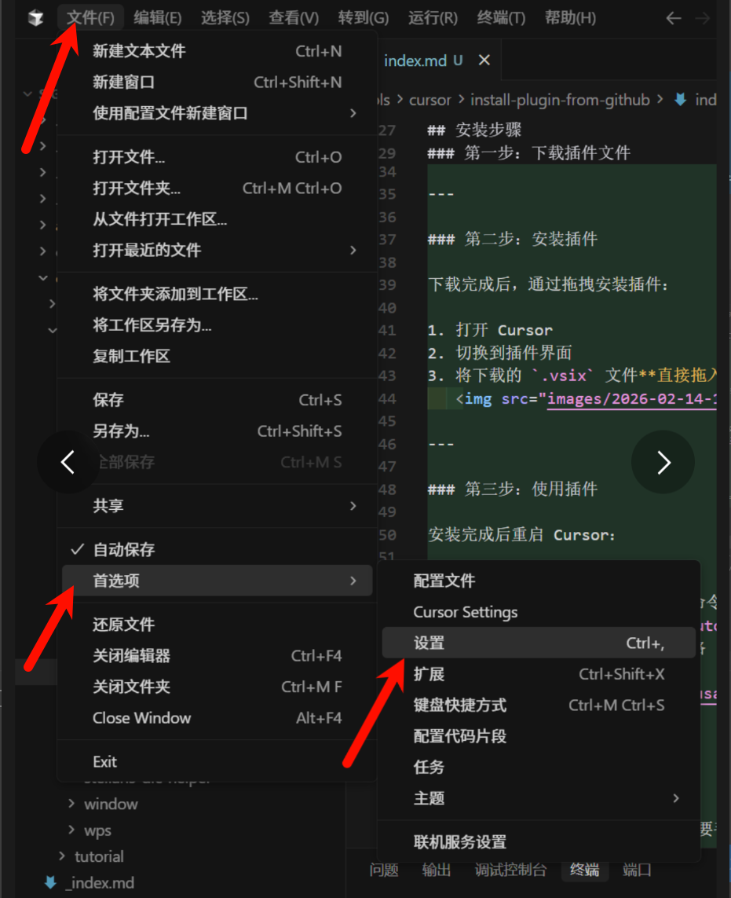
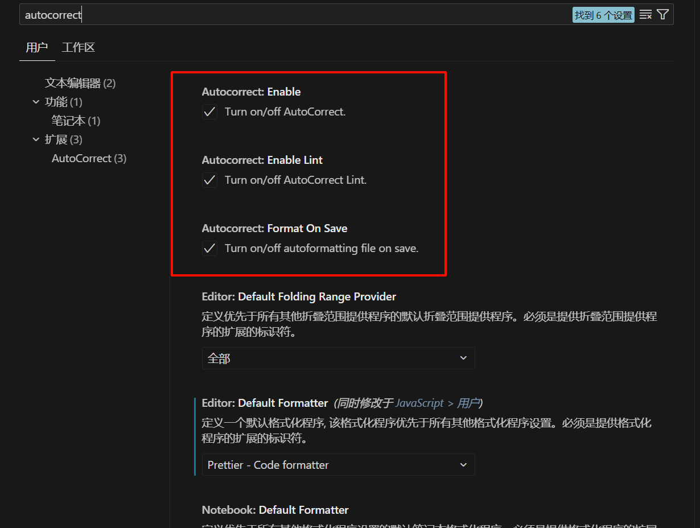

## 为什么需要手动安装？

Cursor 的插件商店并没有完全同步 VSCode 的所有插件，有些好用的插件可能找不到。比如这次要装的中英文自动空格插件（AutoCorrect），它能让你的文档看起来更规范：

- ❌ 格式化前：`Cursor是一款基于VSCode的AI编程助手`
- ✅ 格式化后：`Cursor 是一款基于 VSCode 的 AI 编程助手`

好消息是，Cursor 完全兼容 VSCode 插件，我们可以通过 `.vsix` 文件手动安装。

---

## 安装步骤

### 第一步：下载插件文件

点击下载 AutoCorrect 插件：[huacnlee.autocorrect-2.6.4.vsix](plugins/huacnlee.autocorrect-2.6.4.vsix)

> 💡 这个 `.vsix` 文件是 VSCode/Cursor 的插件安装包格式，下载到本地即可。

---

### 第二步：安装插件

下载完成后，通过拖拽安装插件：

1. 打开 Cursor
2. 切换到插件界面
3. 将下载的 `.vsix` 文件**直接拖入 插件窗口**
   

---

### 第三步：使用插件

安装完成后重启 Cursor：

1. 打开设置



2. 搜索 autocorrect
3. 根据需求调整选项

```
1. Autocorrect: Enable
   总开关：决定插件是否开启。勾选它，插件才会在后台运行；如果不勾选，整个插件就相当于停用了。

2. Autocorrect: Enable Lint
   实时检查提示：勾选后，它会在你编辑时自动检测格式问题，并在有问题的地方（比如“你好World”）下面画波浪线提示你，但不会自动修改，主要是为了让你“看见”哪里有问题。

3. Autocorrect: Format On Save
   保存时自动修复（推荐勾选）：这是最核心的功能。勾选后，当你按下保存快捷键（Ctrl+S）时，插件会自动把所有检测到的格式错误瞬间修正（比如自动变成“你好 World”）。
```

<br>


---

## 注意事项

- 手动安装的插件不会自动更新，需要手动下载新版本重新安装
- 大部分 VSCode 插件都能在 Cursor 中正常使用
- 如果 Cursor 商店中已有同名插件，建议先卸载再安装

---

## 其他插件安装

这个方法适用于所有 VSCode 插件。如果你需要其他插件的 `.vsix` 文件，可以从 [VSCode 插件市场](https://marketplace.visualstudio.com/) 下载。

---

**小技巧**：掌握手动安装插件的方法，能让你的 Cursor 更加强大！✨
