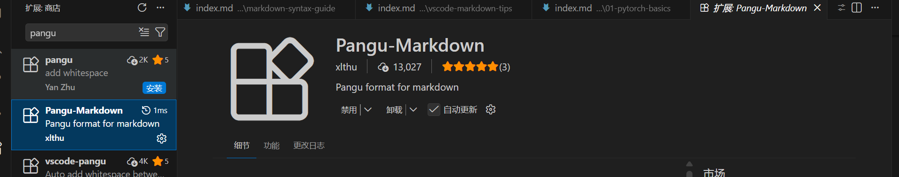
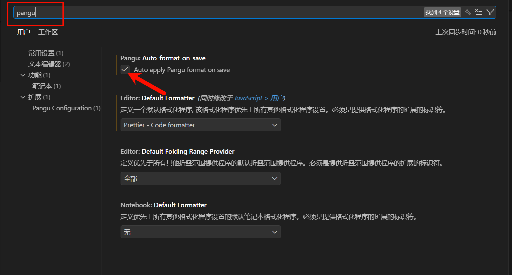

## 前言

在编写中英文混排的文档时，在中文和英文之间添加空格是一个良好的排版习惯。这样做可以：

- **提升阅读体验**：适当的空格让文字更加清晰易读，避免中英文紧贴在一起显得拥挤
- **符合排版规范**：许多中文排版指南都建议在中英文之间添加空格
- **保持文档一致性**：统一的格式让整个文档看起来更专业

但是手动添加空格既繁琐又容易遗漏，本文将介绍如何使用 VS Code 插件实现保存时自动格式化。

## 安装插件

### Pangu-Markdown

打开 VS Code 扩展商店，搜索 `Pangu-Markdown` 并安装。

## 配置自动格式化

### settings.json 配置

1. **打开设置**

2. **搜索并启用自动格式化**

   搜索 `pangu`，勾选 "Format On Save"（保存时自动格式化）选项。

3. **重启 VS Code**

   配置完成后需要重启 VS Code 才能生效。

   > **注意**：如果配置后没有生效，请尝试重启 VS Code。这是插件生效的必要步骤。

## 总结

配置完成后，使用 `Ctrl+S` 保存文件时，插件会自动在中文和英文之间添加空格，让你专注于内容创作，无需担心排版格式问题。
