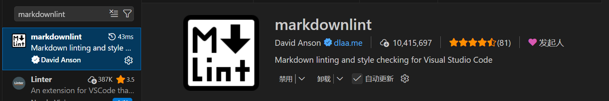
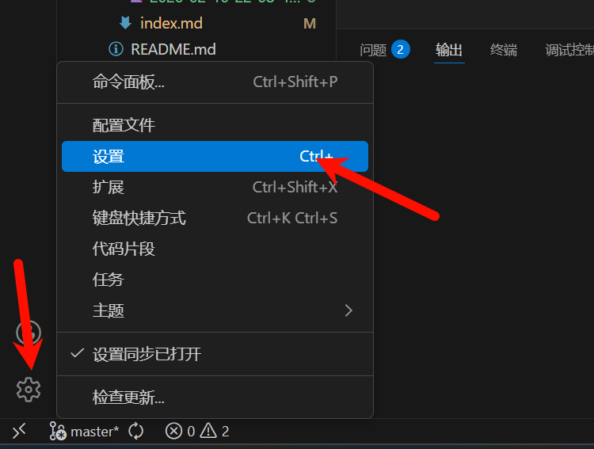
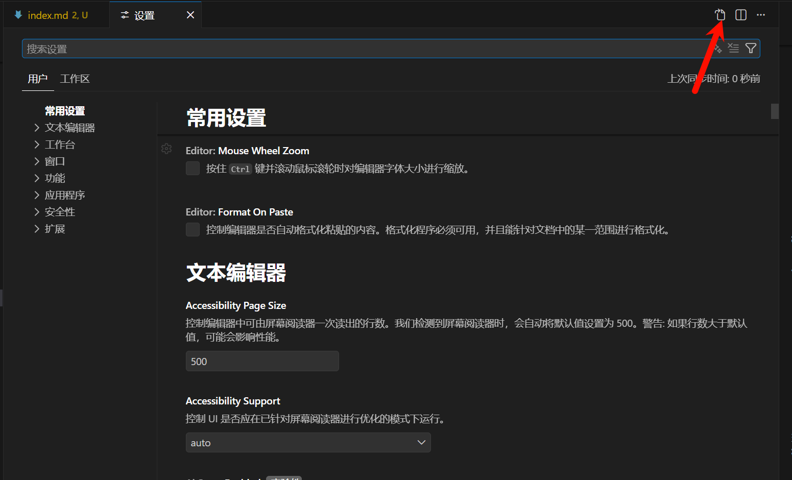
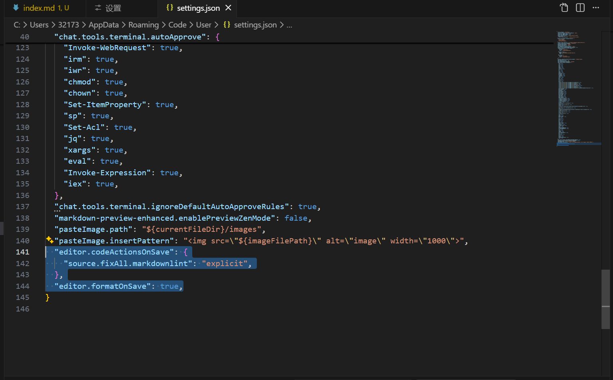

## 前言

在 VS Code 中编写 Markdown 时，常常会遇到各种格式问题：表格对不齐、列表缩进混乱、链接格式错误等。本文将介绍如何通过插件和配置来轻松解决这些问题，让你的 Markdown 写作更加高效。

---

## 安装插件 markdownlint

### 格式检查工具

**功能**：

- 实时检查 Markdown 格式
- 自动修复常见问题
- 保持文档规范统一

**常见提示**：

| 规则  | 说明             | 解决                  |
| ----- | ---------------- | --------------------- |
| MD001 | 标题层级不连续   | 不要从 # 直接跳到 ### |
| MD009 | 行尾有多余空格   | 删除行尾空格          |
| MD012 | 连续空行超过一行 | 删除多余空行          |
| MD013 | 行长度超过限制   | 换行或调整配置        |
| MD022 | 标题前后需要空行 | 添加空行              |
| MD032 | 列表前后需要空行 | 添加空行              |

### 使用方法

1. 在拓展商店搜索并安装 markdownlint

<a href="images/2026-02-10-23-18-56.png" target="_blank">  </a>

2. 打开设置 (json)

<a href="images/2026-02-10-23-21-47.png" target="_blank">  </a>

<a href="images/2026-02-10-23-22-18.png" target="_blank">  </a>

3. 在设置中输入

```
  "editor.codeActionsOnSave": {
    "source.fixAll.markdownlint": "explicit",
  },
  "editor.formatOnSave": true,
```

<br>
<a href="images/2026-02-10-23-23-38.png" target="_blank">  </a>

## 总结

之后只要 Ctrl + S 保存文件，就会自动修正 Markdown 格式

---

最后更新：2026-02-10
