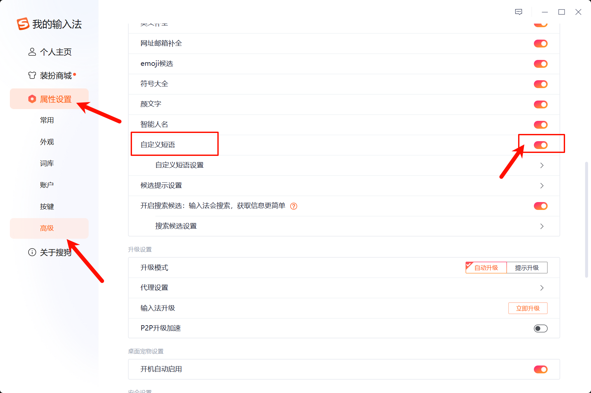
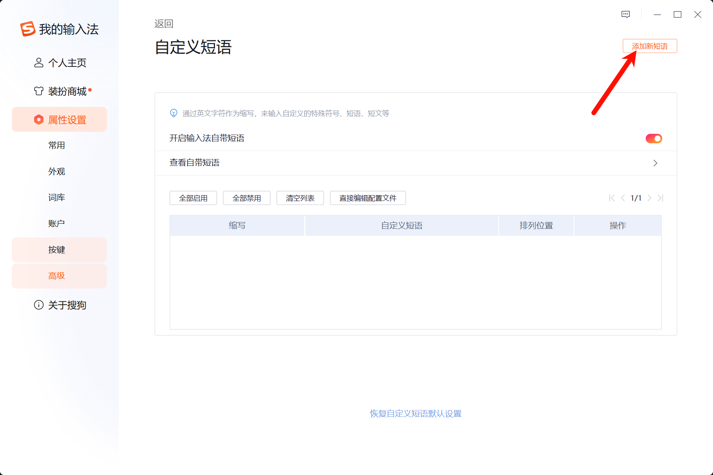
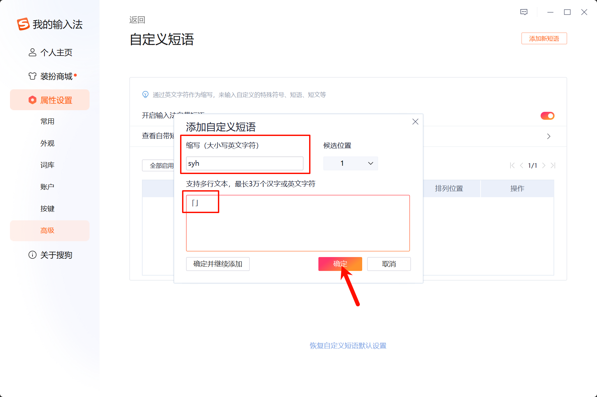
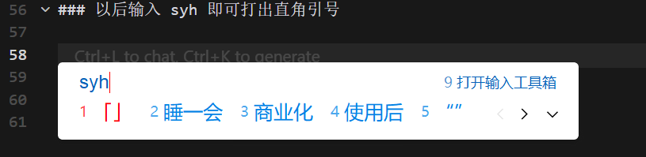
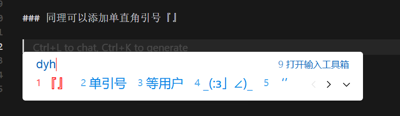

## 1. 为什么需要直角引号？

在中文排版中，直角引号「」和『』比普通引号 "" 更加规范和美观，特别适合用于：

- 📝 学术论文和正式文档
- 📖 书籍和杂志排版
- 🎨 设计作品中的文字说明
- 💬 强调引用内容时

相比普通的弯引号，直角引号在视觉上更加醒目，也更符合传统中文排版规范。

## 2. 直角引号的区别

- **普通引号**：""、''
- **直角引号**：「」、『』

使用规则：

- 「」用于第一层引用（相当于双引号 ""）
- 『』用于第二层引用，即引用中的引用（相当于单引号 ''）

**示例**：他说「这本书里写着『天行健，君子以自强不息』」

## 3. 设置方法

### 3.1. 第一步：开启自定义短语功能

打开搜狗输入法设置界面，选择属性设置->高级，勾选自定义短语。

### 3.2. 第二步：添加新短语

进入自定义短语设置，点击添加新短语。

### 3.3. 第三步：设置直角引号「」

缩写可以自拟，这里我用 "syh" 意指"第一层引号"，下方文本框输入直角引号「」即可。

### 3.4. 第四步：使用效果

以后输入 syh 即可快速打出直角引号「」。

### 3.5. 第五步：添加嵌套引号『』

同理可以添加第二层引号『』，用于引用中的引用。

## 4. 总结

通过搜狗输入法的自定义短语功能，我们可以快速输入直角引号，让中文文档的排版更加规范美观。你也可以用同样的方法添加其他常用符号，提升输入效率！
