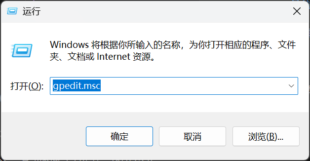
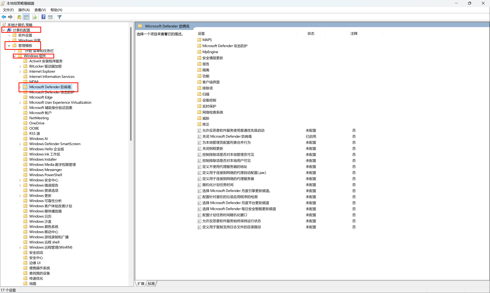
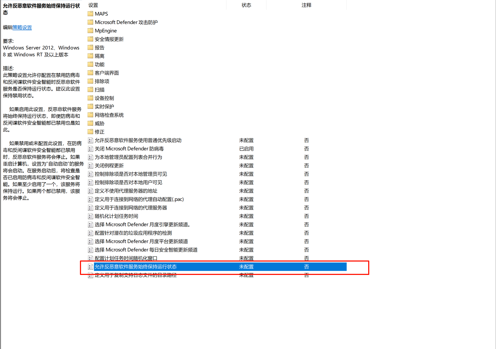
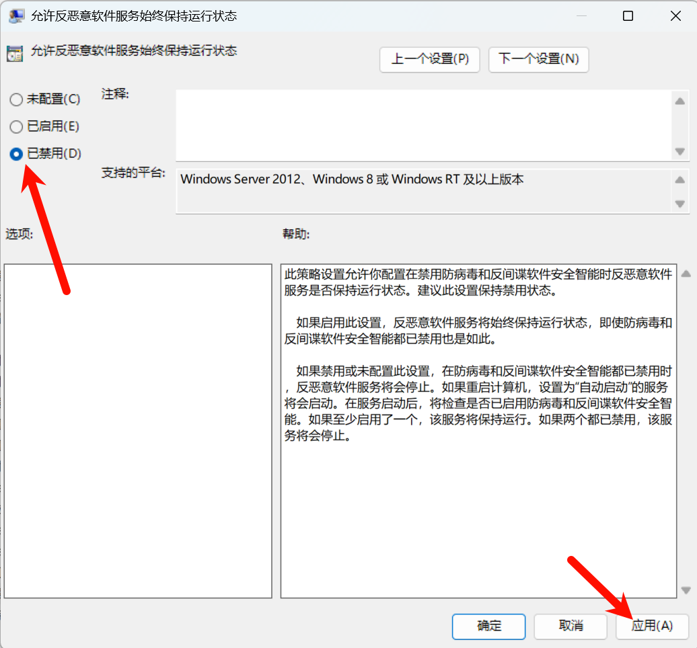

## 问题背景

在日常使用 Windows 系统时，Windows Defender 的实时保护功能有时会带来一些困扰：

- 占用系统资源，导致电脑卡顿
- 误报软件为病毒（尤其是开发工具和破解软件）
- 自动删除或隔离某些文件
- 与其他安全软件冲突

虽然可以在"设置"中临时关闭实时保护，但系统会在一段时间后自动重新启用。本文介绍如何通过**组策略编辑器**彻底禁用 Windows Defender。

---

## 操作步骤

### 1. 打开组策略编辑器

按下 `Windows + R` 组合键，打开"运行"窗口。

在输入框中输入以下命令并按回车：

```
gpedit.msc
```

<br>
<a href="images/2026-02-11-13-05-10.png" target="_blank">  </a>

> ⚠️ **注意**：家庭版 Windows 默认不包含组策略编辑器。如果提示找不到 gpedit.msc，需要先安装组策略编辑器功能。

### 2. 导航到 Defender 设置

在组策略编辑器窗口中，按照以下路径依次展开：

```
计算机配置
  → 管理模板
    → Windows 组件
      → Windows Defender 防病毒程序
```

<br>
<a href="images/2026-02-11-13-02-25.png" target="_blank">  </a>

### 3. 禁用反恶意软件服务

在右侧面板中找到并双击：

```
允许反恶意软件服务始终保持运行状态
```

<br>
<a href="images/2026-02-11-13-03-21.png" target="_blank">  </a>
在弹出的设置窗口中：

1. 选择 **已禁用**
2. 点击 **应用**
3. 点击 **确定**
   <a href="images/2026-02-11-13-03-57.png" target="_blank">  </a>

### 4. 重启生效

完成上述设置后，**重启电脑**使配置生效。

重启后，Windows Defender 的实时保护将被彻底关闭，且不会自动重新启用。

---

## 验证是否成功

重启后，打开"Windows 安全中心"：

1. 按 `Windows + I` 打开设置
2. 进入 **隐私和安全性** → **Windows 安全中心**
3. 点击 **病毒和威胁防护**

如果看到"未进行任何操作"或"实时保护已关闭"的提示，说明设置成功。

---

## 如何恢复实时保护

如果将来需要重新启用 Windows Defender：

1. 再次打开组策略编辑器（`gpedit.msc`）
2. 找到同样的设置项
3. 将其改为 **未配置** 或 **已启用**
4. 重启电脑

---

## 总结

通过组策略编辑器禁用 Windows Defender 是一个简单但有效的方法，适合需要长期关闭实时保护的场景。

但请记住：**安全性和便利性往往是一对矛盾**。关闭防护的同时，也要承担相应的风险。建议根据实际需求谨慎操作。
