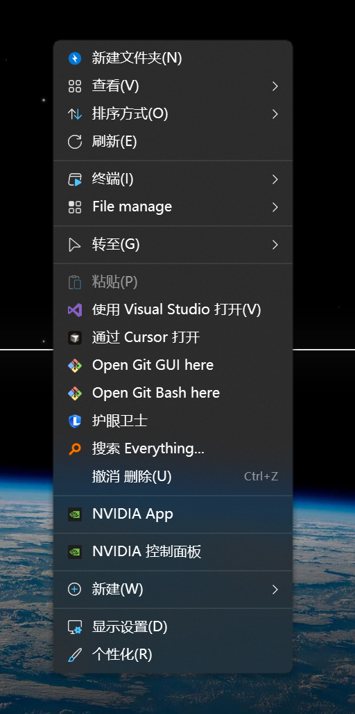
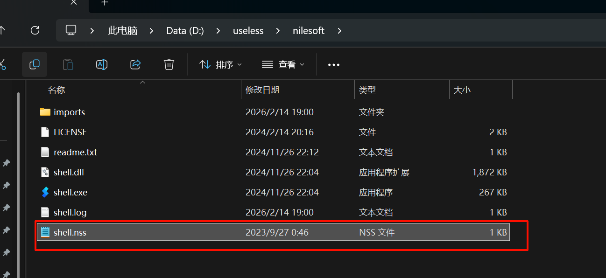
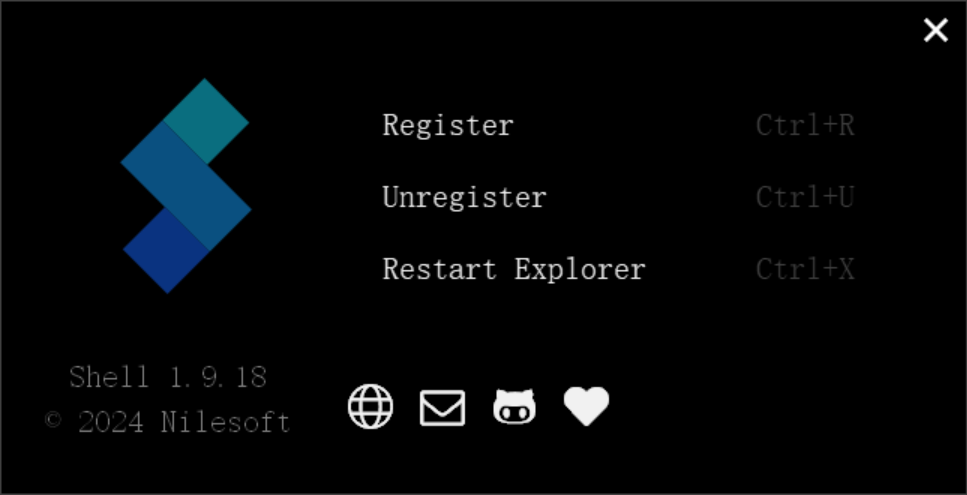
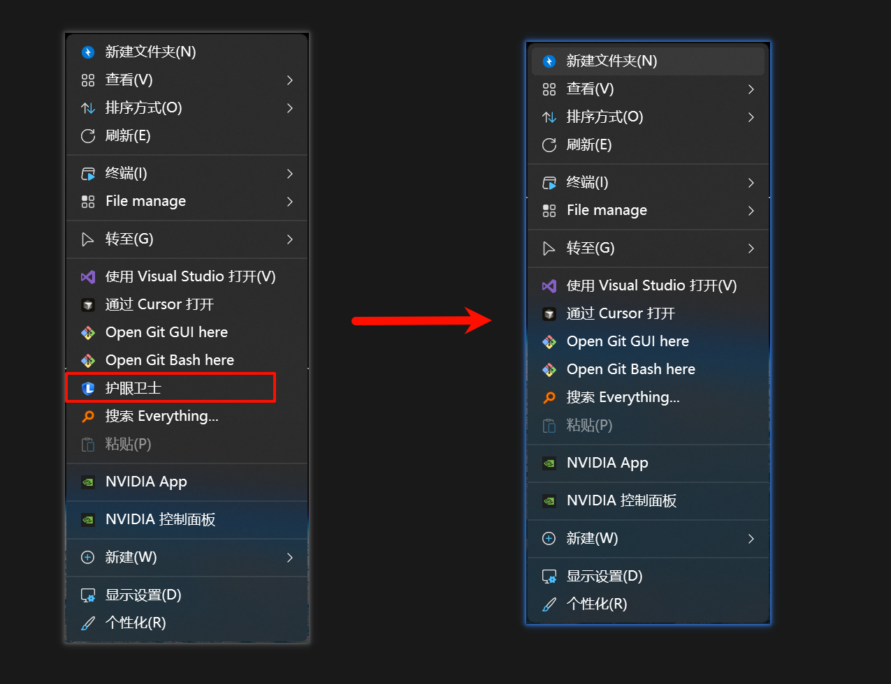
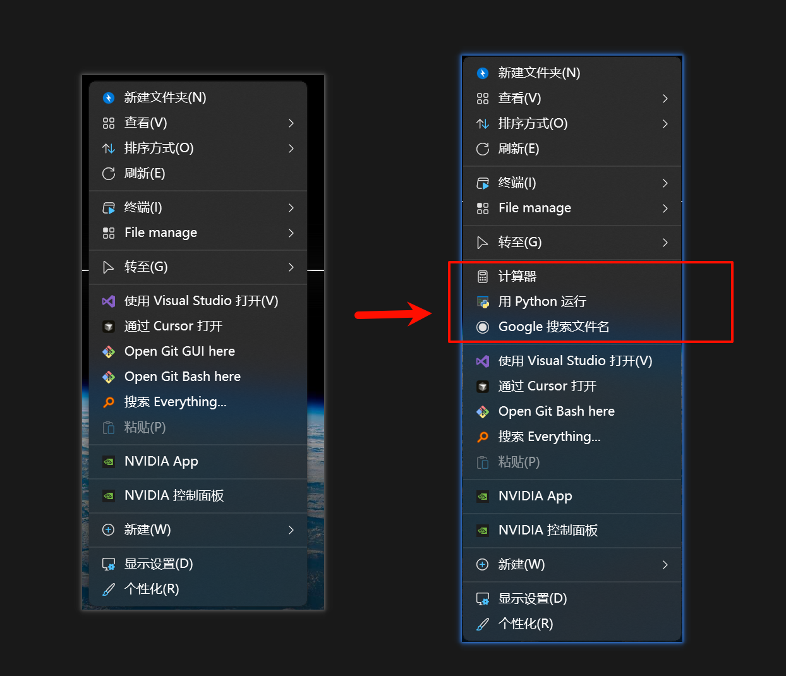
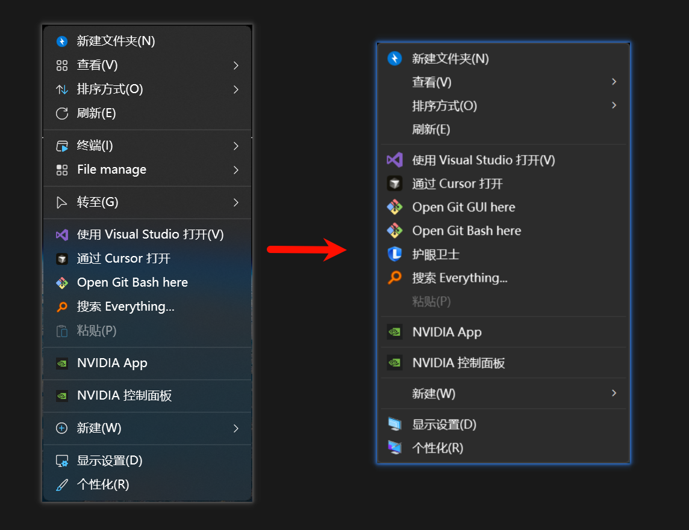

## 什么是 Nilesoft Shell？

Nilesoft Shell 是一款强大的 Windows 右键菜单自定义工具，让你完全掌控右键菜单的每一个细节。无论是添加常用程序、自定义图标、创建子菜单，还是根据文件类型显示不同选项，Nilesoft Shell 都能轻松实现。

**核心优势：**

- ✅ 完全免费开源
- ✅ 配置灵活强大
- ✅ 支持动态菜单和条件显示
- ✅ 可自定义图标和样式
- ✅ 轻量级，不影响系统性能

接下来，我们以"添加 Cursor 到右键菜单"为例，演示如何使用 Nilesoft Shell。

---

## 安装 Nilesoft Shell

前往[官网下载](https://nilesoft.org/download)并安装 Nilesoft Shell。安装完成后可能需要重启资源管理器才能看到效果。

**提示**：安装时请记住安装路径，后续配置时会用到。

---

## 体验默认功能

安装完成后，右键点击桌面，即可看到 Nilesoft Shell 的默认菜单。默认配置已经包含了许多实用功能，比如快速访问系统工具、文件操作等。



这只是冰山一角，接下来我们将学习如何自定义菜单！

---

## 认识配置文件

Nilesoft Shell 的所有配置都保存在 `shell.nss` 文件中。这是一个纯文本配置文件，使用类似 JavaScript 的语法，易读易写。

进入 Nilesoft 安装目录，找到并打开 `shell.nss` 文件：



**默认配置内容**（建议保存备份，方便出错时恢复）：

```javascript
settings
{
	priority=1
	exclude.where = !process.is_explorer
	showdelay = 200
	// Options to allow modification of system items
	modify.remove.duplicate=1
	tip.enabled=true
}

import 'imports/theme.nss'
import 'imports/images.nss'

import 'imports/modify.nss'

menu(mode="multiple" title="Pin/Unpin" image=icon.pin)
{
}

menu(mode="multiple" title=title.more_options image=icon.more_options)
{
}

import 'imports/terminal.nss'
import 'imports/file-manage.nss'
import 'imports/develop.nss'
import 'imports/goto.nss'
import 'imports/taskbar.nss'
```

---

## 基本操作

掌握基本操作是使用 Nilesoft Shell 的第一步。以下是最常用的几个操作。

---

### 应用配置修改

每次修改配置文件后，需要重启资源管理器才能使配置生效。

**操作方法：**

1. 在开始菜单搜索 `nilesoft` 或直接运行安装目录下的 `shell.exe`
2. 在弹出的窗口中选择 **Restart Explorer**（重启资源管理器）



**三个选项说明：**

- **Enable**：启用 Nilesoft Shell
- **Disable**：停用 Nilesoft Shell
- **Restart Explorer**：重启资源管理器（使配置生效）

---

### 移除菜单项

如果想移除右键菜单中的某个选项，可以使用 `remove()` 命令。

**语法格式：**

```javascript
remove((find = "菜单上显示的文字"));
```

**使用示例：**

比如要移除「护眼卫士」这个选项，在配置文件末尾添加：

```javascript
remove((find = "护眼卫士"));
```

保存后重启资源管理器，该选项即可消失。



**⚠️ 注意事项：**

1. **必须一字不差**：引号内的文字必须与右键菜单中显示的完全一致（包括空格、符号）
2. **语言匹配**：中文系统填中文，英文系统填英文（如 `remove(find="Print")`）
3. **支持模糊匹配**：可以使用通配符，如 `remove(find="护眼*")` 移除所有以"护眼"开头的菜单项

---

### 添加菜单项

添加自定义菜单项是 Nilesoft Shell 的核心功能。根据不同场景，添加方式略有不同。

---

#### 场景一：添加普通应用程序

适用于计算器、记事本等不需要参数的程序。

**语法格式：**

```javascript
item(title='菜单名' cmd='程序命令' image=图标)
```

**示例：添加计算器**

```javascript
// 添加计算器到右键菜单
item(title='计算器' cmd='calc.exe' image=\uE1E7)
```

**参数说明：**

- `title`：菜单中显示的文字
- `cmd`：要执行的程序命令
- `image`：菜单图标（`\uE1E7` 是系统内置的计算器图标）

---

#### 场景二：添加文件处理工具

适用于需要打开当前选中文件的程序，如编辑器、播放器等。

**关键点**：使用 `args='"@sel.path"'` 将选中的文件路径传递给程序。

**示例：添加 Python 运行**

**第一步：获取 Python 路径**

1. 按 `Win + R` 打开运行，输入 `cmd` 回车
2. 在命令行中输入：`where python`
3. 复制显示的路径（如 `C:\Users\xxxxx\anaconda3\python.exe`）

**第二步：添加配置**

```javascript
// 用 Python 运行当前脚本
item(title='用 Python 运行'
     cmd='python'
     args='"@sel.path"'
     image='C:\Users\xxxxx\anaconda3\python.exe')
```

**参数说明：**

- `args='"@sel.path"'`：将选中文件的完整路径传递给 Python
- `image='...'`：程序路径需要加引号，系统会自动提取程序图标

---

#### 场景三：添加网址快捷方式

可以将常用网站添加到右键菜单，点击即可打开浏览器。

**示例：添加 Google 搜索**

```javascript
// 添加 Google 搜索
item(title='Google 搜索'
     cmd='https://www.google.com/')

// 搜索选中的文本
item(title='搜索选中内容'
     cmd='https://www.google.com/search?q=@sel.text'
     image=\uE16F)
```

**参数说明：**

- `@sel.text`：获取选中的文本内容

**效果展示：**



---

## 进阶操作

掌握基本操作后，我们来学习更强大的功能，让右键菜单更加智能和精准。

---

### 条件显示：让菜单项更智能

通过 `where` 参数，可以让菜单项根据不同条件显示，避免菜单杂乱。

#### 语法格式

```javascript
item(where=条件 title='菜单名' cmd='命令')
```

---

#### 1. 根据文件扩展名显示

```javascript
// 只在 .py 文件上显示
item(where=sel.ext=='.py'
     title='用 Python 运行'
     cmd='python'
     args='"@sel.path"')

// 只在图片文件上显示（支持多种格式）
item(where=sel.ext=='.jpg' or sel.ext=='.png' or sel.ext=='.gif'
     title='画图编辑'
     cmd='mspaint.exe'
     args='"@sel.path"')

// 只在 Markdown 文件上显示
item(where=sel.ext=='.md'
     title='用 Typora 打开'
     cmd='C:\Program Files\Typora\Typora.exe'
     args='"@sel.path"')
```

---

#### 2. 根据选择类型显示

```javascript
// 只在选中文件时显示（不包括文件夹）
item(where=sel.type==1
     title='Google 搜索文件名'
     cmd='https://www.google.com/search?q=@sel.name')

// 只在选中文件夹时显示
item(where=sel.type==2
     title='在此处打开 CMD'
     cmd='cmd.exe'
     args='/K cd /d "@sel.path"')

// 只在空白处显示（没有选中任何东西）
item(where=sel.count==0
     title='计算器'
     cmd='calc.exe')
```

---

#### 3. 根据文件数量显示

```javascript
// 只在选中单个文件时显示
item(where=sel.count==1
     title='查看文件属性'
     cmd='explorer.exe'
     args='/select,"@sel.path"')

// 选中多个文件时显示
item(where=sel.count>1
     title='批量处理'
     cmd='你的批量处理工具路径')
```

---

#### 4. 组合条件

```javascript
// Python 文件 且 只选中一个文件
item(where=sel.ext=='.py' and sel.count==1
     title='调试此脚本'
     cmd='python'
     args='-m pdb "@sel.path"')
```

---

#### 实战案例：智能编辑器菜单

根据不同文件类型，自动调用相应的编辑器：

```javascript
// Markdown 文件用 Typora 打开
item(where=sel.ext=='.md'
     title='Typora 编辑'
     cmd='C:\Program Files\Typora\Typora.exe'
     args='"@sel.path"')

// 代码文件用 VSCode 打开
item(where=sel.ext=='.py' or sel.ext=='.js' or sel.ext=='.html'
     title='VSCode 编辑'
     cmd='C:\Users\你的用户名\AppData\Local\Programs\Microsoft VS Code\Code.exe'
     args='"@sel.path"')

// 文本文件用记事本打开
item(where=sel.ext=='.txt'
     title='记事本编辑'
     cmd='notepad.exe'
     args='"@sel.path"')
```

---

### 创建子菜单：让菜单更整洁

当自定义菜单项越来越多时，可以用子菜单进行分组，保持菜单简洁。

#### 基本语法

```javascript
menu(title='菜单组名' image=图标) {
    item(title='选项 1' cmd='...')
    item(title='选项 2' cmd='...')
    sep  // 分隔线
    item(title='选项 3' cmd='...')
}
```

#### 实战案例：开发工具菜单

```javascript
// 创建"开发工具"子菜单
menu(title='开发工具' image=\uE26C) {
    item(title='Cursor'
         cmd='C:\Users\你的用户名\AppData\Local\Programs\cursor\Cursor.exe'
         args='"@sel.path"')

    item(title='VSCode'
         cmd='C:\Users\你的用户名\AppData\Local\Programs\Microsoft VS Code\Code.exe'
         args='"@sel.path"')

    sep  // 添加分隔线

    item(title='Git Bash'
         cmd='C:\Program Files\Git\git-bash.exe'
         args='"@sel.path"')
}
```

**效果**：右键菜单会显示"开发工具"，点击后展开包含多个选项的二级菜单。

---

### 添加分隔线：让菜单更清晰

使用 `sep` 在菜单项之间添加分隔线，让菜单结构更清晰。

```javascript
item(title='选项 1' cmd='...')
item(title='选项 2' cmd='...')
sep  // 添加分隔线
item(title='选项 3' cmd='...')
```

---

### 图标使用技巧

图标可以让菜单更美观易识别。Nilesoft Shell 支持三种图标添加方式。

---

#### 方式一：使用程序自带图标（推荐）

直接使用程序的 `.exe` 文件路径，系统会自动提取图标。

```javascript
// 使用程序自带图标
item(title='Cursor'
     cmd='C:\Users\xxxxx\AppData\Local\Programs\cursor\Cursor.exe'
     image='C:\Users\xxxxx\AppData\Local\Programs\cursor\Cursor.exe')
```

**优点**：图标与程序完全匹配，视觉统一。

---

#### 方式二：使用 Unicode 图标代码

使用 Windows 内置的 Segoe MDL2 Assets 字体图标。

```javascript
// 使用系统内置图标
item(title='计算器' cmd='calc.exe' image=\uE1E7)
```

**常用图标代码：**

| 图标代码 | 效果   | 适用场景 |
| -------- | ------ | -------- |
| `\uE1E7` | 计算器 | 计算器   |
| `\uE26C` | 代码   | 编程工具 |
| `\uE943` | 文档   | 文本编辑 |
| `\uE713` | 设置   | 系统设置 |
| `\uE768` | 播放   | 媒体播放 |
| `\uE16F` | 搜索   | 搜索功能 |

**⚠️ 重要提示**：Unicode 图标代码**不要加引号**，直接使用！

```javascript
// ✅ 正确写法
image=\uE1E7

// ❌ 错误写法（加引号图标不显示）
image='\uE1E7'
```

---

#### 方式三：不使用图标

如果不需要图标，直接省略 `image` 参数即可。

```javascript
// 不使用图标
item(title='我的工具' cmd='...')
```

---

### 常用变量和属性

在配置中可以使用丰富的变量和属性来获取上下文信息。

#### 选择对象相关变量（@sel）

**基础路径变量：**

| 变量               | 说明                 | 示例值                  |
| ------------------ | -------------------- | ----------------------- |
| `@sel.path`        | 选中项的完整路径     | `C:\Users\xxx\file.txt` |
| `@sel.name`        | 文件名（含扩展名）   | `file.txt`              |
| `@sel.title`       | 文件名（不含扩展名） | `file`                  |
| `@sel.ext`         | 文件扩展名           | `.txt`                  |
| `@sel.parent`      | 父文件夹路径         | `C:\Users\xxx`          |
| `@sel.parent.name` | 父文件夹名称         | `xxx`                   |
| `@sel.root`        | 根目录路径           | `C:\`                   |

**条件判断属性：**

| 属性        | 说明               | 可能值                |
| ----------- | ------------------ | --------------------- |
| `sel.count` | 选中的文件数量     | `0`, `1`, `2`, `3`... |
| `sel.type`  | 选择类型（见下表） | 数字代码              |

**其他实用变量：**

| 变量             | 说明                       | 示例           |
| ---------------- | -------------------------- | -------------- |
| `@sel.text`      | 选中的文本内容             | `被选中的文字` |
| `@sel.file`      | 仅文件的路径（排除文件夹） | `C:\file.txt`  |
| `@sel.directory` | 仅文件夹的路径（排除文件） | `C:\folder`    |
| `@sel.curdir`    | 当前工作目录               | `C:\Users\xxx` |

#### 类型判断（type 属性）

在 `where` 条件中，可以使用 `type` 属性精确控制菜单显示：

| 类型值              | 说明                  | 使用示例                     |
| ------------------- | --------------------- | ---------------------------- |
| `file`              | 文件                  | `where=sel.type==file`       |
| `dir` / `directory` | 文件夹                | `where=sel.type==dir`        |
| `drive`             | 驱动器                | `where=sel.type==drive`      |
| `fixed`             | 固定磁盘（如硬盘）    | `where=sel.type==fixed`      |
| `removable`         | 可移动磁盘（如 U 盘） | `where=sel.type==removable`  |
| `usb`               | USB 设备              | `where=sel.type==usb`        |
| `dvd`               | DVD 驱动器            | `where=sel.type==dvd`        |
| `remote`            | 网络驱动器            | `where=sel.type==remote`     |
| `vhd`               | 虚拟硬盘              | `where=sel.type==vhd`        |
| `desktop`           | 桌面                  | `where=sel.type==desktop`    |
| `recyclebin`        | 回收站                | `where=sel.type==recyclebin` |
| `taskbar`           | 任务栏                | `where=sel.type==taskbar`    |

**实战示例：**

```javascript
// 只在 U 盘上显示
item(where=sel.type==usb title='安全弹出 U 盘' cmd='...')

// 只在回收站显示
item(where=sel.type==recyclebin title='清空回收站' cmd='...')

// 排除网络驱动器
item(where=sel.type!=remote title='本地文件操作' cmd='...')
```

#### 📖 完整变量列表

以上仅列出常用变量。Nilesoft Shell 还提供了更多高级变量和函数，包括：

- 文件元数据获取（`sel.meta()`）
- 快捷方式信息（`sel.lnk`）
- 路径长度检测（`sel.path.length`）
- 只读/隐藏属性判断（`sel.readonly`, `sel.hidden`）
- 等等...

**查看完整文档：**

- [sel 函数完整文档](https://nilesoft.org/docs/functions/sel)
- [配置属性完整文档](https://nilesoft.org/docs/configuration/properties)
- [表达式和变量](https://nilesoft.org/docs/expressions)

---

## 常见问题

### 新增选项没有出现，且菜单风格变丑

**症状示例：**



**原因分析：**

配置文件语法错误导致 Nilesoft Shell 加载失败，系统回退到默认右键菜单。

**解决方法：**

1. **逐步排查**：删除最近添加的配置，重启资源管理器测试
2. **常见错误**：
   - 程序路径未加引号（如 `image=C:\xxx\xxx.exe` 应改为 `image='C:\xxx\xxx.exe'`）
   - Unicode 图标错误加了引号（如 `image='\uE1E7'` 应改为 `image=\uE1E7`）
   - 括号、引号未正确闭合
3. **恢复备份**：如果改乱了，使用前面保存的默认配置恢复

**调试技巧**：

- 每次只添加一个配置，测试无误后再添加下一个
- 养成备份配置文件的习惯
- 注意检查中英文标点符号（要用英文标点）

---

## 总结

Nilesoft Shell 是一款功能强大的右键菜单定制工具，通过简单的配置文件即可打造出完全符合个人工作流的右键菜单。

**核心要点：**

- 使用 `remove()` 移除不需要的菜单项
- 使用 `item()` 添加自定义菜单项
- 使用 `where` 参数实现条件显示
- 使用 `menu()` 创建子菜单分组
- 每次修改后记得重启资源管理器

掌握这些技巧，你的 Windows 右键菜单将变得更加高效、整洁、个性化！

---

## 相关资源

- [Nilesoft Shell 官网](https://nilesoft.org/)
- [Nilesoft Shell GitHub](https://github.com/moudey/Shell)
- [官方配置文档](https://nilesoft.org/docs)
- [Segoe MDL2 图标列表](https://learn.microsoft.com/en-us/windows/apps/design/style/segoe-ui-symbol-font)
