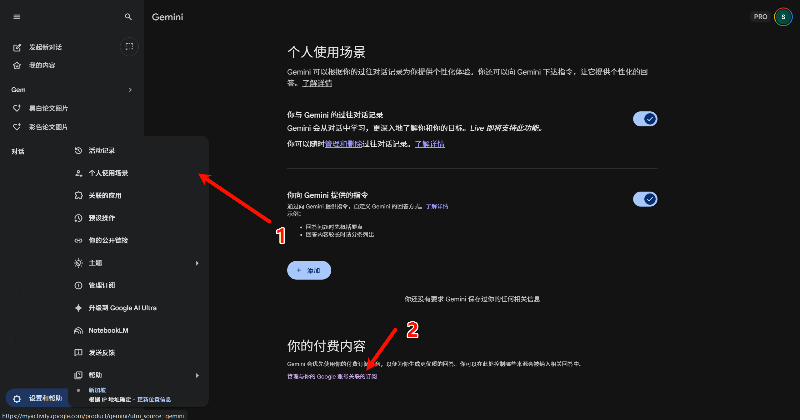
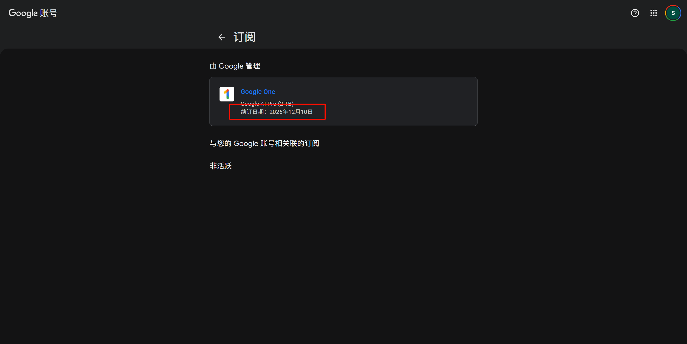

Gemini（原 Google One AI）的订阅到期时间在网页里藏得比较刁钻，第一次找往往要翻半天。这里记一下**具体查找路径**，方便大家查找。

---

## 第一步：设置和帮助 → 个人使用场景

在 [Gemini](https://gemini.google.com) 页面，**唯一的入口**是：

1. 点击左侧边栏底部的 **「设置和帮助」**，展开或进入设置相关页面。
2. 在随之出现的内容里进入 **「个人使用场景」**（Personal Usage Scenarios）。
3. 在该页的 **「你的付费内容」** 区块中，点击下方的 **「管理与你的 Google 账号关联的订阅」**。

点击后会跳转到 Google 账号的订阅页面。

---

## 第二步：在 Google 账号订阅页查看续订日期

跳转后进入的是 **Google 账号 → 订阅** 页面。页面顶部有返回箭头和「订阅」标题。

找到 Google One 一栏，这里的续订日期就是你会员到期的时间

---

## 小结

**路径总结**：打开 Gemini → **设置和帮助** → **个人使用场景** → 点击「管理与你的 Google 账号关联的订阅」→ 在跳转后的「订阅」页中，看「由 Google 管理」里对应订阅卡片上的 **「续订日期」** 即可。
