## 前言

在这个信息碎片化的时代，拥有一方完全属于自己的网络天地，是很多技术爱好者和创作者的"浪漫"。无论是记录学习笔记、分享项目经验，还是单纯地碎碎念，一个独立博客都是最好的载体。

市面上的博客框架很多，经过一番折腾和对比，我最终选择了 Hugo。它速度极快，生成的静态页面安全稳定，配合 GitHub Pages 可以实现完全免费的托管。而在主题选择上，我使用了设计感极佳的卡片式主题 Stack，它不仅美观，而且功能非常完善。

这篇教程是我在踩坑和摸索后的总结。为了让大家少走弯路，我将原本零散的记录整理成了这篇"手把手"指南。本教程将涵盖从仓库创建、环境部署，到界面汉化、评论区接入，甚至包括如何高效地用 VS Code 写文章的全流程。

不需要你精通前端代码，只要跟着步骤走，你也能轻松搭建出一个既好看又好用的个人博客。

---

## 快速起步与仓库搭建

搭建博客最怕的就是繁琐的环境配置。幸运的是，我们不需要在本地一行行敲代码安装 Hugo，直接利用现成的 GitHub 模板，只需点几下鼠标，就能把博客"搬"回家。

### 获取主题模板

首先，我们需要访问 `hugo-theme-stack` 的官方启动模板。这个模板已经预置好了 GitHub Actions 自动构建脚本，能帮我们省去 90% 的配置工作。

> **模板地址**：[https://github.com/CaiJimmy/hugo-theme-stack-starter](https://github.com/CaiJimmy/hugo-theme-stack-starter)

进入页面后，点击右上角的 **Use this template**（使用此模板）按钮，然后选择 **Create a new repository**（创建新仓库）。

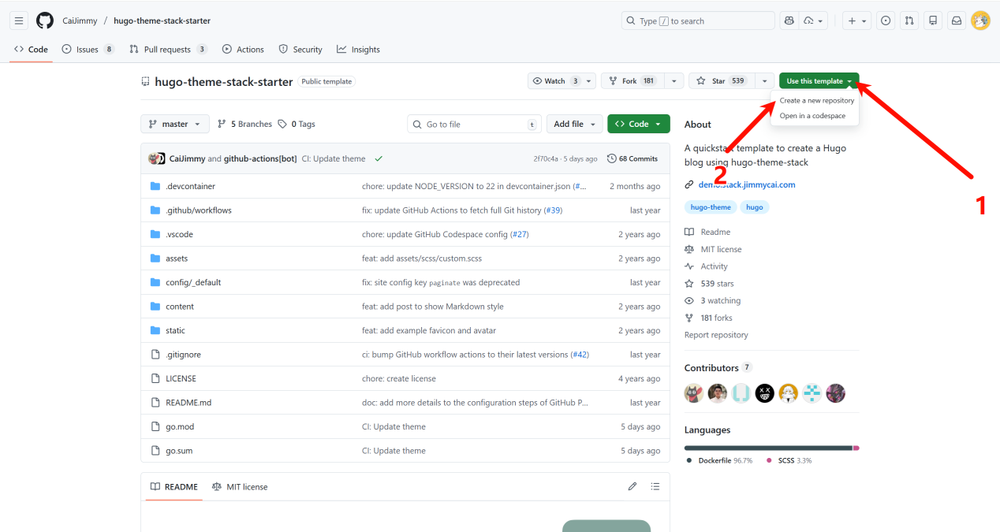

### 创建 GitHub 仓库（关键步骤！）

这一步至关重要，仓库的命名直接决定了你的博客能不能被访问。

在 **Repository name**（仓库名称）一栏中，**必须**按照以下格式填写：

```text
你的GitHub用户名.github.io
```

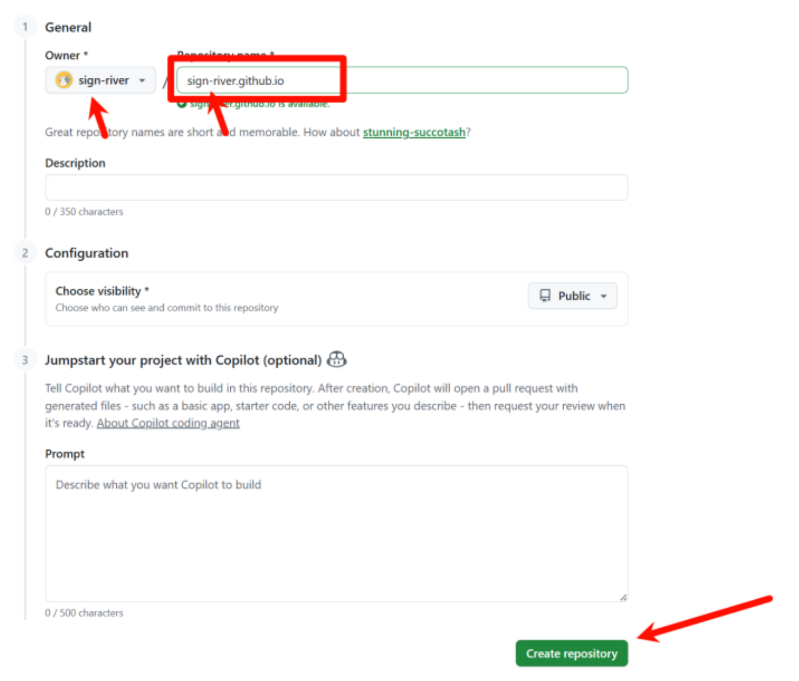

> ⚠️ **注意事项：**
>
> - **格式严格**：`github.io` 前面的部分必须和你的 GitHub 账户名完全一致（大小写最好也保持一致）
> - **示例**：如果你的 GitHub 用户名是 `sign-river`，那么仓库名必须是 `sign-river.github.io`。如果不这样填，后续 GitHub Pages 将无法自动部署，你会遇到 404 错误
> - **权限设置**：选择 **Public**（公开），这样 GitHub Pages 才能免费托管你的网站

填写完毕后，点击底部的 **Create repository** 按钮。

### 等待自动部署

仓库创建好后，GitHub 的后台会自动开始工作：

1. 点击仓库顶部的 **Actions** 标签页
2. 你会看到一个名为 `Initial commit` 或 `pages-build-deployment` 的工作流正在运行

部署状态说明：

- 🟡 **黄色旋转图标**：表示正在部署中，请耐心等待（通常需要 1-2 分钟）
- 🟢 **绿色对勾图标**：表示部署成功！

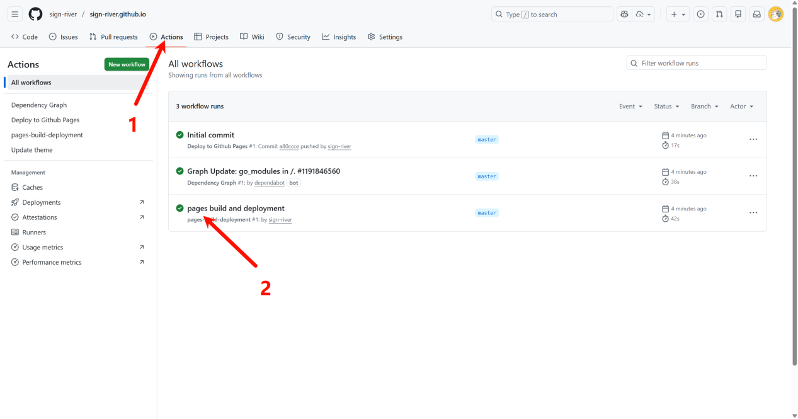

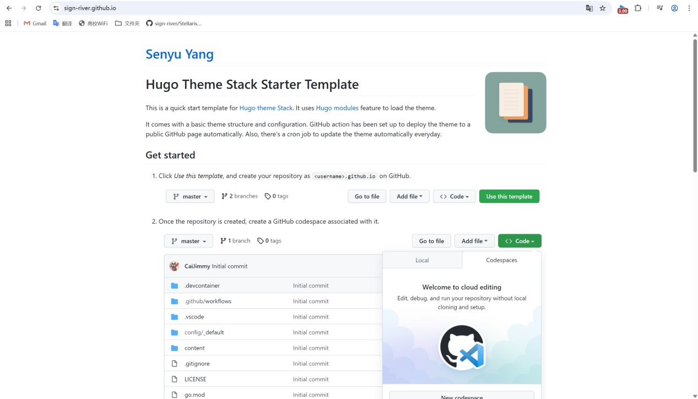

部署完成后，访问 `https://你的用户名.github.io`，如果能看到一个带有 "Hugo Theme Stack" 标题和示例文章的精美页面，恭喜你，你的个人博客雏形已经搭建完成了！🎉

---

## 基础个性化配置

上一章我们成功部署了博客，但现在的博客标题还是默认的 "Hugo Theme Stack Starter"，头像也是默认的。接下来，我们通过修改两个核心配置文件，让博客焕然一新。

### 修改核心站点信息 (config.toml)

这个文件控制着博客最基础的信息，比如网站地址和标题。

1. 在你的仓库主页，点击进入 `config/_default` 文件夹

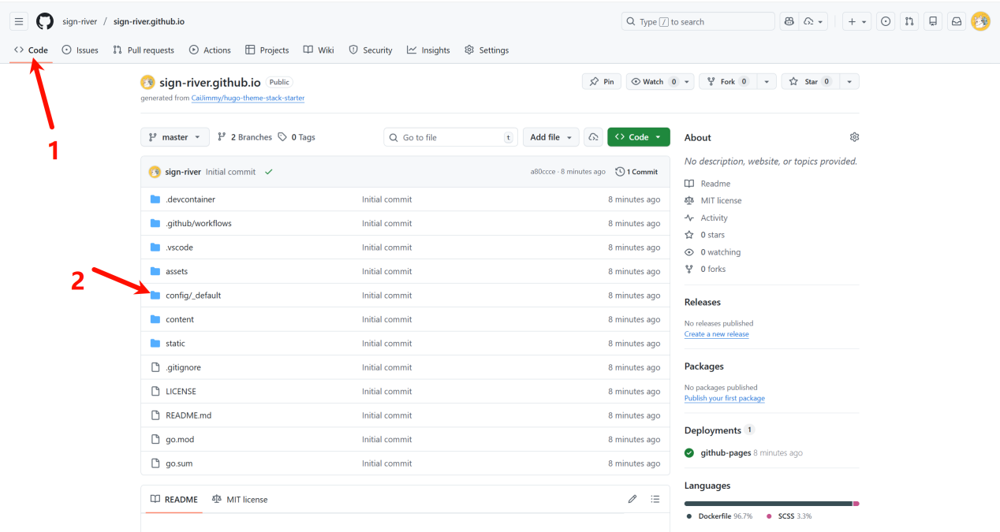

2. 找到并点击 `config.toml` 文件

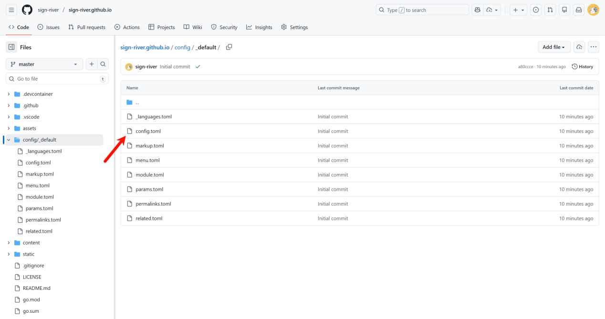

3. 点击文件右上角的 **铅笔图标**（Edit this file）进入编辑模式

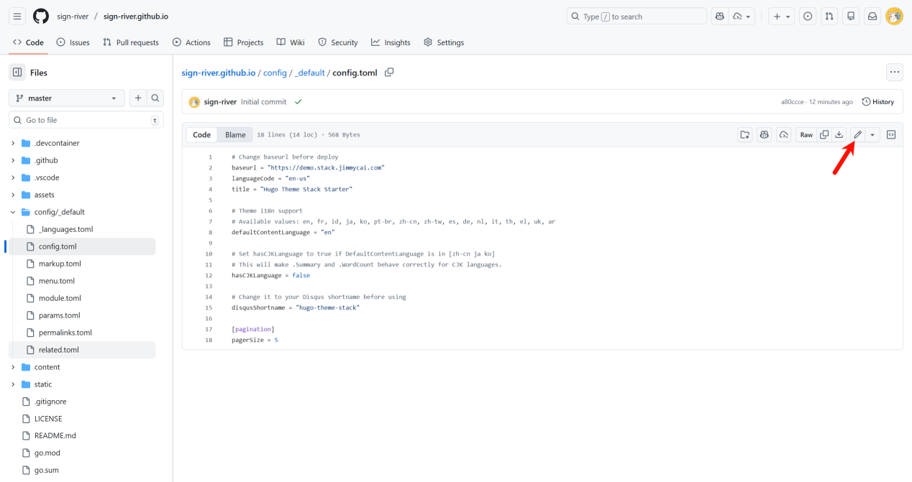

4. 找到以下两行并进行修改：

   ```toml
    # 将此链接修改为你自己的仓库地址 (注意最后要有斜杠 /)
    baseurl = "https://你的用户名.github.io/"

    # 修改为你喜欢的博客名称
    title = "YSY的博客"
    ```

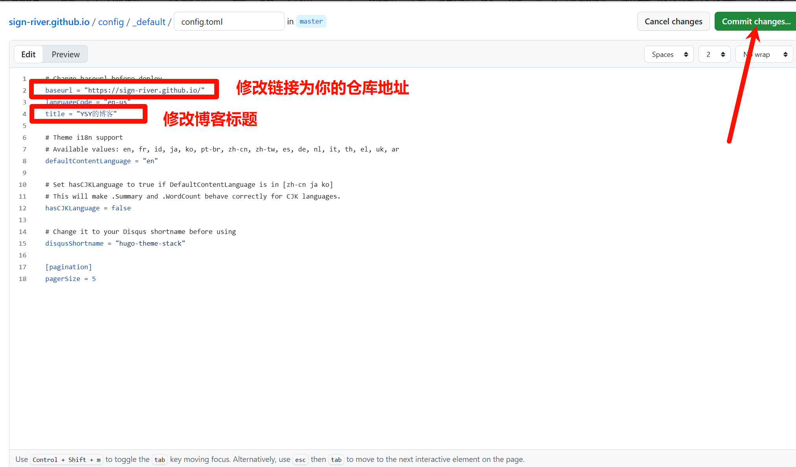

5. 修改完成后，点击页面底部的绿色按钮 **Commit changes** 保存

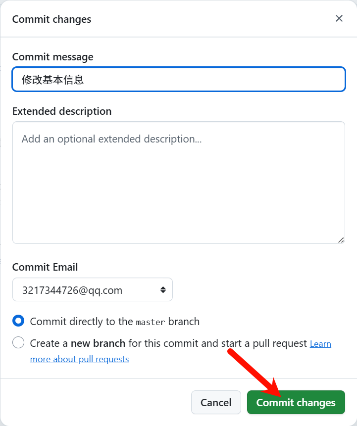

### 设置头像与个人简介 (params.toml)

这个文件主要控制侧边栏的展示内容。

1. 回到 `config/_default` 文件夹，这次我们要修改 `params.toml` 文件

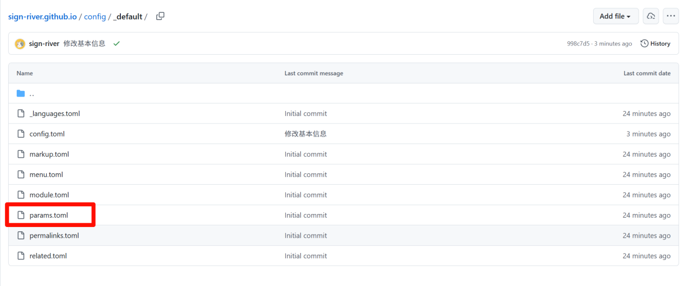

2. 同样点击铅笔图标编辑，找到 `[sidebar]` 区域，参考下图修改：

   ```toml
    [sidebar]
    # 侧边栏显示的表情符号
    emoji = "🐱"
    # 侧边栏显示的个人简介/副标题
    subtitle = "热爱编程"

    [sidebar.avatar]
    # 启用头像
    enabled = true
    # 头像必须放在 assets/img/ 目录下
    src = "img/avatar.png"
    ```

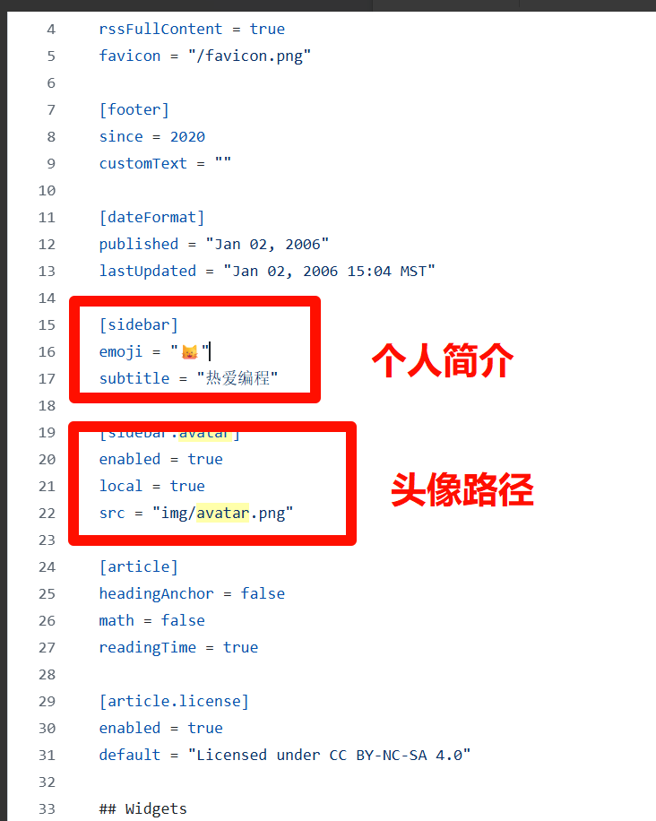

3. 修改完成后，记得 **Commit changes** 保存

### 上传你的头像图片

刚才我们在配置文件里指定了头像路径是 `img/avatar.png`，现在我们需要把真正的图片传上去。

1. 回到仓库根目录，依次进入 `assets` -> `img` 文件夹

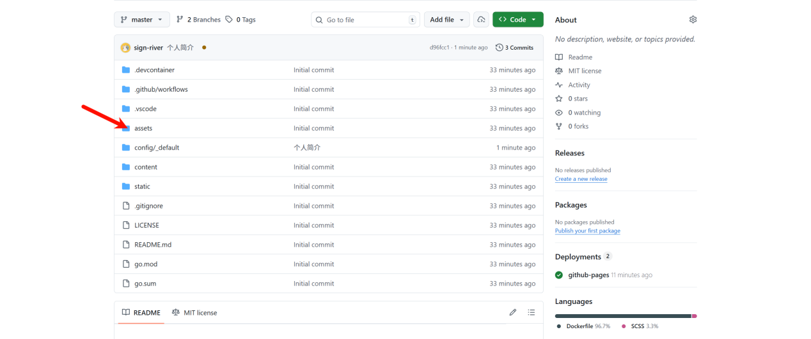

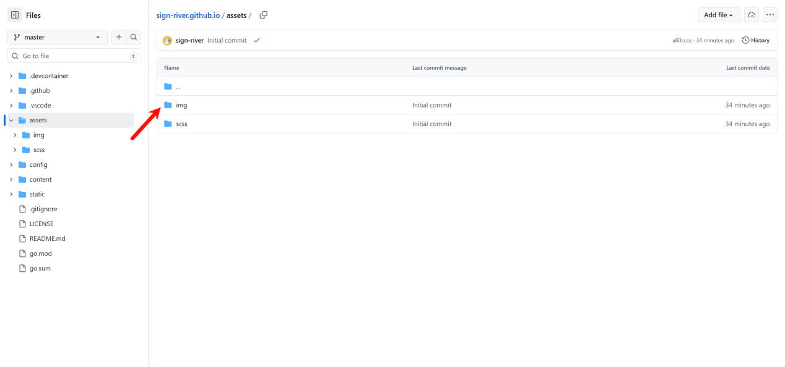

1. 点击右上角的 **Add file** → **Upload files**

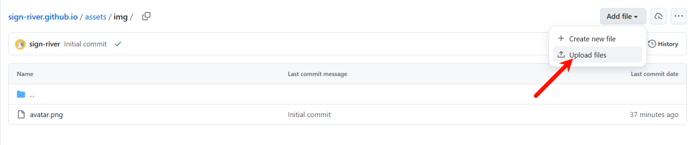

2. 将你准备好的头像图片重命名为 `avatar.png`（注意后缀名要匹配），然后拖拽上传

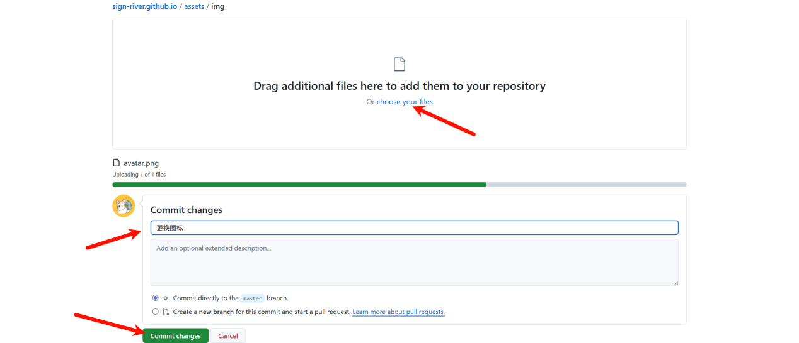

3. 点击 **Commit changes** 提交更改

### 关键步骤：切换部署分支

很多新手会发现改完配置后博客打不开了，或者显示的还是源码，原因通常是 GitHub Pages 的分支设置不对。我们需要告诉 GitHub：“请展示在这个分支里生成的网页文件”。

1. 进入仓库顶部的 **Settings**（设置）选项卡
2. 在左侧菜单栏找到 **Pages**
3. 在 **Build and deployment** 区域进行以下配置：
   - **Source** 选择 **Deploy from a branch**
   - **Branch**（分支）下拉菜单中，一定要选择 **gh-pages** 分支（而不是 master/main）
   - 文件夹保持 `/(root)` 不变

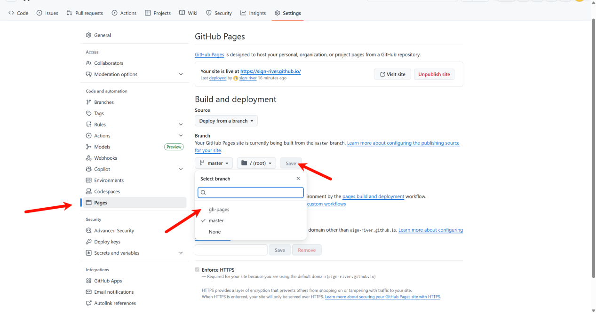

4. 点击 **Save** 保存

### 欣赏你的博客

完成上述步骤后，等待几分钟（GitHub Actions 需要一点时间重新构建）。再次访问你的博客链接：

> `https://你的用户名.github.io`

现在，你应该能看到博客标题变了，左侧也换成了你的头像和简介。是不是更有成就感了？

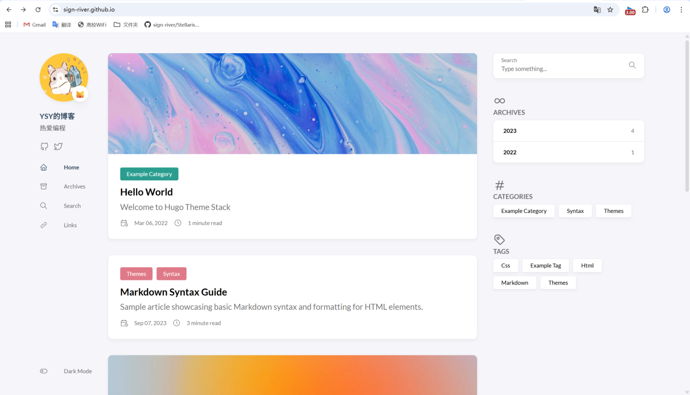

---

## 内容管理与初次发布

现在的博客里充斥着 "Hello World" 和 "Markdown Syntax Guide" 这样的演示文章。我们需要把它们清理干净，然后发布一篇真正属于你的内容。

### 清理演示文章

首先，我们要把“样板房”里的旧家具搬走。

1. 在 GitHub 仓库中，进入 `content/post` 文件夹
2. 你会看到 `hello-world`、`markdown-syntax` 等文件夹
3. **全部删除**：点击右上角的 **...** → **Delete directory**，或者直接在本地操作删除

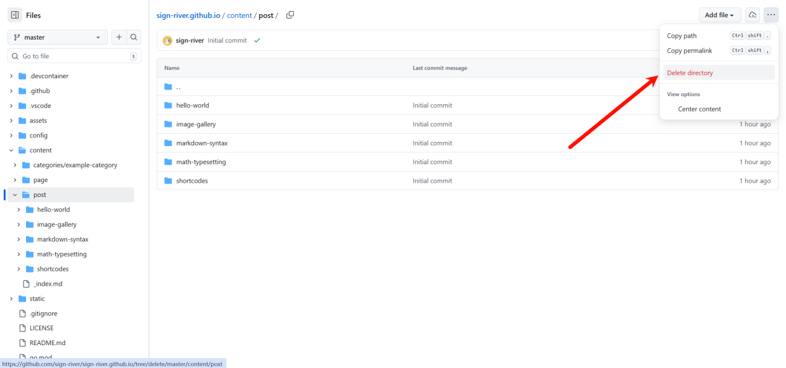

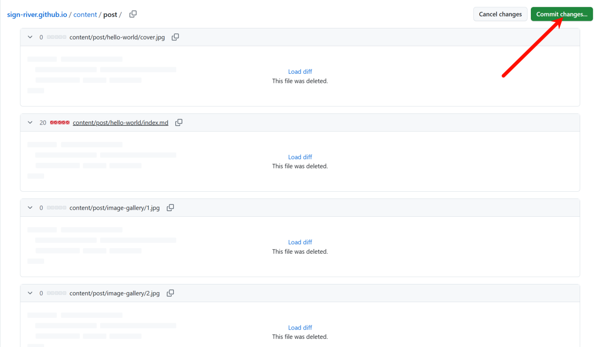

### 创建第一篇文章

Hugo 有一种很好的文章组织方式叫 "Page Bundles"（页面束）。简单来说，就是**给每一篇文章建一个文件夹**，把文章文字（`index.md`）和图片放在一起，这样管理起来非常方便。

1. 在 `content/post` 目录下，点击 **Add file** → **Create new file**

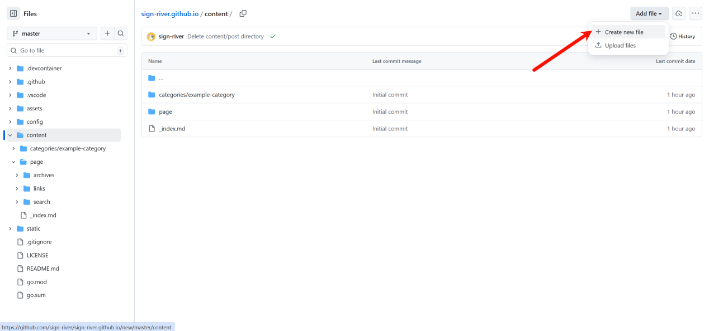

2. 在文件名输入框中填写：`post/my-first-post/index.md`
   - *注意：输入 `/` 会自动创建文件夹*

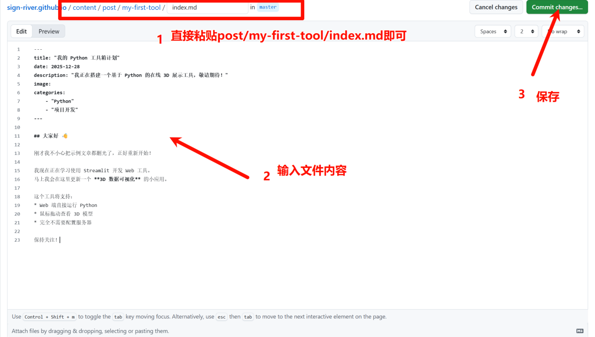

3. 输入文章内容，格式如下：

```

---
# 1. Front Matter (元数据配置区) - 决定了文章在网站后台和侧边栏的展示
title: "我的 Python 工具箱计划"         # 文章标题
date: 2025-12-28                      # 发布日期，影响排序
description: "我正在搭建一个..."        # 摘要，显示在列表页和侧边栏简介
image:                                # 封面图路径，留空则不显示
categories:                           # 分类设置，直接控制侧边栏的导航分类
  - "Python"
  - "项目开发"
---

# 2. 正文内容区 - 读者实际阅读的内容

## 大家好 👋
# 使用 ## 开头表示二级标题，侧边栏目录（TOC）会自动抓取它

这里输入你的文章正文内容。你可以描述你的项目背景、学习心得等。

### 这个工具将支持：
# 使用三级标题细分内容
* Web 端直接运行 Python              # 无序列表项
* 鼠标拖动查看 3D 模型                # 无序列表项
* 完全不需要配置服务器                # 无序列表项

保持关注！

```

1. 发布与验证
   - 滚动到页面底部，在 **Commit changes** 中填写“发布第一篇文章”，然后点击绿色按钮提交
   - 等待 GitHub Actions 构建完成（通常几十秒）
   - 刷新你的博客首页

✨ **见证时刻**：原本的英文演示文章消失了，取而代之的是你刚刚写的“我的第一篇博客”！点击标题进去，能看到你写的内容。

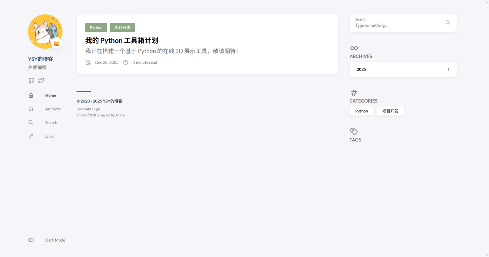

---

## 界面深度优化与汉化

这一章我们将深入博客的配置文件，把默认的英文界面改成中文，并去除多余的元素，让博客看起来更专业。

### 配置社交链接 (menu.toml)

默认模板左侧栏有 GitHub 和 Twitter 的图标。我们需要把 Twitter 删掉，并把 GitHub 换成你自己的地址。

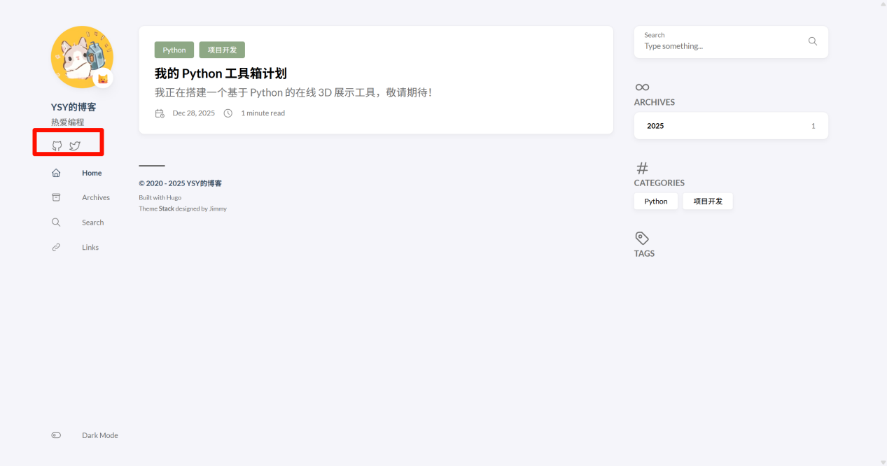

1. 进入 `config/_default` 文件夹，打开 `menu.toml`
2. 找到 `[[social]]` 区域
3. **修改 GitHub**：将 `url` 修改为你自己的 GitHub 主页地址
4. **删除 Twitter**：直接删除整个 Twitter 的配置块（从 `[[social]]` 到 `icon = "brand-twitter"` 的部分）

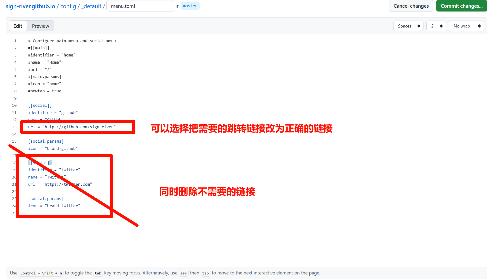

### 全局语言汉化

让博客的时间格式、提示文案都变成中文。

1. 打开 `config/_default/config.toml`。
2. 找到并修改以下三项配置：

    ```toml
    languageCode = "zh-cn"
    defaultContentLanguage = "zh-cn"
    hasCJKLanguage = true
    ```

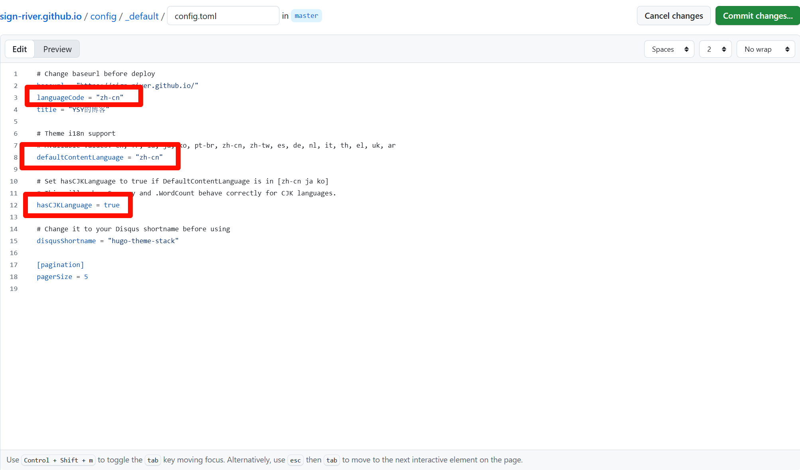

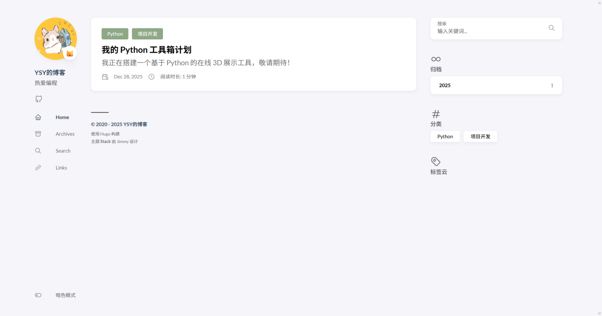

### 左侧主菜单汉化（关键！）

左侧的 "Home", "Archives", "Search" 等菜单需要改成中文。这个过程分两步，防止配置冲突。

#### 清理页面独立配置

Stack 主题在每个页面的源文件中也定义了菜单，我们需要先删掉它们，以便由统一的配置文件接管。

1. 分别找到以下 3 个文件：
   - `content/page/archives/index.md`
   - `content/page/search/index.md`
   - `content/page/links/index.md`

2. **编辑文件**：删除文件头部 `menu:` 及其下方缩进的内容（通常是 `main:` 和 `params:` 那几行）
   - *注意：保留最上方的 `title`、`slug` 等信息，以及最下方的 `---` 分隔线，只删 menu 模块*

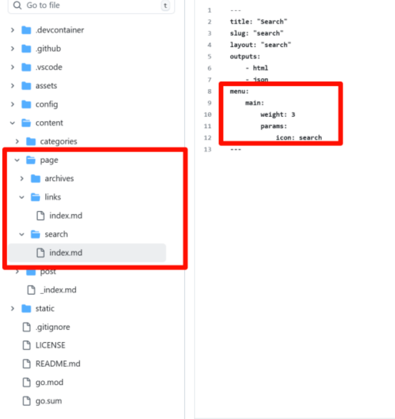

#### 重写主菜单配置

1. 回到 `config/_default/menu.toml`
2. **清空** `[[main]]` 相关的旧配置，**复制粘贴**以下内容：

   ```toml
    [[main]]
        identifier = "home"
        name = "首页"
        url = "/"
        weight = 1
        [main.params]
            icon = "home"

    [[main]]
        identifier = "archives"
        name = "归档"
        url = "/archives/"
        weight = 2
        [main.params]
            icon = "archives"

    [[main]]
        identifier = "search"
        name = "搜索"
        url = "/search/"
        weight = 3
        [main.params]
            icon = "search"

    [[main]]
        identifier = "links"
        name = "友链"
        url = "/links/"
        weight = 4
        [main.params]
            icon = "link"
    ```

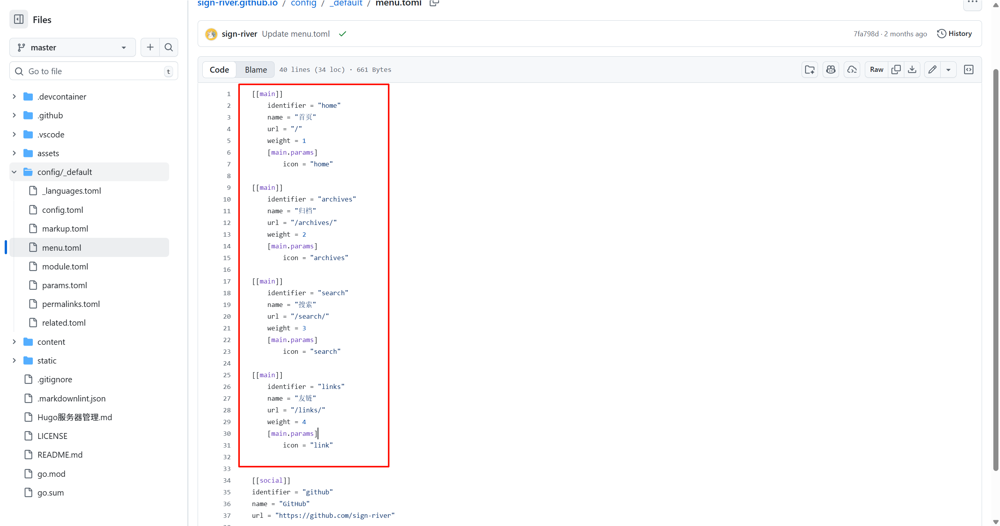

### 隐藏页脚版权信息 (CSS)

如果你想让页面底部更清爽，隐藏 "Powered by Hugo" 字样，可以通过自定义 CSS 实现。

1. 进入 `assets/scss/` 文件夹
2. 新建或编辑 `custom.scss` 文件
3. 添加以下代码：

   ```css
   .site-footer .powerby {
       display: none;
   }
   ```

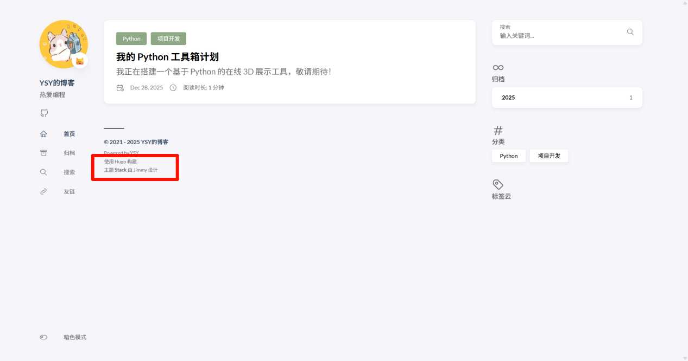

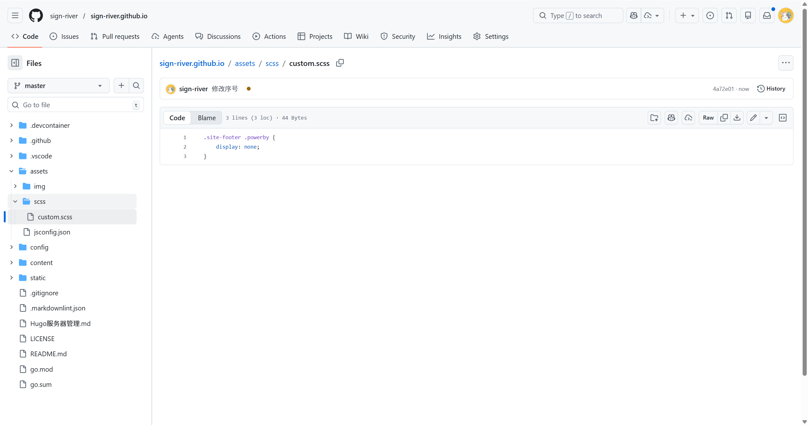

### 细节清理

最后做两个收尾工作：

1. **修改网站图标 (Favicon)**：
   - 准备一张正方形的小图片，重命名为 `favicon.png`
   - 上传到仓库的 `static` 文件夹下（如果没有该文件夹，请在根目录新建一个）

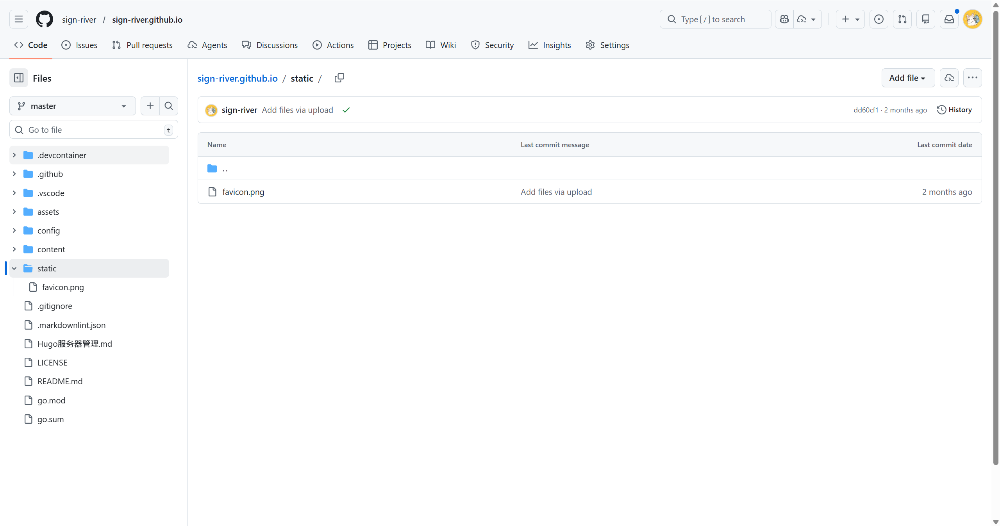

2. **删除多余分类**：
   - 进入 `content/categories`
   - 删除 `example-category` 文件夹，保持分类清爽

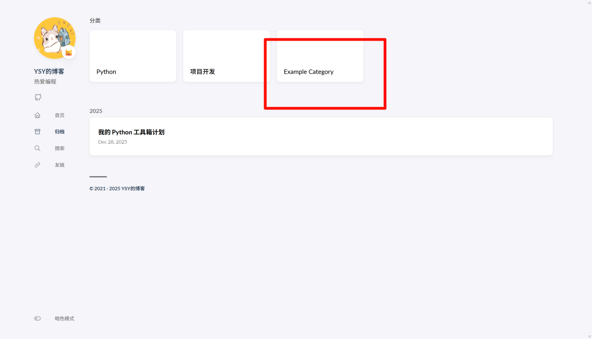

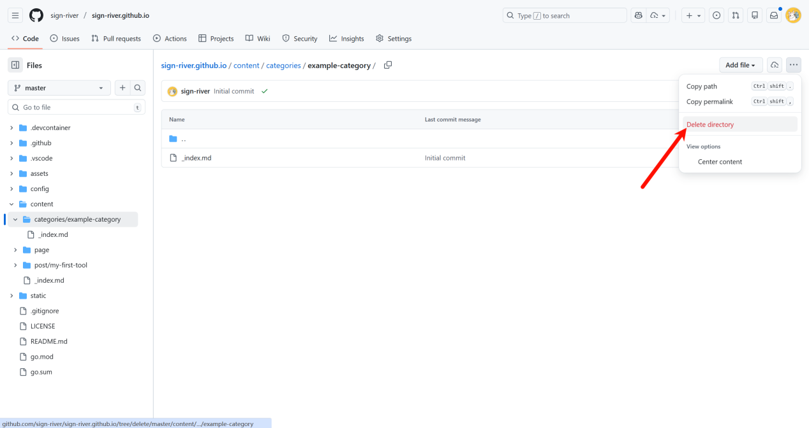

---

## 接入评论系统（Giscus）

一个没有评论区的博客是没有灵魂的。虽然 Stack 主题自带了 Disqus 支持，但它加载慢且有广告。本章我们将重点介绍 Giscus —— 一个基于 GitHub Discussions 的现代化、免费、无广告的评论系统。

在这里，我们强烈推荐使用 **Giscus**。它利用 GitHub 的 Discussions 功能来存储评论，不仅完全免费、无广告，而且数据完全掌握在你自己的仓库里。

### 开启 GitHub Discussions

Giscus 的运作依赖于你仓库的 Discussions 模块。

1. 打开你的博客 GitHub 仓库页面
2. 点击上方的 **Settings**（设置）选项卡
3. 在 **General** 页面向下滚动，找到 **Features** 区域

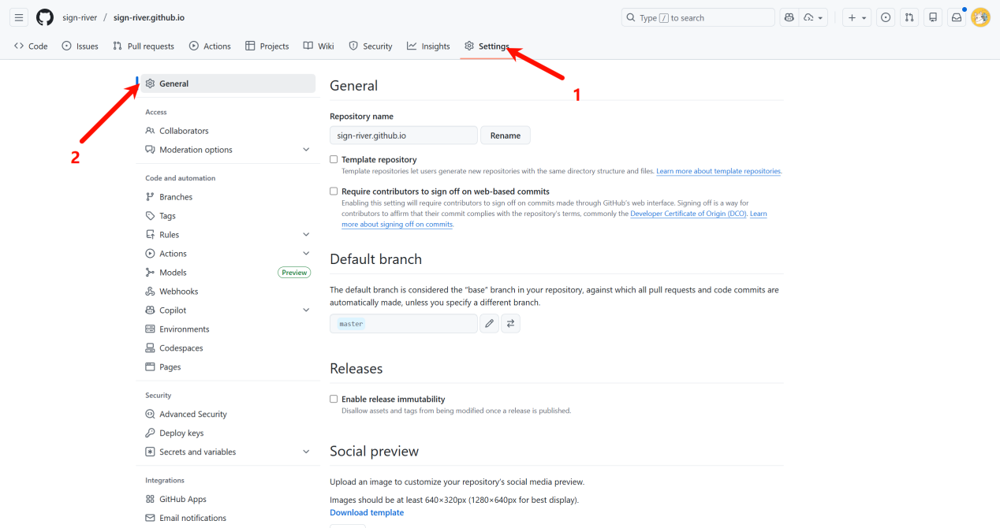

4. 勾选 **Discussions** 选项
   - *提示：这一步非常关键，如果不开启，后续评论将无法写入*

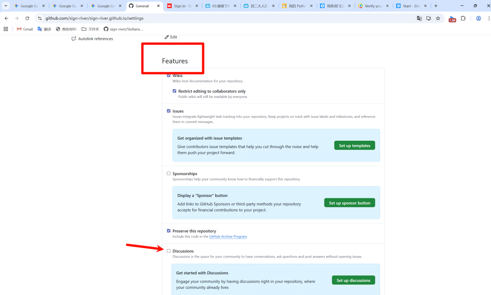

### 安装 Giscus 应用

我们需要授权 Giscus 机器人访问你的仓库。

1. 访问 Giscus 应用页面：[https://github.com/apps/giscus](https://github.com/apps/giscus)
2. 点击绿色的 **Install** 按钮

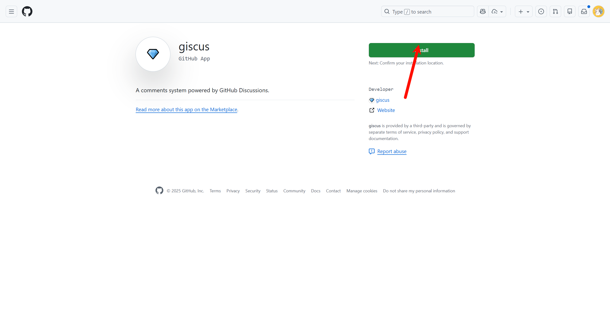

3. 在权限选择页面：
   - 选择 **Only select repositories**
   - 在下拉菜单中找到并选中你用来存放博客的仓库（`你的用户名.github.io`）

4. 点击 **Install** 完成安装

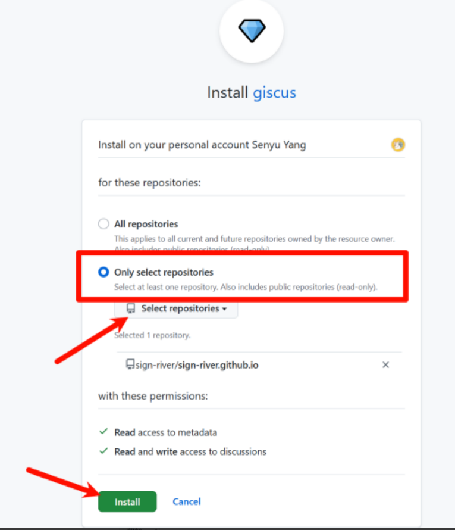

### 获取配置代码

Giscus 提供了一个可视化工具来生成配置参数。

1. 访问 Giscus 官网：[https://giscus.app/zh-CN](https://giscus.app/zh-CN)

2. **配置仓库**：
   - 在“仓库”一栏，输入 `你的用户名/你的仓库名`（例如 `sign-river/sign-river.github.io`）
   - 等待下方出现绿色的“成功！该仓库满足所有条件”提示

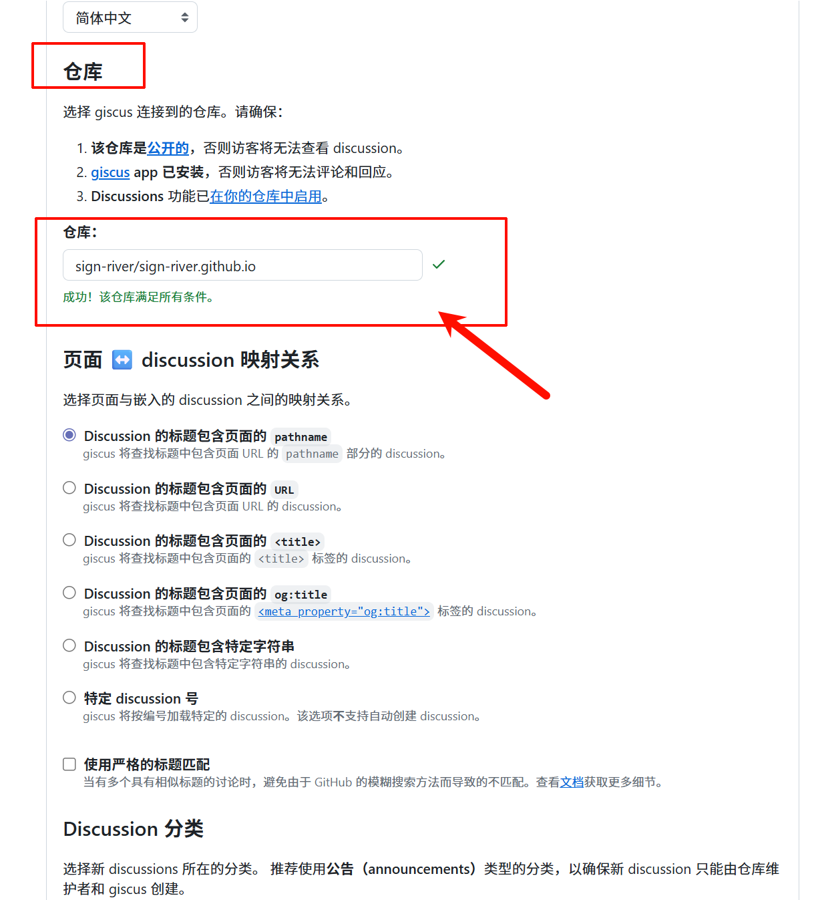

3. **配置分类**：
   - 在“Discussion 分类”中，推荐选择 **Announcements**
   - *注意：这决定了评论会出现在仓库 Discussions 的哪个板块下*

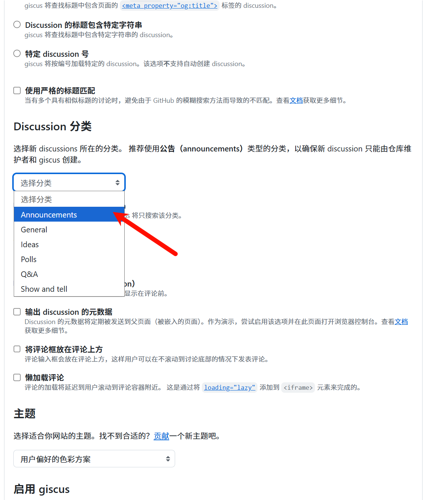

4. **生成代码**：
   - 滚动到页面底部的“启用 giscus”部分
   - 你会看到一段生成的 `<script>` 代码。**不要直接复制这段代码**，我们只需要其中的几个关键参数

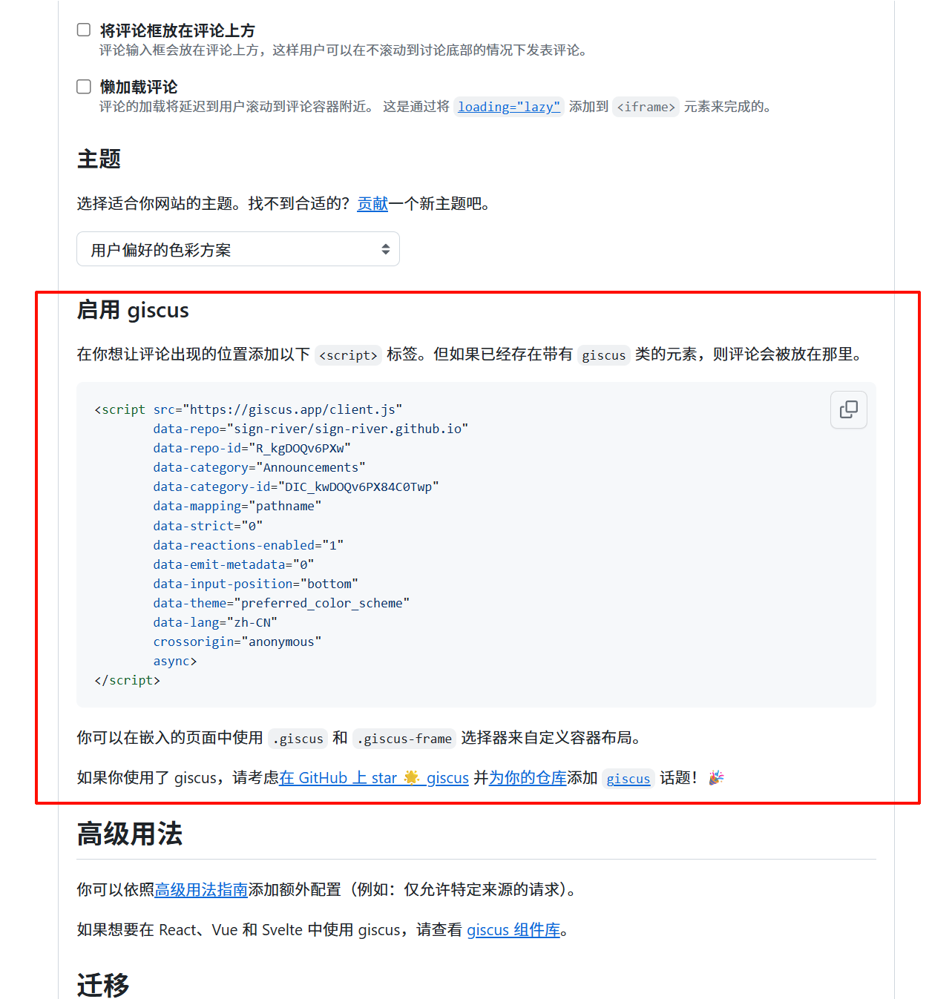

### 写入博客配置 (params.toml)

现在把获取到的参数填入 Hugo 的配置文件中。

1. 回到你的仓库，打开 `config/_default/params.toml` 文件
2. 找到 `[comments]` 区域，将 `enabled` 设置为 `true`，`provider` 设置为 `"giscus"`

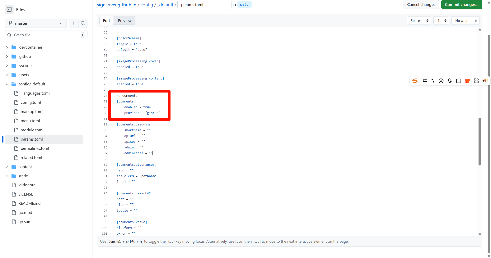

3. 找到 `[comments.giscus]` 区域，根据刚才网页生成的信息填写：

    ```toml
    [comments]
        enabled = true
        provider = "giscus"

    [comments.giscus]
        repo = "你的用户名/仓库名"
        repoID = "从Giscus官网生成的代码中复制"
        category = "Announcements"
        categoryID = "从Giscus官网生成的代码中复制"
        mapping = "pathname"
        lightTheme = "light"
        darkTheme = "dark"
        reactionsEnabled = 1
        emitMetadata = 0
    ```

   > ⚠️ **关键点**：`repoID` 和 `categoryID` 是两串乱码一样的字符，必须从 Giscus 官网生成的代码中精确复制。

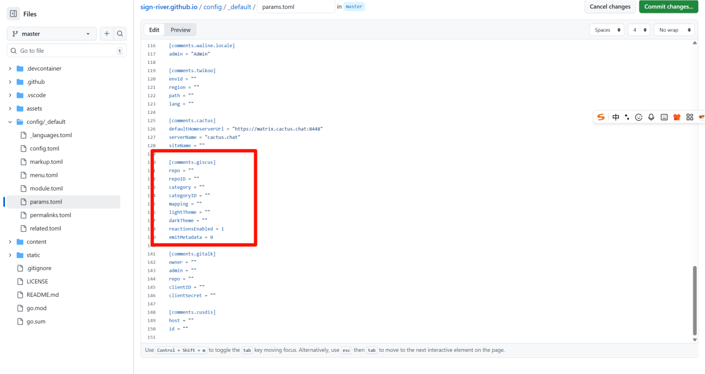

### 清理旧配置 (config.toml)

为了防止冲突，我们需要确保 Disqus 是关闭的。

1. 打开 `config/_default/config.toml`
2. 找到 `disqusShortname` 这一行
3. 在行首添加 `#` 号将其注释掉，或者直接删除该行

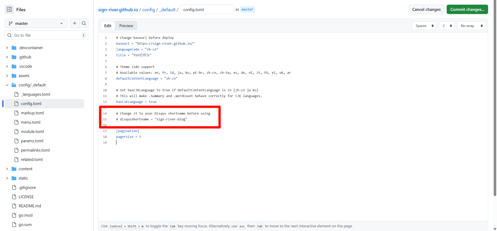

### 验证评论区

提交所有更改（**Commit changes**）并等待部署完成。刷新你的博客文章页面，滚动到底部。

如果一切顺利，你应该能看到一个漂亮的评论框，支持使用 GitHub 账号登录发表评论。所有的评论都会自动同步到你 GitHub 仓库的 Discussions 版块中。

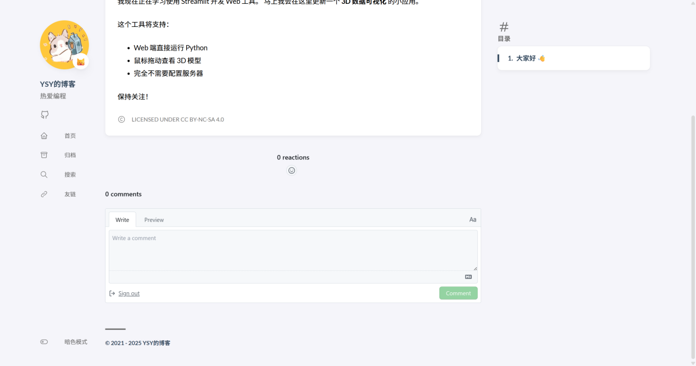

---

## 打造高效写作环境

工欲善其事，必先利其器。虽然 GitHub 网页版也能修改文件，但为了更好的写作体验（尤其是图片处理和实时预览），强烈建议将仓库克隆到本地，使用 VS Code 进行管理。

### 准备工作

1. **克隆仓库**：使用 Git 工具将你的 `用户名.github.io` 仓库克隆到本地电脑
2. **打开项目**：右键点击文件夹，选择 "Open with Code"（用 VS Code 打开）

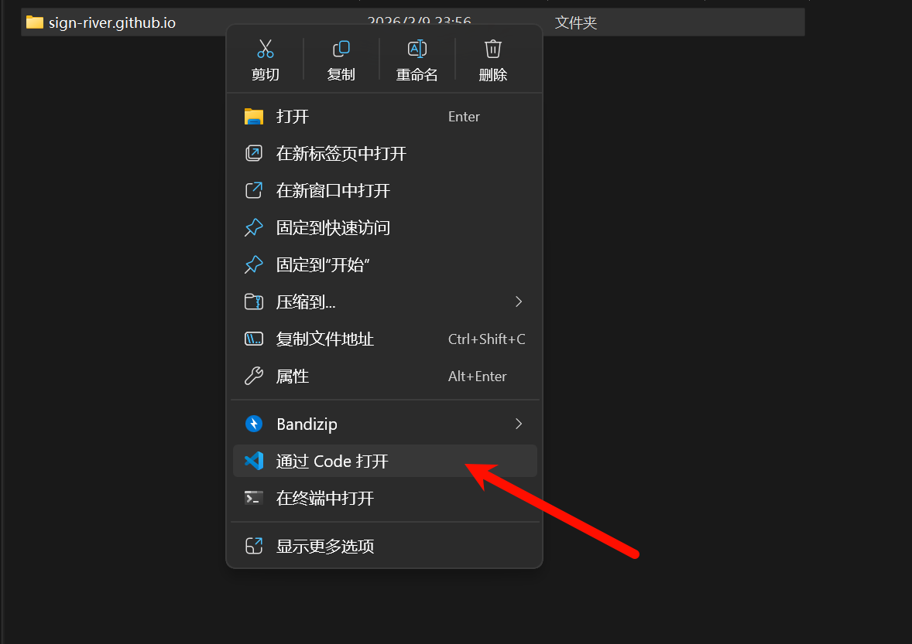

### 必装插件推荐

在 VS Code 的扩展商店（Extensions）中搜索并安装以下三个插件，它们将彻底改变你的写作方式。

#### 🛠️ Markdown All in One —— 全能助手

这是写 Markdown 的必备插件，提供了快捷键、自动补全和格式化功能。

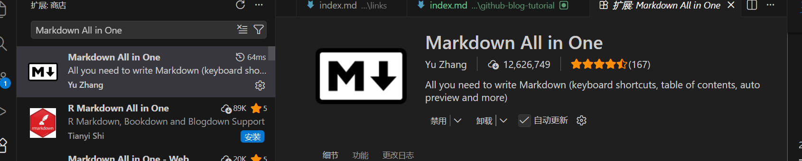

**常用快捷键**：

- **加粗**：`Ctrl + B`
- **斜体**：`Ctrl + I`
- **删除线**：`Alt + S`
- **调整标题级别**：`Ctrl + Shift + ]`

**自动功能**：

- **表格格式化**：写表格时会自动对齐，强迫症福音。
- **链接补全**：选中文字输入 `[`，自动包裹为链接格式。

#### 🖼️ Paste Image —— 截图神器

在 Markdown 中插入图片通常很麻烦（截图 → 保存 → 改名 → 上传 → 引用）。这个插件能把这些步骤缩减为一步。

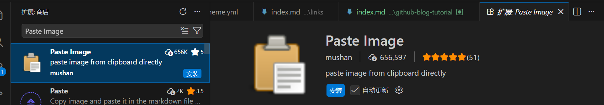

**使用方法**：

1. 使用任意截图工具（如微信截图或 `Win + Shift + S`）截图
2. 在 VS Code 的 Markdown 文件中，按下 **`Ctrl + Alt + V`**

**神奇效果**：

- **插件会自动将剪贴板里的图片保存到当前文章的目录下。
- **自动在文章中插入 `` 代码，所见即所得。

#### 👁️ Markdown Preview Enhanced —— 实时预览

虽然 VS Code 自带预览，但这个插件功能更强大。

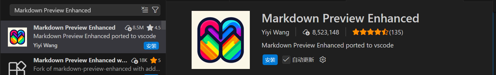

**核心功能**：

- **同步滚动**：左边编辑，右边预览自动跟随，不迷路
- **数学公式与图表**：完美支持 LaTeX 公式和各种流程图渲染
- **导出功能**：右键点击预览界面，可以直接导出为 HTML 或 PDF 分享

### 开始你的创作之旅

现在，你的本地写作环境已经配置完毕：

1. **新建**：在 `content/post` 下新建文件夹和 `index.md`
2. **写作**：用 Markdown All in One 快速排版
3. **配图**：用 Paste Image 一键粘贴截图
4. **预览**：用 Preview Enhanced 实时检查效果
5. **发布**：写完后，在 VS Code 的源代码管理（Source Control）中点击 **Commit** 和 **Sync**，文章就会自动推送到 GitHub 并发布上线！

---

## 补充内容

### link界面调整

默认的友链页面尚未初始化。如果你想添加友情链接，请按照以下步骤操作：

1.定位配置文件 在博客的本地根目录下，找到 Links 页面的源文件（通常位于 source/links/index.md）。

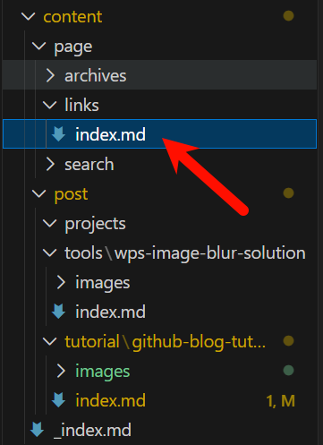

2.编辑链接信息 复制以下配置代码，覆盖或添加到文件中。你可以根据需要修改 links 下的列表项。

```
---
title: Links
links:
  - title: GitHub
    description: 欢迎访问我的代码仓库
    website: https://github.com/sign-river
    image: https://github.githubassets.com/images/modules/logos_page/GitHub-Mark.png
  - title: Bilibili
    description: 我的b站账户
    website: https://space.bilibili.com/504574253?spm_id_from=333.1007.0.0
    image: https://www.bilibili.com/favicon.ico

comments: false
---
```

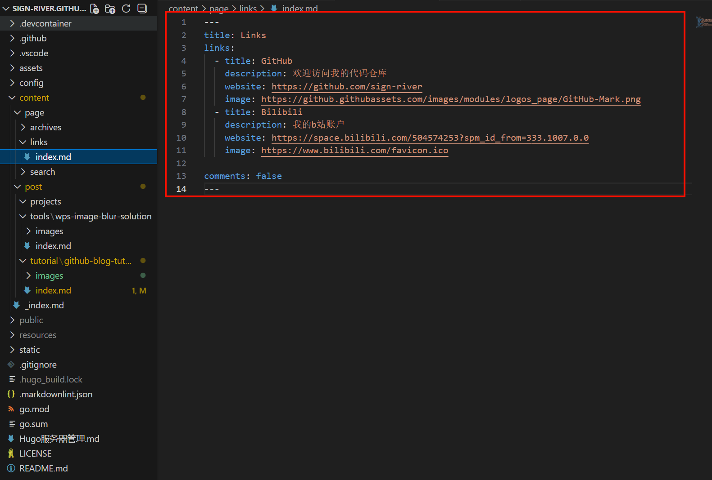

### Paste Image 图片保存位置

在粘贴图片时,默认会把图片在index.md文件的同一级目录保存,看上去非常的乱,所以如何在index.md旁边开一个images文件夹,让图片保存到文件夹里呢?

解决方案如下:

1. 打开vscode设置

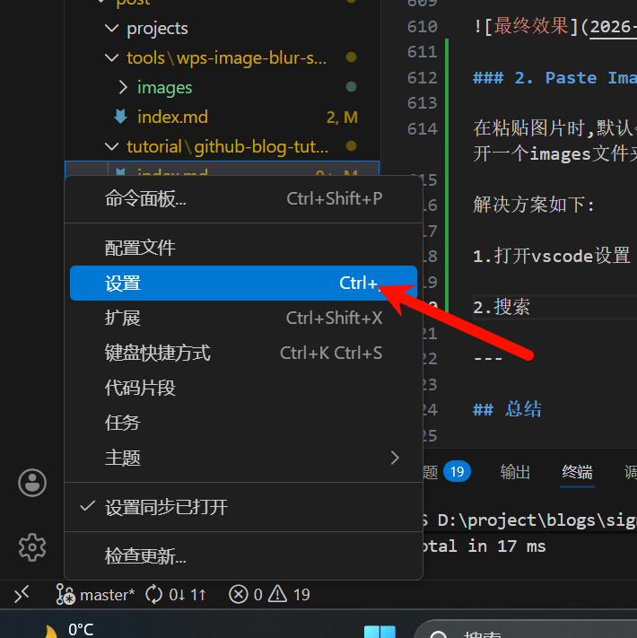

2. 搜索paste image
3. 找到Path
4. 在原参数后添加/images即可

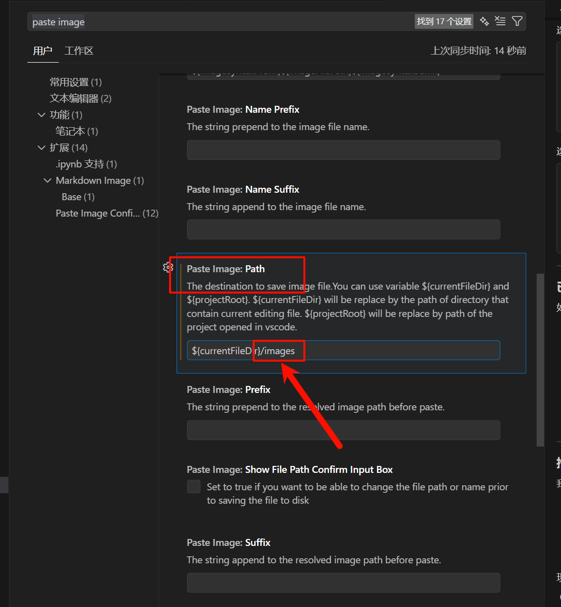

### Paste Image 图片大小调整

直接保存的图片无法调整参数，所以我们要把引入图片的代码格式转为html

解决方案如下：

1. 打开vscode设置


2. 搜索搜索paste image
3. 找到Insert Pattern
4. 删除原参数修改为

```

```

5. 调整图片大小时修改width值即可

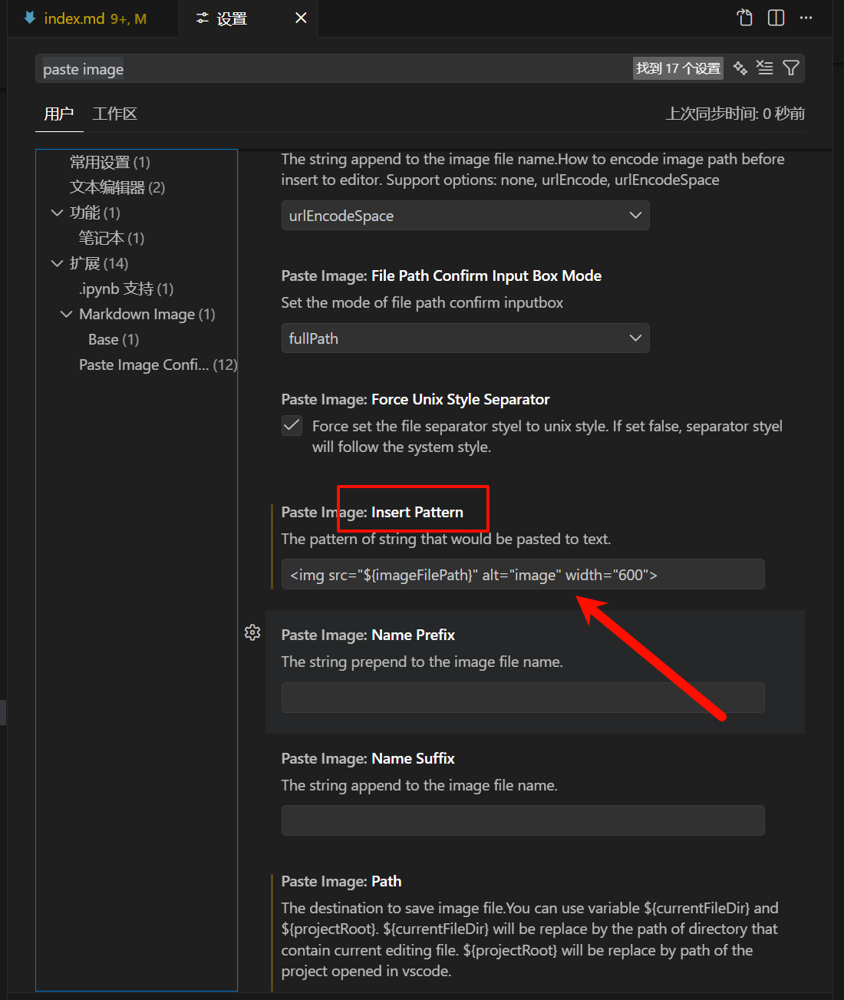

### 文章目录序号嵌套问题

如果你的文章标题中已经手动添加了序号（如 1. 前言），博客自动生成的目录可能会再次添加一层编号，导致出现类似 1. 1. 前言 的重复显示现象。

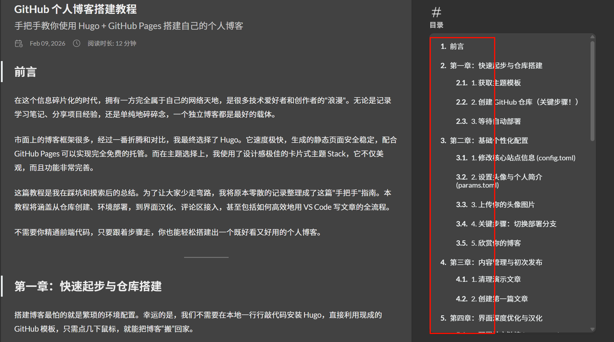

解决方案如下:

我们需要在站点配置中关闭目录的自动编号功能

1. 定位配置文件： 找到站点根目录下的 config/_default/markup.toml 文件。
2. 修改参数： 找到 [tableOfContents] 区域，将 ordered 属性由 true 改为 false。

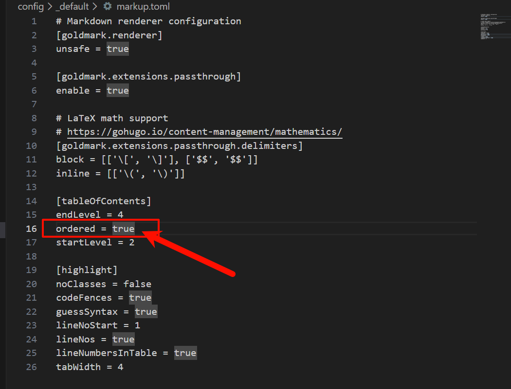

3. 不过需要注意，关闭自动编号后如果写文章时没有手动编号，会出现无法在网页中打开文章的情况

---

## 总结

博客已经搭建完成。接下来的日子里，希望你能把更多的时间花在**记录和分享**上，让这里成为你思想的后花园，而不是一个仅仅为了展示技术的空壳。
如果这篇教程对你有帮助，或是遇到什么问题，欢迎在下方的评论区留言。

Happy Blogging! 🍻

## 参考资料

- [Hugo 官方文档](https://gohugo.io/)
- [Stack 主题文档](https://stack.jimmycai.com/)
- [GitHub Pages 文档](https://docs.github.com/pages)
